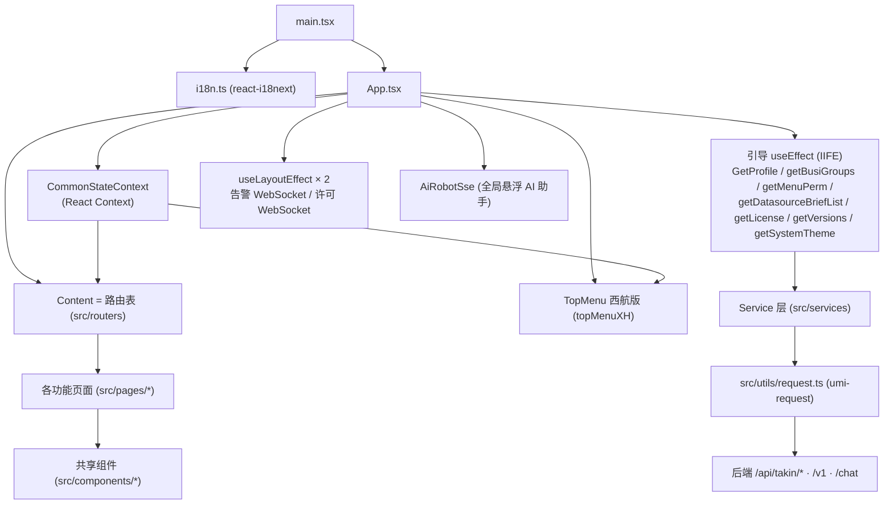

# 羚牛（LingNiu）一体化综合运维管理平台 · 前端架构文档

> 本文档基于代码索引提交 **`629bd918`（`bugxiugai`，2026-07-31）** 编写，与 [doc-deepwiki](doc-deepwiki/deepwiki-README.md) 目录下的 DeepWiki 文档同源（分支 `v2.1`）。
> 目标是给出**整体架构视图与导航**，把散落在各 DeepWiki 子文档中的细节串成一张地图；**具体实现细节不在此重复**，一律以 `→ 参见` 链接指向对应 DeepWiki 文档。
> DeepWiki 文档中的代码行号引用（GitHub 链接 `blob/629bd918/...#Lxx-Lyy`）均锚定在同一提交 `629bd918`。本分支正检出于该提交，因此文档行号可直接对应本地源码。抽查校验结论见文末 [附录 A](#附录-a文档行号可靠性抽查)。

---

## 1. 项目定位

羚牛（LingNiu，代号 **西航/XH**、**SXXC**）是一套面向基础设施监控、资产管理与自动化运维的**一体化综合运维管理平台**。它构建在夜莺（**Nightingale / N9E**）之上，在其核心可观测能力（指标、日志、链路、告警）之外，扩展了 **IT/IoT 资产管理、AI 辅助告警、任务自愈、值班/巡检、运维大屏** 等专有模块。

前端是一个基于 **React 17 + TypeScript** 的单页应用（SPA），采用集中式 `CommonStateContext` 承载用户权限、数据源、业务组等跨页共享数据，并通过 WebSocket 接收实时告警/许可推送。

> → 顶层概览参见 [1-Overview](doc-deepwiki/1-Overview.md)

## 2. 技术栈总览

| 领域 | 选型 | 说明 |
|------|------|------|
| 框架 | React 17 + Hooks + TypeScript 4.9 | 全函数组件（[src/App.tsx](src/App.tsx) 顶部 `@ts-nocheck`，历史遗留） |
| 路由 | `react-router-dom` v5 | `<Switch>/<Route>`，集中式配置（[src/routers/index.tsx](src/routers/index.tsx)） |
| UI 组件库 | Ant Design `4.21` + `@ant-design/pro-components` | 叠加 `src/components` 下的业务无关封装组件 |
| 全局状态 | React Context（主）+ `react-hooks-global-state`（遗留 store） | 双轨并存，见 [§6](#6-状态管理双轨制) |
| 请求 | `umi-request`（[src/utils/request.ts](src/utils/request.ts)） | 统一封装，后端前缀 `/api/takin/*` |
| 图表 | ECharts / `@fc-plot/ts-graph` / `@antv/x6`（拓扑）/ `@ant-design/graphs`·`plots` / `d3` | 时序、拓扑、大屏等 |
| 编辑器 | CodeMirror / `codemirror-promql` / `react-ace` | PromQL / SQL / 脚本输入 |
| AI 交互 | 原生 `fetch` + `TextDecoder` + SSE 流式（DeepSeek） | 见 [§12](#12-ai-助手与实时推送) |
| 国际化 | `i18next` + `react-i18next` | 见 [§11](#11-国际化与主题) |
| 样式 | Less（主题 + `modifyVars`）+ CSS 变量 + PostCSS | 见 [§11](#11-国际化与主题) |
| 构建 | Vite + `tsc` | 自定义构建插件见 [§9](#9-构建与扩展机制) |

> → 构建与环境细节参见 [1.1-Getting-Started-&-Build-Configuration](doc-deepwiki/1.1-Getting-Started-&-Build-Configuration.md)

## 3. 顶层架构与启动流程

入口 `src/main.tsx → src/App.tsx`。`main.tsx` 先初始化 i18n（[src/i18n.ts](src/i18n.ts)），再挂载 `<App/>`。`App` 组件承担四件事：**创建全局 Context、异步引导公共数据、建立实时推送、装配路由与全局 AI 助手**。

> 注：`Req --> BE` 描述的是 `Service 层/request.ts` 实际到达的前缀（`/api/takin/*`）；AI 相关的 `/v1/*`（DeepSeek 代理）由 `AiRobotSse`/`Solution` 组件用原生 `fetch` 直连，不经过 `request.ts`，详见 §12。`/chat` 前缀仅被已废弃、未挂载的 `src/pages/sxxc/aiRobot/index.tsx` 引用，属死码，不代表现役数据流。

启动关键点（[src/App.tsx](src/App.tsx)）：

- **全局状态容器** `CommonStateContext` 在模块级 `createContext` 创建（[src/App.tsx:119](src/App.tsx)），由 `App` 内 `useState` 持有的 `commonState` 提供值（[src/App.tsx:359](src/App.tsx) 起的 `Provider`）。
- **匿名路由**（登录、回调、分享图表、大屏分享）不触发公共数据引导（`anonymousRoutes`，[src/App.tsx:115](src/App.tsx)）。
- **引导逻辑**集中在一个 `useEffect` 内的 async IIFE（[src/App.tsx:261](src/App.tsx)），串行拉取 `GetProfile / getBusiGroups / getMenuPerm / getDatasourceBriefList / getLicense / getVersions`，并写入 `localStorage`（`userId`、`groupIds`、`curBusiId` 等）。`getSystemTheme` 覆盖平台标题/Logo/favicon。
- **实时推送**：两个 `useLayoutEffect` 分别建立**告警 WebSocket**（[src/App.tsx:217](src/App.tsx)，端口偏移 `232443`，推送触发右下角告警弹窗/声音）与**许可到期 WebSocket**（[src/App.tsx:241](src/App.tsx)，偏移 `758493`）。
- **全局 AI 助手** `AiRobotSse` 在路由骨架内常驻渲染（[src/App.tsx:368](src/App.tsx)），跨页面可用。

> → 应用壳与全局状态参见 [1.2-Application-Shell-&-Global-State](doc-deepwiki/1.2-Application-Shell-&-Global-State.md)

## 4. 运行时数据流

标准数据流：**UI → Context / Service → `request.ts` → 后端**，回程反向填充 Context 触发重渲染。

- 业务组（Business Group）、数据源列表、用户 `profile`、菜单权限点 `permList` 等**跨页共享数据**统一存放在 `CommonStateContext`，避免逐页重复请求。
- 数据源列表按 `plugin_type` 分组缓存（`groupedDatasourceList`，[src/App.tsx:149](src/App.tsx)），供仪表盘/探索页复用。
- License / `feats` 特性开关经 `getAuthorizedDatasourceCates(feats, isPlus)`（[src/components/AdvancedWrap/utils.ts:48](src/components/AdvancedWrap/utils.ts)）驱动**授权数据源类型**的可见性。
- 实时告警走 **WebSocket 旁路**，直接更新组件本地 state（弹窗/大屏 `WarnModal`），不经 Context。

## 5. 目录与模块地图

顶层 `src/` 目录职责，以及对应的 DeepWiki 深入文档。**羚牛专有模块集中在 `src/pages/xh/`（西航 IT 资产/监控）与 `src/pages/sxxc/`（运维中心 SXXC）两棵子树**，其余多沿用 Nightingale 基座。

| 目录 | 职责 | 深入文档 |
|------|------|----------|
| `src/App.tsx`、`src/main.tsx`、`src/routers/` | 应用壳、全局 Context、路由与实时推送 | [1.2](doc-deepwiki/1.2-Application-Shell-&-Global-State.md)、[1.3](doc-deepwiki/1.3-Routing-&-Navigation.md) |
| `src/pages/login`、`loginCallback/`、`src/pages/user/`、`permissions`、`organization` | 登录/SSO（OAuth·CAS·LDAP）、用户/团队/权限管理 | [2-Authentication-&-User-Management](doc-deepwiki/2-Authentication-&-User-Management.md)、[2.1](doc-deepwiki/2.1-Login-&-SSO-Flows.md)、[2.2](doc-deepwiki/2.2-User,-Team-&-Permission-Administration.md) |
| `src/pages/xh/assetmgt`、`assets`、`assetmgt`、`src/pages/sxxc/iotAssetMgt` | XH IT 资产台账与扩展属性、IoT 物联网资产 | [3-Asset-Management](doc-deepwiki/3-Asset-Management.md)、[3.1](doc-deepwiki/3.1-XH-IT-Asset-Inventory.md)、[3.2](doc-deepwiki/3.2-XH-Asset-Form-&-Extended-Properties.md)、[3.3](doc-deepwiki/3.3-IoT-Asset-Management.md) |
| `src/pages/xh/monitor`、`recordingRules`、`targets`、`src/components/PromQueryBuilder` | XH 监控配置、PromQL 可视化构建、录制规则与监控对象 | [4-Monitoring-&-Metrics](doc-deepwiki/4-Monitoring-&-Metrics.md)、[4.1](doc-deepwiki/4.1-XH-Monitor-Configuration.md)、[4.2](doc-deepwiki/4.2-PromQL-Query-Builder-&-Metric-Explorer.md)、[4.3](doc-deepwiki/4.3-Recording-Rules-&-Monitoring-Targets.md) |
| `src/pages/alertRules`、`warning/`（shield·subscribe）、`event`、`historyEvents`、`orderformEvents`、`src/pages/event/Solution` | 告警规则、事件与历史、静默/订阅、AI 辅助解决方案 | [5-Alerting-System](doc-deepwiki/5-Alerting-System.md)、[5.1](doc-deepwiki/5.1-Alert-Rule-Management.md)、[5.2](doc-deepwiki/5.2-Alert-Events-&-History.md)、[5.3](doc-deepwiki/5.3-Alert-Subscriptions,-Mutes-&-Notifications.md)、[5.4](doc-deepwiki/5.4-AI-Assisted-Alert-Solutions.md) |
| `src/pages/dashboard`、`dashboardBuiltin`、`src/pages/sxxc/dashboardxc`、`screenView`、`screenAddress`、`dataRoom`、`apiService` | 标准仪表盘、XC 运维仪表盘、大屏管理与播放 | [6-Dashboards-&-Visualization](doc-deepwiki/6-Dashboards-&-Visualization.md)、[6.1](doc-deepwiki/6.1-Standard-Dashboard-%28Nightingale%29.md)、[6.2](doc-deepwiki/6.2-XC-Dashboard-%28dashboardxc%29.md)、[6.3](doc-deepwiki/6.3-Big-Screen-%28大屏%29-Management-&-Viewer.md) |
| `src/pages/sxxc/inspectionList`·`inspectionReport`、`taskManage`·`taskInstance`·`taskStrategy`、`dutyManage`、`autoInspect`·`healthReport`·`workorder`·`productionPlan`；`src/pages/task*`、`taskTpl` | 运维中心：巡检、任务执行与自愈、值班、iframe 子应用（`src/pages/sxxc/serverVideoAlarm`/`serverVideoAsset` 的 import/路由/菜单项均被注释，属死码、运行时不可达，不计入本清单） | [7-Operations-Center-%28SXXC-Modules%29](doc-deepwiki/7-Operations-Center-%28SXXC-Modules%29.md)、[7.1](doc-deepwiki/7.1-Inspection-Management.md)、[7.2](doc-deepwiki/7.2-Task-Management-&-Self-Healing.md)、[7.3](doc-deepwiki/7.3-Duty-Management.md)、[7.4](doc-deepwiki/7.4-Integrated-Iframe-Sub-Applications.md) |
| `src/pages/sxxc/aiRobot`（`sse.tsx`·`index.tsx`） | 悬浮 AI 助手：SSE 流式对话、深度思考、文件上传 | [8-AI-Assistant-%28AiRobot%29](doc-deepwiki/8-AI-Assistant-%28AiRobot%29.md)、[8.1](doc-deepwiki/8.1-SSE-Streaming-&-Chat-Architecture.md)、[8.2](doc-deepwiki/8.2-AI-UI,-Theming-&-File-Uploads.md) |
| `src/utils/`（`request.ts`·`api.ts`·`aes.ts`·`rsa.ts`）、`src/pages/datasource`、`src/pages/log`、`src/pages/system`、`license` | 基础设施：HTTP 请求层、数据源管理、日志分析、系统配置与许可 | [9-Infrastructure-&-Platform-Services](doc-deepwiki/9-Infrastructure-&-Platform-Services.md)、[9.1](doc-deepwiki/9.1-HTTP-Request-Layer-&-API-Conventions.md)、[9.2](doc-deepwiki/9.2-Datasource-Management.md)、[9.3](doc-deepwiki/9.3-Log-Analysis-&-System-Logs.md)、[9.4](doc-deepwiki/9.4-System-Configuration-&-License.md) |
| `src/pages/traceCpt/`、`explorer/`、`src/components/PromGraphCpt` | 分布式链路（Jaeger）、指标/日志探索 | [10-Distributed-Tracing-&-Explorer](doc-deepwiki/10-Distributed-Tracing-&-Explorer.md)、[10.1](doc-deepwiki/10.1-Trace-Search-&-Detail.md)、[10.2](doc-deepwiki/10.2-Metric-&-Log-Explorer.md) |
| `src/services/` | API 服务层（含 `services/sxxc/`） | 见 [§7](#7-服务层) |
| `src/store/` | 遗留全局 store | 见 [§6](#6-状态管理双轨制) |
| `src/plus/`（构建期注入，仓库不含） | 企业版扩展 | 见 [§9](#9-构建与扩展机制) |

> 术语对照参见 [11-Glossary](doc-deepwiki/11-Glossary.md)。

## 6. 状态管理（双轨制）

项目存在**两套并存**的全局状态方案，阅读时需注意区分：

1. **主线：React Context** —— `CommonStateContext`（[src/App.tsx:119](src/App.tsx)，接口 `ICommonState` 见 [src/App.tsx:71](src/App.tsx)）承载绝大多数跨页共享数据（`profile / permList / busiGroups / datasourceList / groupedDatasourceList / feats / versions / license*`），新代码优先使用。
2. **遗留：`react-hooks-global-state` store** —— `src/store/` 下按域拆分（`commonInterface / businessInterface / eventInterface / warningInterface / accountInterface / dashboardInterface / assetsInterfaces / sxxc …`），聚合类型 `RootState` 见 [src/store/common.ts:23](src/store/common.ts)。老页面仍在使用，改动时保持其既有模式即可。

## 7. 服务层

`src/services/*.ts` 按领域拆分（`account / common / login / warning / targets / resource / metric / subscribe / shield / dashboardV2 / assets / recording / license / parameters` 等），羚牛专有服务集中在 `src/services/sxxc/`（`iotAssets / taskManage / taskStrategy / inspection / dutyManage / bigScreen`）。全部基于 `umi-request` 封装的 [src/utils/request.ts](src/utils/request.ts)（`api.ts` 仅为其默认导出别名）。后端约定前缀 **`/api/takin/*`**（另有 `/api/takin-plus`、`/api/fc-brain`、`/v1`、`/chat`、`/sxxcTask` 等，见 [vite.config.ts](vite.config.ts) 代理表）。

> → 请求约定与数据源服务参见 [9.1-HTTP-Request-Layer-&-API-Conventions](doc-deepwiki/9.1-HTTP-Request-Layer-&-API-Conventions.md)、[9.2-Datasource-Management](doc-deepwiki/9.2-Datasource-Management.md)

## 8. HTTP 请求层与后端约定

[src/utils/request.ts](src/utils/request.ts)（315 行）是全站网络出口，实现了一个较完整的拦截器管线：

- **鉴权注入**：从 Cookie 读取并注入 `Bearer` token（`request.ts:66-77`）。
- **401 与 Token 续期**：`refreshTokenPromise` 单例避免并发 401 重复刷新（`request.ts:63-65 / 201-205`），并处理 `LOGIN_CONFLICT` 等踢下线场景。
- **响应归一化**：兼容 n9e / n9e-plus / takin 多种后端返回结构，统一为 `{ success: true, ... }` 供 UI 消费（`request.ts:95-145`）。
- **敏感数据加密**：数据源 `basic_auth_password` 与登录页"记住密码"本地存储均经 AES（[src/utils/aes.ts](src/utils/aes.ts)）加解密。`src/utils/rsa.ts` 的 `RsaEncry` 在登录页（`loginNormal.tsx`/`loginSso.tsx`）仅有注释掉的调用分支，实际提交的仍是明文密码，RSA 加密当前**未生效**（死码）。

> → 参见 [9.1-HTTP-Request-Layer-&-API-Conventions](doc-deepwiki/9.1-HTTP-Request-Layer-&-API-Conventions.md)

## 9. 构建与扩展机制

### 9.1 Vite 构建管线

- `npm run dev` 启开发服务器（端口 **8765**，`--host`）；`npm run build` 先 `tsc` 类型检查再 `vite build`，产物目录 `outDir: pub`（[vite.config.ts:148](vite.config.ts)）。
- 生产构建 `esbuild.drop` 移除 `console/debugger`；`manualChunks` 做 vendor 分包（react/antd/x6/antv/codemirror 等）。
- 自定义构建插件在顶层 `plugins/`：`md.ts`、`plusResolve.ts`、`svg.ts`（`reactSvgPlugin`）。
- 开发代理集中在 `vite.config.ts` 的 `server.proxy`，统一指向 `baseUrl`。

### 9.2 plus 扩展（企业版分层）

开源仓库不含 `src/plus`，企业能力通过 **`plus:/*` 别名** 在构建期解析（[plugins/plusResolve.ts](plugins/plusResolve.ts)）：

- 生命周期以 `:advanced` 结尾的构建 → `plus:` 映射到 `/src/plus`（真实企业代码）；
- 普通开源构建 → 映射到 `/plugins/PlusPlaceholder`（占位空实现）。

配合 `useIsPlus`（`plus:/components/useIsPlus`）、`getLicense`/`feats`、`AdvancedWrap`（`Cate` 能力标记 + `getAuthorizedDatasourceCates`，[src/components/AdvancedWrap/utils.ts](src/components/AdvancedWrap/utils.ts)）在**运行时**做特性/授权门控。

### 9.3 特性开关

`comb_feats.js` 在 `build:advanced` 时把 `--feats=A,B` 写成 `VITE_IS_A / VITE_IS_B` 环境变量注入 `.env.advanced`；代码中通过 `import.meta.env.VITE_IS_*` 分支切换社区/企业差异。

### 9.4 动态包注册

路由除集中式声明外，还通过 `dynamicPackages()`（[src/utils/index.ts:134](src/utils/index.ts)，`import.meta.globEager('../Packages/*/entry.tsx')`）收集扩展入口，连同 `plusLoader.routes` 一并注入 [src/routers/index.tsx:126](src/routers/index.tsx) 起的 `lazyRoutes` 与 `<Switch>`（[src/routers/index.tsx:300](src/routers/index.tsx)）。

## 10. 路由与权限

- 路由集中在 [src/routers/index.tsx](src/routers/index.tsx) 的 `Content` 组件，`react-router-dom` v5 `<Switch>` 顺序匹配；根路径 `/` 重定向到 `/home`，兜底 `*` 落到 `NotFound`。
- **权限模型与基座不同**：本 fork 的 `Content` **不做路由级 403 白名单拦截**，权限门控下沉到两处 —— ① 顶部导航按 `permList` 过滤菜单项（[src/components/menu/topMenuXH.tsx](src/components/menu/topMenuXH.tsx)）；② 具体页面/按钮内联判断 `Admin` 角色或某权限点（如 `recordingRules/PageTable.tsx`、`permissions/Operations.tsx`）。`profile.roles` 与 `permList` 均来自 `CommonStateContext`。
- 企业版录制规则等以 `!isPlus` 条件挂载（[src/routers/index.tsx:207](src/routers/index.tsx)）。

> → 路由与导航细节参见 [1.3-Routing-&-Navigation](doc-deepwiki/1.3-Routing-&-Navigation.md)、RBAC 参见 [2.2-User,-Team-&-Permission-Administration](doc-deepwiki/2.2-User,-Team-&-Permission-Administration.md)

## 11. 国际化与主题

- **i18n**：[src/i18n.ts](src/i18n.ts) 用 `react-i18next` 初始化，默认语言 `localStorage.language || 'zh_CN'`。公共翻译在 `src/locales/`（`common / datasource`），各页面翻译分散在 `src/pages/*/locale/`（`zh_CN / zh_HK / en_US`）。
- **主题**：主色等通过 Less `modifyVars` 定制（`primary-color: #0A4B9D` 等，[vite.config.ts:172](vite.config.ts)）；仪表盘全屏暗色通过给容器加 `theme-dark` class 实现（[src/routers/index.tsx:148](src/routers/index.tsx)）；平台标题/Logo/favicon 由 `getSystemTheme` 运行时下发（[src/App.tsx:261](src/App.tsx)）。

## 12. AI 助手与实时推送

这是羚牛相对 Nightingale 基座最具辨识度的两组能力：

- **悬浮 AI 助手 `AiRobotSse`**（[src/pages/sxxc/aiRobot/sse.tsx](src/pages/sxxc/aiRobot/sse.tsx)）：在 `App` 顶层常驻。基于原生 `fetch + TextDecoder` 维持到 **`/v1/chat-messages`**（DeepSeek 代理，中断走 `/v1/chat-messages/{taskId}/stop`）的 SSE 长连接，`processChunk` 逐块解析（去 `data:` 前缀 → JSON.parse），解析 `<think>` 标签展示"深度思考"，`AbortController` 支持中断；支持 Word/Excel/PPT/图片上传（`/v1/files/upload`）作为上下文，`react-draggable` 拖拽，随 `/screenView` 大屏自动切换深色主题。（同目录下旧版 `index.tsx` 走 `/chat`，其 import/路由/菜单均未接入，是未挂载的死码，不要与现役的 `sse.tsx` 混淆。）
- **AI 辅助告警解决方案 `Solution`**（[src/pages/event/Solution/index.tsx](src/pages/event/Solution/index.tsx)）：告警详情内**同屏并列**展示 `getRuleSolution` 知识库解决方案卡片与 DeepSeek 流式 AI 问答（同样直连 `/v1/chat-messages`）；二者各自独立手动触发，**并非**"先查知识库、查不到再回退 AI"的顺序逻辑。该组件仅提供诊断建议，UI 文案为"解决方案推荐"；与"自愈"（自动执行修复动作）无关——真正的告警自愈脚本引擎是独立的 `taskTpl`（`/job-tpls`）+ `task`（`/job-tasks`）模块，见 [7.2](doc-deepwiki/7.2-Task-Management-&-Self-Healing.md)，两者不要混淆。
- **实时推送**：App 内两条 WebSocket（告警、许可到期）驱动右下角告警弹窗、声音与大屏 `WarnModal`（[src/App.tsx:217](src/App.tsx) 起）。

> → 参见 [8-AI-Assistant-%28AiRobot%29](doc-deepwiki/8-AI-Assistant-%28AiRobot%29.md)、[8.1-SSE-Streaming-&-Chat-Architecture](doc-deepwiki/8.1-SSE-Streaming-&-Chat-Architecture.md)、[5.4-AI-Assisted-Alert-Solutions](doc-deepwiki/5.4-AI-Assisted-Alert-Solutions.md)

## 13. 阅读建议（新人上手路径）

1. 先读 [1-Overview](doc-deepwiki/1-Overview.md) + 本文档 §3/§5 建立全局观；
2. 按你要动的功能，从 §5 模块地图跳到对应 DeepWiki 子文档；
3. 动到资产/监控/大屏等**羚牛专有模块**时，重点看 `src/pages/xh/*` 与 `src/pages/sxxc/*` 两棵子树；
4. 涉及网络/鉴权时先读 §8 与 [9.1](doc-deepwiki/9.1-HTTP-Request-Layer-&-API-Conventions.md)；涉及企业版差异时理解 §9.2 plus 机制。

---

## 附录 A：文档行号可靠性抽查

在提交 `629bd918` 上，对 14 篇 DeepWiki 文档并发抽查其代码行号引用（每篇随机抽 6 处，共 **84** 处），核对被引行号处的代码是否与文档描述相符（子代理各自读取本地源码逐处比对）：

| 文档 | 抽查结果 | 备注（偏差处） |
|------|:--------:|------|
| 1.1 Getting-Started-&-Build-Configuration | 5/6 | `topMenuXH.tsx:9` 为 import 语句而非用法 |
| 1.2 Application-Shell-&-Global-State | 5/6 | `App.tsx:216` 指向闭合括号；WebSocket 实际在 L219 |
| 1.3 Routing-&-Navigation | 5/6 | `routers/index.tsx:143-150` 指向主题判断而非 `<Switch>` |
| 2.1 Login-&-SSO-Flows | 6/6 | — |
| 2.2 User,-Team-&-Permission-Administration | 6/6 | — |
| 3.1 XH-IT-Asset-Inventory | 5/6 | `xh/assetmgt/index.tsx:143-180` 指向 state hooks 而非 Tree/titleRender |
| 3.3 IoT-Asset-Management | 6/6 | — |
| 4.2 PromQL-Query-Builder-&-Metric-Explorer | 6/6 | — |
| 5.1 Alert-Rule-Management | 4/6 | `Edit.tsx:41-42` 处理器实际在 `Form/utils.ts:144`；`warning.ts:24` 为 import 行（真实函数在 L154/175） |
| 5.4 AI-Assisted-Alert-Solutions | 4/6 | `Solution/index.tsx:266-281` 函数名为 `searchBtn` 而非文档所述；`warnModal:12-13` 仅 import |
| 6.1 Standard-Dashboard-(Nightingale) | 6/6 | — |
| 7.3 Duty-Management | 6/6 | — |
| 8.1 SSE-Streaming-&-Chat-Architecture | 3/6 | 最弱：多处指向表单校验/`readStream` 声明处/注释行；`<think>` 正则实际在 L336 |
| 9.1 HTTP-Request-Layer-&-API-Conventions | 6/6 | — |
| **合计** | **73/84 ≈ 87%** | |

**结论：**

- 行号引用**整体可靠（~87%）**，**文件路径无一出错**，行号基本能精确定位到目标区域或其相邻数行。
- 偏差集中在一种固定模式：**用 import 语句、类型/接口声明、状态 hook 块或注释行去"佐证"某项功能实现**，导致引用落在"声明处"而非"实现处"，一般在几十行内即可找到真正目标，不影响导航。
- **需重点留意 [8.1-SSE-Streaming-&-Chat-Architecture](doc-deepwiki/8.1-SSE-Streaming-&-Chat-Architecture.md)（3/6）** 与 [5.4](doc-deepwiki/5.4-AI-Assisted-Alert-Solutions.md)、[5.1](doc-deepwiki/5.1-Alert-Rule-Management.md)（各 4/6）：这几篇在描述流式/异步实现细节时行号漂移较明显（如函数命名、正则位置、处理器归属），使用时建议结合上下文核对而非直接跳行。

> 抽查方法：14 个并发子代理（以 haiku 为主、内容较稠密的文档用 sonnet）在检出于 `629bd918` 的本地源码上逐处核对；行号落在"相邻声明/import/注释"即计为偏差，判定偏严。
