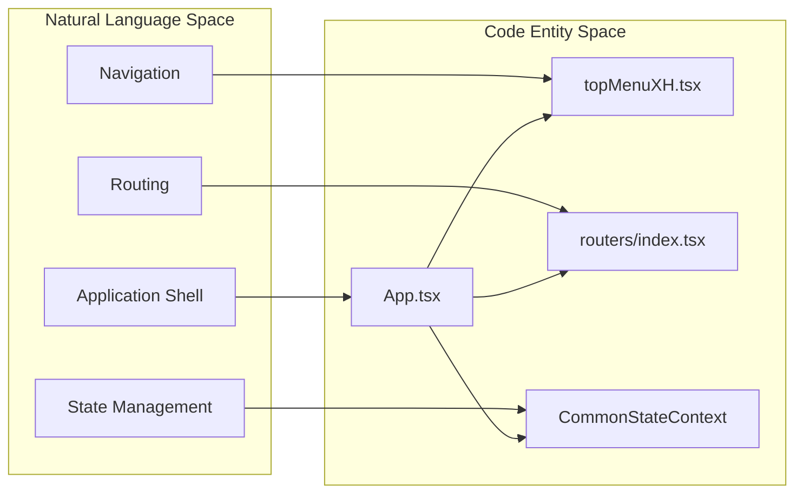
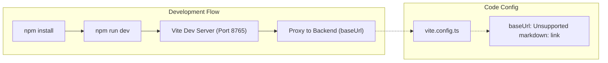

# Overview
Relevant source files

- [README.md](https://github.com/thetide557/ln-server-pub/blob/629bd918/README.md?plain=1)
- [package.json](https://github.com/thetide557/ln-server-pub/blob/629bd918/package.json)
- [src/App.less](https://github.com/thetide557/ln-server-pub/blob/629bd918/src/App.less)
- [src/App.tsx](https://github.com/thetide557/ln-server-pub/blob/629bd918/src/App.tsx)
- [src/components/Code/index.tsx](https://github.com/thetide557/ln-server-pub/blob/629bd918/src/components/Code/index.tsx)
- [src/components/menu/topMenuXH.tsx](https://github.com/thetide557/ln-server-pub/blob/629bd918/src/components/menu/topMenuXH.tsx)
- [src/pages/sxxc/screenView/index.less](https://github.com/thetide557/ln-server-pub/blob/629bd918/src/pages/sxxc/screenView/index.less)
- [src/routers/index.tsx](https://github.com/thetide557/ln-server-pub/blob/629bd918/src/routers/index.tsx)
- [vite.config.ts](https://github.com/thetide557/ln-server-pub/blob/629bd918/vite.config.ts)

The LingNiu (羚牛) Integrated Operations and Maintenance Platform is a comprehensive technical solution designed for infrastructure monitoring, asset management, and automated operations. Built upon the Nightingale (N9E) foundation, this platform extends core monitoring capabilities with specialized modules for IT and IoT asset management, AI-assisted alerting, and integrated task execution.

### System Purpose and Architecture

The platform serves as a centralized hub for O&M teams to manage the lifecycle of IT assets, monitor real-time performance metrics via Prometheus-compatible data sources, and respond to incidents using automated self-healing scripts or AI-driven troubleshooting recommendations.

The frontend is a modern React application utilizing Vite for build tooling and Ant Design for its UI component library. It employs a centralized state management pattern to handle cross-cutting concerns such as user permissions, data source configurations, and real-time alert notifications via WebSockets.

#### System Entity Map

The following diagram bridges the natural language functional modules to their primary code entry points and components.

Sources: `src/App.tsx:18-120`(), `src/components/menu/topMenuXH.tsx:23-220`(), `src/routers/index.tsx:143-150`()

---

### Core Technology Stack

The platform utilizes a robust set of libraries to handle complex data visualization and real-time interactions:

| Category | Technologies |
| --- | --- |
| Framework & Build | React 17, Vite, TypeScript `<FileRef file-url="https://github.com/thetide557/ln-server-pub/blob/629bd918/package.json#L75-L117" min=75 max=117 file-path="package.json">Hii</FileRef>` |
| UI Components | Ant Design (v4), Ant Design Pro Components `<FileRef file-url="https://github.com/thetide557/ln-server-pub/blob/629bd918/package.json#L15-L39" min=15 max=39 file-path="package.json">Hii</FileRef>` |
| Visualization | ECharts, D3, AntV X6 (Topology), @fc-plot/ts-graph `<FileRef file-url="https://github.com/thetide557/ln-server-pub/blob/629bd918/package.json#L16-L60" min=16 max=60 file-path="package.json">Hii</FileRef>` |
| State & Hooks | ahooks, react-use, Context API `<FileRef file-url="https://github.com/thetide557/ln-server-pub/blob/629bd918/package.json#L38-L91" min=38 max=91 file-path="package.json">Hii</FileRef>` |
| Styling | Less (Ant Design theme variables overridden at build time via Vite's `modifyVars`) `<FileRef file-url="https://github.com/thetide557/ln-server-pub/blob/629bd918/vite.config.ts#L167-L199" min=167 max=199 file-path="vite.config.ts">Hii</FileRef>` |

---

### Major Functional Modules

The application is organized into several high-level domains, each managed by specific service layers and UI components.

#### 1. Global Shell & Context

The root of the application, `App.tsx`, establishes the `CommonStateContext`. This context provides global access to user profiles, authorized data sources, and business groups. It also initializes WebSocket connections for real-time alert popups and license monitoring.

- For details, see [Application Shell & Global State](/org/benjamin-braddock/wiki/thetide557/ln-server-pub/page/1.2?branch=v2.1).

#### 2. Asset & Monitoring Management

The platform distinguishes between standard IT assets (XH) and IoT devices. It links these assets to Prometheus monitoring targets, allowing for dynamic dashboard generation and PromQL-based querying.

- Code Reference: Asset routes are defined in `src/routers/index.tsx`[57-60](https://github.com/thetide557/ln-server-pub/blob/629bd918/57-60) and navigation is handled in `src/components/menu/topMenuXH.tsx`[31-50](https://github.com/thetide557/ln-server-pub/blob/629bd918/31-50)

#### 3. Alerting & AI Assistance

Beyond standard threshold alerting, the platform integrates an AI Assistant (`AiRobotSse`) that utilizes Server-Sent Events (SSE) to provide streaming troubleshooting advice, including "Deep Thinking" states for complex issue analysis.

- Code Reference:`src/pages/sxxc/aiRobot/sse.tsx` is imported in the main `App.tsx`[46](https://github.com/thetide557/ln-server-pub/blob/629bd918/46) to provide global availability.

#### 4. Operations & Task Center

Includes automated inspection scheduling, duty management, and self-healing task execution. It leverages a script repository to run operations across target hosts.

- Code Reference: Task and inspection routes are mapped in `src/routers/index.tsx`[118-124](https://github.com/thetide557/ln-server-pub/blob/629bd918/118-124)

---

### Getting Started

To set up the development environment, ensure you have Node.js v16 and npm v8 installed. The platform uses a proxy configuration in `vite.config.ts` to route API requests to the backend server.

Sources: `package.json:4-10`(), `vite.config.ts:61-143`(), `README.md:17-40`()

- For detailed installation and deployment steps, see [Getting Started & Build Configuration](/org/benjamin-braddock/wiki/thetide557/ln-server-pub/page/1.1?branch=v2.1).
- For details on navigation logic and permission-based routing, see [Routing & Navigation](/org/benjamin-braddock/wiki/thetide557/ln-server-pub/page/1.3?branch=v2.1).