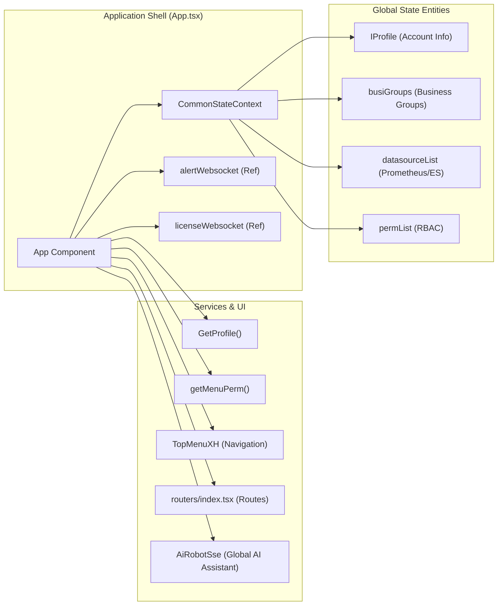
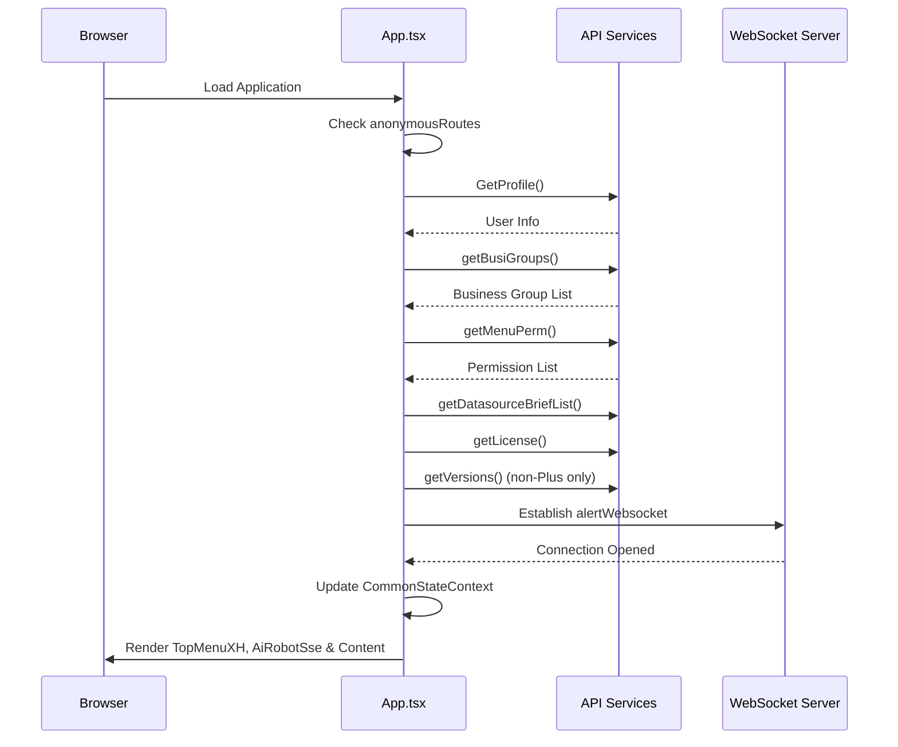

# Application Shell & Global State
Relevant source files

- [src/App.less](https://github.com/thetide557/ln-server-pub/blob/629bd918/src/App.less)
- [src/App.tsx](https://github.com/thetide557/ln-server-pub/blob/629bd918/src/App.tsx)
- [src/components/menu/topMenuXH.tsx](https://github.com/thetide557/ln-server-pub/blob/629bd918/src/components/menu/topMenuXH.tsx) (the actually-effective navigation implementation; `topMenu.tsx` in the same directory is unused dead code — its import is commented out in `App.tsx`)
- [src/components/pageLayout/index.tsx](https://github.com/thetide557/ln-server-pub/blob/629bd918/src/components/pageLayout/index.tsx)
- [src/pages/sxxc/screenView/index.less](https://github.com/thetide557/ln-server-pub/blob/629bd918/src/pages/sxxc/screenView/index.less)
- [src/pages/sxxc/aiRobot/sse.tsx](https://github.com/thetide557/ln-server-pub/blob/629bd918/src/pages/sxxc/aiRobot/sse.tsx)
- [src/pages/sxxc/warnModal/index.tsx](https://github.com/thetide557/ln-server-pub/blob/629bd918/src/pages/sxxc/warnModal/index.tsx)

The application root, defined in `App.tsx`, serves as the orchestration layer for the LingNiu (羚牛) platform. It initializes the React context for global state, establishes real-time communication via WebSockets, and fetches essential bootstrapping data such as user profiles, business groups, and license statuses.

## Global State Management

The platform utilizes a React Context-based state management system called `CommonStateContext`. This context provides a unified interface for accessing and updating global application data across all functional modules.

### CommonStateContext Interface

The `ICommonState` interface defines the core properties shared throughout the application:

| Property | Type | Description |
| --- | --- | --- |
| `profile` | `IProfile` | Current user information (username, role, admin status). |
| `busiGroups` | `Array` | List of business groups the user has access to. |
| `datasourceList` | `Datasource[]` | All configured monitoring datasources. |
| `permList` | `string[]` | Permission keys for Role-Based Access Control (RBAC). |
| `licenseExpired` | `boolean` | Current platform license validity status. |
| `curBusiId` | `number` | The ID of the currently selected business group. |

Sources:

- `src/App.tsx:71-107` (Interface definition)
- `src/App.tsx:119-119` (Context creation)
- `src/App.tsx:141-194` (Initialization of `commonState` hook)

### State Synchronization to LocalStorage

Key UI states are persisted to `localStorage` to maintain consistency across page refreshes:

- `curBusiId`: The active business group context [src/App.tsx#168-171](https://github.com/thetide557/ln-server-pub/blob/629bd918/src/App.tsx#L168-L171)
- `organizationId`: The active organizational hierarchy node [src/App.tsx#174-177](https://github.com/thetide557/ln-server-pub/blob/629bd918/src/App.tsx#L174-L177)
- `queryCondition`: Global search or filter strings [src/App.tsx#179-182](https://github.com/thetide557/ln-server-pub/blob/629bd918/src/App.tsx#L179-L182)

## Application Initialization Flow

When the `App` component mounts, it executes a series of asynchronous calls to prepare the environment. This process is guarded by an `initialized` ref to prevent redundant executions [src/App.tsx#126](https://github.com/thetide557/ln-server-pub/blob/629bd918/src/App.tsx#L126-L126)

### Data Fetching Sequence

The platform follows this logic during startup:

1. Anonymous Route Check: If the current path is in `anonymousRoutes` (e.g., `/login`, `/chart`), data fetching is bypassed [src/App.tsx#115-117](https://github.com/thetide557/ln-server-pub/blob/629bd918/src/App.tsx#L115-L117)
2. User Profile: Calls `GetProfile()` to retrieve user metadata [src/App.tsx#318](https://github.com/thetide557/ln-server-pub/blob/629bd918/src/App.tsx#L318-L318)
3. Business Groups: Loads available groups using `getBusiGroups()`[src/App.tsx#343](https://github.com/thetide557/ln-server-pub/blob/629bd918/src/App.tsx#L343-L343) — this call happens **before** the permissions fetch, not after
4. Permissions: Fetches the RBAC menu permissions via `getMenuPerm()`[src/App.tsx#327](https://github.com/thetide557/ln-server-pub/blob/629bd918/src/App.tsx#L327-L327)
5. Datasources: Retrieves the list of datasources via `getDatasourceBriefList()`[src/App.tsx#344](https://github.com/thetide557/ln-server-pub/blob/629bd918/src/App.tsx#L344-L344)
6. License: Checks the platform license status through `getLicense()`[src/App.tsx#356](https://github.com/thetide557/ln-server-pub/blob/629bd918/src/App.tsx#L356-L356)
7. Version Check (non-Plus builds only): Calls `getVersions()` to check for available upgrades; this call is skipped entirely when `isPlus` is true [src/App.tsx#293-295](https://github.com/thetide557/ln-server-pub/blob/629bd918/src/App.tsx#L293-L295)

Sources:

- `src/App.tsx:312-363` (Initialization `useEffect` logic)
- `src/services/account.ts:31-31` (Profile service)
- `src/services/common.ts:33-33` (Common services)

## Real-time Alerting & WebSockets

The shell maintains two primary WebSocket connections to provide real-time updates without polling.

### WebSocket Connections

- Alert WebSocket: Connects to `WebSocketURL` to receive real-time event notifications [src/App.tsx#216](https://github.com/thetide557/ln-server-pub/blob/629bd918/src/App.tsx#L216-L216) When a matching event arrives (non-anonymous session and the alert's `group_id` is one of the user's business groups), it shows an Ant Design `message.error` toast plus a custom bottom-right corner alert dialog (level + "查看详情" link) [src/App.tsx#220-250](https://github.com/thetide557/ln-server-pub/blob/629bd918/src/App.tsx#L220-L250). `WarnModal` is **not** opened automatically or based on alert priority — it only opens when the user clicks "查看详情" in that corner dialog while the current path is `/screenView`
- License WebSocket: Monitors license validity in real-time; on the first matching message (non-anonymous) it shows a one-time `Modal.warning` dialog with the license message [src/App.tsx#274](https://github.com/thetide557/ln-server-pub/blob/629bd918/src/App.tsx#L274-L274)

### Visual & Audio Notifications

Upon receiving a matching alert via WebSocket:

1. `alertLevel`/`alertId` are read directly from the payload's `severity`/`id` fields [src/App.tsx#222](https://github.com/thetide557/ln-server-pub/blob/629bd918/src/App.tsx#L222-L222)
2. An Ant Design `message.error` toast ("有设备发生告警信息") is shown, and a custom corner alert dialog (`special_alert_dialog`) becomes visible with the alert level [src/App.tsx#227](https://github.com/thetide557/ln-server-pub/blob/629bd918/src/App.tsx#L227-L227) — this happens regardless of the current path; `/screenView` is not checked at this stage
3. An audio notification is played via `audioRef`[src/App.tsx#244](https://github.com/thetide557/ln-server-pub/blob/629bd918/src/App.tsx#L244-L244)
4. If the user clicks "查看详情" in the corner dialog: when the current path is **not** `/screenView`, they are redirected to the event detail page; when the current path **is** `/screenView`, `WarnModal` is opened instead (the `/screenView` check happens here, not when the toast/dialog is first shown) [src/App.tsx#202-206](https://github.com/thetide557/ln-server-pub/blob/629bd918/src/App.tsx#L202-L206)

Sources:

- `src/App.tsx:216-297` (WebSocket setup and message handling)
- `src/utils/constant.ts:32-32` (WebSocket URL constant)
- `src/pages/sxxc/warnModal/index.tsx` (Alert modal component)

## Component Architecture

The following diagram illustrates the relationship between the root shell and its dependent state entities.

### Shell to Code Entity Mapping

Sources:

- `src/App.tsx:18-47` (Imports and Component definition)
- `src/App.tsx:119-122` (Context definition)

### Initialization Sequence Diagram

Sources:

- `src/App.tsx:312-363` (Lifecycle hooks)
- `src/components/menu/topMenuXH.tsx:43-43` (Main navigation component)

## Theming and Layout

The application shell handles global visual styling through `App.less` and `global.variable.less`.

- Theme Storage: The platform theme (title, logo, icon) is managed via `useLocalStorage` with a default `initTheme`[src/App.tsx#109-140](https://github.com/thetide557/ln-server-pub/blob/629bd918/src/App.tsx#L109-L140)
- Page Wrapper: `PageLayout` only renders the generic page header (back button, icon, title) and page body. It destructures `profile` from `CommonStateContext` and defines a Profile/Logout dropdown `menu`, but neither `profile` nor `menu` is actually referenced in its rendered JSX — this is unused/dead code inside the component [src/components/pageLayout/index.tsx#46-113](https://github.com/thetide557/ln-server-pub/blob/629bd918/src/components/pageLayout/index.tsx#L46-L113). The real user-profile display (nickname/avatar) and working logout dropdown live in `TopMenuXH`, not `PageLayout` [src/components/menu/topMenuXH.tsx#457-773](https://github.com/thetide557/ln-server-pub/blob/629bd918/src/components/menu/topMenuXH.tsx#L457-L773)
- Navigation: The platform uses `TopMenuXH` (a specialized version for West Air/西航) to render the primary navigation bar. The older `src/components/menu/topMenu.tsx` is unused dead code — its import is commented out in `App.tsx` [src/App.tsx#42-43](https://github.com/thetide557/ln-server-pub/blob/629bd918/src/App.tsx#L42-L43)
- Global AI Assistant: `AiRobotSse` renders as a sibling of `TopMenu`/`Content` on every route except the two job-task output routes [src/App.tsx#365-372](https://github.com/thetide557/ln-server-pub/blob/629bd918/src/App.tsx#L365-L372). It is a draggable floating chat widget that streams answers from `/v1/chat-messages` and shows "深度思考中..." / "深度思考完成" (thinking/done) states while streaming

Sources:

- `src/App.tsx:109-113` (Theme defaults)
- `src/components/pageLayout/index.tsx:17-44` (Layout definition)
- `src/components/menu/topMenuXH.tsx:457-773` (Profile display & logout)
- `src/pages/sxxc/aiRobot/sse.tsx` (Global AI assistant widget)
- `src/App.less:1-25` (Global header styles)