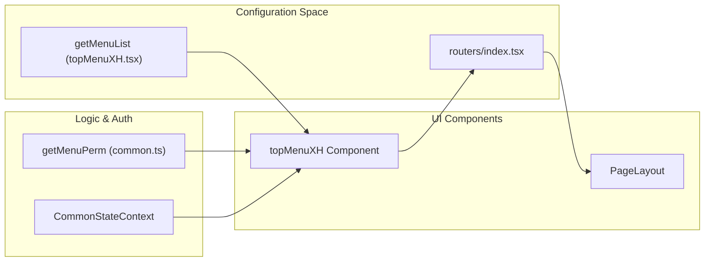
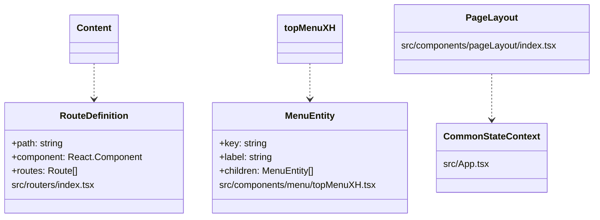

# Routing & Navigation
Relevant source files

- [src/components/menu/topMenu.tsx](https://github.com/thetide557/ln-server-pub/blob/629bd918/src/components/menu/topMenu.tsx)
- [src/components/menu/topMenuXH.tsx](https://github.com/thetide557/ln-server-pub/blob/629bd918/src/components/menu/topMenuXH.tsx)
- [src/components/pageLayout/index.tsx](https://github.com/thetide557/ln-server-pub/blob/629bd918/src/components/pageLayout/index.tsx)
- [src/routers/index.tsx](https://github.com/thetide557/ln-server-pub/blob/629bd918/src/routers/index.tsx)
- [vite.config.ts](https://github.com/thetide557/ln-server-pub/blob/629bd918/vite.config.ts)

The LingNiu (羚牛) platform utilizes `react-router-dom` for client-side routing. The architecture centralizes route definitions in a single configuration file while supporting dynamic injection of "Plus" (enterprise) modules and permission-based navigation filtering via specialized menu components.

## Route Configuration

Routes are defined in `src/routers/index.tsx`. The application uses a `Switch` component to render the first matching `Route` based on the current URL path [src/routers/index.tsx#143-150](https://github.com/thetide557/ln-server-pub/blob/629bd918/src/routers/index.tsx#L143-L150)

### Core Routing Structure

The routing system distinguishes between standard pages, administrative tools, and specialized views like "Big Screens" or "Dashboards" which may require specific theme classes (e.g., `dark` mode for full-screen dashboards) [src/routers/index.tsx#147-152](https://github.com/thetide557/ln-server-pub/blob/629bd918/src/routers/index.tsx#L147-L152)

| Path Category | Key Components | Purpose |
| --- | --- | --- |
| Asset Management | `XhAssetMgt`, `IotAssetMgt` | IT infrastructure and IoT asset inventory [src/routers/index.tsx#57-60](https://github.com/thetide557/ln-server-pub/blob/629bd918/src/routers/index.tsx#L57-L60) |
| Monitoring | `MetricExplore`, `XhMonitor`, `RecordingRule` | Metrics querying and monitor configuration [src/routers/index.tsx#46-62](https://github.com/thetide557/ln-server-pub/blob/629bd918/src/routers/index.tsx#L46-L62) |
| Alerting | `AlertRules`, `Event`, `Shield`, `Subscribe` | Rule definition and alert lifecycle management [src/routers/index.tsx#38-56](https://github.com/thetide557/ln-server-pub/blob/629bd918/src/routers/index.tsx#L38-L56) |
| Operations | `TaskManage`, `InspectionList`, `DutyManage` | Scheduled tasks and manual operations [src/routers/index.tsx#119-124](https://github.com/thetide557/ln-server-pub/blob/629bd918/src/routers/index.tsx#L119-L124) |
| System | `Users`, `Groups`, `Permissions`, `Datasource` | RBAC and infrastructure settings [src/routers/index.tsx#43-88](https://github.com/thetide557/ln-server-pub/blob/629bd918/src/routers/index.tsx#L43-L88) |

Note: `src/routers/index.tsx` does not define every route in the app. Two `job-task` output paths (`/job-task/:busiId/output/:taskId/:outputType` and `/job-task/:busiId/output/:taskId/:host/:outputType`) are registered directly in `App.tsx`'s own top-level `Switch`, ahead of `TopMenu`/`Content`, so those two paths render `TaskOutput`/`TaskHostOutput` standalone without the menu chrome.

### Dynamic & Plus Routes

The platform supports dynamic route injection through a plugin mechanism. The `dynamicPackages` utility scans for additional modules, which are then flattened into the `lazyRoutes` array and rendered alongside static routes [src/routers/index.tsx#126-129](https://github.com/thetide557/ln-server-pub/blob/629bd918/src/routers/index.tsx#L126-L129) Furthermore, the `plusLoader` is used to inject enterprise-specific components, such as anomaly detection jobs [src/routers/index.tsx#98-100](https://github.com/thetide557/ln-server-pub/blob/629bd918/src/routers/index.tsx#L98-L100)

In this `ln-server-pub` (public) build, the `plus:` module id resolves through `plugins/plusResolve.ts` to `plugins/PlusPlaceholder.tsx` unless the app is built with the `:advanced` npm scripts — and that placeholder exports no-op stubs (e.g. `Jobs()` returns `null`, and the default export has no `.routes`). So in this repository's normal build, `StrategyBrain` (from `plus:/datasource/anomaly`) renders nothing and `plusLoader.routes` contributes no extra routes; the injection mechanism only becomes live in the separate "advanced" (enterprise) build.

Sources:[src/routers/index.tsx#1-130](https://github.com/thetide557/ln-server-pub/blob/629bd918/src/routers/index.tsx#L1-L130)[vite.config.ts#72](https://github.com/thetide557/ln-server-pub/blob/629bd918/vite.config.ts#L72-L72)

---

## Navigation & Menu System

Navigation is primarily handled by the `topMenuXH` component, which renders the top-level navigation bar and dropdown menus.

### Permission-Filtered Rendering

The `topMenuXH` component fetches user permissions via `getMenuPerm` to determine which menu items should be visible to the current user — but only for non-Admin roles. The fetch+filter only runs when `profile.roles` does **not** include `'Admin'`; users with the `Admin` role are assigned the full, unfiltered static `menuList` directly, bypassing `getMenuPerm` entirely [src/components/menu/topMenuXH.tsx#486-546](https://github.com/thetide557/ln-server-pub/blob/629bd918/src/components/menu/topMenuXH.tsx#L486-L546)

1. Menu Definition: A static `menuList` defines the structure, icons, and labels [src/components/menu/topMenuXH.tsx#23-220](https://github.com/thetide557/ln-server-pub/blob/629bd918/src/components/menu/topMenuXH.tsx#L23-L220)
2. State Integration: The component consumes `CommonStateContext` to read the current user `profile` [src/components/menu/topMenuXH.tsx#1](https://github.com/thetide557/ln-server-pub/blob/629bd918/src/components/menu/topMenuXH.tsx#L1-L1). The current theme, however, is **not** sourced from `CommonStateContext` — it comes from a separate `useLocalStorage('platform_theme', initTheme)` hook that reads/writes `localStorage` directly (only the `initTheme` default-value constant is imported from `App.tsx`) [src/components/menu/topMenuXH.tsx#462](https://github.com/thetide557/ln-server-pub/blob/629bd918/src/components/menu/topMenuXH.tsx#L462-L462)
3. Active State: `useLocation`/`pathname` are used to decide whether to hide the side menu (e.g. on `/login`, `/chart/*`, dashboard fullscreen) and to reset an internal `defaultSelectedKeys` state on path change, but that reset value is never actually applied to the rendered `Menu`. The `Menu`'s `selectedKeys` prop is bound to a separate `mainMenuKey` state that is only ever mutated inside a commented-out code block, so it stays `[]` for the lifetime of the component — in the current build, the active top-level menu item is **not** actually highlighted based on the current URL [src/components/menu/topMenuXH.tsx#452-466](https://github.com/thetide557/ln-server-pub/blob/629bd918/src/components/menu/topMenuXH.tsx#L452-L466)[src/components/menu/topMenuXH.tsx#534-536](https://github.com/thetide557/ln-server-pub/blob/629bd918/src/components/menu/topMenuXH.tsx#L534-L536)[src/components/menu/topMenuXH.tsx#689](https://github.com/thetide557/ln-server-pub/blob/629bd918/src/components/menu/topMenuXH.tsx#L689-L689)

### Data Flow: Route to UI

The following diagram illustrates how route definitions and permission data flow into the rendered Navigation Menu.

Navigation Logic Flow

Sources:[src/components/menu/topMenuXH.tsx#1-10](https://github.com/thetide557/ln-server-pub/blob/629bd918/src/components/menu/topMenuXH.tsx#L1-L10)[src/components/menu/topMenuXH.tsx#23-34](https://github.com/thetide557/ln-server-pub/blob/629bd918/src/components/menu/topMenuXH.tsx#L23-L34)[src/routers/index.tsx#143-150](https://github.com/thetide557/ln-server-pub/blob/629bd918/src/routers/index.tsx#L143-L150)

---

## Page Layout & Navigation Utilities

The `PageLayout` component provides a consistent wrapper for pages, handling the page header (icon/title) and a back-navigation control [src/components/pageLayout/index.tsx#81-116](https://github.com/thetide557/ln-server-pub/blob/629bd918/src/components/pageLayout/index.tsx#L81-L116). It does **not** actually render breadcrumbs or a user profile dropdown, despite defining code for the latter — see below.

### Key Functions in PageLayout

- Back Navigation: The `showBack` and `backPath` props allow pages to implement a standard "Return" button using `history.push` or `history.goBack()`[src/components/pageLayout/index.tsx#89-105](https://github.com/thetide557/ln-server-pub/blob/629bd918/src/components/pageLayout/index.tsx#L89-L105)
- Profile dropdown / Logout is dead code here: `PageLayout` defines a local `menu` (a profile/`Logout` dropdown, clearing `access_token`, `refresh_token`, `curBusiId`, `card5Data`, `card7Data`, `userId`, `deepseek_token`, then `history.push('/login')`) and imports `Dropdown`, but that `menu` is never rendered anywhere in the component's JSX — it, and the `Dropdown`/`profile` context read, are unused dead code [src/components/pageLayout/index.tsx#21-79](https://github.com/thetide557/ln-server-pub/blob/629bd918/src/components/pageLayout/index.tsx#L21-L79). Breadcrumbs are likewise not implemented in `PageLayout` (a `Breadcrumb` is only used ad hoc by one unrelated page, `src/pages/taskTpl/detail.tsx`).
- Actual Logout Logic: The live user profile/logout dropdown that users interact with is `topMenuXH.tsx`'s `topRightMenu`, rendered in the top bar. Its `Logout` handler clears `access_token`, `refresh_token`, `curBusiId`, `card5Data`, `card7Data`, `userId`, `left_tissueId`, `left_parId`, `left_asset_type` (notably **not** `deepseek_token`), then either redirects to the server-provided `logout_url` or to `/login` [src/components/menu/topMenuXH.tsx#643-681](https://github.com/thetide557/ln-server-pub/blob/629bd918/src/components/menu/topMenuXH.tsx#L643-L681)

### Mapping System Entities to Code

This diagram maps the logical navigation concepts to their implementation entities in the codebase.

Entity Mapping Diagram

Sources:[src/components/pageLayout/index.tsx#46-118](https://github.com/thetide557/ln-server-pub/blob/629bd918/src/components/pageLayout/index.tsx#L46-L118)[src/routers/index.tsx#131-141](https://github.com/thetide557/ln-server-pub/blob/629bd918/src/routers/index.tsx#L131-L141)[src/components/menu/topMenuXH.tsx#23-220](https://github.com/thetide557/ln-server-pub/blob/629bd918/src/components/menu/topMenuXH.tsx#L23-L220)

---

## Build-Time Configuration

The routing behavior is also influenced by `vite.config.ts`. The platform uses a proxy configuration to route API requests from the frontend to the appropriate backend services based on the path prefix [vite.config.ts#84-143](https://github.com/thetide557/ln-server-pub/blob/629bd918/vite.config.ts#L84-L143)

- Base URL: Defined as `http://172.16.20.11:17000/`[vite.config.ts#61](https://github.com/thetide557/ln-server-pub/blob/629bd918/vite.config.ts#L61-L61)
- Proxy Rules: Paths like `/api/takin/xh/`, `/api/takin-plus`, and `/sxxcTask` are mapped to the backend to ensure seamless communication during development [vite.config.ts#91-132](https://github.com/thetide557/ln-server-pub/blob/629bd918/vite.config.ts#L91-L132)
- Plus Plugin: The `plusResolve()` plugin is registered to handle the `plus:` alias used in dynamic route injection [vite.config.ts#72](https://github.com/thetide557/ln-server-pub/blob/629bd918/vite.config.ts#L72-L72)

Sources:[vite.config.ts#61-143](https://github.com/thetide557/ln-server-pub/blob/629bd918/vite.config.ts#L61-L143)[vite.config.ts#72](https://github.com/thetide557/ln-server-pub/blob/629bd918/vite.config.ts#L72-L72)