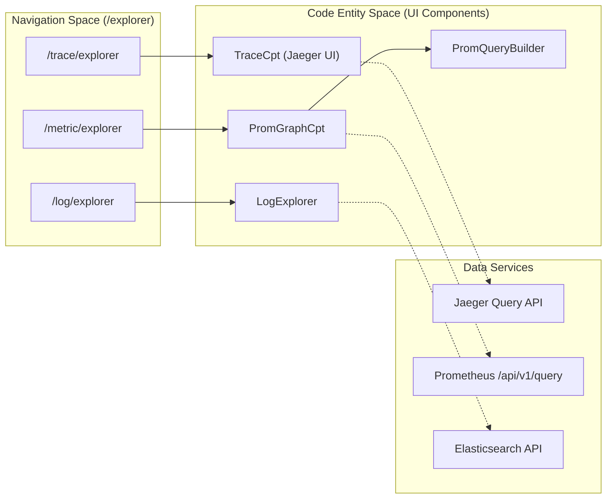
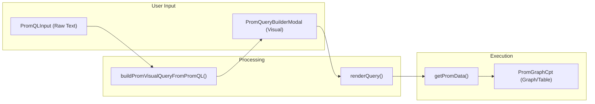

# Distributed Tracing & Explorer
Relevant source files

- [public/image/login/logo.png](https://github.com/thetide557/ln-server-pub/blob/629bd918/public/image/login/logo.png)
- [public/image/login/logo_top1.png](https://github.com/thetide557/ln-server-pub/blob/629bd918/public/image/login/logo_top1.png)
- [src/components/PromGraphCpt/Graph.tsx](https://github.com/thetide557/ln-server-pub/blob/629bd918/src/components/PromGraphCpt/Graph.tsx)
- [src/components/PromGraphCpt/index.tsx](https://github.com/thetide557/ln-server-pub/blob/629bd918/src/components/PromGraphCpt/index.tsx)
- [src/components/PromQueryBuilder/MetricSelect/index.tsx](https://github.com/thetide557/ln-server-pub/blob/629bd918/src/components/PromQueryBuilder/MetricSelect/index.tsx)
- [src/components/PromQueryBuilder/RawQuery/index.tsx](https://github.com/thetide557/ln-server-pub/blob/629bd918/src/components/PromQueryBuilder/RawQuery/index.tsx)
- [src/components/PromQueryBuilder/utils/buildPromVisualQueryFromPromQL.ts](https://github.com/thetide557/ln-server-pub/blob/629bd918/src/components/PromQueryBuilder/utils/buildPromVisualQueryFromPromQL.ts)
- [src/pages/explorer/Prometheus/index.tsx](https://github.com/thetide557/ln-server-pub/blob/629bd918/src/pages/explorer/Prometheus/index.tsx)
- [src/pages/taskTpl/index.tsx](https://github.com/thetide557/ln-server-pub/blob/629bd918/src/pages/taskTpl/index.tsx)

The Distributed Tracing & Explorer module provides a unified interface for investigating system behavior across different telemetry types. Located under the `/explorer` routes, this module integrates Jaeger-based distributed tracing, Prometheus-based metric exploration, and Elasticsearch-based log searching into a single diagnostic workspace.

The core of the tracing functionality is the `TraceCpt` component, which handles trace searching, visualization of spans, and dependency mapping. The metrics and logs explorers leverage specialized components like `PromGraphCpt` and `PromQueryBuilder` to provide both raw and visual query capabilities.

### System Architecture & Route Mapping

The following diagram illustrates how the explorer routes map to specific UI components and their underlying data services.

Explorer Component & Route Mapping

Sources:[src/pages/explorer/Prometheus/index.tsx#35-58](https://github.com/thetide557/ln-server-pub/blob/629bd918/src/pages/explorer/Prometheus/index.tsx#L35-L58)[src/components/PromGraphCpt/index.tsx#27-32](https://github.com/thetide557/ln-server-pub/blob/629bd918/src/components/PromGraphCpt/index.tsx#L27-L32)

---

### 10.1. Trace Search & Detail

The tracing system allows users to search for distributed traces across microservices. The interface supports filtering by service name, operation, custom tags (e.g., HTTP status codes), and duration ranges.

- Search Interface: Users can perform lookups by specific Trace IDs or use filters to identify performance bottlenecks [src/pages/explorer/constants.ts](https://github.com/thetide557/ln-server-pub/blob/629bd918/src/pages/explorer/constants.ts)
- Trace Visualization: Once a trace is selected, the system renders a Gantt-chart style span timeline view for that single trace. The service dependency graph is a separate, standalone page ("拓扑分析"/Topology Analysis at `/trace/dependencies`, a sibling of "即时查询"/Instant Query at `/trace/explorer` in the navigation) that visualizes the overall service call graph for a Jaeger data source — it is not triggered by, or scoped to, selecting an individual trace.
- Data Transformation: The `transformTraceData` utility converts raw Jaeger JSON responses from trace search results and single-trace lookups into the hierarchical span tree used by the result list and detail/timeline views. The Dependencies (topology) page uses a separate `getRadialData` utility to convert the `/api/dependencies` response into the graph nodes/edges it renders.

For details on trace filtering, span attributes, and dependency graph generation, see [Trace Search & Detail](/org/benjamin-braddock/wiki/thetide557/ln-server-pub/page/10.1?branch=v2.1).

---

### 10.2. Metric & Log Explorer

The Metric and Log explorers provide specialized tools for ad-hoc debugging and data inspection without requiring pre-configured dashboards.

- Prometheus Explorer: Built around the `PromGraphCpt` component, it supports switching between `table` and `graph` modes [src/components/PromGraphCpt/index.tsx#66-67](https://github.com/thetide557/ln-server-pub/blob/629bd918/src/components/PromGraphCpt/index.tsx#L66-L67) It features a visual query builder (`PromQueryBuilder`) that allows users to construct complex PromQL expressions through UI dropdowns for metrics, labels, and operations [src/components/PromQueryBuilder/RawQuery/index.tsx#68-87](https://github.com/thetide557/ln-server-pub/blob/629bd918/src/components/PromQueryBuilder/RawQuery/index.tsx#L68-L87)
- Log Explorer: Provides a dedicated interface for searching Elasticsearch indices, with two selectable modes for locating data — via configured index patterns or by targeting raw indices directly. It includes a fields sidebar for choosing which document fields are shown as columns in the result list, plus a date-field/time-range picker for timestamp-based filtering.
- Deep Linking: Queries are serialized into the URL, allowing users to share specific views (e.g., a specific PromQL query and time range) via simple link sharing [src/pages/explorer/Prometheus/index.tsx#45-48](https://github.com/thetide557/ln-server-pub/blob/629bd918/src/pages/explorer/Prometheus/index.tsx#L45-L48)

Metric Exploration Workflow

Sources:[src/components/PromGraphCpt/Graph.tsx#120-125](https://github.com/thetide557/ln-server-pub/blob/629bd918/src/components/PromGraphCpt/Graph.tsx#L120-L125)[src/components/PromQueryBuilder/RawQuery/index.tsx#90-95](https://github.com/thetide557/ln-server-pub/blob/629bd918/src/components/PromQueryBuilder/RawQuery/index.tsx#L90-L95)[src/components/PromQueryBuilder/utils/buildPromVisualQueryFromPromQL.ts#44-47](https://github.com/thetide557/ln-server-pub/blob/629bd918/src/components/PromQueryBuilder/utils/buildPromVisualQueryFromPromQL.ts#L44-L47)

For details on the visual query builder, metric translation dictionaries, and Elasticsearch index management, see [Metric & Log Explorer](/org/benjamin-braddock/wiki/thetide557/ln-server-pub/page/10.2?branch=v2.1).

Sources:

- `src/components/PromGraphCpt/index.tsx`
- `src/components/PromQueryBuilder/RawQuery/index.tsx`
- `src/pages/explorer/Prometheus/index.tsx`
- `src/components/PromGraphCpt/Graph.tsx`