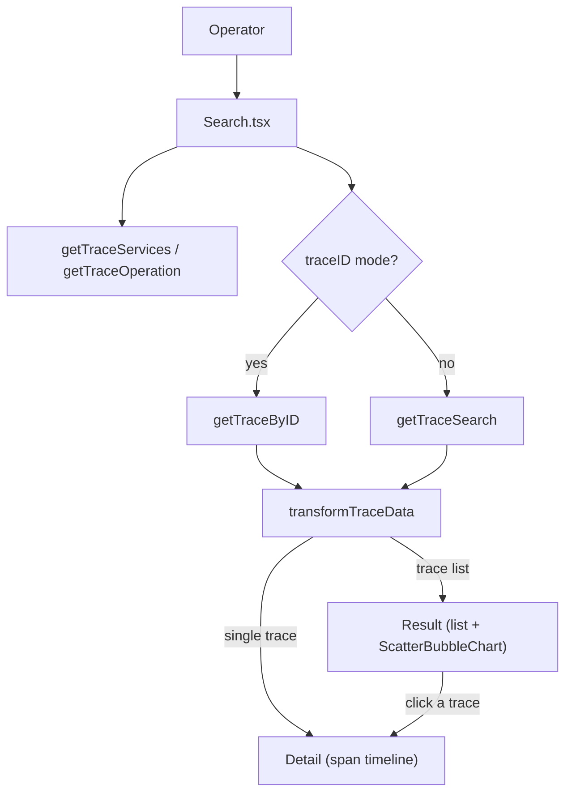

# Trace Search & Detail
Relevant source files

- [src/pages/traceCpt/index.tsx](https://github.com/thetide557/ln-server-pub/blob/629bd918/src/pages/traceCpt/index.tsx)
- [src/pages/traceCpt/Search.tsx](https://github.com/thetide557/ln-server-pub/blob/629bd918/src/pages/traceCpt/Search.tsx)
- [src/pages/traceCpt/Result/index.tsx](https://github.com/thetide557/ln-server-pub/blob/629bd918/src/pages/traceCpt/Result/index.tsx)
- [src/pages/traceCpt/Result/ResultItem/index.tsx](https://github.com/thetide557/ln-server-pub/blob/629bd918/src/pages/traceCpt/Result/ResultItem/index.tsx)
- [src/pages/traceCpt/Detail/index.tsx](https://github.com/thetide557/ln-server-pub/blob/629bd918/src/pages/traceCpt/Detail/index.tsx)
- [src/pages/traceCpt/Detail/Header/index.tsx](https://github.com/thetide557/ln-server-pub/blob/629bd918/src/pages/traceCpt/Detail/Header/index.tsx)
- [src/pages/traceCpt/Detail/Header/SpanGraph/index.tsx](https://github.com/thetide557/ln-server-pub/blob/629bd918/src/pages/traceCpt/Detail/Header/SpanGraph/index.tsx)
- [src/pages/traceCpt/Detail/Timeline/index.tsx](https://github.com/thetide557/ln-server-pub/blob/629bd918/src/pages/traceCpt/Detail/Timeline/index.tsx)
- [src/pages/traceCpt/services.ts](https://github.com/thetide557/ln-server-pub/blob/629bd918/src/pages/traceCpt/services.ts)
- [src/pages/traceCpt/utils/index.ts](https://github.com/thetide557/ln-server-pub/blob/629bd918/src/pages/traceCpt/utils/index.ts)
- [src/pages/traceCpt/type.ts](https://github.com/thetide557/ln-server-pub/blob/629bd918/src/pages/traceCpt/type.ts)
- [src/pages/traceCpt/components/ScatterBubbleChart/ScatterBubbleChart.tsx](https://github.com/thetide557/ln-server-pub/blob/629bd918/src/pages/traceCpt/components/ScatterBubbleChart/ScatterBubbleChart.tsx)

The Trace Search & Detail feature (`TraceCpt`, mounted at route `/trace/explorer`) lets operators search for distributed traces backed by a Jaeger-compatible datasource, browse the matching traces, and drill into a single trace's span timeline for debugging. It is composed of a search form, a result list (with a duration/time scatter overview), and a Gantt-style span detail view.

## Trace Search Interface

### Data Source

The search form always targets the `jaeger` datasource group: the datasource type selector is fixed to `Jaeger` and the datasource instance dropdown is populated from `groupedDatasourceList['jaeger']` in the shared `CommonStateContext` [src/pages/traceCpt/Search.tsx#50-51](https://github.com/thetide557/ln-server-pub/blob/629bd918/src/pages/traceCpt/Search.tsx#L50-L51) There is no way to point this page at another datasource type.

### Search Parameters

A `Radio.Group` switches the form between two mutually exclusive modes, "query" and "id" [src/pages/traceCpt/Search.tsx#209-212](https://github.com/thetide557/ln-server-pub/blob/629bd918/src/pages/traceCpt/Search.tsx#L209-L212)

In query mode, the following filters are available and are combined into a single `SearchTraceType` object on submit [src/pages/traceCpt/Search.tsx#156-170](https://github.com/thetide557/ln-server-pub/blob/629bd918/src/pages/traceCpt/Search.tsx#L156-L170) [src/pages/traceCpt/type.ts#8-18](https://github.com/thetide557/ln-server-pub/blob/629bd918/src/pages/traceCpt/type.ts#L8-L18):

| Field | Description | Source |
| --- | --- | --- |
| Service | Populated from `getTraceServices`; selecting a service re-fetches its operations. | [src/pages/traceCpt/Search.tsx#94-108](https://github.com/thetide557/ln-server-pub/blob/629bd918/src/pages/traceCpt/Search.tsx#L94-L108) |
| Operation | Populated from `getTraceOperation(dataSourceId, service)`. | [src/pages/traceCpt/Search.tsx#110-120](https://github.com/thetide557/ln-server-pub/blob/629bd918/src/pages/traceCpt/Search.tsx#L110-L120) |
| Tags | Free-text field (e.g. `http.status_code=200 error=true`) parsed as logfmt via `logfmt/lib/logfmt_parser`, coercing all values to strings, and sent as `attributes`. | [src/pages/traceCpt/Search.tsx#30-44](https://github.com/thetide557/ln-server-pub/blob/629bd918/src/pages/traceCpt/Search.tsx#L30-L44) |
| Time Range | `TimeRangePicker`, default `now-12h` to `now`; parsed to `start_time_min`/`start_time_max`. | [src/pages/traceCpt/Search.tsx#57-61](https://github.com/thetide557/ln-server-pub/blob/629bd918/src/pages/traceCpt/Search.tsx#L57-L61) |
| Duration Max / Min | Free-text durations (e.g. `1.2s`, `100ms`, `500us`), validated against `/\d[\d\\.]*(us\|ms\|s\|m\|h)$/`. | [src/pages/traceCpt/Search.tsx#24-28](https://github.com/thetide557/ln-server-pub/blob/629bd918/src/pages/traceCpt/Search.tsx#L24-L28) |
| Num Traces | Optional numeric cap on the number of returned traces (`num_traces`). | [src/pages/traceCpt/Search.tsx#320-331](https://github.com/thetide557/ln-server-pub/blob/629bd918/src/pages/traceCpt/Search.tsx#L320-L331) |

There is no free-standing "duration" range slider — duration filtering is these two text inputs, not a graphical control.

### Trace ID Lookup

Switching to "id" mode replaces the whole filter row with a single required Trace ID input; submitting calls `onSearch({ data_source_id, traceID })` instead of building a `SearchTraceType` [src/pages/traceCpt/Search.tsx#150-155](https://github.com/thetide557/ln-server-pub/blob/629bd918/src/pages/traceCpt/Search.tsx#L150-L155) The component can also be handed an `init` (trace ID) prop on mount, in which case it pre-fills the Trace ID field and fires the ID-based `onSearch` immediately — without flipping the visible radio toggle to "id" mode [src/pages/traceCpt/Search.tsx#79-83](https://github.com/thetide557/ln-server-pub/blob/629bd918/src/pages/traceCpt/Search.tsx#L79-L83)

### Search & Selection Flow

Sources:[src/pages/traceCpt/index.tsx#15-51](https://github.com/thetide557/ln-server-pub/blob/629bd918/src/pages/traceCpt/index.tsx#L15-L51)[src/pages/traceCpt/Result/index.tsx#48-65](https://github.com/thetide557/ln-server-pub/blob/629bd918/src/pages/traceCpt/Result/index.tsx#L48-L65)

## Search Results

`Result` fetches with `getTraceSearch(search)` whenever the search criteria change, maps every raw trace through `transformTraceData`, and sorts them client-side (`MOST_RECENT`, `LONGEST_FIRST`, `SHORTEST_FIRST`, `MOST_SPANS`, `LEAST_SPANS`) [src/pages/traceCpt/Result/index.tsx#48-70](https://github.com/thetide557/ln-server-pub/blob/629bd918/src/pages/traceCpt/Result/index.tsx#L48-L70) [src/pages/traceCpt/utils/index.ts#206-217](https://github.com/thetide557/ln-server-pub/blob/629bd918/src/pages/traceCpt/utils/index.ts#L206-L217)

- Overview chart: when results exist, a `ScatterBubbleChart` plots each trace's start time against duration, with bubble size proportional to span count; clicking a point opens that trace's detail view [src/pages/traceCpt/components/ScatterBubbleChart/ScatterBubbleChart.tsx#36-44](https://github.com/thetide557/ln-server-pub/blob/629bd918/src/pages/traceCpt/components/ScatterBubbleChart/ScatterBubbleChart.tsx#L36-L44)
- Result list: each `ResultItem` shows the derived trace name (dominant root span's `service: operation`), total span count, a tag per service with its span count, and relative/absolute start time; clicking an item also opens the detail view [src/pages/traceCpt/Result/ResultItem/index.tsx#17-53](https://github.com/thetide557/ln-server-pub/blob/629bd918/src/pages/traceCpt/Result/ResultItem/index.tsx#L17-L53)

## Trace Detail & Span Timeline

Once a trace is loaded (from either search path), `Detail` renders a header summary plus a Gantt-style span timeline; a shared `viewRange` state (in `[0, 1]` normalized coordinates) links zoom/pan between the two [src/pages/traceCpt/Detail/index.tsx#16-73](https://github.com/thetide557/ln-server-pub/blob/629bd918/src/pages/traceCpt/Detail/index.tsx#L16-L73)

- Header summary: start time, total duration, distinct service count, max span depth, and total span count [src/pages/traceCpt/Detail/Header/index.tsx#21-58](https://github.com/thetide557/ln-server-pub/blob/629bd918/src/pages/traceCpt/Detail/Header/index.tsx#L21-L58), plus a `SpanGraph` minimap (a canvas rendering of every span's relative offset/width by service color) with a draggable viewing-layer scrubber for zooming the timeline [src/pages/traceCpt/Detail/Header/SpanGraph/index.tsx#40-61](https://github.com/thetide557/ln-server-pub/blob/629bd918/src/pages/traceCpt/Detail/Header/SpanGraph/index.tsx#L40-L61)
- Timeline: spans are rendered as a virtualized, indentation-based tree reflecting parent/child depth; each row's children can be collapsed independently [src/pages/traceCpt/Detail/Timeline/index.tsx#41-49](https://github.com/thetide557/ln-server-pub/blob/629bd918/src/pages/traceCpt/Detail/Timeline/index.tsx#L41-L49)
- Span detail: expanding a span row reveals an accordion with independently toggleable `tags`, `process`, `logs`, `warnings`, and `references` sub-sections [src/pages/traceCpt/Detail/Timeline/index.tsx#61-80](https://github.com/thetide557/ln-server-pub/blob/629bd918/src/pages/traceCpt/Detail/Timeline/index.tsx#L61-L80)

## Data Transformation: `transformTraceData`

`transformTraceData` (in `utils/index.ts`) converts one raw Jaeger trace response into the `Trace` shape consumed by both the result list and the detail/timeline view. It:

- Filters out spans with no start time, then attaches each span's `process` from `data.processes` [src/pages/traceCpt/utils/index.ts#41-94](https://github.com/thetide557/ln-server-pub/blob/629bd918/src/pages/traceCpt/utils/index.ts#L41-L94)
- Builds a span tree (`getTraceSpanIdsAsTree`) purely to order and depth-annotate spans — parents before children, siblings by start time — not to render a separate graph [src/pages/traceCpt/utils/index.ts#97-118](https://github.com/thetide557/ln-server-pub/blob/629bd918/src/pages/traceCpt/utils/index.ts#L97-L118)
- Computes each span's `relativeStartTime` (offset from the trace's earliest span start) and `depth`, dedupes/orders its tags, and links reference spans [src/pages/traceCpt/utils/index.ts#116-142](https://github.com/thetide557/ln-server-pub/blob/629bd918/src/pages/traceCpt/utils/index.ts#L116-L142)
- Derives the overall trace name, per-service span counts, and total `duration`/`startTime`/`endTime` [src/pages/traceCpt/utils/index.ts#145-159](https://github.com/thetide557/ln-server-pub/blob/629bd918/src/pages/traceCpt/utils/index.ts#L145-L159)

This function is used only for search results and single-trace lookups (both call sites feed it a single Jaeger trace object) [src/pages/traceCpt/index.tsx#34-35](https://github.com/thetide557/ln-server-pub/blob/629bd918/src/pages/traceCpt/index.tsx#L34-L35)[src/pages/traceCpt/Result/index.tsx#54](https://github.com/thetide557/ln-server-pub/blob/629bd918/src/pages/traceCpt/Result/index.tsx#L54-L54) — it does not process, and is not used by, the service dependency graph.

## API Endpoints

All requests are proxied through the selected Jaeger datasource instance at `/api/takin/proxy/{data_source_id}/api/*` [src/pages/traceCpt/services.ts#33-58](https://github.com/thetide557/ln-server-pub/blob/629bd918/src/pages/traceCpt/services.ts#L33-L58):

| Function | Endpoint | Used by |
| --- | --- | --- |
| `getTraceServices` | `GET /api/takin/proxy/{id}/api/services` | Service dropdown |
| `getTraceOperation` | `GET /api/takin/proxy/{id}/api/services/{service}/operations` | Operation dropdown |
| `getTraceSearch` | `GET /api/takin/proxy/{id}/api/traces` (with search params) | Search results |
| `getTraceByID` | `GET /api/takin/proxy/{id}/api/traces/{traceID}` | Trace ID lookup |

Sources:[src/pages/traceCpt/services.ts#33-58](https://github.com/thetide557/ln-server-pub/blob/629bd918/src/pages/traceCpt/services.ts#L33-L58)

## Relationship to the Dependency Graph

The service dependency graph ("拓扑分析"/Topology Analysis at `/trace/dependencies`) is a separate, sibling page, not a view reachable from a selected trace or from this search/detail flow. It calls its own `getTraceDependencies` (`/api/takin/proxy/{id}/api/dependencies`) and transforms the response with a distinct `getRadialData` utility — it does not use `transformTraceData` or any component documented on this page.

## Technical Reference

### Key Components

- `TraceCpt` (`index.tsx`): top-level state container — holds the current search/trace-ID query and the resolved `Trace`, and switches between `Result` and `Detail` [src/pages/traceCpt/index.tsx#15-51](https://github.com/thetide557/ln-server-pub/blob/629bd918/src/pages/traceCpt/index.tsx#L15-L51)
- `Search`: the filter form described above [src/pages/traceCpt/Search.tsx](https://github.com/thetide557/ln-server-pub/blob/629bd918/src/pages/traceCpt/Search.tsx)
- `Result` / `ResultItem`: trace list and per-trace summary row [src/pages/traceCpt/Result/index.tsx](https://github.com/thetide557/ln-server-pub/blob/629bd918/src/pages/traceCpt/Result/index.tsx)
- `Detail`, `Detail/Header`, `Detail/Timeline`: span timeline detail view [src/pages/traceCpt/Detail/index.tsx](https://github.com/thetide557/ln-server-pub/blob/629bd918/src/pages/traceCpt/Detail/index.tsx)
- `services.ts`: Jaeger proxy API calls [src/pages/traceCpt/services.ts](https://github.com/thetide557/ln-server-pub/blob/629bd918/src/pages/traceCpt/services.ts)
- `utils/index.ts`: `transformTraceData` and `sortTraces` [src/pages/traceCpt/utils/index.ts](https://github.com/thetide557/ln-server-pub/blob/629bd918/src/pages/traceCpt/utils/index.ts)

Sources:

- `src/pages/traceCpt/index.tsx`
- `src/pages/traceCpt/Search.tsx`
- `src/pages/traceCpt/Result/index.tsx`
- `src/pages/traceCpt/Detail/index.tsx`
- `src/pages/traceCpt/services.ts`
- `src/pages/traceCpt/utils/index.ts`
- `src/pages/traceCpt/type.ts`
