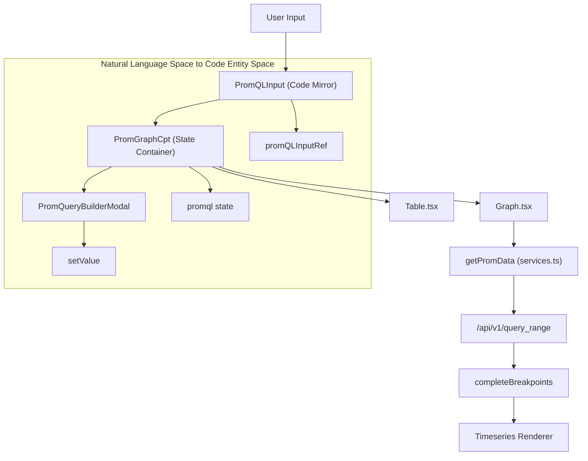
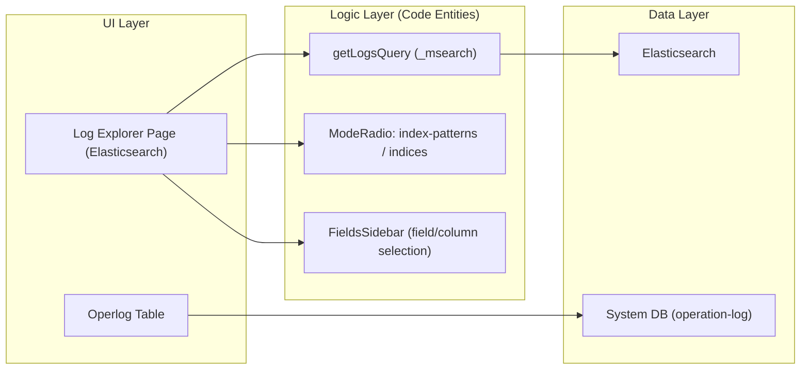

# Metric & Log Explorer
Relevant source files

- [public/image/alarm/s1.png](https://github.com/thetide557/ln-server-pub/blob/629bd918/public/image/alarm/s1.png)
- [public/image/alarm/s11.png](https://github.com/thetide557/ln-server-pub/blob/629bd918/public/image/alarm/s11.png)
- [public/image/alarm/s2.png](https://github.com/thetide557/ln-server-pub/blob/629bd918/public/image/alarm/s2.png)
- [public/image/alarm/s22.png](https://github.com/thetide557/ln-server-pub/blob/629bd918/public/image/alarm/s22.png)
- [public/image/alarm/s3.png](https://github.com/thetide557/ln-server-pub/blob/629bd918/public/image/alarm/s3.png)
- [public/image/alarm/s33.png](https://github.com/thetide557/ln-server-pub/blob/629bd918/public/image/alarm/s33.png)
- [public/image/login/logo.png](https://github.com/thetide557/ln-server-pub/blob/629bd918/public/image/login/logo.png)
- [public/image/login/logo_top1.png](https://github.com/thetide557/ln-server-pub/blob/629bd918/public/image/login/logo_top1.png)
- [src/components/PromGraphCpt/Graph.tsx](https://github.com/thetide557/ln-server-pub/blob/629bd918/src/components/PromGraphCpt/Graph.tsx)
- [src/components/PromGraphCpt/components/MetricsExplorer.tsx](https://github.com/thetide557/ln-server-pub/blob/629bd918/src/components/PromGraphCpt/components/MetricsExplorer.tsx)
- [src/components/PromGraphCpt/index.tsx](https://github.com/thetide557/ln-server-pub/blob/629bd918/src/components/PromGraphCpt/index.tsx)
- [src/components/PromGraphCpt/style.less](https://github.com/thetide557/ln-server-pub/blob/629bd918/src/components/PromGraphCpt/style.less)
- [src/components/PromQueryBuilder/MetricSelect/index.tsx](https://github.com/thetide557/ln-server-pub/blob/629bd918/src/components/PromQueryBuilder/MetricSelect/index.tsx)
- [src/components/PromQueryBuilder/RawQuery/index.tsx](https://github.com/thetide557/ln-server-pub/blob/629bd918/src/components/PromQueryBuilder/RawQuery/index.tsx)
- [src/components/PromQueryBuilder/utils/buildPromVisualQueryFromPromQL.ts](https://github.com/thetide557/ln-server-pub/blob/629bd918/src/components/PromQueryBuilder/utils/buildPromVisualQueryFromPromQL.ts)
- [src/pages/explorer/Prometheus/index.tsx](https://github.com/thetide557/ln-server-pub/blob/629bd918/src/pages/explorer/Prometheus/index.tsx)
- [src/pages/taskTpl/index.tsx](https://github.com/thetide557/ln-server-pub/blob/629bd918/src/pages/taskTpl/index.tsx)

The Metric & Log Explorer provides a comprehensive interface for querying, visualizing, and analyzing time-series data from Prometheus-compatible sources and log data from Elasticsearch. It bridges the gap between raw PromQL/Lucene queries and visual data exploration through a unified component architecture.

## 1. Metric Explorer Architecture

The Metric Explorer is primarily driven by the `PromGraphCpt` component, which acts as a wrapper for Prometheus instant and range queries. It supports two primary visualization modes: Table (instant query) and Graph (range query).

### 1.1 Core Components and Data Flow

The exploration process follows a standard flow from query input to data visualization, with optional visual builders for complex query construction.

| Component | Role | File Reference |
| --- | --- | --- |
| `PromGraphCpt` | Main container managing state for time ranges, data sources, and query strings. | [src/components/PromGraphCpt/index.tsx#59-141](https://github.com/thetide557/ln-server-pub/blob/629bd918/src/components/PromGraphCpt/index.tsx#L59-L141) |
| `PromQLInput` | Code-editor style input with autocomplete support. | [src/components/PromGraphCpt/index.tsx#174-185](https://github.com/thetide557/ln-server-pub/blob/629bd918/src/components/PromGraphCpt/index.tsx#L174-L185) |
| `Graph` | Handles `query_range` requests and renders time-series charts using `Timeseries`. | [src/components/PromGraphCpt/Graph.tsx#66-181](https://github.com/thetide557/ln-server-pub/blob/629bd918/src/components/PromGraphCpt/Graph.tsx#L66-L181) |
| `Table` | Handles instant `query` requests and renders label-value pairs. | [src/components/PromGraphCpt/Table.tsx](https://github.com/thetide557/ln-server-pub/blob/629bd918/src/components/PromGraphCpt/Table.tsx) |
| `MetricsExplorer` | A modal sidebar for browsing available metrics and their metadata. | [src/components/PromGraphCpt/components/MetricsExplorer.tsx](https://github.com/thetide557/ln-server-pub/blob/629bd918/src/components/PromGraphCpt/components/MetricsExplorer.tsx) |

### 1.2 Component Interaction Diagram

This diagram illustrates how user input in the `PromGraphCpt` flows through the query execution logic to the visualization renderers.

Sources:[src/components/PromGraphCpt/index.tsx#79-92](https://github.com/thetide557/ln-server-pub/blob/629bd918/src/components/PromGraphCpt/index.tsx#L79-L92)[src/components/PromGraphCpt/Graph.tsx#107-147](https://github.com/thetide557/ln-server-pub/blob/629bd918/src/components/PromGraphCpt/Graph.tsx#L107-L147)[src/components/PromGraphCpt/index.tsx#206-215](https://github.com/thetide557/ln-server-pub/blob/629bd918/src/components/PromGraphCpt/index.tsx#L206-L215)

## 2. Visual PromQL Builder

The Visual Query Builder allows users to construct complex PromQL expressions without manual syntax knowledge. It supports metric selection, label filtering, and operation chaining.

### 2.1 Serialization and Parsing

The system maintains a bidirectional link between the visual representation (`PromVisualQuery`) and the raw string.

- String to Visual: The `buildPromVisualQueryFromPromQL` function uses the `lezer-promql` parser to convert a raw string into a structured object [src/components/PromQueryBuilder/utils/buildPromVisualQueryFromPromQL.ts#44-76](https://github.com/thetide557/ln-server-pub/blob/629bd918/src/components/PromQueryBuilder/utils/buildPromVisualQueryFromPromQL.ts#L44-L76)
- Visual to String: The `renderQuery` function iterates through metrics, labels, and operations to regenerate the PromQL string [src/components/PromQueryBuilder/RawQuery/index.tsx#68-87](https://github.com/thetide557/ln-server-pub/blob/629bd918/src/components/PromQueryBuilder/RawQuery/index.tsx#L68-L87)

### 2.2 Operations and Translation

The builder utilizes a dictionary for Chinese metric translations to improve readability for non-technical users.

- Translation Dictionary:`cn_name` and `en_name` provide mapping for common metrics [src/components/PromQueryBuilder/components/metrics_translation.ts](https://github.com/thetide557/ln-server-pub/blob/629bd918/src/components/PromQueryBuilder/components/metrics_translation.ts)
- Metric Selection: The `MetricSelect` component uses `getMetric` to fetch available metrics and displays translated descriptions in the dropdown [src/components/PromQueryBuilder/MetricSelect/index.tsx#54-79](https://github.com/thetide557/ln-server-pub/blob/629bd918/src/components/PromQueryBuilder/MetricSelect/index.tsx#L54-L79)

Sources:[src/components/PromQueryBuilder/RawQuery/index.tsx#17-28](https://github.com/thetide557/ln-server-pub/blob/629bd918/src/components/PromQueryBuilder/RawQuery/index.tsx#L17-L28)[src/components/PromQueryBuilder/MetricSelect/index.tsx#25-29](https://github.com/thetide557/ln-server-pub/blob/629bd918/src/components/PromQueryBuilder/MetricSelect/index.tsx#L25-L29)[src/components/PromQueryBuilder/MetricSelect/index.tsx#98](https://github.com/thetide557/ln-server-pub/blob/629bd918/src/components/PromQueryBuilder/MetricSelect/index.tsx#L98-L98)

## 3. Log Explorer & System Logs

The Log Explorer (`/log/explorer`, `src/pages/explorer/Elasticsearch/index.tsx`) provides a dedicated interface for browsing Elasticsearch logs. A separate, unrelated `operlog` page provides a system-level operation audit trail backed by the application database rather than Elasticsearch.

### 3.1 Log Search Logic

The Log Explorer supports two switchable search modes plus a dedicated field-selection sidebar, filtered by time range and a per-index date field.

- Two Search Modes: A mode toggle (`ModeRadio`) switches the query builder between **Index Patterns** (`QueryBuilderWithIndexPatterns`, backed by predefined index patterns) and raw **Indices** (`QueryBuilder`, browsed directly via `_cat/indices`); the last-used mode is persisted in `localStorage` [src/pages/explorer/Elasticsearch/index.tsx](https://github.com/thetide557/ln-server-pub/blob/629bd918/src/pages/explorer/Elasticsearch/index.tsx)[src/pages/explorer/Elasticsearch/QueryBuilderWithIndexPatterns.tsx](https://github.com/thetide557/ln-server-pub/blob/629bd918/src/pages/explorer/Elasticsearch/QueryBuilderWithIndexPatterns.tsx)
- Time & Field Filtering: Searches are scoped by a `date_field`, a time range, and a free-text filter string, then executed against Elasticsearch via `getLogsQuery` [src/pages/explorer/Elasticsearch/services.ts](https://github.com/thetide557/ln-server-pub/blob/629bd918/src/pages/explorer/Elasticsearch/services.ts)
- Fields Sidebar: `FieldsSidebar` lets users choose which fields/columns are displayed in the results table; it is a column-selection panel, not an index-pattern selector [src/pages/explorer/components/FieldsSidebar/index.tsx](https://github.com/thetide557/ln-server-pub/blob/629bd918/src/pages/explorer/components/FieldsSidebar/index.tsx)
- Operation Logs: The unrelated `operlog` page at `/log/operlog` records user actions across the platform as an audit trail, queried from the application database (not Elasticsearch) [src/pages/log/operlog/index.tsx](https://github.com/thetide557/ln-server-pub/blob/629bd918/src/pages/log/operlog/index.tsx)

### 3.2 System Logs Component Diagram

This diagram maps the UI components to the underlying service calls for log retrieval.

Sources:[src/pages/explorer/Elasticsearch/index.tsx](https://github.com/thetide557/ln-server-pub/blob/629bd918/src/pages/explorer/Elasticsearch/index.tsx)[src/pages/explorer/Elasticsearch/services.ts](https://github.com/thetide557/ln-server-pub/blob/629bd918/src/pages/explorer/Elasticsearch/services.ts)[src/pages/explorer/components/FieldsSidebar/index.tsx](https://github.com/thetide557/ln-server-pub/blob/629bd918/src/pages/explorer/components/FieldsSidebar/index.tsx)[src/pages/log/operlog/index.tsx](https://github.com/thetide557/ln-server-pub/blob/629bd918/src/pages/log/operlog/index.tsx)

## 4. Deep-Linking and State Management

The explorer supports deep-linking via URL query parameters, allowing users to share specific views, time ranges, and queries.

- URL Parameters: Parameters such as `prom_ql`, `mode` (table/graph), `start`, and `end` are parsed using `query-string`[src/pages/explorer/Prometheus/index.tsx#22-32](https://github.com/thetide557/ln-server-pub/blob/629bd918/src/pages/explorer/Prometheus/index.tsx#L22-L32)
- History Synchronization: Changes to the time range or query trigger a `history.replace` to update the URL without a full page reload [src/pages/explorer/Prometheus/index.tsx#45-49](https://github.com/thetide557/ln-server-pub/blob/629bd918/src/pages/explorer/Prometheus/index.tsx#L45-L49)
- Initial State: The `Prometheus` page component initializes the `PromGraph` component using these URL values to ensure consistent state on page refresh [src/pages/explorer/Prometheus/index.tsx#35-58](https://github.com/thetide557/ln-server-pub/blob/629bd918/src/pages/explorer/Prometheus/index.tsx#L35-L58)

Sources:[src/pages/explorer/Prometheus/index.tsx#7-9](https://github.com/thetide557/ln-server-pub/blob/629bd918/src/pages/explorer/Prometheus/index.tsx#L7-L9)[src/pages/explorer/Prometheus/index.tsx#27-32](https://github.com/thetide557/ln-server-pub/blob/629bd918/src/pages/explorer/Prometheus/index.tsx#L27-L32)[src/pages/explorer/Prometheus/index.tsx#45-49](https://github.com/thetide557/ln-server-pub/blob/629bd918/src/pages/explorer/Prometheus/index.tsx#L45-L49)