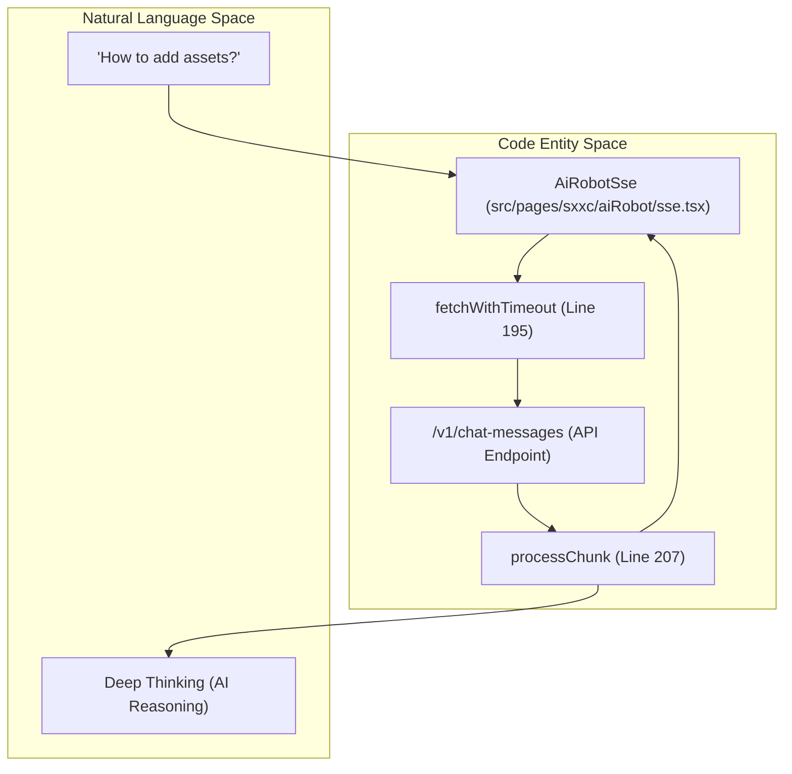
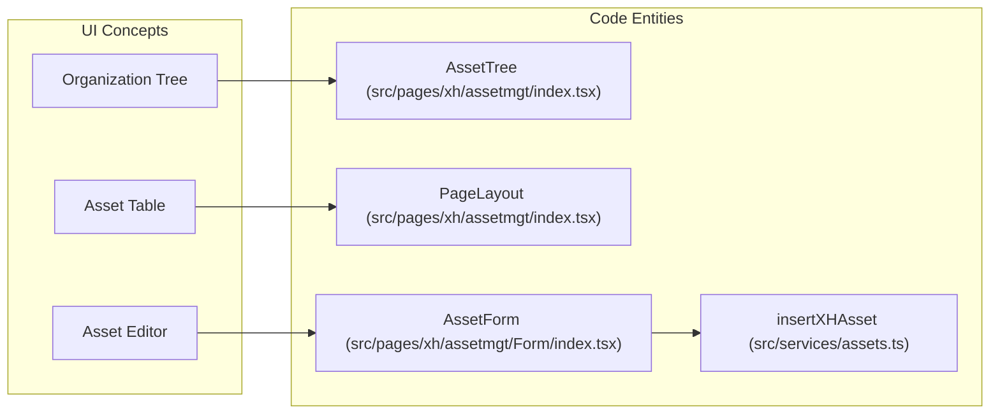

# Glossary
Relevant source files

- [index.html](https://github.com/thetide557/ln-server-pub/blob/629bd918/index.html)
- [src/App.less](https://github.com/thetide557/ln-server-pub/blob/629bd918/src/App.less)
- [src/App.tsx](https://github.com/thetide557/ln-server-pub/blob/629bd918/src/App.tsx)
- [src/components/PromQueryBuilder/components/metrics_translation.ts](https://github.com/thetide557/ln-server-pub/blob/629bd918/src/components/PromQueryBuilder/components/metrics_translation.ts)
- [src/components/menu/topMenuXH.tsx](https://github.com/thetide557/ln-server-pub/blob/629bd918/src/components/menu/topMenuXH.tsx)
- [src/pages/alertRules/Form/Base.tsx](https://github.com/thetide557/ln-server-pub/blob/629bd918/src/pages/alertRules/Form/Base.tsx)
- [src/pages/alertRules/Form/Notify/index.tsx](https://github.com/thetide557/ln-server-pub/blob/629bd918/src/pages/alertRules/Form/Notify/index.tsx)
- [src/pages/alertRules/Form/components/HelpLabel.tsx](https://github.com/thetide557/ln-server-pub/blob/629bd918/src/pages/alertRules/Form/components/HelpLabel.tsx)
- [src/pages/alertRules/Form/index.tsx](https://github.com/thetide557/ln-server-pub/blob/629bd918/src/pages/alertRules/Form/index.tsx)
- [src/pages/alertRules/Form/style.less](https://github.com/thetide557/ln-server-pub/blob/629bd918/src/pages/alertRules/Form/style.less)
- [src/pages/alertRules/List/index.tsx](https://github.com/thetide557/ln-server-pub/blob/629bd918/src/pages/alertRules/List/index.tsx)
- [src/pages/dataRoom/index.tsx](https://github.com/thetide557/ln-server-pub/blob/629bd918/src/pages/dataRoom/index.tsx)
- [src/pages/event/Solution/index.less](https://github.com/thetide557/ln-server-pub/blob/629bd918/src/pages/event/Solution/index.less)
- [src/pages/event/Solution/index.tsx](https://github.com/thetide557/ln-server-pub/blob/629bd918/src/pages/event/Solution/index.tsx)
- [src/pages/event/detail.less](https://github.com/thetide557/ln-server-pub/blob/629bd918/src/pages/event/detail.less)
- [src/pages/event/detail.tsx](https://github.com/thetide557/ln-server-pub/blob/629bd918/src/pages/event/detail.tsx)
- [src/pages/event/index.tsx](https://github.com/thetide557/ln-server-pub/blob/629bd918/src/pages/event/index.tsx)
- [src/pages/event/locale/zh_CN.ts](https://github.com/thetide557/ln-server-pub/blob/629bd918/src/pages/event/locale/zh_CN.ts)
- [src/pages/help/version/index.less](https://github.com/thetide557/ln-server-pub/blob/629bd918/src/pages/help/version/index.less)
- [src/pages/help/version/index.tsx](https://github.com/thetide557/ln-server-pub/blob/629bd918/src/pages/help/version/index.tsx)
- [src/pages/help/version/locale/zh_CN.ts](https://github.com/thetide557/ln-server-pub/blob/629bd918/src/pages/help/version/locale/zh_CN.ts)
- [src/pages/historyEvents/index.tsx](https://github.com/thetide557/ln-server-pub/blob/629bd918/src/pages/historyEvents/index.tsx)
- [src/pages/log/syslog/index.tsx](https://github.com/thetide557/ln-server-pub/blob/629bd918/src/pages/log/syslog/index.tsx)
- [src/pages/login/index.tsx](https://github.com/thetide557/ln-server-pub/blob/629bd918/src/pages/login/index.tsx)
- [src/pages/loginCallback/cas.tsx](https://github.com/thetide557/ln-server-pub/blob/629bd918/src/pages/loginCallback/cas.tsx)
- [src/pages/loginCallback/index.tsx](https://github.com/thetide557/ln-server-pub/blob/629bd918/src/pages/loginCallback/index.tsx)
- [src/pages/loginCallback/oauth.tsx](https://github.com/thetide557/ln-server-pub/blob/629bd918/src/pages/loginCallback/oauth.tsx)
- [src/pages/permissions/index.tsx](https://github.com/thetide557/ln-server-pub/blob/629bd918/src/pages/permissions/index.tsx)
- [src/pages/sxxc/aiRobot/index.less](https://github.com/thetide557/ln-server-pub/blob/629bd918/src/pages/sxxc/aiRobot/index.less)
- [src/pages/sxxc/aiRobot/index.tsx](https://github.com/thetide557/ln-server-pub/blob/629bd918/src/pages/sxxc/aiRobot/index.tsx)
- [src/pages/sxxc/aiRobot/loading/index.less](https://github.com/thetide557/ln-server-pub/blob/629bd918/src/pages/sxxc/aiRobot/loading/index.less)
- [src/pages/sxxc/aiRobot/loading/index.tsx](https://github.com/thetide557/ln-server-pub/blob/629bd918/src/pages/sxxc/aiRobot/loading/index.tsx)
- [src/pages/sxxc/aiRobot/sse.tsx](https://github.com/thetide557/ln-server-pub/blob/629bd918/src/pages/sxxc/aiRobot/sse.tsx)
- [src/pages/sxxc/autoInspect/index.tsx](https://github.com/thetide557/ln-server-pub/blob/629bd918/src/pages/sxxc/autoInspect/index.tsx)
- [src/pages/sxxc/healthReport/index.tsx](https://github.com/thetide557/ln-server-pub/blob/629bd918/src/pages/sxxc/healthReport/index.tsx)
- [src/pages/sxxc/inspectionList/components/createModal/index.tsx](https://github.com/thetide557/ln-server-pub/blob/629bd918/src/pages/sxxc/inspectionList/components/createModal/index.tsx)
- [src/pages/sxxc/inspectionList/components/inspectionForm/index.tsx](https://github.com/thetide557/ln-server-pub/blob/629bd918/src/pages/sxxc/inspectionList/components/inspectionForm/index.tsx)
- [src/pages/sxxc/inspectionList/index.tsx](https://github.com/thetide557/ln-server-pub/blob/629bd918/src/pages/sxxc/inspectionList/index.tsx)
- [src/pages/sxxc/inspectionList/log.tsx](https://github.com/thetide557/ln-server-pub/blob/629bd918/src/pages/sxxc/inspectionList/log.tsx)
- [src/pages/sxxc/inspectionReport/index.tsx](https://github.com/thetide557/ln-server-pub/blob/629bd918/src/pages/sxxc/inspectionReport/index.tsx)
- [src/pages/sxxc/productionPlan/index.tsx](https://github.com/thetide557/ln-server-pub/blob/629bd918/src/pages/sxxc/productionPlan/index.tsx)
- [src/pages/sxxc/screenAddress/Add.tsx](https://github.com/thetide557/ln-server-pub/blob/629bd918/src/pages/sxxc/screenAddress/Add.tsx)
- [src/pages/sxxc/screenAddress/Detail.tsx](https://github.com/thetide557/ln-server-pub/blob/629bd918/src/pages/sxxc/screenAddress/Detail.tsx)
- [src/pages/sxxc/screenAddress/Edit.tsx](https://github.com/thetide557/ln-server-pub/blob/629bd918/src/pages/sxxc/screenAddress/Edit.tsx)
- [src/pages/sxxc/screenAddress/Form/index.tsx](https://github.com/thetide557/ln-server-pub/blob/629bd918/src/pages/sxxc/screenAddress/Form/index.tsx)
- [src/pages/sxxc/screenAddress/index.tsx](https://github.com/thetide557/ln-server-pub/blob/629bd918/src/pages/sxxc/screenAddress/index.tsx)
- [src/pages/sxxc/screenView/index.less](https://github.com/thetide557/ln-server-pub/blob/629bd918/src/pages/sxxc/screenView/index.less)
- [src/pages/sxxc/screenView/index.tsx](https://github.com/thetide557/ln-server-pub/blob/629bd918/src/pages/sxxc/screenView/index.tsx)
- [src/pages/sxxc/serverVideoAlarm/index.tsx](https://github.com/thetide557/ln-server-pub/blob/629bd918/src/pages/sxxc/serverVideoAlarm/index.tsx)
- [src/pages/sxxc/serverVideoAsset/index.tsx](https://github.com/thetide557/ln-server-pub/blob/629bd918/src/pages/sxxc/serverVideoAsset/index.tsx)
- [src/pages/sxxc/taskInstance/index.tsx](https://github.com/thetide557/ln-server-pub/blob/629bd918/src/pages/sxxc/taskInstance/index.tsx)
- [src/pages/sxxc/taskManage/components/taskForm/index.tsx](https://github.com/thetide557/ln-server-pub/blob/629bd918/src/pages/sxxc/taskManage/components/taskForm/index.tsx)
- [src/pages/sxxc/taskManage/index.tsx](https://github.com/thetide557/ln-server-pub/blob/629bd918/src/pages/sxxc/taskManage/index.tsx)
- [src/pages/sxxc/topology/index.tsx](https://github.com/thetide557/ln-server-pub/blob/629bd918/src/pages/sxxc/topology/index.tsx)
- [src/pages/sxxc/warnModal/index.less](https://github.com/thetide557/ln-server-pub/blob/629bd918/src/pages/sxxc/warnModal/index.less)
- [src/pages/sxxc/warnModal/index.tsx](https://github.com/thetide557/ln-server-pub/blob/629bd918/src/pages/sxxc/warnModal/index.tsx)
- [src/pages/sxxc/workorder/index.tsx](https://github.com/thetide557/ln-server-pub/blob/629bd918/src/pages/sxxc/workorder/index.tsx)
- [src/pages/system/parameters.tsx](https://github.com/thetide557/ln-server-pub/blob/629bd918/src/pages/system/parameters.tsx)
- [src/pages/targets/BusinessGroup/index.tsx](https://github.com/thetide557/ln-server-pub/blob/629bd918/src/pages/targets/BusinessGroup/index.tsx)
- [src/pages/targets/version/index.tsx](https://github.com/thetide557/ln-server-pub/blob/629bd918/src/pages/targets/version/index.tsx)
- [src/pages/user/component/addUser/index.tsx](https://github.com/thetide557/ln-server-pub/blob/629bd918/src/pages/user/component/addUser/index.tsx)
- [src/pages/xh/assetmgt/Accordion/accordionModal.tsx](https://github.com/thetide557/ln-server-pub/blob/629bd918/src/pages/xh/assetmgt/Accordion/accordionModal.tsx)
- [src/pages/xh/assetmgt/Form/index.tsx](https://github.com/thetide557/ln-server-pub/blob/629bd918/src/pages/xh/assetmgt/Form/index.tsx)
- [src/pages/xh/assetmgt/Form/style.less](https://github.com/thetide557/ln-server-pub/blob/629bd918/src/pages/xh/assetmgt/Form/style.less)
- [src/pages/xh/assetmgt/index.tsx](https://github.com/thetide557/ln-server-pub/blob/629bd918/src/pages/xh/assetmgt/index.tsx)
- [src/pages/xh/assetmgt/style.less](https://github.com/thetide557/ln-server-pub/blob/629bd918/src/pages/xh/assetmgt/style.less)
- [src/pages/xh/monitor/Form/index.tsx](https://github.com/thetide557/ln-server-pub/blob/629bd918/src/pages/xh/monitor/Form/index.tsx)
- [src/pages/xh/monitor/index.tsx](https://github.com/thetide557/ln-server-pub/blob/629bd918/src/pages/xh/monitor/index.tsx)
- [src/pages/xh/monitor/style.less](https://github.com/thetide557/ln-server-pub/blob/629bd918/src/pages/xh/monitor/style.less)
- [src/routers/index.tsx](https://github.com/thetide557/ln-server-pub/blob/629bd918/src/routers/index.tsx)
- [src/services/assets.ts](https://github.com/thetide557/ln-server-pub/blob/629bd918/src/services/assets.ts)
- [src/services/login.ts](https://github.com/thetide557/ln-server-pub/blob/629bd918/src/services/login.ts)
- [src/services/sxxc/bigScreen.ts](https://github.com/thetide557/ln-server-pub/blob/629bd918/src/services/sxxc/bigScreen.ts)
- [src/services/sxxc/inspection.ts](https://github.com/thetide557/ln-server-pub/blob/629bd918/src/services/sxxc/inspection.ts)
- [src/services/targets.ts](https://github.com/thetide557/ln-server-pub/blob/629bd918/src/services/targets.ts)
- [src/store/sxxc/inspection/index.ts](https://github.com/thetide557/ln-server-pub/blob/629bd918/src/store/sxxc/inspection/index.ts)
- [src/utils/day.js](https://github.com/thetide557/ln-server-pub/blob/629bd918/src/utils/day.js)
- [src/utils/request.ts](https://github.com/thetide557/ln-server-pub/blob/629bd918/src/utils/request.ts)
- [vite.config.ts](https://github.com/thetide557/ln-server-pub/blob/629bd918/vite.config.ts)

This page provides definitions for codebase-specific terminology, domain concepts, and internal jargon used within the LingNiu (羚牛) Integrated Operations and Maintenance Platform.

## 1. Core Domain Concepts

### XH (西航)

Refers to the specialized version of the platform tailored for IT infrastructure management. It is distinguished from standard Nightingale (N9E) features by its heavy focus on physical asset lifecycles and specialized monitoring views.

- Key Files:`src/pages/xh/assetmgt/index.tsx`, `src/components/menu/topMenuXH.tsx`.

### Business Group (业务组 / BG)

A logical container used to group assets, alert rules, and dashboards. Permissions are primarily assigned at the Business Group level.

- Implementation: Managed via `CommonStateContext` in `App.tsx`[src/App.tsx#78-83](https://github.com/thetide557/ln-server-pub/blob/629bd918/src/App.tsx#L78-L83)
- Service:`getBusiGroups` in `src/services/common.ts`.

### Asset Shelf Lifecycle (上下架)

The process of moving an asset from a "Warehouse/Idle" state to an "Active/Monitoring" state.

- Logic: Handled by `batchShelfXhAssets`[src/pages/xh/assetmgt/index.tsx#37](https://github.com/thetide557/ln-server-pub/blob/629bd918/src/pages/xh/assetmgt/index.tsx#L37-L37)
- History: Tracked via `getAssetShelfHistory`[src/pages/xh/assetmgt/Form/index.tsx#9](https://github.com/thetide557/ln-server-pub/blob/629bd918/src/pages/xh/assetmgt/Form/index.tsx#L9-L9)

### Strategy (策略)

In the alerting context, a strategy defines the specific conditions (PromQL), severity, and notification channels for an alert rule.

- Entity:`strategy_id` is the primary identifier used to group rules [src/pages/event/detail.tsx#90](https://github.com/thetide557/ln-server-pub/blob/629bd918/src/pages/event/detail.tsx#L90-L90)

---

## 2. Technical Terms & Internal Jargon

| Term | Definition | Code Pointer |
| --- | --- | --- |
| Ident | A unique identifier for a monitoring target (usually an IP or hostname). | `src/services/assets.ts` |
| BusiGroup | Abbreviation for Business Group. | `src/App.tsx` |
| DeepSeek | The integrated AI model used for the AI Assistant and alert solutions. | `src/pages/sxxc/aiRobot/sse.tsx` |
| SSE | Server-Sent Events; used for streaming AI responses. | `src/pages/sxxc/aiRobot/sse.tsx` |
| TissueId | Internal name for Organization/Tree node IDs in asset management. | `src/pages/xh/assetmgt/index.tsx:104` |
| IBEX | Not an active engine in this codebase — appears only as a commented-out/disabled menu entry (`/ibex-settings`, 自愈配置) in `topMenuXH.tsx`. Actual self-healing script execution is implemented via the `/job-tpls` (自愈脚本) and `/job-tasks` (执行历史) pages. | `src/components/menu/topMenuXH.tsx:189` |
| DataRoom | The embedded sub-application for designing large-screen visualizations. | `src/pages/sxxc/screenView/index.tsx:42` |

---

## 3. Natural Language to Code Entity Mapping

### AI Interaction Flow

The following diagram bridges the user's "Natural Language" query to the internal SSE processing and AI logic.

Diagram: AI Assistant Request Flow

*Sources: [src/pages/sxxc/aiRobot/sse.tsx#195-231](https://github.com/thetide557/ln-server-pub/blob/629bd918/src/pages/sxxc/aiRobot/sse.tsx#L195-L231)*

### Asset Management Navigation

This diagram maps UI concepts like "Organization Tree" and "Asset Form" to their respective implementation classes.

Diagram: Asset Entity Mapping

*Sources: [src/pages/xh/assetmgt/index.tsx#33-45](https://github.com/thetide557/ln-server-pub/blob/629bd918/src/pages/xh/assetmgt/index.tsx#L33-L45)[src/pages/xh/assetmgt/Form/index.tsx#9-45](https://github.com/thetide557/ln-server-pub/blob/629bd918/src/pages/xh/assetmgt/Form/index.tsx#L9-L45)*

---

## 4. Key Implementation Details

### SSE (Server-Sent Events) Processing

The platform uses SSE for real-time AI streaming. The implementation manually parses chunks to extract JSON data and "Deep Thinking" content.

- Function:`processChunk`[src/pages/sxxc/aiRobot/sse.tsx#207](https://github.com/thetide557/ln-server-pub/blob/629bd918/src/pages/sxxc/aiRobot/sse.tsx#L207-L207)
- Logic: It looks for the `data:` prefix, parses the JSON, and extracts the `answer` field [src/pages/sxxc/aiRobot/sse.tsx#213-230](https://github.com/thetide557/ln-server-pub/blob/629bd918/src/pages/sxxc/aiRobot/sse.tsx#L213-L230)

### Dynamic Asset Forms

XH assets use dynamic forms where fields are rendered based on the `currentType` of the asset.

- Component:`src/pages/xh/assetmgt/Form/index.tsx`.
- Password Handling: Specialized `ControlledPasswordField` is used to prevent accidental overwriting of existing credentials [src/pages/xh/assetmgt/Form/index.tsx#28-43](https://github.com/thetide557/ln-server-pub/blob/629bd918/src/pages/xh/assetmgt/Form/index.tsx#L28-L43)

### Large Screen (BigScreen) Integration

The `ScreenView` component manages a carousel of iframes, often pointing to the `DataRoom` sub-app.

- Auth Handshake: Tokens are passed to iframes via `postMessage`[src/pages/sxxc/screenView/index.tsx#48-53](https://github.com/thetide557/ln-server-pub/blob/629bd918/src/pages/sxxc/screenView/index.tsx#L48-L53)
- Styling: Custom CSS strings stored in `nav_template` are parsed into React style objects via `MyStyle`[src/pages/sxxc/screenAddress/Form/index.tsx#117-128](https://github.com/thetide557/ln-server-pub/blob/629bd918/src/pages/sxxc/screenAddress/Form/index.tsx#L117-L128)

---

## 5. System Abbreviations Reference

| Abbreviation | Full Name | Context |
| --- | --- | --- |
| PromQL | Prometheus Query Language | Monitoring & Alerting |
| RBAC | Role-Based Access Control | User Permissions |
| SSO | Single Sign-On | Authentication |
| CAS | Central Authentication Service | SSO Provider |
| LDAP | Lightweight Directory Access Protocol | User Directory |
| XC | (Customized Variant) | Specialized Dashboards |

Sources:

- `src/App.tsx`
- `src/pages/xh/assetmgt/index.tsx`
- `src/pages/xh/assetmgt/Form/index.tsx`
- `src/pages/sxxc/aiRobot/sse.tsx`
- `src/pages/sxxc/screenView/index.tsx`
- `src/pages/sxxc/screenAddress/Form/index.tsx`
- `src/pages/event/detail.tsx`