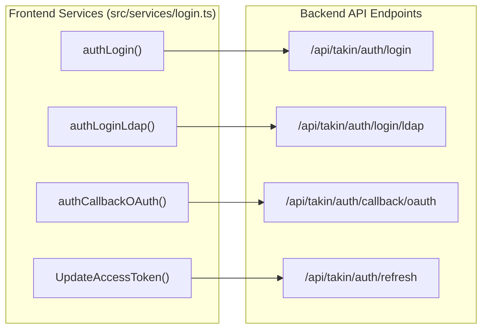
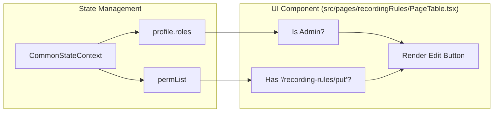

# Authentication & User Management
Relevant source files

- [src/components/menu/topMenu.less](https://github.com/thetide557/ln-server-pub/blob/629bd918/src/components/menu/topMenu.less)
- [src/pages/login/index.tsx](https://github.com/thetide557/ln-server-pub/blob/629bd918/src/pages/login/index.tsx)
- [src/pages/loginCallback/cas.tsx](https://github.com/thetide557/ln-server-pub/blob/629bd918/src/pages/loginCallback/cas.tsx)
- [src/pages/loginCallback/index.tsx](https://github.com/thetide557/ln-server-pub/blob/629bd918/src/pages/loginCallback/index.tsx)
- [src/pages/loginCallback/oauth.tsx](https://github.com/thetide557/ln-server-pub/blob/629bd918/src/pages/loginCallback/oauth.tsx)
- [src/pages/recordingRules/PageTable.tsx](https://github.com/thetide557/ln-server-pub/blob/629bd918/src/pages/recordingRules/PageTable.tsx)
- [src/pages/recordingRules/components/editModal.tsx](https://github.com/thetide557/ln-server-pub/blob/629bd918/src/pages/recordingRules/components/editModal.tsx)
- [src/pages/recordingRules/components/operateForm.tsx](https://github.com/thetide557/ln-server-pub/blob/629bd918/src/pages/recordingRules/components/operateForm.tsx)
- [src/pages/targets/List.tsx](https://github.com/thetide557/ln-server-pub/blob/629bd918/src/pages/targets/List.tsx)
- [src/pages/user/component/userForm/index.tsx](https://github.com/thetide557/ln-server-pub/blob/629bd918/src/pages/user/component/userForm/index.tsx)
- [src/pages/user/users.tsx](https://github.com/thetide557/ln-server-pub/blob/629bd918/src/pages/user/users.tsx)
- [src/services/login.ts](https://github.com/thetide557/ln-server-pub/blob/629bd918/src/services/login.ts)
- [src/services/menu.ts](https://github.com/thetide557/ln-server-pub/blob/629bd918/src/services/menu.ts)

This section provides a high-level overview of the LingNiu platform's security architecture, covering how users authenticate via various methods (Local, LDAP, SSO) and how administrative controls govern users, teams, and roles.

## Authentication Overview

The platform supports a multi-modal authentication system managed through the `Login` component [src/pages/login/index.tsx#23-42](https://github.com/thetide557/ln-server-pub/blob/629bd918/src/pages/login/index.tsx#L23-L42) It dynamically toggles between standard login and Single Sign-On (SSO) based on system configuration retrieved via `ifShowSso`[src/services/login.ts#158-163](https://github.com/thetide557/ln-server-pub/blob/629bd918/src/services/login.ts#L158-L163)

### Authentication Methods

- Local: Username/password login against the internal database via `authLogin()`. This is the **only** method `LoginNormal` offers (rendered when SSO is disabled); it is also the default "账号登录" tab inside `LoginSso` (rendered when SSO is enabled) [src/services/login.ts#22-32](https://github.com/thetide557/ln-server-pub/blob/629bd918/src/services/login.ts#L22-L32)
- LDAP & SSO (CAS/OIDC/OAuth2): These paths only exist inside `LoginSso`'s "单点登录" tab — LDAP directory login via `authLoginLdap()` [src/services/login.ts#35-45](https://github.com/thetide557/ln-server-pub/blob/629bd918/src/services/login.ts#L35-L45), plus redirect buttons for CAS, OIDC and OAuth2. `LoginNormal` does **not** provide LDAP or SSO options. The platform provides dedicated callback pages for OIDC [src/pages/loginCallback/index.tsx](https://github.com/thetide557/ln-server-pub/blob/629bd918/src/pages/loginCallback/index.tsx), CAS [src/pages/loginCallback/cas.tsx](https://github.com/thetide557/ln-server-pub/blob/629bd918/src/pages/loginCallback/cas.tsx) and OAuth2 [src/pages/loginCallback/oauth.tsx](https://github.com/thetide557/ln-server-pub/blob/629bd918/src/pages/loginCallback/oauth.tsx) to process external tickets/codes, registered as the `/callback`, `/callback/cas` and `/callback/oauth` routes respectively.
- Token Lifecycle: Upon successful authentication, the system stores `access_token` and `refresh_token` in both Cookies and LocalStorage [src/pages/loginCallback/oauth.tsx#39-43](https://github.com/thetide557/ln-server-pub/blob/629bd918/src/pages/loginCallback/oauth.tsx#L39-L43). When "记住密码" (remember me) is checked, the username/password are also cached in LocalStorage, with the password AES-encrypted/decrypted via `src/utils/aes.ts` rather than kept in plain text. It also fetches a specific `deepseek_token` for AI-assisted features [src/services/login.ts#151-155](https://github.com/thetide557/ln-server-pub/blob/629bd918/src/services/login.ts#L151-L155)

For detailed flow diagrams and token handling logic, see [Login & SSO Flows](/org/benjamin-braddock/wiki/thetide557/ln-server-pub/page/2.1?branch=v2.1).

### Code-to-Entity Mapping: Login Services

The following diagram illustrates how the frontend services map to specific backend API endpoints for authentication.

Sources:[src/services/login.ts#21-75](https://github.com/thetide557/ln-server-pub/blob/629bd918/src/services/login.ts#L21-L75)[src/pages/loginCallback/oauth.tsx#31-35](https://github.com/thetide557/ln-server-pub/blob/629bd918/src/pages/loginCallback/oauth.tsx#L31-L35)

---

## User & Team Administration

Administrative functions are centralized in the `Resource` component (often referred to as the User Management page) [src/pages/user/users.tsx#50](https://github.com/thetide557/ln-server-pub/blob/629bd918/src/pages/user/users.tsx#L50-L50) This interface allows administrators to manage the lifecycle of user accounts and their organizational groupings.

### Key Administrative Features

- User CRUD: The `UserForm` component [src/pages/user/component/userForm/index.tsx#31](https://github.com/thetide557/ln-server-pub/blob/629bd918/src/pages/user/component/userForm/index.tsx#L31-L31) handles user creation and editing, including password complexity validation [src/pages/user/component/userForm/index.tsx#99-109](https://github.com/thetide557/ln-server-pub/blob/629bd918/src/pages/user/component/userForm/index.tsx#L99-L109)
- Team Management: Users are organized into teams (or business groups). The platform supports a tree-based organizational view [src/pages/user/users.tsx#129-145](https://github.com/thetide557/ln-server-pub/blob/629bd918/src/pages/user/users.tsx#L129-L145)
- Account Controls: Administrators can enable/disable accounts, delete users in bulk, and manage "Temporary Users" with expiration dates [src/pages/user/users.tsx#101-120](https://github.com/thetide557/ln-server-pub/blob/629bd918/src/pages/user/users.tsx#L101-L120)[src/pages/user/component/userForm/index.tsx#88](https://github.com/thetide557/ln-server-pub/blob/629bd918/src/pages/user/component/userForm/index.tsx#L88-L88)

For details on the User CRUD and Team structures, see [User, Team & Permission Administration](/org/benjamin-braddock/wiki/thetide557/ln-server-pub/page/2.2?branch=v2.1).

---

## Role-Based Access Control (RBAC)

Access control is implemented via a role-based system where permissions are checked against the user's assigned roles. Beyond the built-in roles, a dedicated **Permissions** admin page (`src/pages/permissions/index.tsx`, route `/permissions`) lets administrators create/edit/delete custom roles and assign a per-role set of granular permission strings through a checkable operation tree; this is where `permList` entries ultimately come from.

| Entity | Description | Code Reference |
| --- | --- | --- |
| Roles | Named permission sets assigned to users. Built-in roles (`Admin`, `运维管理员`, `普通用户`, `临时用户`) are protected from deletion/edit by non-Admins; administrators can otherwise create, rename and delete custom roles. | [src/pages/permissions/index.tsx](https://github.com/thetide557/ln-server-pub/blob/629bd918/src/pages/permissions/index.tsx), [src/pages/permissions/RoleFormModal.tsx](https://github.com/thetide557/ln-server-pub/blob/629bd918/src/pages/permissions/RoleFormModal.tsx) |
| Permissions | Granular access strings (e.g., `/recording-rules/put`) that are checked/toggled per role via `Operations.tsx`'s checkable tree, and then checked in consuming pages' UI (e.g. recording rules). | [src/pages/permissions/Operations.tsx](https://github.com/thetide557/ln-server-pub/blob/629bd918/src/pages/permissions/Operations.tsx), [src/pages/recordingRules/PageTable.tsx#208](https://github.com/thetide557/ln-server-pub/blob/629bd918/src/pages/recordingRules/PageTable.tsx#L208-L208) |
| Global State | `CommonStateContext` provides `profile` and `permList` to all components. | [src/App.tsx](https://github.com/thetide557/ln-server-pub/blob/629bd918/src/App.tsx) |

### Code-to-Entity Mapping: RBAC Implementation

This diagram shows how the system verifies a user's rights before allowing an action, such as editing a recording rule.

Sources:[src/pages/recordingRules/PageTable.tsx#41](https://github.com/thetide557/ln-server-pub/blob/629bd918/src/pages/recordingRules/PageTable.tsx#L41-L41)[src/pages/recordingRules/PageTable.tsx#208-216](https://github.com/thetide557/ln-server-pub/blob/629bd918/src/pages/recordingRules/PageTable.tsx#L208-L216)

---

## Related Child Pages

- [Login & SSO Flows](/org/benjamin-braddock/wiki/thetide557/ln-server-pub/page/2.1?branch=v2.1): Deep dive into the authentication handshake, redirection logic for CAS/OIDC/OAuth2, and the transparent token refresh mechanism.
- [User, Team & Permission Administration](/org/benjamin-braddock/wiki/thetide557/ln-server-pub/page/2.2?branch=v2.1): Technical details on the User management table, the dynamic UserForm, and how team hierarchies are fetched and rendered.