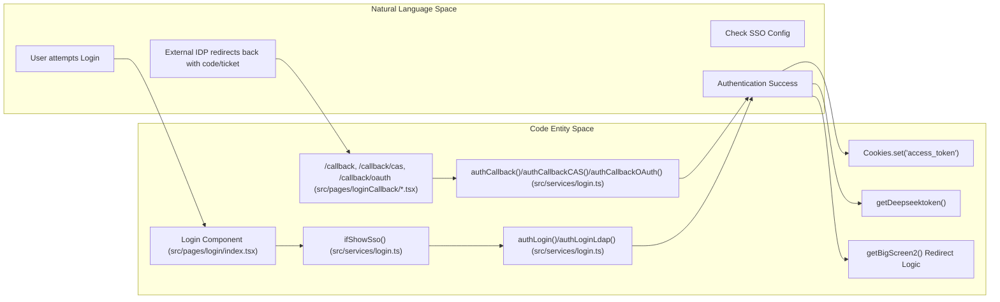
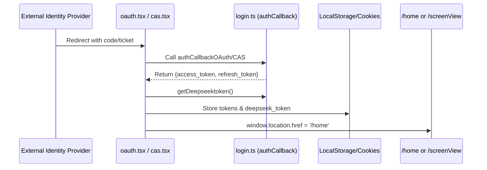

# Login & SSO Flows
Relevant source files

- [src/pages/login/index.tsx](https://github.com/thetide557/ln-server-pub/blob/629bd918/src/pages/login/index.tsx)
- [src/pages/login/loginNormal.less](https://github.com/thetide557/ln-server-pub/blob/629bd918/src/pages/login/loginNormal.less)
- [src/pages/login/loginNormal.tsx](https://github.com/thetide557/ln-server-pub/blob/629bd918/src/pages/login/loginNormal.tsx)
- [src/pages/login/loginSso.less](https://github.com/thetide557/ln-server-pub/blob/629bd918/src/pages/login/loginSso.less)
- [src/pages/login/loginSso.tsx](https://github.com/thetide557/ln-server-pub/blob/629bd918/src/pages/login/loginSso.tsx)
- [src/pages/loginCallback/cas.tsx](https://github.com/thetide557/ln-server-pub/blob/629bd918/src/pages/loginCallback/cas.tsx)
- [src/pages/loginCallback/index.tsx](https://github.com/thetide557/ln-server-pub/blob/629bd918/src/pages/loginCallback/index.tsx)
- [src/pages/loginCallback/oauth.tsx](https://github.com/thetide557/ln-server-pub/blob/629bd918/src/pages/loginCallback/oauth.tsx)
- [src/pages/warning/shield/add.tsx](https://github.com/thetide557/ln-server-pub/blob/629bd918/src/pages/warning/shield/add.tsx)
- [src/services/login.ts](https://github.com/thetide557/ln-server-pub/blob/629bd918/src/services/login.ts)

The authentication system in the LingNiu platform supports multiple identity providers, including local database authentication, LDAP, and Single Sign-On (SSO) protocols such as CAS, OIDC, and OAuth2. The system manages a multi-token lifecycle to handle API authorization and AI-assisted features.

## Authentication Entry Point

The `Login` component acts as a dynamic dispatcher. Upon mounting, it queries the backend to determine if SSO is globally enabled.

- Logic: It calls `ifShowSso()`[src/pages/login/index.tsx#26-28](https://github.com/thetide557/ln-server-pub/blob/629bd918/src/pages/login/index.tsx#L26-L28) If the response indicates SSO is enabled, it renders `LoginSso`; otherwise, it renders `LoginNormal`[src/pages/login/index.tsx#39](https://github.com/thetide557/ln-server-pub/blob/629bd918/src/pages/login/index.tsx#L39-L39)
- Cleanup: It clears `password_expiry_reminded` from local storage to reset password expiration notifications [src/pages/login/index.tsx#29](https://github.com/thetide557/ln-server-pub/blob/629bd918/src/pages/login/index.tsx#L29-L29)

### Component Architecture

| Component | Role | File |
| --- | --- | --- |
| `Login` | Root entry, determines SSO vs Normal mode. | [src/pages/login/index.tsx](https://github.com/thetide557/ln-server-pub/blob/629bd918/src/pages/login/index.tsx) |
| `LoginNormal` | Standard login form for local database users. | [src/pages/login/loginNormal.tsx](https://github.com/thetide557/ln-server-pub/blob/629bd918/src/pages/login/loginNormal.tsx) |
| `LoginSso` | Enhanced form supporting LDAP and links to SSO providers. | [src/pages/login/loginSso.tsx](https://github.com/thetide557/ln-server-pub/blob/629bd918/src/pages/login/loginSso.tsx) |

Sources:[src/pages/login/index.tsx#17-42](https://github.com/thetide557/ln-server-pub/blob/629bd918/src/pages/login/index.tsx#L17-L42)[src/services/login.ts#158-163](https://github.com/thetide557/ln-server-pub/blob/629bd918/src/services/login.ts#L158-L163)

---

## Login Flow Implementation

### Normal & LDAP Login

Both `LoginNormal` and `LoginSso` utilize Ant Design forms to capture credentials. The system supports a "Remember Me" feature which stores encrypted passwords in `localStorage` using AES [src/pages/login/loginNormal.tsx#144-147](https://github.com/thetide557/ln-server-pub/blob/629bd918/src/pages/login/loginNormal.tsx#L144-L147)

1. Encryption (not active): The code imports `getRSAConfig`/`RsaEncry` and retains a commented-out RSA-encryption branch, but it is never invoked in the current codebase — the live call at [src/pages/login/loginNormal.tsx#153](https://github.com/thetide557/ln-server-pub/blob/629bd918/src/pages/login/loginNormal.tsx#L153-L153) submits the plaintext `password` directly to `authLogin`. No RSA encryption is actually applied before transmission today.
2. Captcha: The system checks `ifShowCaptcha()`[src/services/login.ts#60-65](https://github.com/thetide557/ln-server-pub/blob/629bd918/src/services/login.ts#L60-L65) If required, it fetches an image via `getCaptcha()`[src/services/login.ts#48-52](https://github.com/thetide557/ln-server-pub/blob/629bd918/src/services/login.ts#L48-L52)
3. Authentication:

- Local: Calls `authLogin`[src/services/login.ts#22-32](https://github.com/thetide557/ln-server-pub/blob/629bd918/src/services/login.ts#L22-L32)
- LDAP: Calls `authLoginLdap`[src/services/login.ts#35-45](https://github.com/thetide557/ln-server-pub/blob/629bd918/src/services/login.ts#L35-L45)

### SSO & OAuth Redirection

In `LoginSso`, links for CAS, OIDC, and OAuth2 are generated by fetching redirect URLs from the server:

- `getRedirectURLCAS()`[src/services/login.ts#112-116](https://github.com/thetide557/ln-server-pub/blob/629bd918/src/services/login.ts#L112-L116)
- `getRedirectURL()` (used for OIDC)[src/services/login.ts#99-103](https://github.com/thetide557/ln-server-pub/blob/629bd918/src/services/login.ts#L99-L103)
- `getRedirectURLOAuth()`[src/services/login.ts#125-129](https://github.com/thetide557/ln-server-pub/blob/629bd918/src/services/login.ts#L125-L129)

Sources:[src/pages/login/loginNormal.tsx#141-196](https://github.com/thetide557/ln-server-pub/blob/629bd918/src/pages/login/loginNormal.tsx#L141-L196)[src/pages/login/loginSso.tsx#198-225](https://github.com/thetide557/ln-server-pub/blob/629bd918/src/pages/login/loginSso.tsx#L198-L225)[src/services/login.ts#21-52](https://github.com/thetide557/ln-server-pub/blob/629bd918/src/services/login.ts#L21-L52)

---

## Token Lifecycle & Post-Login Routing

The platform utilizes three primary tokens. `access_token` and `refresh_token` are written to both `Cookies` and `localStorage` for cross-subsystem compatibility; `deepseek_token` is written to `localStorage` only (no Cookie copy is set anywhere in the codebase).

### Token Types

- `access_token`: Used for standard API authorization [src/pages/loginCallback/index.tsx#39](https://github.com/thetide557/ln-server-pub/blob/629bd918/src/pages/loginCallback/index.tsx#L39-L39)
- `refresh_token`: Used to transparently obtain new access tokens via `UpdateAccessToken`[src/services/login.ts#68-75](https://github.com/thetide557/ln-server-pub/blob/629bd918/src/services/login.ts#L68-L75). The actual refresh trigger lives in the global response interceptor in `src/utils/request.ts`: on any `401` response it calls `UpdateAccessToken()` (de-duplicated across concurrent requests via a shared in-flight promise), retries the original request with the new `access_token` on success, and on failure clears the tokens from both `Cookies` and `localStorage` and redirects to `/login`.
- `deepseek_token`: Specifically for the AI Assistant (AiRobot) features, fetched via `getDeepseektoken()` after successful login [src/pages/loginCallback/index.tsx#67-69](https://github.com/thetide557/ln-server-pub/blob/629bd918/src/pages/loginCallback/index.tsx#L67-L69), stored in `localStorage` only

### Post-Login Logic

After successful authentication (Normal or Callback), the system executes a routing check:

1. Business Groups: Fetches user's groups via `getBusiGroups()`[src/pages/loginCallback/index.tsx#47](https://github.com/thetide557/ln-server-pub/blob/629bd918/src/pages/loginCallback/index.tsx#L47-L47)
2. Big Screen Check: Calls `getBigScreen2(groupIds)`[src/pages/loginCallback/index.tsx#53](https://github.com/thetide557/ln-server-pub/blob/629bd918/src/pages/loginCallback/index.tsx#L53-L53)
3. Routing: If the user has access to a "Big Screen" (type 1), they are redirected to `/screenView`; otherwise, they land on `/home`[src/pages/loginCallback/index.tsx#55-59](https://github.com/thetide557/ln-server-pub/blob/629bd918/src/pages/loginCallback/index.tsx#L55-L59)

### Authentication Flow (Code Entity Space)

The following diagram maps the logical flow to specific code handlers and services.

Sources:[src/pages/loginCallback/index.tsx#31-70](https://github.com/thetide557/ln-server-pub/blob/629bd918/src/pages/loginCallback/index.tsx#L31-L70)[src/pages/login/loginNormal.tsx#155-188](https://github.com/thetide557/ln-server-pub/blob/629bd918/src/pages/login/loginNormal.tsx#L155-L188)[src/services/login.ts#151-155](https://github.com/thetide557/ln-server-pub/blob/629bd918/src/services/login.ts#L151-L155)

---

## Callback Handlers

The platform provides dedicated callback pages to process asynchronous responses from identity providers.

### CAS Callback (`cas.tsx`)

- Retrieves `ticket` from URL and `CAS_state` from `localStorage`[src/pages/loginCallback/cas.tsx#32-33](https://github.com/thetide557/ln-server-pub/blob/629bd918/src/pages/loginCallback/cas.tsx#L32-L33)
- Invokes `authCallbackCAS` to exchange the ticket for tokens [src/pages/loginCallback/cas.tsx#31](https://github.com/thetide557/ln-server-pub/blob/629bd918/src/pages/loginCallback/cas.tsx#L31-L31)

### OAuth Callback (`oauth.tsx`)

- Retrieves `code` and `state` from the query string [src/pages/loginCallback/oauth.tsx#32-33](https://github.com/thetide557/ln-server-pub/blob/629bd918/src/pages/loginCallback/oauth.tsx#L32-L33)
- Invokes `authCallbackOAuth`[src/pages/loginCallback/oauth.tsx#31](https://github.com/thetide557/ln-server-pub/blob/629bd918/src/pages/loginCallback/oauth.tsx#L31-L31)

### Sequence: SSO Callback to Application Entry

Sources:[src/pages/loginCallback/cas.tsx#25-83](https://github.com/thetide557/ln-server-pub/blob/629bd918/src/pages/loginCallback/cas.tsx#L25-L83)[src/pages/loginCallback/oauth.tsx#25-80](https://github.com/thetide557/ln-server-pub/blob/629bd918/src/pages/loginCallback/oauth.tsx#L25-L80)