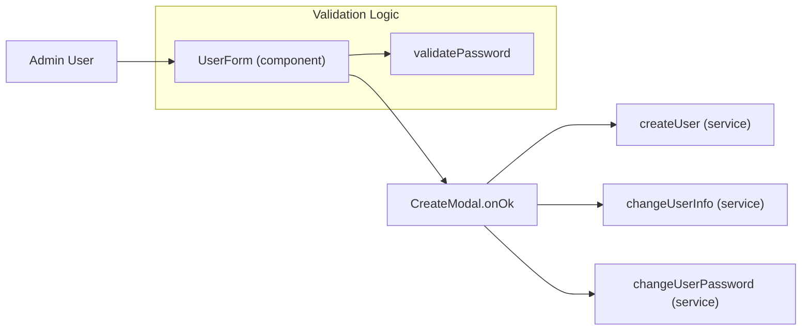
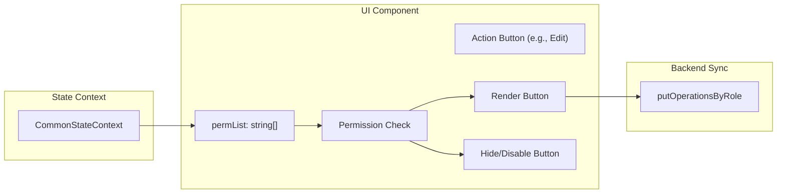

# User, Team & Permission Administration
Relevant source files

- [src/components/TimeRangePicker/TimeRangePicker.tsx](https://github.com/thetide557/ln-server-pub/blob/629bd918/src/components/TimeRangePicker/TimeRangePicker.tsx)
- [src/components/menu/topMenu.less](https://github.com/thetide557/ln-server-pub/blob/629bd918/src/components/menu/topMenu.less)
- [src/components/pageLayout/index.less](https://github.com/thetide557/ln-server-pub/blob/629bd918/src/components/pageLayout/index.less)
- [src/locales/common/en_US.ts](https://github.com/thetide557/ln-server-pub/blob/629bd918/src/locales/common/en_US.ts)
- [src/locales/common/zh_CN.ts](https://github.com/thetide557/ln-server-pub/blob/629bd918/src/locales/common/zh_CN.ts)
- [src/pages/account/changePassword.tsx](https://github.com/thetide557/ln-server-pub/blob/629bd918/src/pages/account/changePassword.tsx)
- [src/pages/dashboard/Detail/Detail.tsx](https://github.com/thetide557/ln-server-pub/blob/629bd918/src/pages/dashboard/Detail/Detail.tsx)
- [src/pages/orderformEvents/index.tsx](https://github.com/thetide557/ln-server-pub/blob/629bd918/src/pages/orderformEvents/index.tsx)
- [src/pages/permissions/index.tsx](https://github.com/thetide557/ln-server-pub/blob/629bd918/src/pages/permissions/index.tsx)
- [src/pages/permissions/Operations.tsx](https://github.com/thetide557/ln-server-pub/blob/629bd918/src/pages/permissions/Operations.tsx)
- [src/pages/permissions/RoleFormModal.tsx](https://github.com/thetide557/ln-server-pub/blob/629bd918/src/pages/permissions/RoleFormModal.tsx)
- [src/pages/permissions/services.ts](https://github.com/thetide557/ln-server-pub/blob/629bd918/src/pages/permissions/services.ts)
- [src/pages/recordingRules/PageTable.tsx](https://github.com/thetide557/ln-server-pub/blob/629bd918/src/pages/recordingRules/PageTable.tsx)
- [src/pages/recordingRules/components/editModal.tsx](https://github.com/thetide557/ln-server-pub/blob/629bd918/src/pages/recordingRules/components/editModal.tsx)
- [src/pages/recordingRules/components/operateForm.tsx](https://github.com/thetide557/ln-server-pub/blob/629bd918/src/pages/recordingRules/components/operateForm.tsx)
- [src/pages/targets/List.tsx](https://github.com/thetide557/ln-server-pub/blob/629bd918/src/pages/targets/List.tsx)
- [src/pages/task/result.tsx](https://github.com/thetide557/ln-server-pub/blob/629bd918/src/pages/task/result.tsx)
- [src/pages/user/business.tsx](https://github.com/thetide557/ln-server-pub/blob/629bd918/src/pages/user/business.tsx)
- [src/pages/user/component/createModal/index.tsx](https://github.com/thetide557/ln-server-pub/blob/629bd918/src/pages/user/component/createModal/index.tsx)
- [src/pages/user/component/passwordForm/index.tsx](https://github.com/thetide557/ln-server-pub/blob/629bd918/src/pages/user/component/passwordForm/index.tsx)
- [src/pages/user/component/userForm/index.tsx](https://github.com/thetide557/ln-server-pub/blob/629bd918/src/pages/user/component/userForm/index.tsx)
- [src/pages/user/groups.tsx](https://github.com/thetide557/ln-server-pub/blob/629bd918/src/pages/user/groups.tsx)
- [src/pages/user/users.tsx](https://github.com/thetide557/ln-server-pub/blob/629bd918/src/pages/user/users.tsx)
- [src/services/menu.ts](https://github.com/thetide557/ln-server-pub/blob/629bd918/src/services/menu.ts)
- [src/store/manageInterface/index.ts](https://github.com/thetide557/ln-server-pub/blob/629bd918/src/store/manageInterface/index.ts)

This section covers the management of human resources and access control within the LingNiu platform. It details the implementation of User CRUD, Team (User Group) structures, Business Group assignments, and the Role-Based Access Control (RBAC) system.

## 1. User Administration

The platform manages users through a centralized resource page and a dynamic form component. Users can be local, or integrated via external providers (LDAP/SSO).

### 1.1 User Lifecycle and CRUD

The main entry point for user management is the `Resource` component in `src/pages/user/users.tsx`. It provides a table view with filtering capabilities for username, nickname, email, phone, status, and role [src/pages/user/users.tsx#38-45](https://github.com/thetide557/ln-server-pub/blob/629bd918/src/pages/user/users.tsx#L38-L45)

Key Components:

- UserForm: A complex form handling user metadata, password validation, and role assignment [src/pages/user/component/userForm/index.tsx#31](https://github.com/thetide557/ln-server-pub/blob/629bd918/src/pages/user/component/userForm/index.tsx#L31-L31)
- UserInfoModal: A wrapper that determines the specific form to show based on `ActionType` (Create, Edit, Reset Password) [src/pages/user/component/createModal/index.tsx#38-50](https://github.com/thetide557/ln-server-pub/blob/629bd918/src/pages/user/component/createModal/index.tsx#L38-L50)
- Account Locking: Users can be locked/unlocked via the `lock_enabled` field [src/pages/user/component/userForm/index.tsx#87](https://github.com/thetide557/ln-server-pub/blob/629bd918/src/pages/user/component/userForm/index.tsx#L87-L87)
- Temporary Users: The system supports temporary accounts with an expiration date (`temp_user_expire_at`) [src/pages/user/component/userForm/index.tsx#88](https://github.com/thetide557/ln-server-pub/blob/629bd918/src/pages/user/component/userForm/index.tsx#L88-L88)

### 1.2 Password Security

Passwords must meet specific complexity requirements: at least 12 characters including three of the following: uppercase, lowercase, numbers, and symbols [src/pages/user/component/userForm/index.tsx#99-109](https://github.com/thetide557/ln-server-pub/blob/629bd918/src/pages/user/component/userForm/index.tsx#L99-L109)

### 1.3 Natural Language to Code: User Management Flow

The following diagram maps the administrative actions to their implementation entities.

| Action | Code Entity | File Path |
| --- | --- | --- |
| Create User | `createUser` | `src/services/manage.ts` |
| Update User | `changeUserInfo` | `src/services/manage.ts` |
| Reset Password | `changeUserPassword` | `src/services/manage.ts` |
| Form Logic | `UserForm` | `src/pages/user/component/userForm/index.tsx` |

Sources:[src/pages/user/component/userForm/index.tsx#31-109](https://github.com/thetide557/ln-server-pub/blob/629bd918/src/pages/user/component/userForm/index.tsx#L31-L109)[src/pages/user/component/createModal/index.tsx#51-78](https://github.com/thetide557/ln-server-pub/blob/629bd918/src/pages/user/component/createModal/index.tsx#L51-L78)[src/pages/user/users.tsx#50-165](https://github.com/thetide557/ln-server-pub/blob/629bd918/src/pages/user/users.tsx#L50-L165)

---

## 2. Team & Business Group Management

The platform distinguishes between Teams (logical groupings of users) and Business Groups (resource-scoping units).

### 2.1 Teams (User Groups)

Teams are managed via the `TeamForm`. They allow for batch operations on users and are used as targets for alert notifications.

- Member Management: Users are added to teams via `addTeamUser`[src/pages/user/component/createModal/index.tsx#119](https://github.com/thetide557/ln-server-pub/blob/629bd918/src/pages/user/component/createModal/index.tsx#L119-L119)
- Organization Integration: Users are associated with teams via the `group_id` property in the user list [src/pages/user/users.tsx#192-205](https://github.com/thetide557/ln-server-pub/blob/629bd918/src/pages/user/users.tsx#L192-L205)

### 2.2 Business Groups

Business Groups (BGs) are used to partition assets and monitoring rules.

- Permission Flags: Members are assigned to BGs with either Read-Write (`rw`) or Read-Only (`ro`) permissions [src/pages/user/component/createModal/index.tsx#134-135](https://github.com/thetide557/ln-server-pub/blob/629bd918/src/pages/user/component/createModal/index.tsx#L134-L135)
- Label Binding: BGs can have associated labels (`label_value`) for automatic asset discovery or filtering [src/pages/user/component/createModal/index.tsx#126-130](https://github.com/thetide557/ln-server-pub/blob/629bd918/src/pages/user/component/createModal/index.tsx#L126-L130)

Sources:[src/pages/user/component/createModal/index.tsx#80-165](https://github.com/thetide557/ln-server-pub/blob/629bd918/src/pages/user/component/createModal/index.tsx#L80-L165)[src/pages/user/users.tsx#129-145](https://github.com/thetide557/ln-server-pub/blob/629bd918/src/pages/user/users.tsx#L129-L145)

---

## 3. RBAC & Permissions

The platform implements a Role-Based Access Control system where roles are associated with specific operation keys.

### 3.1 Role Management & Assignment

Roles are not merely static/predefined — they are fully manageable through a dedicated administration page, `Resource` (`index`) in `src/pages/permissions/index.tsx`, routed at `/permissions`. This page lists all roles (`getRoles()`) and lets an authorized user create, rename, or delete **custom** roles through `RoleFormModal` [src/pages/permissions/RoleFormModal.tsx](https://github.com/thetide557/ln-server-pub/blob/629bd918/src/pages/permissions/RoleFormModal.tsx), backed by `postRoles`/`putRoles`/`deleteRoles` in `src/pages/permissions/services.ts`.

- Protected Built-in Roles: The four built-in roles — `Admin`, `运维管理员`, `普通用户`, `临时用户` — are protected from edit/delete in the UI. `Admin` can never be edited or deleted by anyone; the other three can only be edited/deleted by a user holding the `Admin` role, while custom (non-built-in) roles can additionally be managed by any user holding the `/permissions/put`/`/permissions/del` permission strings [src/pages/permissions/index.tsx#104-143](https://github.com/thetide557/ln-server-pub/blob/629bd918/src/pages/permissions/index.tsx#L104-L143)
- Role Creation: New roles are added via the `role_add` button (gated by `/permissions/add` or Admin) [src/pages/permissions/index.tsx#47-65](https://github.com/thetide557/ln-server-pub/blob/629bd918/src/pages/permissions/index.tsx#L47-L65)

Once a role exists, it is fetched via `getRoles()`[src/services/manage.ts](https://github.com/thetide557/ln-server-pub/blob/629bd918/src/services/manage.ts) and assigned to users in the `UserForm`. The "Admin" role is a reserved superuser role that bypasses standard permission checks in various UI components [src/pages/recordingRules/PageTable.tsx#126](https://github.com/thetide557/ln-server-pub/blob/629bd918/src/pages/recordingRules/PageTable.tsx#L126-L126)[src/pages/permissions/Operations.tsx#73](https://github.com/thetide557/ln-server-pub/blob/629bd918/src/pages/permissions/Operations.tsx#L73-L73)

### 3.2 Permission Mapping

Within the `/permissions` page, selecting a role on the left renders the `Operations` component, which manages the mapping between that Role and specific functional permissions.

- Tree Structure: Permissions are rendered as a checkable tree using the `cname` (display name) and `name` (unique identifier) [src/pages/permissions/Operations.tsx#54-69](https://github.com/thetide557/ln-server-pub/blob/629bd918/src/pages/permissions/Operations.tsx#L54-L69)
- Persistence: Changes are saved via `putOperationsByRole`[src/pages/permissions/Operations.tsx#81-86](https://github.com/thetide557/ln-server-pub/blob/629bd918/src/pages/permissions/Operations.tsx#L81-L86)
- Disabled for Protected Roles: The tree is rendered read-only (`disabled`) for the `运维管理员`/`普通用户`/`临时用户` built-in roles unless the current viewer holds the `Admin` role; the Save button underneath is separately gated by the `/permissions/save` permission (or Admin), regardless of which role is selected [src/pages/permissions/index.tsx#150](https://github.com/thetide557/ln-server-pub/blob/629bd918/src/pages/permissions/index.tsx#L150-L150)

### 3.3 Code Entity Space: Permission Check Pattern

Permissions are checked globally using the `permList` provided by the `CommonStateContext`.

Sources:[src/pages/permissions/Operations.tsx#10-26](https://github.com/thetide557/ln-server-pub/blob/629bd918/src/pages/permissions/Operations.tsx#L10-L26)[src/pages/permissions/Operations.tsx#70-97](https://github.com/thetide557/ln-server-pub/blob/629bd918/src/pages/permissions/Operations.tsx#L70-L97)[src/pages/recordingRules/PageTable.tsx#168-172](https://github.com/thetide557/ln-server-pub/blob/629bd918/src/pages/recordingRules/PageTable.tsx#L168-L172)

---

## 4. Administrative Operations Summary

| Feature | Implementation Detail | Source Reference |
| --- | --- | --- |
| User Status | Toggle between 0 (Disabled) and 1 (Enabled) | [src/pages/user/users.tsx#208-216](https://github.com/thetide557/ln-server-pub/blob/629bd918/src/pages/user/users.tsx#L208-L216) |
| Batch Ops | Supports batch delete, start, and stop for users | [src/pages/user/users.tsx#101-120](https://github.com/thetide557/ln-server-pub/blob/629bd918/src/pages/user/users.tsx#L101-L120) |
| Contact Info | Dynamic list of notification channels (Email, Phone, etc.) | [src/pages/user/component/userForm/index.tsx#78-86](https://github.com/thetide557/ln-server-pub/blob/629bd918/src/pages/user/component/userForm/index.tsx#L78-L86) |
| Recording Rules | Permissions checked for enable/disable and edit | [src/pages/recordingRules/PageTable.tsx#168-216](https://github.com/thetide557/ln-server-pub/blob/629bd918/src/pages/recordingRules/PageTable.tsx#L168-L216) |
| Role Metadata | Roles include a `name` and a `note` (description) | [src/pages/user/component/userForm/index.tsx#201-208](https://github.com/thetide557/ln-server-pub/blob/629bd918/src/pages/user/component/userForm/index.tsx#L201-L208) |

Sources:[src/pages/user/users.tsx#101-120](https://github.com/thetide557/ln-server-pub/blob/629bd918/src/pages/user/users.tsx#L101-L120)[src/pages/user/component/userForm/index.tsx#78-86](https://github.com/thetide557/ln-server-pub/blob/629bd918/src/pages/user/component/userForm/index.tsx#L78-L86)[src/pages/recordingRules/PageTable.tsx#168-216](https://github.com/thetide557/ln-server-pub/blob/629bd918/src/pages/recordingRules/PageTable.tsx#L168-L216)