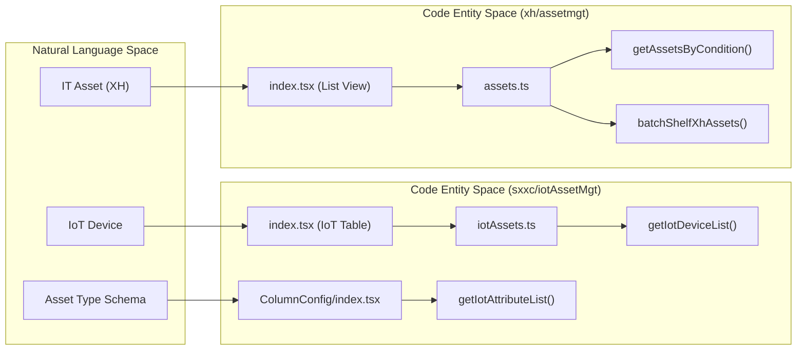
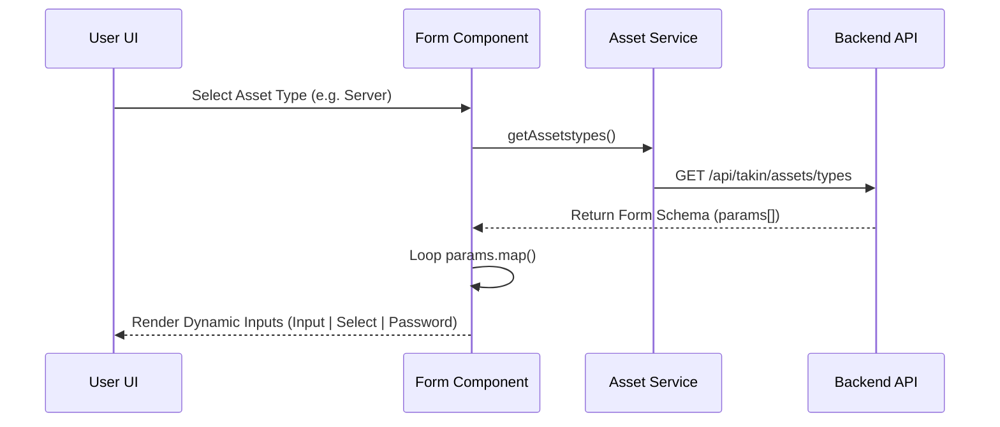

# Asset Management
Relevant source files

- [src/pages/sxxc/iotAssetMgt/Accordion/accordionModal.tsx](https://github.com/thetide557/ln-server-pub/blob/629bd918/src/pages/sxxc/iotAssetMgt/Accordion/accordionModal.tsx)
- [src/pages/sxxc/iotAssetMgt/ColumnConfig/index.tsx](https://github.com/thetide557/ln-server-pub/blob/629bd918/src/pages/sxxc/iotAssetMgt/ColumnConfig/index.tsx)
- [src/pages/sxxc/iotAssetMgt/Form/index.tsx](https://github.com/thetide557/ln-server-pub/blob/629bd918/src/pages/sxxc/iotAssetMgt/Form/index.tsx)
- [src/pages/sxxc/iotAssetMgt/OperationModal.tsx](https://github.com/thetide557/ln-server-pub/blob/629bd918/src/pages/sxxc/iotAssetMgt/OperationModal.tsx)
- [src/pages/sxxc/iotAssetMgt/index.tsx](https://github.com/thetide557/ln-server-pub/blob/629bd918/src/pages/sxxc/iotAssetMgt/index.tsx)
- [src/pages/xh/assetmgt/Accordion/accordionModal.tsx](https://github.com/thetide557/ln-server-pub/blob/629bd918/src/pages/xh/assetmgt/Accordion/accordionModal.tsx)
- [src/pages/xh/assetmgt/Form/index.tsx](https://github.com/thetide557/ln-server-pub/blob/629bd918/src/pages/xh/assetmgt/Form/index.tsx)
- [src/pages/xh/assetmgt/Form/style.less](https://github.com/thetide557/ln-server-pub/blob/629bd918/src/pages/xh/assetmgt/Form/style.less)
- [src/pages/xh/assetmgt/index.tsx](https://github.com/thetide557/ln-server-pub/blob/629bd918/src/pages/xh/assetmgt/index.tsx)
- [src/pages/xh/assetmgt/style.less](https://github.com/thetide557/ln-server-pub/blob/629bd918/src/pages/xh/assetmgt/style.less)
- [src/pages/xh/monitor/Form/index.tsx](https://github.com/thetide557/ln-server-pub/blob/629bd918/src/pages/xh/monitor/Form/index.tsx)
- [src/pages/xh/monitor/index.tsx](https://github.com/thetide557/ln-server-pub/blob/629bd918/src/pages/xh/monitor/index.tsx)
- [src/pages/xh/monitor/style.less](https://github.com/thetide557/ln-server-pub/blob/629bd918/src/pages/xh/monitor/style.less)
- [src/services/assets.ts](https://github.com/thetide557/ln-server-pub/blob/629bd918/src/services/assets.ts)
- [src/services/sxxc/iotAssets.ts](https://github.com/thetide557/ln-server-pub/blob/629bd918/src/services/sxxc/iotAssets.ts)
- [src/utils/day.js](https://github.com/thetide557/ln-server-pub/blob/629bd918/src/utils/day.js)

The platform provides two primary asset management subsystems: XH (IT Infrastructure) and IoT (Internet of Things). While they serve different operational domains, they share architectural patterns such as hierarchical organization trees, dynamic type-driven forms, and batch lifecycle management.

### System Overview

| Subsystem | Target Assets | Core Logic | Key Components |
| --- | --- | --- | --- |
| XH Assets | Servers, Switches, Firewalls | Fixed + Extended properties, Maintenance lifecycle | `xh/assetmgt`[src/pages/xh/assetmgt/index.tsx#134-182](https://github.com/thetide557/ln-server-pub/blob/629bd918/src/pages/xh/assetmgt/index.tsx#L134-L182)`assets.ts` |
| IoT Assets | Sensors, Cameras, Industrial devices | Dynamic Schema, Configurable Page Layouts | `sxxc/iotAssetMgt`[src/pages/sxxc/iotAssetMgt/index.tsx#86-134](https://github.com/thetide557/ln-server-pub/blob/629bd918/src/pages/sxxc/iotAssetMgt/index.tsx#L86-L134)`iotAssets.ts` |

---

### XH IT Asset Inventory

The XH module manages traditional IT infrastructure. It features a multi-level organization tree that categorizes assets by business logic or physical location.

- Organization Tree: Managed via `AccordionModal`, allowing users to define groups and link specific asset types to tree nodes [src/pages/xh/assetmgt/Accordion/accordionModal.tsx#32-61](https://github.com/thetide557/ln-server-pub/blob/629bd918/src/pages/xh/assetmgt/Accordion/accordionModal.tsx#L32-L61)
- Lifecycle Management: Supports "Shelving" (上架/下架) status tracking to manage the operational state of hardware [src/pages/xh/assetmgt/index.tsx#49-54](https://github.com/thetide557/ln-server-pub/blob/629bd918/src/pages/xh/assetmgt/index.tsx#L49-L54)
- Batch Operations: Includes importing/exporting via Excel and batch deletion [src/services/assets.ts#127-132](https://github.com/thetide557/ln-server-pub/blob/629bd918/src/services/assets.ts#L127-L132)[src/services/assets.ts#241-255](https://github.com/thetide557/ln-server-pub/blob/629bd918/src/services/assets.ts#L241-L255)

For details on inventory views and lifecycle, see [XH IT Asset Inventory](/org/benjamin-braddock/wiki/thetide557/ln-server-pub/page/3.1?branch=v2.1).

Sources:[src/pages/xh/assetmgt/index.tsx#1-182](https://github.com/thetide557/ln-server-pub/blob/629bd918/src/pages/xh/assetmgt/index.tsx#L1-L182)[src/pages/xh/assetmgt/Accordion/accordionModal.tsx#9-61](https://github.com/thetide557/ln-server-pub/blob/629bd918/src/pages/xh/assetmgt/Accordion/accordionModal.tsx#L9-L61)[src/services/assets.ts#1-255](https://github.com/thetide557/ln-server-pub/blob/629bd918/src/services/assets.ts#L1-L255)

---

### XH Asset Form & Extended Properties

Asset creation in XH is driven by a dynamic form engine. When a user selects an asset type (e.g., "Server"), the system fetches a specific schema to render relevant fields.

- Dynamic Rendering: Uses `assetTypes` to determine which `formItems` to display [src/pages/xh/assetmgt/Form/index.tsx#47-49](https://github.com/thetide557/ln-server-pub/blob/629bd918/src/pages/xh/assetmgt/Form/index.tsx#L47-L49)
- Extended Properties: Supports "Expansion" attributes (扩展属性) that are stored separately from base settings [src/services/assets.ts#96-104](https://github.com/thetide557/ln-server-pub/blob/629bd918/src/services/assets.ts#L96-L104)
- Security: Implements a `ControlledPasswordField` to handle sensitive data like IPMI or SSH passwords without exposing them in plain text during edits [src/pages/xh/assetmgt/Form/index.tsx#28-43](https://github.com/thetide557/ln-server-pub/blob/629bd918/src/pages/xh/assetmgt/Form/index.tsx#L28-L43)
- Maintenance: Tracks maintenance history and upcoming service dates [src/pages/xh/assetmgt/Form/index.tsx#77-80](https://github.com/thetide557/ln-server-pub/blob/629bd918/src/pages/xh/assetmgt/Form/index.tsx#L77-L80)

For details on form generation and schema handling, see [XH Asset Form & Extended Properties](/org/benjamin-braddock/wiki/thetide557/ln-server-pub/page/3.2?branch=v2.1).

Sources:[src/pages/xh/assetmgt/Form/index.tsx#1-113](https://github.com/thetide557/ln-server-pub/blob/629bd918/src/pages/xh/assetmgt/Form/index.tsx#L1-L113)[src/services/assets.ts#83-104](https://github.com/thetide557/ln-server-pub/blob/629bd918/src/services/assets.ts#L83-L104)

---

### IoT Asset Management

The IoT module is designed for high flexibility, where device attributes vary significantly between models. It uses a metadata-driven approach where the UI layout is itself configurable.

- Dynamic Schema: Attributes are fetched via `getIotAttributeList` based on the `typeId`[src/pages/sxxc/iotAssetMgt/ColumnConfig/index.tsx#67-76](https://github.com/thetide557/ln-server-pub/blob/629bd918/src/pages/sxxc/iotAssetMgt/ColumnConfig/index.tsx#L67-L76)
- Page Configurator: The `IotPageEdit` service and `ColumnConfig` component allow administrators to define which attributes appear in the table and how they are ordered [src/pages/sxxc/iotAssetMgt/ColumnConfig/index.tsx#204-227](https://github.com/thetide557/ln-server-pub/blob/629bd918/src/pages/sxxc/iotAssetMgt/ColumnConfig/index.tsx#L204-L227)
- Three-Level Tree: A specialized organization tree (depth up to 3) for geographical or functional grouping of IoT devices [src/pages/sxxc/iotAssetMgt/Accordion/accordionModal.tsx#73-75](https://github.com/thetide557/ln-server-pub/blob/629bd918/src/pages/sxxc/iotAssetMgt/Accordion/accordionModal.tsx#L73-L75)

For details on IoT schema and layout configuration, see [IoT Asset Management](/org/benjamin-braddock/wiki/thetide557/ln-server-pub/page/3.3?branch=v2.1).

Sources:[src/pages/sxxc/iotAssetMgt/index.tsx#1-238](https://github.com/thetide557/ln-server-pub/blob/629bd918/src/pages/sxxc/iotAssetMgt/index.tsx#L1-L238)[src/pages/sxxc/iotAssetMgt/ColumnConfig/index.tsx#1-227](https://github.com/thetide557/ln-server-pub/blob/629bd918/src/pages/sxxc/iotAssetMgt/ColumnConfig/index.tsx#L1-L227)[src/pages/sxxc/iotAssetMgt/Accordion/accordionModal.tsx#14-95](https://github.com/thetide557/ln-server-pub/blob/629bd918/src/pages/sxxc/iotAssetMgt/Accordion/accordionModal.tsx#L14-L95)

---

### Code-to-Entity Mapping

The following diagram maps the logical asset concepts to their corresponding implementation files and service functions.

#### Asset Entity Mapping

Sources:[src/pages/xh/assetmgt/index.tsx#37-43](https://github.com/thetide557/ln-server-pub/blob/629bd918/src/pages/xh/assetmgt/index.tsx#L37-L43)[src/pages/sxxc/iotAssetMgt/index.tsx#64-71](https://github.com/thetide557/ln-server-pub/blob/629bd918/src/pages/sxxc/iotAssetMgt/index.tsx#L64-L71)[src/services/assets.ts#23-34](https://github.com/thetide557/ln-server-pub/blob/629bd918/src/services/assets.ts#L23-L34)

#### Dynamic Form Generation Flow

Sources:[src/pages/xh/assetmgt/Form/index.tsx#64-68](https://github.com/thetide557/ln-server-pub/blob/629bd918/src/pages/xh/assetmgt/Form/index.tsx#L64-L68)[src/services/assets.ts#164-168](https://github.com/thetide557/ln-server-pub/blob/629bd918/src/services/assets.ts#L164-L168)[src/pages/xh/monitor/Form/index.tsx#164-175](https://github.com/thetide557/ln-server-pub/blob/629bd918/src/pages/xh/monitor/Form/index.tsx#L164-L175)