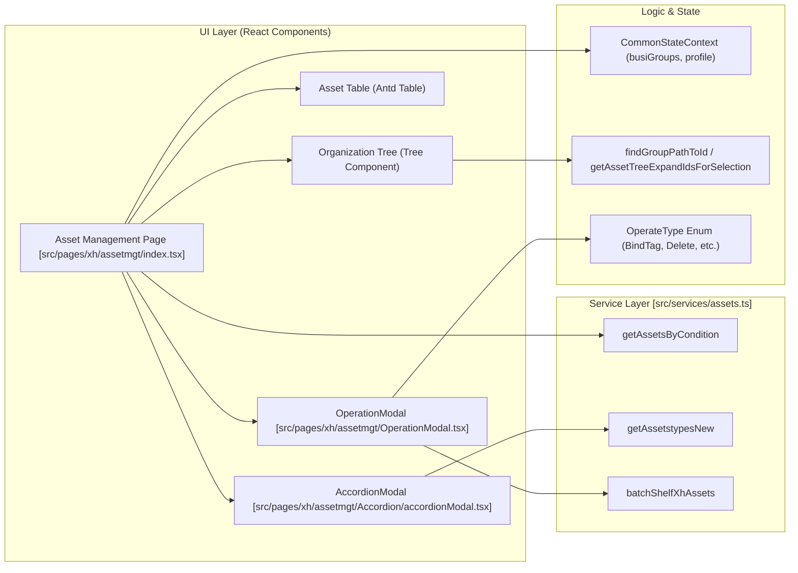
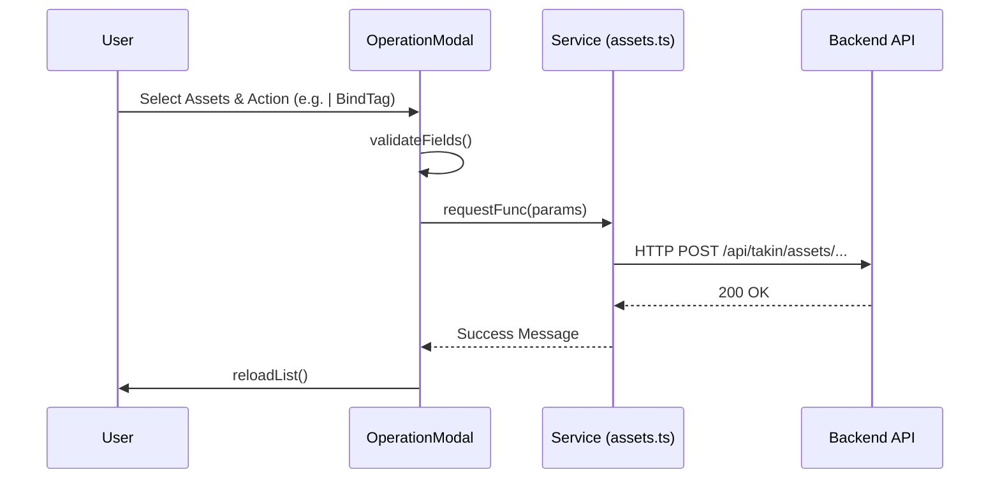

# XH IT Asset Inventory
Relevant source files

- [src/pages/help/servers/index.tsx](https://github.com/thetide557/ln-server-pub/blob/629bd918/src/pages/help/servers/index.tsx)
- [src/pages/log/IndexPatterns/index.tsx](https://github.com/thetide557/ln-server-pub/blob/629bd918/src/pages/log/IndexPatterns/index.tsx)
- [src/pages/xh/assetmgt/Accordion/accordionModal.tsx](https://github.com/thetide557/ln-server-pub/blob/629bd918/src/pages/xh/assetmgt/Accordion/accordionModal.tsx)
- [src/pages/xh/assetmgt/Accordion/index.jsx](https://github.com/thetide557/ln-server-pub/blob/629bd918/src/pages/xh/assetmgt/Accordion/index.jsx)
- [src/pages/xh/assetmgt/OperationModal.tsx](https://github.com/thetide557/ln-server-pub/blob/629bd918/src/pages/xh/assetmgt/OperationModal.tsx)
- [src/pages/xh/assetmgt/catalog.tsx](https://github.com/thetide557/ln-server-pub/blob/629bd918/src/pages/xh/assetmgt/catalog.tsx)
- [src/pages/xh/assetmgt/index.tsx](https://github.com/thetide557/ln-server-pub/blob/629bd918/src/pages/xh/assetmgt/index.tsx)
- [src/pages/xh/assetmgt/style.less](https://github.com/thetide557/ln-server-pub/blob/629bd918/src/pages/xh/assetmgt/style.less)
- [src/pages/xh/monitor/Form/monitorV2.tsx](https://github.com/thetide557/ln-server-pub/blob/629bd918/src/pages/xh/monitor/Form/monitorV2.tsx)
- [src/pages/xh/monitor/MutiAdd.tsx](https://github.com/thetide557/ln-server-pub/blob/629bd918/src/pages/xh/monitor/MutiAdd.tsx)
- [src/pages/xh/monitor/index.tsx](https://github.com/thetide557/ln-server-pub/blob/629bd918/src/pages/xh/monitor/index.tsx)
- [src/pages/xh/monitor/style.less](https://github.com/thetide557/ln-server-pub/blob/629bd918/src/pages/xh/monitor/style.less)

The XH IT Asset Inventory module is a comprehensive system for managing IT infrastructure assets. It provides a hierarchical organization tree, a dynamic asset list with customizable columns, and full lifecycle management including shelving (onboarding/offboarding) and batch operations.

## 1. System Architecture and Data Flow

The module follows a structured data flow where the frontend React components interact with the `assets.ts` service layer to perform CRUD operations on assets and their organizational structures.

### 1.1 Component Relationship Diagram

This diagram maps the visual components to their underlying implementation files and key functions.

Natural Language to Code Entity Map

Sources: `<FileRef file-url="https://github.com/thetide557/ln-server-pub/blob/629bd918/src/pages/xh/assetmgt/index.tsx#L1-L71" min=1 max=71 file-path="src/pages/xh/assetmgt/index.tsx">Hii</FileRef>`, `<FileRef file-url="https://github.com/thetide557/ln-server-pub/blob/629bd918/src/pages/xh/assetmgt/Accordion/accordionModal.tsx#L1-L10" min=1 max=10 file-path="src/pages/xh/assetmgt/Accordion/accordionModal.tsx">Hii</FileRef>`, `<FileRef file-url="https://github.com/thetide557/ln-server-pub/blob/629bd918/src/pages/xh/assetmgt/OperationModal.tsx#L1-L15" min=1 max=15 file-path="src/pages/xh/assetmgt/OperationModal.tsx">Hii</FileRef>`

## 2. Organization Tree & Group Management

The organization tree allows users to categorize assets into nested groups. It supports up to 3 levels of hierarchy, with the third level typically mapping to specific equipment types.

### 2.1 Implementation Details

- Tree Rendering: The organization tree is actually rendered by custom recursive components (`AssetTree` / `TreeNode`, plain `div`/`span` nodes), not Ant Design's `Tree` component — `Tree` is imported from `antd` but is unused for this purpose, and there is no `titleRender`. Per-node context menus use Ant Design `Dropdown`/`Menu` ("编辑"/"删除"/"新增分组"), and group editing opens the `AccordionModal` dialog rather than editing inline `<FileRef file-url="https://github.com/thetide557/ln-server-pub/blob/629bd918/src/pages/xh/assetmgt/index.tsx#L1288-L1458" min=1288 max=1458 file-path="src/pages/xh/assetmgt/index.tsx">Hii</FileRef>`.
- Dynamic Expansion: The function `getAssetTreeExpandIdsForSelection` calculates which nodes should be expanded based on the currently selected `tissueId` or `parId``<FileRef file-url="https://github.com/thetide557/ln-server-pub/blob/629bd918/src/pages/xh/assetmgt/index.tsx#L112-L132" min=112 max=132 file-path="src/pages/xh/assetmgt/index.tsx">Hii</FileRef>`.
- Group Management: The `AccordionModal` component handles the creation and modification of asset groups. It allows associating specific device types with a group via the `types` field `<FileRef file-url="https://github.com/thetide557/ln-server-pub/blob/629bd918/src/pages/xh/assetmgt/Accordion/accordionModal.tsx#L98-L121" min=98 max=121 file-path="src/pages/xh/assetmgt/Accordion/accordionModal.tsx">Hii</FileRef>`.

### 2.2 AccordionModal Logic

| Action | Service Function | File Reference |
| --- | --- | --- |
| Add Group | `addXhAssetstypesNew` | `<FileRef file-url="https://github.com/thetide557/ln-server-pub/blob/629bd918/src/pages/xh/assetmgt/Accordion/accordionModal.tsx#L51-L57" min=51 max=57 file-path="src/pages/xh/assetmgt/Accordion/accordionModal.tsx">Hii</FileRef>` |
| Edit Group | `editXhAssetstypesNew` | `<FileRef file-url="https://github.com/thetide557/ln-server-pub/blob/629bd918/src/pages/xh/assetmgt/Accordion/accordionModal.tsx#L42-L46" min=42 max=46 file-path="src/pages/xh/assetmgt/Accordion/accordionModal.tsx">Hii</FileRef>` |
| Delete Group | `delXhAssetstypesNew` | `<FileRef file-url="https://github.com/thetide557/ln-server-pub/blob/629bd918/src/pages/xh/assetmgt/index.tsx#L37-L37" min=37 file-path="src/pages/xh/assetmgt/index.tsx">Hii</FileRef>` |

Sources: `<FileRef file-url="https://github.com/thetide557/ln-server-pub/blob/629bd918/src/pages/xh/assetmgt/index.tsx#L87-L132" min=87 max=132 file-path="src/pages/xh/assetmgt/index.tsx">Hii</FileRef>`, `<FileRef file-url="https://github.com/thetide557/ln-server-pub/blob/629bd918/src/pages/xh/assetmgt/Accordion/accordionModal.tsx#L32-L61" min=32 max=61 file-path="src/pages/xh/assetmgt/Accordion/accordionModal.tsx">Hii</FileRef>`

## 3. Asset List and Dynamic Columns

The asset list is the primary interface for viewing and filtering IT infrastructure. It features resizable headers and dynamic data fetching based on tree selection.

### 3.1 Filtering and Search

The system provides a robust filtering mechanism defined in `queryFilter`, supporting inputs for IP, Name, OS and Position (资产位置), plus Selects for Manufacturers, Status, Business Groups, Maintenance Status (维保状态) and Management/Shelf Status (管理状态, i.e. 上架/下架) `<FileRef file-url="https://github.com/thetide557/ln-server-pub/blob/629bd918/src/pages/xh/assetmgt/index.tsx#L72-L84" min=72 max=84 file-path="src/pages/xh/assetmgt/index.tsx">Hii</FileRef>`.

### 3.2 Table State Management

The table uses several local storage keys to persist user preferences:

- `asset_current_page`: Page size `<FileRef file-url="https://github.com/thetide557/ln-server-pub/blob/629bd918/src/pages/xh/assetmgt/index.tsx#L147-L147" min=147  file-path="src/pages/xh/assetmgt/index.tsx">Hii</FileRef>`.
- `asset_filter_param`: Current search field (e.g., 'ip') `<FileRef file-url="https://github.com/thetide557/ln-server-pub/blob/629bd918/src/pages/xh/assetmgt/index.tsx#L149-L149" min=149  file-path="src/pages/xh/assetmgt/index.tsx">Hii</FileRef>`.
- `leftassetWidth`: Sidebar width for the organization tree `<FileRef file-url="https://github.com/thetide557/ln-server-pub/blob/629bd918/src/pages/xh/assetmgt/index.tsx#L159-L159" min=159  file-path="src/pages/xh/assetmgt/index.tsx">Hii</FileRef>`.

Sources: `<FileRef file-url="https://github.com/thetide557/ln-server-pub/blob/629bd918/src/pages/xh/assetmgt/index.tsx#L140-L165" min=140 max=165 file-path="src/pages/xh/assetmgt/index.tsx">Hii</FileRef>`

## 4. Asset Lifecycle & Batch Operations

The `OperationModal` and `OperateType` enum define the lifecycle actions available for assets.

### 4.1 Shelving Lifecycle (上架/下架)

Assets transition between management states using the `batchShelfXhAssets` service.

- Onboarding (上架): `OperateType.AssetBatchList``<FileRef file-url="https://github.com/thetide557/ln-server-pub/blob/629bd918/src/pages/xh/assetmgt/index.tsx#L69-L69" min=69  file-path="src/pages/xh/assetmgt/index.tsx">Hii</FileRef>`.
- Offboarding (下架): `OperateType.AssetBatchDelist``<FileRef file-url="https://github.com/thetide557/ln-server-pub/blob/629bd918/src/pages/xh/assetmgt/index.tsx#L70-L70" min=70  file-path="src/pages/xh/assetmgt/index.tsx">Hii</FileRef>`.

### 4.2 Batch Operation Flow

The `OperationModal` handles complex batch tasks. Note that in the XH asset list, the batch-operations dropdown only wires up a subset of the `OperateType` values it defines — the rest still have full modal/request logic in `OperationModal.tsx`, but no menu entry ever sets `operateType` to them, so they are unreachable in the UI:

- Reachable today: `导入设备`/`oid扩展属性导入` (import), `导出设备` (export), `批量转移` (Business Group Transfer via `moveTargetBusi`), `批量删除` (delete), `批量上架`/`批量下架` (shelving) `<FileRef file-url="https://github.com/thetide557/ln-server-pub/blob/629bd918/src/pages/xh/assetmgt/index.tsx#L1754-L1769" min=1754 max=1769 file-path="src/pages/xh/assetmgt/index.tsx">Hii</FileRef>`.
- Tagging: `bindTags` and `unbindTags` (`OperateType.BindTag`/`UnbindTag`) still bulk-manage metadata labels in `OperationModal.tsx`, but their menu items are commented out in `index.tsx`, so tagging is currently not exposed to users from this page `<FileRef file-url="https://github.com/thetide557/ln-server-pub/blob/629bd918/src/pages/xh/assetmgt/OperationModal.tsx#L75-L160" min=75 max=160 file-path="src/pages/xh/assetmgt/OperationModal.tsx">Hii</FileRef>`.
- Organization Change: `changeAssetOrganization` (`OperateType.ChangeOrganize`) still exists in `OperationModal.tsx` and would update the hierarchy placement, but unlike the generic `assetmgt` module (which does expose a "变更组织树" menu item), the XH page never adds a menu entry for it, so it is currently unreachable from the XH asset list UI `<FileRef file-url="https://github.com/thetide557/ln-server-pub/blob/629bd918/src/pages/xh/assetmgt/OperationModal.tsx#L62-L65" min=62 max=65 file-path="src/pages/xh/assetmgt/OperationModal.tsx">Hii</FileRef>`.
- Likewise commented out / unreachable: "移出业务组" (`RemoveBusi`) and "修改备注" (`UpdateNote`).

Operation Data Flow

Sources: `<FileRef file-url="https://github.com/thetide557/ln-server-pub/blob/629bd918/src/pages/xh/assetmgt/OperationModal.tsx#L6-L13" min=6 max=13 file-path="src/pages/xh/assetmgt/OperationModal.tsx">Hii</FileRef>`, `<FileRef file-url="https://github.com/thetide557/ln-server-pub/blob/629bd918/src/pages/xh/assetmgt/OperationModal.tsx#L75-L185" min=75 max=185 file-path="src/pages/xh/assetmgt/OperationModal.tsx">Hii</FileRef>`

## 5. Import and Export

The system supports bulk data movement: import is Excel-only, while export additionally offers XML and Txt output.

- Batch Import: Triggered by `OperateType.AssetBatchImport`. It uses `importXhAssetSetData` to post the uploaded `.xls`/`.xlsx` file to `/api/takin/xh/asset/import-xls` `<FileRef file-url="https://github.com/thetide557/ln-server-pub/blob/629bd918/src/pages/xh/assetmgt/OperationModal.tsx#L13-L13" min=13  file-path="src/pages/xh/assetmgt/OperationModal.tsx">Hii</FileRef>`.
- Network Device (OID) Import: A distinct `OperateType.AssetOidBatchImport` action, surfaced in the batch-operations menu only when the currently selected asset type is a leaf type under "物理资源" (excluding "物理服务器"/"宿主机"). It reuses the same upload dialog but posts to `/api/takin/xh/asset-oid/import-xls` and downloads its own template from `/api/takin/xh/asset-oid/templet` via `exportTemplet` — a separate code path from the regular asset import/template `<FileRef file-url="https://github.com/thetide557/ln-server-pub/blob/629bd918/src/pages/xh/assetmgt/OperationModal.tsx#L375-L420" min=375 max=420 file-path="src/pages/xh/assetmgt/OperationModal.tsx">Hii</FileRef>`.
- Template Export: Users can download an Excel import template via `exportTemplet` to ensure data formatting is correct before import `<FileRef file-url="https://github.com/thetide557/ln-server-pub/blob/629bd918/src/pages/xh/assetmgt/OperationModal.tsx#L9-L9" min=9  file-path="src/pages/xh/assetmgt/OperationModal.tsx">Hii</FileRef>`.
- Batch Export: Assets are exported via `exportTemplet`, but not to Excel only — the user first picks an output format (Excel `.xls`, XML `.xml`, or Txt `.txt`) from a `Radio.Group` before the file downloads `<FileRef file-url="https://github.com/thetide557/ln-server-pub/blob/629bd918/src/pages/xh/assetmgt/OperationModal.tsx#L188-L219" min=188 max=219 file-path="src/pages/xh/assetmgt/OperationModal.tsx">Hii</FileRef>`.

Sources: `<FileRef file-url="https://github.com/thetide557/ln-server-pub/blob/629bd918/src/pages/xh/assetmgt/OperationModal.tsx#L36-L58" min=36 max=58 file-path="src/pages/xh/assetmgt/OperationModal.tsx">Hii</FileRef>`, `<FileRef file-url="https://github.com/thetide557/ln-server-pub/blob/629bd918/src/pages/xh/assetmgt/OperationModal.tsx#L188-L200" min=188 max=200 file-path="src/pages/xh/assetmgt/OperationModal.tsx">Hii</FileRef>`