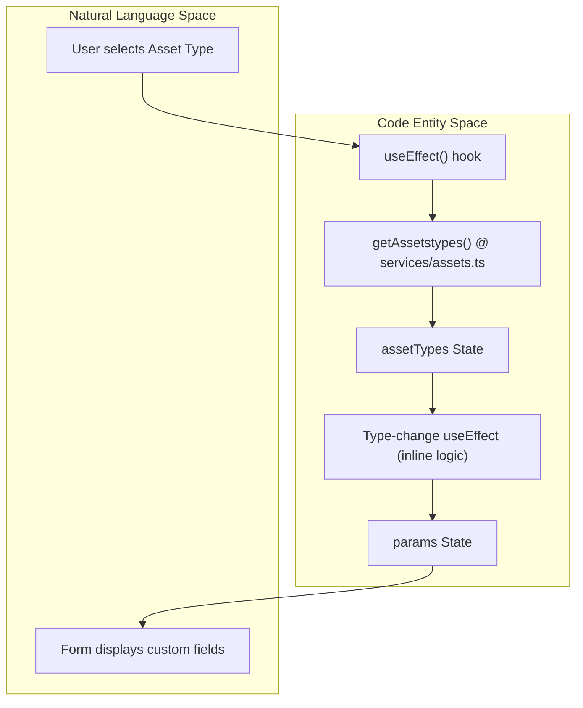

# XH Asset Form & Extended Properties
Relevant source files

- [src/pages/xh/assetmgt/Form/index.tsx](https://github.com/thetide557/ln-server-pub/blob/629bd918/src/pages/xh/assetmgt/Form/index.tsx)
- [src/pages/xh/assetmgt/Form/style.less](https://github.com/thetide557/ln-server-pub/blob/629bd918/src/pages/xh/assetmgt/Form/style.less)
- [src/pages/xh/monitor/Form/index.tsx](https://github.com/thetide557/ln-server-pub/blob/629bd918/src/pages/xh/monitor/Form/index.tsx)
- [src/services/assets.ts](https://github.com/thetide557/ln-server-pub/blob/629bd918/src/services/assets.ts)
- [src/utils/day.js](https://github.com/thetide557/ln-server-pub/blob/629bd918/src/utils/day.js)

The XH Asset management module utilizes a dynamic form system to handle diverse IT infrastructure assets. This system allows for flexible schema definitions based on asset types, specialized handling for sensitive data (passwords), and comprehensive maintenance lifecycle tracking.

## Dynamic Form Generation

The asset form is driven by the selected asset type. When a user selects or edits an asset, the system fetches the corresponding schema and dynamically renders form fields.

### Implementation Logic

1. Asset Type Loading: On initialization, the component calls `getAssetstypes` to retrieve available categories [src/pages/xh/assetmgt/Form/index.tsx#85-92](https://github.com/thetide557/ln-server-pub/blob/629bd918/src/pages/xh/assetmgt/Form/index.tsx#L85-L92)
2. Schema Selection: When the `type` field changes, a `useEffect` hook (keyed on `assetTypes`/`currentType`) looks up the matching entry in `assetTypes` and derives the form configuration for that asset type. This logic is inline in the effect body — there is no separate `genForm` function in this file (that name belongs to the sibling `xh/monitor/Form` module) [src/pages/xh/assetmgt/Form/index.tsx#164-189](https://github.com/thetide557/ln-server-pub/blob/629bd918/src/pages/xh/assetmgt/Form/index.tsx#L164-L189)
3. Field Rendering: The `params` state variable stores the field definitions (labels, names, requirement status, and input types), which are then mapped to Ant Design form components [src/pages/xh/assetmgt/Form/index.tsx#64](https://github.com/thetide557/ln-server-pub/blob/629bd918/src/pages/xh/assetmgt/Form/index.tsx#L64-L64)

### Data Flow: Asset Type to UI

The following diagram illustrates how the code entities interact to transform a type definition into a rendered form.

Diagram: Dynamic Form Generation Flow

Sources: `<FileRef file-url="https://github.com/thetide557/ln-server-pub/blob/629bd918/src/pages/xh/assetmgt/Form/index.tsx#L85-L189" min=85 max=189 file-path="src/pages/xh/assetmgt/Form/index.tsx">Hii</FileRef>`, `<FileRef file-url="https://github.com/thetide557/ln-server-pub/blob/629bd918/src/services/assets.ts#L164-L168" min=164 max=168 file-path="src/services/assets.ts">Hii</FileRef>`

## Extended Properties (扩展属性)

Assets in the XH module support "Extended Properties," a set of additional field groups that are predefined per asset type via `assetType.extra_props` (not arbitrary user-defined keys). Each group carries a fixed set of base fields plus optional list-type fields, and users can add/remove repeated entries for the list-type fields.

- Storage: These properties are handled via the `addXHAssetExpansion` service [src/services/assets.ts#96-104](https://github.com/thetide557/ln-server-pub/blob/629bd918/src/services/assets.ts#L96-L104)
- UI Representation: Each `extra_props` group becomes its own Tab, with its base fields rendered as static Form Items and its list-type fields rendered inside a repeatable `Form.List`. This tab/group structure is driven by the `formItems` state; the `properties` state itself is just a flat `groupName.fieldName -> label` lookup map used to attach the Chinese `name_cn` label when submitting expansion rows, not the thing that drives rendering [src/pages/xh/assetmgt/Form/index.tsx#62](https://github.com/thetide557/ln-server-pub/blob/629bd918/src/pages/xh/assetmgt/Form/index.tsx#L62-L62)
- API Endpoint: The platform uses `PUT /api/takin/xh/assets-expansion` to update these dynamic attributes [src/services/assets.ts#97-103](https://github.com/thetide557/ln-server-pub/blob/629bd918/src/services/assets.ts#L97-L103) using the asset ID and type as query parameters.

Sources: `<FileRef file-url="https://github.com/thetide557/ln-server-pub/blob/629bd918/src/pages/xh/assetmgt/Form/index.tsx#L62-L62" min=62  file-path="src/pages/xh/assetmgt/Form/index.tsx">Hii</FileRef>`, `<FileRef file-url="https://github.com/thetide557/ln-server-pub/blob/629bd918/src/services/assets.ts#L96-L104" min=96 max=104 file-path="src/services/assets.ts">Hii</FileRef>`

## Password Field Handling

To maintain security while providing a smooth user experience, the system uses a custom `ControlledPasswordField` component [src/pages/xh/assetmgt/Form/index.tsx#28-43](https://github.com/thetide557/ln-server-pub/blob/629bd918/src/pages/xh/assetmgt/Form/index.tsx#L28-L43)

### Security Features

- Placeholder Masking: If a password exists in the database, the form receives a placeholder constant `PASSWORD_PLACEHOLDER_VALUE` ('haveValue') instead of the actual plaintext password [src/pages/xh/assetmgt/Form/index.tsx#26-29](https://github.com/thetide557/ln-server-pub/blob/629bd918/src/pages/xh/assetmgt/Form/index.tsx#L26-L29)
- State Management: The component distinguishes between a "dirty" field (modified by the user) and a "stored" field. If the user clears the input but a value was previously stored, it reverts to the placeholder to indicate the value remains unchanged on the server [src/pages/xh/assetmgt/Form/index.tsx#31-40](https://github.com/thetide557/ln-server-pub/blob/629bd918/src/pages/xh/assetmgt/Form/index.tsx#L31-L40)

Sources: `<FileRef file-url="https://github.com/thetide557/ln-server-pub/blob/629bd918/src/pages/xh/assetmgt/Form/index.tsx#L26-L43" min=26 max=43 file-path="src/pages/xh/assetmgt/Form/index.tsx">Hii</FileRef>`

## Maintenance & Lifecycle Tracking

The form includes integrated modals and services for tracking the maintenance history and shelving status of assets.

### Maintenance Tracking

The system tracks three primary maintenance types: Routine Inspection (例行检查), Fault Repair (故障修复), and Expiration Maintenance (到期维护) [src/pages/xh/assetmgt/Form/index.tsx#128-141](https://github.com/thetide557/ln-server-pub/blob/629bd918/src/pages/xh/assetmgt/Form/index.tsx#L128-L141)

| Function | Purpose | Service Reference |
| --- | --- | --- |
| `getMaintenanceInfoById` | Fetches current maintenance status | `<FileRef file-url="https://github.com/thetide557/ln-server-pub/blob/629bd918/src/services/assets.ts#L326-L330" min=326 max=330 file-path="src/services/assets.ts">Hii</FileRef>` |
| `addMaintenanceHistory` | Logs a new maintenance event | `<FileRef file-url="https://github.com/thetide557/ln-server-pub/blob/629bd918/src/services/assets.ts#L341-L346" min=341 max=346 file-path="src/services/assets.ts">Hii</FileRef>` |
| `editMaintenanceInfo` | Updates the maintenance schedule/status | `<FileRef file-url="https://github.com/thetide557/ln-server-pub/blob/629bd918/src/services/assets.ts#L331-L336" min=331 max=336 file-path="src/services/assets.ts">Hii</FileRef>` |

### Shelving History (上下架)

The platform tracks when assets are brought online or taken offline using `getAssetShelfHistory`[src/services/assets.ts#347-351](https://github.com/thetide557/ln-server-pub/blob/629bd918/src/services/assets.ts#L347-L351) This data is displayed in a timeline view within the `assetReleaseModalOpen` state [src/pages/xh/assetmgt/Form/index.tsx#87-88](https://github.com/thetide557/ln-server-pub/blob/629bd918/src/pages/xh/assetmgt/Form/index.tsx#L87-L88)

Diagram: Maintenance & Lifecycle Entity Relationship

Sources: `<FileRef file-url="https://github.com/thetide557/ln-server-pub/blob/629bd918/src/pages/xh/assetmgt/Form/index.tsx#L77-L141" min=77 max=141 file-path="src/pages/xh/assetmgt/Form/index.tsx">Hii</FileRef>`, `<FileRef file-url="https://github.com/thetide557/ln-server-pub/blob/629bd918/src/services/assets.ts#L326-L351" min=326 max=351 file-path="src/services/assets.ts">Hii</FileRef>`

## Service Layer: assets.ts

The `assets.ts` service layer provides the abstraction for all XH asset operations. It handles standard CRUD as well as XH-specific extensions.

### Key Service Functions

| Function Name | Method | Endpoint | Description |
| --- | --- | --- | --- |
| `getXhAsset` | GET | `/api/takin/xh/assets/id` | Retrieves a single asset by ID [src/services/assets.ts#63-67](https://github.com/thetide557/ln-server-pub/blob/629bd918/src/services/assets.ts#L63-L67) |
| `insertXHAsset` | POST | `/api/takin/xh/assets` | Creates a new XH infrastructure asset [src/services/assets.ts#83-88](https://github.com/thetide557/ln-server-pub/blob/629bd918/src/services/assets.ts#L83-L88) |
| `updateXHAsset` | PUT | `/api/takin/xh/assets` | Updates existing asset core data [src/services/assets.ts#89-94](https://github.com/thetide557/ln-server-pub/blob/629bd918/src/services/assets.ts#L89-L94) |
| `getAssetsByConditionSimple` | GET | `/api/takin/xh/assets/simple` | Lightweight fetch for dropdowns/selectors [src/services/assets.ts#36-41](https://github.com/thetide557/ln-server-pub/blob/629bd918/src/services/assets.ts#L36-L41) |
| `deleteXhAssets` | POST | `/api/takin/xh/assets/batch-del` | Performs batch deletion of assets [src/services/assets.ts#127-132](https://github.com/thetide557/ln-server-pub/blob/629bd918/src/services/assets.ts#L127-L132) |

Sources: `<FileRef file-url="https://github.com/thetide557/ln-server-pub/blob/629bd918/src/services/assets.ts#L1-L351" min=1 max=351 file-path="src/services/assets.ts">Hii</FileRef>`