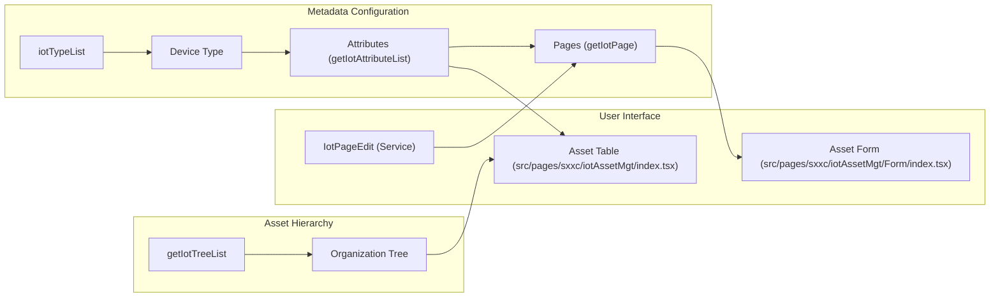
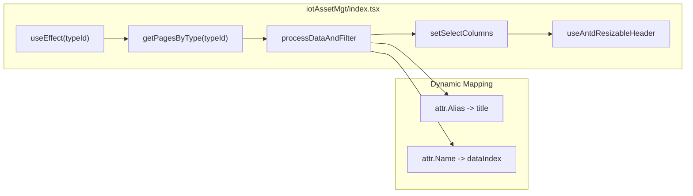

# IoT Asset Management
Relevant source files

- [src/pages/sxxc/iotAssetMgt/Accordion/accordionModal.tsx](https://github.com/thetide557/ln-server-pub/blob/629bd918/src/pages/sxxc/iotAssetMgt/Accordion/accordionModal.tsx)
- [src/pages/sxxc/iotAssetMgt/Accordion/index.less](https://github.com/thetide557/ln-server-pub/blob/629bd918/src/pages/sxxc/iotAssetMgt/Accordion/index.less)
- [src/pages/sxxc/iotAssetMgt/ColumnConfig/index.tsx](https://github.com/thetide557/ln-server-pub/blob/629bd918/src/pages/sxxc/iotAssetMgt/ColumnConfig/index.tsx)
- [src/pages/sxxc/iotAssetMgt/ColumnConfig/style.less](https://github.com/thetide557/ln-server-pub/blob/629bd918/src/pages/sxxc/iotAssetMgt/ColumnConfig/style.less)
- [src/pages/sxxc/iotAssetMgt/Form/index.tsx](https://github.com/thetide557/ln-server-pub/blob/629bd918/src/pages/sxxc/iotAssetMgt/Form/index.tsx)
- [src/pages/sxxc/iotAssetMgt/Form/style.less](https://github.com/thetide557/ln-server-pub/blob/629bd918/src/pages/sxxc/iotAssetMgt/Form/style.less)
- [src/pages/sxxc/iotAssetMgt/OperationModal.tsx](https://github.com/thetide557/ln-server-pub/blob/629bd918/src/pages/sxxc/iotAssetMgt/OperationModal.tsx)
- [src/pages/sxxc/iotAssetMgt/index.tsx](https://github.com/thetide557/ln-server-pub/blob/629bd918/src/pages/sxxc/iotAssetMgt/index.tsx)
- [src/pages/sxxc/iotAssetMgt/locale/en_US.ts](https://github.com/thetide557/ln-server-pub/blob/629bd918/src/pages/sxxc/iotAssetMgt/locale/en_US.ts)
- [src/pages/sxxc/iotAssetMgt/locale/index.ts](https://github.com/thetide557/ln-server-pub/blob/629bd918/src/pages/sxxc/iotAssetMgt/locale/index.ts)
- [src/pages/sxxc/iotAssetMgt/locale/zh_CN.ts](https://github.com/thetide557/ln-server-pub/blob/629bd918/src/pages/sxxc/iotAssetMgt/locale/zh_CN.ts)
- [src/pages/sxxc/iotAssetMgt/style.less](https://github.com/thetide557/ln-server-pub/blob/629bd918/src/pages/sxxc/iotAssetMgt/style.less)
- [src/services/sxxc/iotAssets.ts](https://github.com/thetide557/ln-server-pub/blob/629bd918/src/services/sxxc/iotAssets.ts)

The IoT Asset Management module provides a flexible, schema-driven approach to managing diverse hardware devices. Unlike traditional IT assets, IoT assets utilize a dynamic metadata system where device types determine the available data fields, organization hierarchy, and UI presentation.

## 1. System Architecture & Data Flow

The module is built on a dynamic schema architecture. Device types define "Attributes," which are then grouped into "Pages" for the user interface. This allows the platform to support everything from smart cameras to environmental sensors without code changes for new hardware types.

### Code Entity Mapping

| Natural Language Space | Code Entity Space | File Source |
| --- | --- | --- |
| Device Type | `typeId` / `iotTypeList` | [src/services/sxxc/iotAssets.ts#5-9](https://github.com/thetide557/ln-server-pub/blob/629bd918/src/services/sxxc/iotAssets.ts#L5-L9) |
| Dynamic Attribute | `FieldItem` / `Attributes` | [src/pages/sxxc/iotAssetMgt/ColumnConfig/index.tsx#25-34](https://github.com/thetide557/ln-server-pub/blob/629bd918/src/pages/sxxc/iotAssetMgt/ColumnConfig/index.tsx#L25-L34) |
| UI Page/Tab | `PageConfig` / `IotPage` | [src/pages/sxxc/iotAssetMgt/ColumnConfig/index.tsx#36-42](https://github.com/thetide557/ln-server-pub/blob/629bd918/src/pages/sxxc/iotAssetMgt/ColumnConfig/index.tsx#L36-L42) |
| Organization Tree | `iotTreeList` / `Depth` | [src/services/sxxc/iotAssets.ts#60-66](https://github.com/thetide557/ln-server-pub/blob/629bd918/src/services/sxxc/iotAssets.ts#L60-L66) |

### Data Flow Diagram

Title: IoT Asset Metadata and Configuration Flow

Note: the asset table's columns are driven directly by `getIotAttributeList` (called with `showDisplayed: true`) in `src/pages/sxxc/iotAssetMgt/index.tsx`, not by `getIotPage`/`IotPageEdit`'s Page grouping — `getIotPage` is only consumed by the Asset Form (for building tabs from `PageName`). The list page imports `getIotPage` but never calls it.

Sources: [src/services/sxxc/iotAssets.ts#5-89](https://github.com/thetide557/ln-server-pub/blob/629bd918/src/services/sxxc/iotAssets.ts#L5-L89)[src/pages/sxxc/iotAssetMgt/index.tsx#64-71](https://github.com/thetide557/ln-server-pub/blob/629bd918/src/pages/sxxc/iotAssetMgt/index.tsx#L64-L71)

## 2. Organization Tree Management

The system supports a hierarchical organization structure (up to 3 levels deep) managed via `AccordionModal`.

- Tree Structure: The tree is fetched via `getIotTreeList`[src/services/sxxc/iotAssets.ts#61-66](https://github.com/thetide557/ln-server-pub/blob/629bd918/src/services/sxxc/iotAssets.ts#L61-L66)
- Node Properties: Each node contains a `Name`, `Depth`, `ParentId`, and `TypeIds`[src/pages/sxxc/iotAssetMgt/Accordion/accordionModal.tsx#70-75](https://github.com/thetide557/ln-server-pub/blob/629bd918/src/pages/sxxc/iotAssetMgt/Accordion/accordionModal.tsx#L70-L75)
- Device Type Binding: Level 2 nodes (the third level, 0-indexed) are required to bind specific device types to the group [src/pages/sxxc/iotAssetMgt/Accordion/accordionModal.tsx#180-182](https://github.com/thetide557/ln-server-pub/blob/629bd918/src/pages/sxxc/iotAssetMgt/Accordion/accordionModal.tsx#L180-L182)
- CRUD Operations:

- Add/Edit: Handled by `addIotTree`[src/services/sxxc/iotAssets.ts#68-73](https://github.com/thetide557/ln-server-pub/blob/629bd918/src/services/sxxc/iotAssets.ts#L68-L73)
- Delete: Handled by `delIotTreeNode`[src/services/sxxc/iotAssets.ts#76-81](https://github.com/thetide557/ln-server-pub/blob/629bd918/src/services/sxxc/iotAssets.ts#L76-L81)

Sources: [src/pages/sxxc/iotAssetMgt/Accordion/accordionModal.tsx#14-165](https://github.com/thetide557/ln-server-pub/blob/629bd918/src/pages/sxxc/iotAssetMgt/Accordion/accordionModal.tsx#L14-L165)[src/services/sxxc/iotAssets.ts#60-81](https://github.com/thetide557/ln-server-pub/blob/629bd918/src/services/sxxc/iotAssets.ts#L60-L81)

## 3. Dynamic UI Configuration (ColumnConfig)

The `ColumnConfig` component allows administrators to define how asset data is displayed in both the list view and the detail forms.

### Page and Field Configuration

Users can create multiple tabs (Pages) for a device type. Each page contains a list of attributes.

- Display Order: Controls the sequence of columns in the main asset table [src/pages/sxxc/iotAssetMgt/ColumnConfig/index.tsx#204-227](https://github.com/thetide557/ln-server-pub/blob/629bd918/src/pages/sxxc/iotAssetMgt/ColumnConfig/index.tsx#L204-L227)
- Sort Order: Controls the sequence of fields within the asset detail form [src/pages/sxxc/iotAssetMgt/ColumnConfig/index.tsx#96-103](https://github.com/thetide557/ln-server-pub/blob/629bd918/src/pages/sxxc/iotAssetMgt/ColumnConfig/index.tsx#L96-L103)
- Persistence: Layout changes are saved via `IotPageEdit`[src/services/sxxc/iotAssets.ts#36-41](https://github.com/thetide557/ln-server-pub/blob/629bd918/src/services/sxxc/iotAssets.ts#L36-L41)

### Column Configuration Logic

Title: Column Rendering Logic in IotAssetMgt

Sources: [src/pages/sxxc/iotAssetMgt/index.tsx#209-231](https://github.com/thetide557/ln-server-pub/blob/629bd918/src/pages/sxxc/iotAssetMgt/index.tsx#L209-L231)[src/pages/sxxc/iotAssetMgt/ColumnConfig/index.tsx#91-123](https://github.com/thetide557/ln-server-pub/blob/629bd918/src/pages/sxxc/iotAssetMgt/ColumnConfig/index.tsx#L91-L123)

## 4. Asset Detail & Lifecycle

Asset viewing and editing are handled by a dynamic form generator in `src/pages/sxxc/iotAssetMgt/Form/index.tsx`.

- Dynamic Tabs: The form renders tabs based on the `PageName` defined in the configuration [src/pages/sxxc/iotAssetMgt/Form/index.tsx#183-192](https://github.com/thetide557/ln-server-pub/blob/629bd918/src/pages/sxxc/iotAssetMgt/Form/index.tsx#L183-L192)
- Field Rendering: The `renderFormItem` function switches between `Input`, `Select`, `Password`, and `Checkbox` based on the attribute's `type` property [src/pages/sxxc/iotAssetMgt/Form/index.tsx#137-162](https://github.com/thetide557/ln-server-pub/blob/629bd918/src/pages/sxxc/iotAssetMgt/Form/index.tsx#L137-L162)
- Data Loading: Asset details are fetched using a composite key (primaryKey + typeId) via `getIotDeviceDetail`[src/pages/sxxc/iotAssetMgt/Form/index.tsx#113-120](https://github.com/thetide557/ln-server-pub/blob/629bd918/src/pages/sxxc/iotAssetMgt/Form/index.tsx#L113-L120)

Sources: [src/pages/sxxc/iotAssetMgt/Form/index.tsx#87-105](https://github.com/thetide557/ln-server-pub/blob/629bd918/src/pages/sxxc/iotAssetMgt/Form/index.tsx#L87-L105)[src/pages/sxxc/iotAssetMgt/Form/index.tsx#137-162](https://github.com/thetide557/ln-server-pub/blob/629bd918/src/pages/sxxc/iotAssetMgt/Form/index.tsx#L137-L162)[src/services/sxxc/iotAssets.ts#53-58](https://github.com/thetide557/ln-server-pub/blob/629bd918/src/services/sxxc/iotAssets.ts#L53-L58)

## 5. Batch Operations & Service Layer

The `OperationModal` component implements handlers for a full set of bulk actions — bind/unbind tags, change org, delete, batch import, batch export — reusing service functions from the shared XH asset layer (`@/services/assets`). However, in the actual IoT asset list (`src/pages/sxxc/iotAssetMgt/index.tsx`), the batch-operations dropdown only wires up a single menu item, **导出设备 (Batch Export)**, which sets `operateType` to `OperateType.AssetBatchExport` [src/pages/sxxc/iotAssetMgt/index.tsx#818-846](https://github.com/thetide557/ln-server-pub/blob/629bd918/src/pages/sxxc/iotAssetMgt/index.tsx#L818-L846). No menu item in this list page ever sets `operateType` to `BindTag`, `UnbindTag`, `ChangeOrganize`, `Delete`, or `AssetBatchImport` — so although `OperationModal` still contains working code paths for them (below), these operations are currently unreachable from the IoT asset list UI.

Batch Export itself calls a dedicated IoT endpoint, `/api/takin/iot/device/export`, unlike Batch Import which (per the known XH-reuse issue) posts to the XH endpoint `/api/takin/xh/asset/import-xls` [src/pages/sxxc/iotAssetMgt/OperationModal.tsx#594-627](https://github.com/thetide557/ln-server-pub/blob/629bd918/src/pages/sxxc/iotAssetMgt/OperationModal.tsx#L594-L627).

### Key Operations (implemented in `OperationModal`, not all reachable from the IoT list UI)

| Operation | Service Function | Reachable from IoT list UI? | File Reference |
| --- | --- | --- | --- |
| Batch Export | inline export via `/api/takin/iot/device/export` | Yes | [src/pages/sxxc/iotAssetMgt/OperationModal.tsx#609-656](https://github.com/thetide557/ln-server-pub/blob/629bd918/src/pages/sxxc/iotAssetMgt/OperationModal.tsx#L609-L656) |
| Bind Tags | `bindTags` | No (dead path) | [src/pages/sxxc/iotAssetMgt/OperationModal.tsx#158](https://github.com/thetide557/ln-server-pub/blob/629bd918/src/pages/sxxc/iotAssetMgt/OperationModal.tsx#L158-L158) |
| Unbind Tags | `unbindTags` | No (dead path) | [src/pages/sxxc/iotAssetMgt/OperationModal.tsx#208](https://github.com/thetide557/ln-server-pub/blob/629bd918/src/pages/sxxc/iotAssetMgt/OperationModal.tsx#L208-L208) |
| Change Org | `changeAssetOrganization` | No (dead path) | [src/pages/sxxc/iotAssetMgt/OperationModal.tsx#26](https://github.com/thetide557/ln-server-pub/blob/629bd918/src/pages/sxxc/iotAssetMgt/OperationModal.tsx#L26-L26) |
| Delete Assets | `deleteXhAssets` | No (dead path) | [src/pages/sxxc/iotAssetMgt/OperationModal.tsx#21](https://github.com/thetide557/ln-server-pub/blob/629bd918/src/pages/sxxc/iotAssetMgt/OperationModal.tsx#L21-L21) |
| Batch Import | `importXhAssetSetData` (posts to XH's `/api/takin/xh/asset/import-xls`) | No (dead path) | [src/pages/sxxc/iotAssetMgt/OperationModal.tsx#594-608](https://github.com/thetide557/ln-server-pub/blob/629bd918/src/pages/sxxc/iotAssetMgt/OperationModal.tsx#L594-L608) |

### Service API Summary (`iotAssets.ts`)

- `getIotDeviceList`: Retrieves the paginated list of assets based on filters [src/services/sxxc/iotAssets.ts#45-50](https://github.com/thetide557/ln-server-pub/blob/629bd918/src/services/sxxc/iotAssets.ts#L45-L50)
- `getIotTypeList`: Fetches all registered device categories [src/services/sxxc/iotAssets.ts#5-9](https://github.com/thetide557/ln-server-pub/blob/629bd918/src/services/sxxc/iotAssets.ts#L5-L9)
- `addIotType` / `delIotType`: Manages the lifecycle of device definitions [src/services/sxxc/iotAssets.ts#12-17](https://github.com/thetide557/ln-server-pub/blob/629bd918/src/services/sxxc/iotAssets.ts#L12-L17)[src/services/sxxc/iotAssets.ts#84-89](https://github.com/thetide557/ln-server-pub/blob/629bd918/src/services/sxxc/iotAssets.ts#L84-L89)

Sources: [src/pages/sxxc/iotAssetMgt/OperationModal.tsx#19-30](https://github.com/thetide557/ln-server-pub/blob/629bd918/src/pages/sxxc/iotAssetMgt/OperationModal.tsx#L19-L30)[src/services/sxxc/iotAssets.ts#1-89](https://github.com/thetide557/ln-server-pub/blob/629bd918/src/services/sxxc/iotAssets.ts#L1-L89)