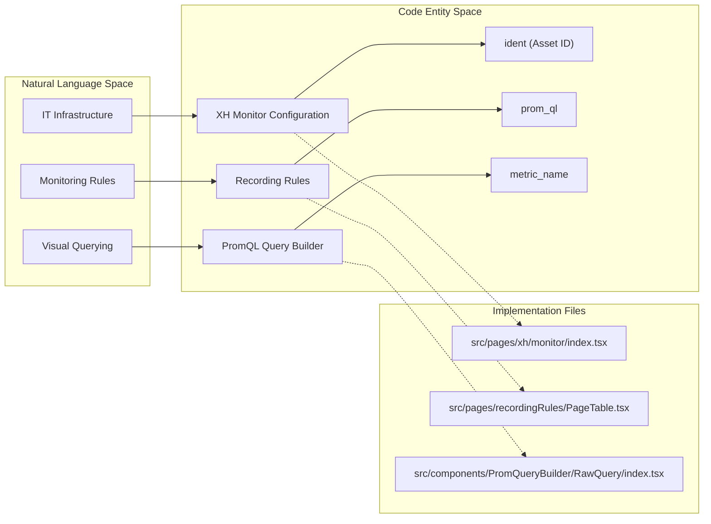
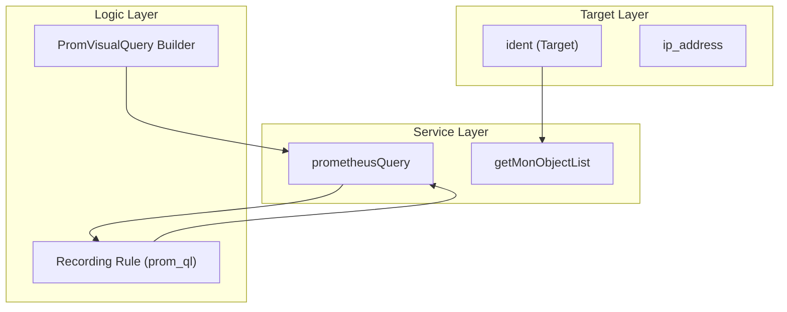

# Monitoring & Metrics
Relevant source files

- [public/image/login/logo.png](https://github.com/thetide557/ln-server-pub/blob/629bd918/public/image/login/logo.png)
- [public/image/login/logo_top1.png](https://github.com/thetide557/ln-server-pub/blob/629bd918/public/image/login/logo_top1.png)
- [src/components/PromQueryBuilder/RawQuery/index.tsx](https://github.com/thetide557/ln-server-pub/blob/629bd918/src/components/PromQueryBuilder/RawQuery/index.tsx)
- [src/components/PromQueryBuilder/utils/buildPromVisualQueryFromPromQL.ts](https://github.com/thetide557/ln-server-pub/blob/629bd918/src/components/PromQueryBuilder/utils/buildPromVisualQueryFromPromQL.ts)
- [src/components/menu/topMenu.less](https://github.com/thetide557/ln-server-pub/blob/629bd918/src/components/menu/topMenu.less)
- [src/pages/explorer/Prometheus/index.tsx](https://github.com/thetide557/ln-server-pub/blob/629bd918/src/pages/explorer/Prometheus/index.tsx)
- [src/pages/recordingRules/PageTable.tsx](https://github.com/thetide557/ln-server-pub/blob/629bd918/src/pages/recordingRules/PageTable.tsx)
- [src/pages/recordingRules/components/editModal.tsx](https://github.com/thetide557/ln-server-pub/blob/629bd918/src/pages/recordingRules/components/editModal.tsx)
- [src/pages/recordingRules/components/operateForm.tsx](https://github.com/thetide557/ln-server-pub/blob/629bd918/src/pages/recordingRules/components/operateForm.tsx)
- [src/pages/targets/List.tsx](https://github.com/thetide557/ln-server-pub/blob/629bd918/src/pages/targets/List.tsx)
- [src/pages/user/component/userForm/index.tsx](https://github.com/thetide557/ln-server-pub/blob/629bd918/src/pages/user/component/userForm/index.tsx)
- [src/pages/user/users.tsx](https://github.com/thetide557/ln-server-pub/blob/629bd918/src/pages/user/users.tsx)
- [src/pages/xh/assetmgt/Accordion/accordionModal.tsx](https://github.com/thetide557/ln-server-pub/blob/629bd918/src/pages/xh/assetmgt/Accordion/accordionModal.tsx)
- [src/pages/xh/assetmgt/index.tsx](https://github.com/thetide557/ln-server-pub/blob/629bd918/src/pages/xh/assetmgt/index.tsx)
- [src/pages/xh/assetmgt/style.less](https://github.com/thetide557/ln-server-pub/blob/629bd918/src/pages/xh/assetmgt/style.less)
- [src/pages/xh/monitor/index.tsx](https://github.com/thetide557/ln-server-pub/blob/629bd918/src/pages/xh/monitor/index.tsx)
- [src/pages/xh/monitor/style.less](https://github.com/thetide557/ln-server-pub/blob/629bd918/src/pages/xh/monitor/style.less)
- [src/services/menu.ts](https://github.com/thetide557/ln-server-pub/blob/629bd918/src/services/menu.ts)

The Monitoring & Metrics layer provides the infrastructure for observing IT assets, executing PromQL queries, and defining computed recording rules. It bridges the gap between raw infrastructure assets (XH) and the Prometheus-based telemetry data used for alerting and visualization.

## Overview of the Monitoring Stack

The platform utilizes a multi-tiered monitoring approach:

1. Asset-Linked Monitoring: Individual XH assets are associated with specific monitoring scripts and Prometheus metrics.
2. Telemetry Discovery: A visual Metric Explorer and PromQL builder allow engineers to explore available time-series data without writing complex queries manually.
3. Data Enrichment: Recording rules compute new metrics from raw data, optimizing performance for dashboards and alerts.
4. Target Management: Monitoring targets (probes) are tracked by their identity (`ident`) and assigned to business groups for scoped observability.

Sources:[src/pages/xh/monitor/index.tsx#1-56](https://github.com/thetide557/ln-server-pub/blob/629bd918/src/pages/xh/monitor/index.tsx#L1-L56)[src/pages/recordingRules/PageTable.tsx#101-190](https://github.com/thetide557/ln-server-pub/blob/629bd918/src/pages/recordingRules/PageTable.tsx#L101-L190)[src/components/PromQueryBuilder/RawQuery/index.tsx#68-87](https://github.com/thetide557/ln-server-pub/blob/629bd918/src/components/PromQueryBuilder/RawQuery/index.tsx#L68-L87)

---

## XH Monitor Configuration

The XH Monitor module manages the operational status of monitoring for IT assets. It allows administrators to enable or disable monitoring at the asset level, view real-time metric graphs, and perform bulk operations like batch monitoring activation.

- Monitor Lifecycle: Controls whether an asset is actively scraped or ignored via `TurnOnMonitoring` and `DisableMonitoring` states [src/pages/xh/monitor/index.tsx#54-55](https://github.com/thetide557/ln-server-pub/blob/629bd918/src/pages/xh/monitor/index.tsx#L54-L55)
- Organization Tree: Assets are grouped into a hierarchy (`monitortree`, fetched via `getMonitortree`) used to browse and filter the monitor list by business group and asset type; it is a navigation/filtering aid rather than a mechanism for inheriting monitoring configuration between parent and child nodes [src/pages/xh/monitor/index.tsx#31](https://github.com/thetide557/ln-server-pub/blob/629bd918/src/pages/xh/monitor/index.tsx#L31-L31)
- Asset Association: Links physical assets to monitoring metrics using the `ident` field as a unique key.

For details on managing monitor scripts and unit types, see [XH Monitor Configuration](/org/benjamin-braddock/wiki/thetide557/ln-server-pub/page/4.1?branch=v2.1).

Sources:[src/pages/xh/monitor/index.tsx#31-56](https://github.com/thetide557/ln-server-pub/blob/629bd918/src/pages/xh/monitor/index.tsx#L31-L56)[src/pages/xh/monitor/index.tsx#89-110](https://github.com/thetide557/ln-server-pub/blob/629bd918/src/pages/xh/monitor/index.tsx#L89-L110)

---

## PromQL Query Builder & Metric Explorer

The platform provides a visual interface for constructing Prometheus Query Language (PromQL) expressions. This allows users to build complex queries through dropdowns and label filters rather than manual syntax.

- Visual Construction: The `PromVisualQuery` structure handles metrics, label filters (e.g., `host="server-01"`), and operations (e.g., `rate`, `sum`) [src/components/PromQueryBuilder/RawQuery/index.tsx#4-15](https://github.com/thetide557/ln-server-pub/blob/629bd918/src/components/PromQueryBuilder/RawQuery/index.tsx#L4-L15)
- Binary Operations: Supports complex math between queries (e.g., `A / B`) with vector matching [src/components/PromQueryBuilder/RawQuery/index.tsx#39-46](https://github.com/thetide557/ln-server-pub/blob/629bd918/src/components/PromQueryBuilder/RawQuery/index.tsx#L39-L46)
- Serialization: The `renderQuery` function converts visual selections into standard PromQL strings [src/components/PromQueryBuilder/RawQuery/index.tsx#68-87](https://github.com/thetide557/ln-server-pub/blob/629bd918/src/components/PromQueryBuilder/RawQuery/index.tsx#L68-L87)

For details on the visual builder and the Chinese metric translation dictionary, see [PromQL Query Builder & Metric Explorer](/org/benjamin-braddock/wiki/thetide557/ln-server-pub/page/4.2?branch=v2.1).

Sources:[src/components/PromQueryBuilder/RawQuery/index.tsx#48-66](https://github.com/thetide557/ln-server-pub/blob/629bd918/src/components/PromQueryBuilder/RawQuery/index.tsx#L48-L66)[src/components/PromQueryBuilder/RawQuery/index.tsx#68-87](https://github.com/thetide557/ln-server-pub/blob/629bd918/src/components/PromQueryBuilder/RawQuery/index.tsx#L68-L87)

---

## Recording Rules & Monitoring Targets

Recording rules allow the system to pre-calculate frequently needed or computationally expensive PromQL expressions and save the result as a new set of time series.

- Rule Management: Defined via `PageTable.tsx`, these rules include evaluation intervals and append tags for better categorization [src/pages/recordingRules/PageTable.tsx#137-158](https://github.com/thetide557/ln-server-pub/blob/629bd918/src/pages/recordingRules/PageTable.tsx#L137-L158)
- Monitoring Targets: Managed in the `targets/List.tsx` component, targets represent the actual instances being monitored (e.g., host machines, containers). They are identified by a unique `ident`[src/pages/targets/List.tsx#39](https://github.com/thetide557/ln-server-pub/blob/629bd918/src/pages/targets/List.tsx#L39-L39)
- Target Metadata: Includes IP addresses, probe versions, and business group assignments [src/pages/targets/List.tsx#77-82](https://github.com/thetide557/ln-server-pub/blob/629bd918/src/pages/targets/List.tsx#L77-L82)

For details on rule creation and target utilization coloring, see [Recording Rules & Monitoring Targets](/org/benjamin-braddock/wiki/thetide557/ln-server-pub/page/4.3?branch=v2.1).

Sources:[src/pages/recordingRules/PageTable.tsx#101-164](https://github.com/thetide557/ln-server-pub/blob/629bd918/src/pages/recordingRules/PageTable.tsx#L101-L164)[src/pages/targets/List.tsx#34-55](https://github.com/thetide557/ln-server-pub/blob/629bd918/src/pages/targets/List.tsx#L34-L55)[src/pages/targets/List.tsx#92-165](https://github.com/thetide557/ln-server-pub/blob/629bd918/src/pages/targets/List.tsx#L92-L165)

---

## Data Relationship Diagram

The following diagram illustrates how monitoring targets, recording rules, and visual queries interact within the system architecture.

Sources:[src/pages/targets/List.tsx#10](https://github.com/thetide557/ln-server-pub/blob/629bd918/src/pages/targets/List.tsx#L10-L10)[src/pages/recordingRules/components/operateForm.tsx#6-7](https://github.com/thetide557/ln-server-pub/blob/629bd918/src/pages/recordingRules/components/operateForm.tsx#L6-L7)[src/components/PromQueryBuilder/RawQuery/index.tsx#89-97](https://github.com/thetide557/ln-server-pub/blob/629bd918/src/components/PromQueryBuilder/RawQuery/index.tsx#L89-L97)

## Sub-Pages

- [XH Monitor Configuration](/org/benjamin-braddock/wiki/thetide557/ln-server-pub/page/4.1?branch=v2.1)
- [PromQL Query Builder & Metric Explorer](/org/benjamin-braddock/wiki/thetide557/ln-server-pub/page/4.2?branch=v2.1)
- [Recording Rules & Monitoring Targets](/org/benjamin-braddock/wiki/thetide557/ln-server-pub/page/4.3?branch=v2.1)