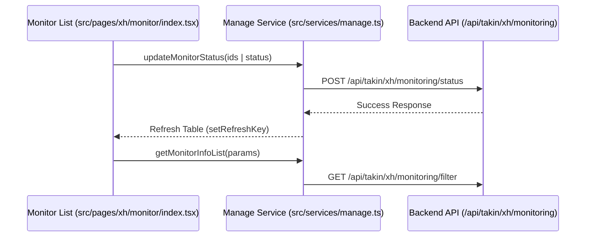
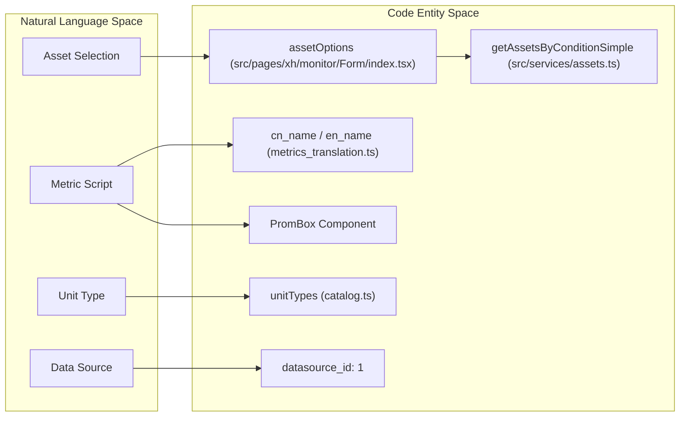

# XH Monitor Configuration
Relevant source files

- [src/pages/alertRules/index.tsx](https://github.com/thetide557/ln-server-pub/blob/629bd918/src/pages/alertRules/index.tsx)
- [src/pages/explorer/Metric.tsx](https://github.com/thetide557/ln-server-pub/blob/629bd918/src/pages/explorer/Metric.tsx)
- [src/pages/xh/assetmgt/Accordion/accordionModal.tsx](https://github.com/thetide557/ln-server-pub/blob/629bd918/src/pages/xh/assetmgt/Accordion/accordionModal.tsx)
- [src/pages/xh/assetmgt/Add.tsx](https://github.com/thetide557/ln-server-pub/blob/629bd918/src/pages/xh/assetmgt/Add.tsx)
- [src/pages/xh/assetmgt/Form/index.tsx](https://github.com/thetide557/ln-server-pub/blob/629bd918/src/pages/xh/assetmgt/Form/index.tsx)
- [src/pages/xh/assetmgt/Form/style.less](https://github.com/thetide557/ln-server-pub/blob/629bd918/src/pages/xh/assetmgt/Form/style.less)
- [src/pages/xh/assetmgt/index.tsx](https://github.com/thetide557/ln-server-pub/blob/629bd918/src/pages/xh/assetmgt/index.tsx)
- [src/pages/xh/assetmgt/style.less](https://github.com/thetide557/ln-server-pub/blob/629bd918/src/pages/xh/assetmgt/style.less)
- [src/pages/xh/monitor/Accordion/accordionModal.tsx](https://github.com/thetide557/ln-server-pub/blob/629bd918/src/pages/xh/monitor/Accordion/accordionModal.tsx)
- [src/pages/xh/monitor/Accordion/catalog.tsx](https://github.com/thetide557/ln-server-pub/blob/629bd918/src/pages/xh/monitor/Accordion/catalog.tsx)
- [src/pages/xh/monitor/Accordion/index.jsx](https://github.com/thetide557/ln-server-pub/blob/629bd918/src/pages/xh/monitor/Accordion/index.jsx)
- [src/pages/xh/monitor/Accordion/index.less](https://github.com/thetide557/ln-server-pub/blob/629bd918/src/pages/xh/monitor/Accordion/index.less)
- [src/pages/xh/monitor/Accordion/style.less](https://github.com/thetide557/ln-server-pub/blob/629bd918/src/pages/xh/monitor/Accordion/style.less)
- [src/pages/xh/monitor/Add.tsx](https://github.com/thetide557/ln-server-pub/blob/629bd918/src/pages/xh/monitor/Add.tsx)
- [src/pages/xh/monitor/Form/index.tsx](https://github.com/thetide557/ln-server-pub/blob/629bd918/src/pages/xh/monitor/Form/index.tsx)
- [src/pages/xh/monitor/index.tsx](https://github.com/thetide557/ln-server-pub/blob/629bd918/src/pages/xh/monitor/index.tsx)
- [src/pages/xh/monitor/style.less](https://github.com/thetide557/ln-server-pub/blob/629bd918/src/pages/xh/monitor/style.less)
- [src/services/assets.ts](https://github.com/thetide557/ln-server-pub/blob/629bd918/src/services/assets.ts)
- [src/utils/day.js](https://github.com/thetide557/ln-server-pub/blob/629bd918/src/utils/day.js)

The XH Monitor module facilitates the linking of IT infrastructure assets to Prometheus monitoring metrics. It provides a structured interface for defining monitoring scripts (PromQL), managing the lifecycle of monitor targets (enable/disable), and performing bulk operations across assets within the organization hierarchy.

## 1. Monitor Lifecycle & Operations

The monitor configuration system manages the state of monitoring for individual assets. Monitors are primarily associated with assets via an `asset_id` and categorized by asset types (e.g., Host, Network Device).

### Data Flow: Monitor Management

The following diagram illustrates the interaction between the Monitor List view, the service layer, and the backend API for status management.

Monitor Status Management Flow

### Key Functions and Operations

- Status Control: The `updateMonitorStatus` function toggles the monitoring state between enabled and disabled [src/services/manage.ts#32](https://github.com/thetide557/ln-server-pub/blob/629bd918/src/services/manage.ts#L32-L32)
- Bulk Operations: The `OperateType` enum defines supported batch actions, including `TurnOnMonitoring`, `DisableMonitoring`, and `Delete`[src/pages/xh/monitor/index.tsx#51-56](https://github.com/thetide557/ln-server-pub/blob/629bd918/src/pages/xh/monitor/index.tsx#L51-L56)
- Deletion: Individual monitors are removed via `deleteXhMonitor`, while multiple monitors use `deleteXhBatchMonitor`[src/services/manage.ts#32](https://github.com/thetide557/ln-server-pub/blob/629bd918/src/services/manage.ts#L32-L32)

Sources:

- [src/pages/xh/monitor/index.tsx#43-62](https://github.com/thetide557/ln-server-pub/blob/629bd918/src/pages/xh/monitor/index.tsx#L43-L62)
- [src/services/manage.ts#31-33](https://github.com/thetide557/ln-server-pub/blob/629bd918/src/services/manage.ts#L31-L33)
- [src/services/assets.ts#31-33](https://github.com/thetide557/ln-server-pub/blob/629bd918/src/services/assets.ts#L31-L33)

---

## 2. Monitor Configuration Form

The Monitor Form is the central entity for creating or editing a monitor target. It bridges the gap between an asset's physical identity (IP, Name) and its monitoring logic (PromQL).

### Form Components

- Asset Association: Users select an asset from `assetOptions` which are populated by `getAssetsByConditionSimple`[src/pages/xh/monitor/Form/index.tsx#101-119](https://github.com/thetide557/ln-server-pub/blob/629bd918/src/pages/xh/monitor/Form/index.tsx#L101-L119)
- Metric Selection: The `scriptOptions` are generated from a dictionary of translated metric names (`cn_name` and `en_name`) [src/pages/xh/monitor/Form/index.tsx#60-80](https://github.com/thetide557/ln-server-pub/blob/629bd918/src/pages/xh/monitor/Form/index.tsx#L60-L80)
- PromBox: A specialized component for inputting PromQL queries, integrated into the form via `PromBox`[src/pages/xh/monitor/Form/index.tsx#9](https://github.com/thetide557/ln-server-pub/blob/629bd918/src/pages/xh/monitor/Form/index.tsx#L9-L9)
- Unit Types: Supports various measurement units (e.g., percentage, bytes, time) imported from the `unitTypes` catalog [src/pages/xh/monitor/Form/index.tsx#14](https://github.com/thetide557/ln-server-pub/blob/629bd918/src/pages/xh/monitor/Form/index.tsx#L14-L14)

### Code Entity Mapping: Form Logic

This diagram maps the UI fields to the underlying code entities and service calls.

Form Entity Mapping

Sources:

- [src/pages/xh/monitor/Form/index.tsx#56-157](https://github.com/thetide557/ln-server-pub/blob/629bd918/src/pages/xh/monitor/Form/index.tsx#L56-L157)
- [src/pages/xh/monitor/Form/index.tsx#164-189](https://github.com/thetide557/ln-server-pub/blob/629bd918/src/pages/xh/monitor/Form/index.tsx#L164-L189)
- [src/services/assets.ts#36-41](https://github.com/thetide557/ln-server-pub/blob/629bd918/src/services/assets.ts#L36-L41)

---

## 3. Organization and Filtering

Monitors are organized using a tree structure that reflects the IT asset hierarchy. This allows administrators to filter monitoring targets by business groups or asset categories.

### Tree and Filter Logic

- Monitor Tree: The tree is populated solely via `getMonitortree`; `getAssetDirectoryTree` is also imported in this file but is not called to build the tree (unused import)[src/pages/xh/monitor/index.tsx#31](https://github.com/thetide557/ln-server-pub/blob/629bd918/src/pages/xh/monitor/index.tsx#L31-L31)
- Expansion Logic: The `getMonitorTreeExpandIdsForSelection` function calculates which nodes to expand based on the current selection (`parId` or `tissueId`) [src/pages/xh/monitor/index.tsx#90-110](https://github.com/thetide557/ln-server-pub/blob/629bd918/src/pages/xh/monitor/index.tsx#L90-L110)
- Search and Filter: The `queryFilter` defines the searchable fields in the monitor list: `monitoring_name`, `name` (asset name), `status`, and `ip`[src/pages/xh/monitor/index.tsx#57-62](https://github.com/thetide557/ln-server-pub/blob/629bd918/src/pages/xh/monitor/index.tsx#L57-L62)

### Accordion & Grouping

The `AccordionModal` is used to manage monitor groups, allowing users to define which asset types belong to specific organizational folders [src/pages/xh/assetmgt/Accordion/accordionModal.tsx#9-30](https://github.com/thetide557/ln-server-pub/blob/629bd918/src/pages/xh/assetmgt/Accordion/accordionModal.tsx#L9-L30) It utilizes `addXhAssetstypesNew` and `editXhAssetstypesNew` to persist group changes [src/pages/xh/assetmgt/Accordion/accordionModal.tsx#42-56](https://github.com/thetide557/ln-server-pub/blob/629bd918/src/pages/xh/assetmgt/Accordion/accordionModal.tsx#L42-L56)

Sources:

- [src/pages/xh/monitor/index.tsx#65-110](https://github.com/thetide557/ln-server-pub/blob/629bd918/src/pages/xh/monitor/index.tsx#L65-L110)
- [src/pages/xh/assetmgt/Accordion/accordionModal.tsx#32-61](https://github.com/thetide557/ln-server-pub/blob/629bd918/src/pages/xh/assetmgt/Accordion/accordionModal.tsx#L32-L61)
- [src/services/assets.ts#257-261](https://github.com/thetide557/ln-server-pub/blob/629bd918/src/services/assets.ts#L257-L261)

---

## 4. Integration with Alerting and Explorer

The monitor configuration acts as a springboard for other monitoring functions.

| Feature | Code Reference | Description |
| --- | --- | --- |
| Alert Rules | `src/pages/alertRules/index.tsx` | Monitors link to the Alert Rules page filtered to that asset's existing rules (`asset_id` passed via query string); only if the user then clicks "添加" from that filtered view is a new rule pre-filled with the `asset_id` [src/pages/alertRules/index.tsx#41-47](https://github.com/thetide557/ln-server-pub/blob/629bd918/src/pages/alertRules/index.tsx#L41-L47) |
| Metric Explorer | `src/pages/explorer/Metric.tsx` | Clicking a metric in the monitor list navigates to the Explorer with a pre-filled `prom_ql`[src/pages/explorer/Metric.tsx#31-36](https://github.com/thetide557/ln-server-pub/blob/629bd918/src/pages/explorer/Metric.tsx#L31-L36) |
| Data Visualization | `getAssetsMonitor` | Fetches time-series data for monitors based on `start_at`, `end_at`, and `monitorids`[src/services/assets.ts#149-161](https://github.com/thetide557/ln-server-pub/blob/629bd918/src/services/assets.ts#L149-L161) |

Sources:

- [src/pages/alertRules/index.tsx#35-55](https://github.com/thetide557/ln-server-pub/blob/629bd918/src/pages/alertRules/index.tsx#L35-L55)
- [src/pages/explorer/Metric.tsx#27-49](https://github.com/thetide557/ln-server-pub/blob/629bd918/src/pages/explorer/Metric.tsx#L27-L49)
- [src/services/assets.ts#149-161](https://github.com/thetide557/ln-server-pub/blob/629bd918/src/services/assets.ts#L149-L161)