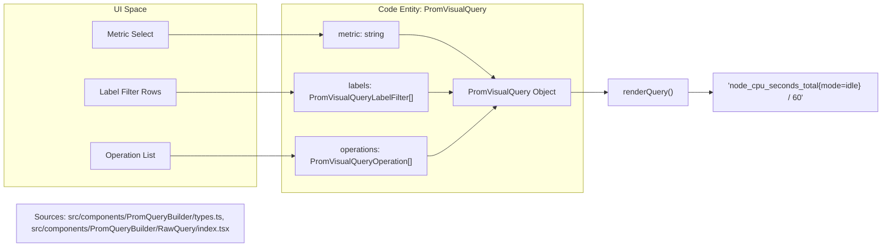
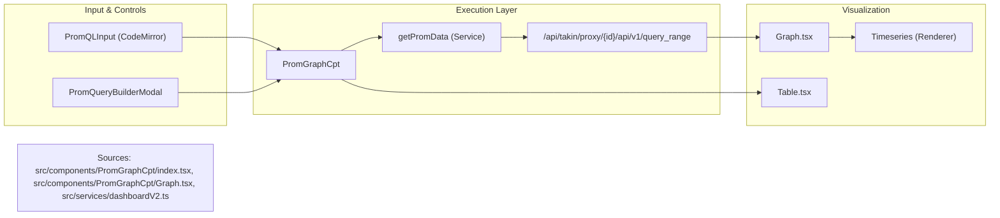

# PromQL Query Builder & Metric Explorer
Relevant source files

- [public/image/login/logo.png](https://github.com/thetide557/ln-server-pub/blob/629bd918/public/image/login/logo.png)
- [public/image/login/logo_top1.png](https://github.com/thetide557/ln-server-pub/blob/629bd918/public/image/login/logo_top1.png)
- [src/components/PromGraphCpt/Graph.tsx](https://github.com/thetide557/ln-server-pub/blob/629bd918/src/components/PromGraphCpt/Graph.tsx)
- [src/components/PromGraphCpt/index.tsx](https://github.com/thetide557/ln-server-pub/blob/629bd918/src/components/PromGraphCpt/index.tsx)
- [src/components/PromQLInput/index.tsx](https://github.com/thetide557/ln-server-pub/blob/629bd918/src/components/PromQLInput/index.tsx)
- [src/components/PromQueryBuilder/LabelFilters/index.tsx](https://github.com/thetide557/ln-server-pub/blob/629bd918/src/components/PromQueryBuilder/LabelFilters/index.tsx)
- [src/components/PromQueryBuilder/MetricSelect/index.tsx](https://github.com/thetide557/ln-server-pub/blob/629bd918/src/components/PromQueryBuilder/MetricSelect/index.tsx)
- [src/components/PromQueryBuilder/Operations/index.tsx](https://github.com/thetide557/ln-server-pub/blob/629bd918/src/components/PromQueryBuilder/Operations/index.tsx)
- [src/components/PromQueryBuilder/Operations/utils/createAggregationOperation.ts](https://github.com/thetide557/ln-server-pub/blob/629bd918/src/components/PromQueryBuilder/Operations/utils/createAggregationOperation.ts)
- [src/components/PromQueryBuilder/Operations/utils/createFunction.ts](https://github.com/thetide557/ln-server-pub/blob/629bd918/src/components/PromQueryBuilder/Operations/utils/createFunction.ts)
- [src/components/PromQueryBuilder/Operations/utils/createRangeFunction.ts](https://github.com/thetide557/ln-server-pub/blob/629bd918/src/components/PromQueryBuilder/Operations/utils/createRangeFunction.ts)
- [src/components/PromQueryBuilder/Operations/utils/index.ts](https://github.com/thetide557/ln-server-pub/blob/629bd918/src/components/PromQueryBuilder/Operations/utils/index.ts)
- [src/components/PromQueryBuilder/PromQueryBuilderModal.tsx](https://github.com/thetide557/ln-server-pub/blob/629bd918/src/components/PromQueryBuilder/PromQueryBuilderModal.tsx)
- [src/components/PromQueryBuilder/RawQuery/index.tsx](https://github.com/thetide557/ln-server-pub/blob/629bd918/src/components/PromQueryBuilder/RawQuery/index.tsx)
- [src/components/PromQueryBuilder/types.ts](https://github.com/thetide557/ln-server-pub/blob/629bd918/src/components/PromQueryBuilder/types.ts)
- [src/components/PromQueryBuilder/utils/buildPromVisualQueryFromPromQL.ts](https://github.com/thetide557/ln-server-pub/blob/629bd918/src/components/PromQueryBuilder/utils/buildPromVisualQueryFromPromQL.ts)
- [src/pages/account/info.tsx](https://github.com/thetide557/ln-server-pub/blob/629bd918/src/pages/account/info.tsx)
- [src/pages/explorer/Prometheus/index.tsx](https://github.com/thetide557/ln-server-pub/blob/629bd918/src/pages/explorer/Prometheus/index.tsx)
- [src/pages/system/logo_set.tsx](https://github.com/thetide557/ln-server-pub/blob/629bd918/src/pages/system/logo_set.tsx)
- [src/pages/taskTpl/index.tsx](https://github.com/thetide557/ln-server-pub/blob/629bd918/src/pages/taskTpl/index.tsx)
- [src/pages/warning/shield/components/tagItem.tsx](https://github.com/thetide557/ln-server-pub/blob/629bd918/src/pages/warning/shield/components/tagItem.tsx)
- [src/pages/warning/subscribe/components/BusiGroupsTagItem.tsx](https://github.com/thetide557/ln-server-pub/blob/629bd918/src/pages/warning/subscribe/components/BusiGroupsTagItem.tsx)
- [src/pages/warning/subscribe/components/tagItem.tsx](https://github.com/thetide557/ln-server-pub/blob/629bd918/src/pages/warning/subscribe/components/tagItem.tsx)
- [src/services/dashboardV2.ts](https://github.com/thetide557/ln-server-pub/blob/629bd918/src/services/dashboardV2.ts)

The platform provides a sophisticated visual interface for interacting with Prometheus data, bridging the gap between raw PromQL syntax and a guided, UI-driven query experience. This module encompasses the visual query builder, a metrics explorer for discovering available time series, and a translation layer to provide human-readable Chinese descriptions for technical metric names.

## Visual PromQL Query Builder

The PromQL Query Builder allows users to construct complex queries without deep knowledge of PromQL syntax. It translates UI selections (metrics, label filters, and operations) into a valid PromQL string via a structured internal representation.

### Data Structures & Types

The builder operates on the `PromVisualQuery` interface, which decomposes a query into its functional components:

- Metric: The root metric name [src/components/PromQueryBuilder/types.ts#34](https://github.com/thetide557/ln-server-pub/blob/629bd918/src/components/PromQueryBuilder/types.ts#L34-L34)
- Labels: An array of `PromVisualQueryLabelFilter` objects containing the label key, operator (e.g., `=`, `!=`, `=~`), and value [src/components/PromQueryBuilder/types.ts#15-19](https://github.com/thetide557/ln-server-pub/blob/629bd918/src/components/PromQueryBuilder/types.ts#L15-L19)
- Operations: A list of functions or aggregations applied to the vector [src/components/PromQueryBuilder/types.ts#24-27](https://github.com/thetide557/ln-server-pub/blob/629bd918/src/components/PromQueryBuilder/types.ts#L24-L27)
- Binary Queries: Support for mathematical operations between two queries [src/components/PromQueryBuilder/types.ts#8-13](https://github.com/thetide557/ln-server-pub/blob/629bd918/src/components/PromQueryBuilder/types.ts#L8-L13)

### Query Serialization (Rendering)

The `renderQuery` function in `src/components/PromQueryBuilder/RawQuery/index.tsx` is responsible for converting the visual state into a string:

1. Labels: `renderLabels` iterates through the filter array to produce the `{key="value"}` block [src/components/PromQueryBuilder/RawQuery/index.tsx#48-66](https://github.com/thetide557/ln-server-pub/blob/629bd918/src/components/PromQueryBuilder/RawQuery/index.tsx#L48-L66)
2. Operations: `renderOperations` applies the specific renderer for each operation (e.g., `rate()`, `sum()`) in the order they were added [src/components/PromQueryBuilder/RawQuery/index.tsx#17-28](https://github.com/thetide557/ln-server-pub/blob/629bd918/src/components/PromQueryBuilder/RawQuery/index.tsx#L17-L28)
3. Binary Logic: Handles nested queries and binary operators, adding parentheses where necessary to maintain operator precedence [src/components/PromQueryBuilder/RawQuery/index.tsx#30-46](https://github.com/thetide557/ln-server-pub/blob/629bd918/src/components/PromQueryBuilder/RawQuery/index.tsx#L30-L46)

### Query Deserialization (Parsing)

To support loading existing PromQL strings into the builder, the `buildPromVisualQueryFromPromQL` function uses the `lezer-promql` parser to walk the Abstract Syntax Tree (AST) and populate the `PromVisualQuery` object [src/components/PromQueryBuilder/utils/buildPromVisualQueryFromPromQL.ts#44-76](https://github.com/thetide557/ln-server-pub/blob/629bd918/src/components/PromQueryBuilder/utils/buildPromVisualQueryFromPromQL.ts#L44-L76)

### Visual to Code Mapping: Query Construction

This diagram illustrates how UI components map to the `PromVisualQuery` entity and the final string output.

## Metric Explorer & Translation

The Metric Explorer provides a searchable interface for all metrics available in the selected Prometheus datasource.

### Metric Selection & Translation

The `MetricSelect` component uses the `getMetric` service to fetch available metric names [src/components/PromQueryBuilder/MetricSelect/index.tsx#25-29](https://github.com/thetide557/ln-server-pub/blob/629bd918/src/components/PromQueryBuilder/MetricSelect/index.tsx#L25-L29) It enhances the display using `metrics_translation.ts`, which contains a dictionary mapping technical metric names to Chinese descriptions.

- Data Fetching: Calls `/api/takin/proxy/{datasourceValue}/api/v1/label/__name__/values`[src/services/dashboardV2.ts#218-225](https://github.com/thetide557/ln-server-pub/blob/629bd918/src/services/dashboardV2.ts#L218-L225)
- UI Enhancement: The `AutoComplete` options are enriched with labels from `cn_name` or `en_name` to show both the raw metric and its human-readable description [src/components/PromQueryBuilder/MetricSelect/index.tsx#57-79](https://github.com/thetide557/ln-server-pub/blob/629bd918/src/components/PromQueryBuilder/MetricSelect/index.tsx#L57-L79)
- Description Display: A dedicated `keydes` state updates whenever a metric is selected, displaying the "Metric Keyword Explanation" (指标关键词说明) below the input [src/components/PromQueryBuilder/MetricSelect/index.tsx#31-45](https://github.com/thetide557/ln-server-pub/blob/629bd918/src/components/PromQueryBuilder/MetricSelect/index.tsx#L31-L45)

### Translation Logic

The translation is handled by two dictionaries: `cn_name` and `en_name`[src/components/PromGraphCpt/index.tsx#34](https://github.com/thetide557/ln-server-pub/blob/629bd918/src/components/PromGraphCpt/index.tsx#L34-L34) When a user types or selects a metric, the system performs a lookup to provide immediate context [src/components/PromGraphCpt/index.tsx#108-122](https://github.com/thetide557/ln-server-pub/blob/629bd918/src/components/PromGraphCpt/index.tsx#L108-L122)

## Metric Graphing Component (`PromGraphCpt`)

The `PromGraphCpt` is the primary container for Prometheus data visualization, supporting both Table and Graph views.

### Execution Flow

1. Input: Users enter a query via `PromQLInput` (a CodeMirror-based editor) or use the `PromQueryBuilderModal`[src/components/PromGraphCpt/index.tsx#174-218](https://github.com/thetide557/ln-server-pub/blob/629bd918/src/components/PromGraphCpt/index.tsx#L174-L218)
2. Datasource Proxy: Requests are routed through the `/api/takin/proxy` endpoint to avoid CORS issues and inject authentication [src/components/PromQLInput/index.tsx#57-107](https://github.com/thetide557/ln-server-pub/blob/629bd918/src/components/PromQLInput/index.tsx#L57-L107)
3. Graph Rendering: The `Graph.tsx` component fetches data using `getPromData` and processes it into series for the `Timeseries` renderer [src/components/PromGraphCpt/Graph.tsx#107-147](https://github.com/thetide557/ln-server-pub/blob/629bd918/src/components/PromGraphCpt/Graph.tsx#L107-L147)
4. Time Handling: Supports relative (e.g., `now-1h`) and absolute time ranges, parsed via `parseRange`[src/components/PromGraphCpt/Graph.tsx#110-112](https://github.com/thetide557/ln-server-pub/blob/629bd918/src/components/PromGraphCpt/Graph.tsx#L110-L112)

### Code Entity Relationship: Monitoring Pipeline

## Operation Definitions

Operations (functions and aggregations) are categorized to help users find relevant transformations:

- Aggregations: `sum`, `avg`, `min`, `max`, etc. [src/components/PromQueryBuilder/types.ts#2](https://github.com/thetide557/ln-server-pub/blob/629bd918/src/components/PromQueryBuilder/types.ts#L2-L2)
- Functions: `rate`, `irate`, `increase`, `ceil`, etc. [src/components/PromQueryBuilder/types.ts#4](https://github.com/thetide557/ln-server-pub/blob/629bd918/src/components/PromQueryBuilder/types.ts#L4-L4)
- Binary Ops: Mathematical and comparison operators [src/components/PromQueryBuilder/types.ts#3](https://github.com/thetide557/ln-server-pub/blob/629bd918/src/components/PromQueryBuilder/types.ts#L3-L3)

Each operation is defined with a `renderer` function that determines how it wraps the inner expression. For example, a no-parameter function like `ceil()` uses the default `functionRendererLeft` which places the function name to the left of the expression [src/components/PromQueryBuilder/Operations/utils/createFunction.ts#15](https://github.com/thetide557/ln-server-pub/blob/629bd918/src/components/PromQueryBuilder/Operations/utils/createFunction.ts#L15-L15)

Sources:

- `src/components/PromQueryBuilder/types.ts:1-210`
- `src/components/PromQueryBuilder/RawQuery/index.tsx:1-97`
- `src/components/PromGraphCpt/index.tsx:59-218`
- `src/components/PromQueryBuilder/MetricSelect/index.tsx:1-101`
- `src/components/PromQueryBuilder/utils/buildPromVisualQueryFromPromQL.ts:44-76`
- `src/services/dashboardV2.ts:218-225`
- `src/components/PromGraphCpt/Graph.tsx:107-147`