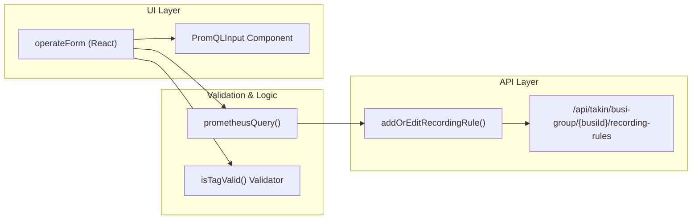
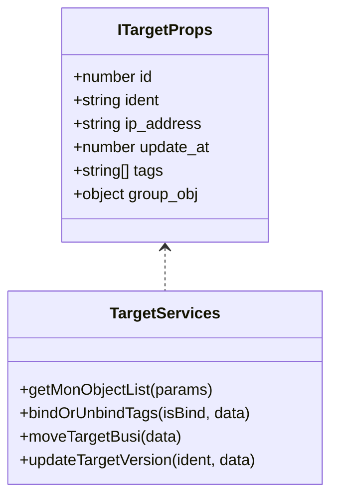

# Recording Rules & Monitoring Targets
Relevant source files

- [src/components/menu/topMenu.less](https://github.com/thetide557/ln-server-pub/blob/629bd918/src/components/menu/topMenu.less)
- [src/pages/help/version/index.less](https://github.com/thetide557/ln-server-pub/blob/629bd918/src/pages/help/version/index.less)
- [src/pages/help/version/index.tsx](https://github.com/thetide557/ln-server-pub/blob/629bd918/src/pages/help/version/index.tsx)
- [src/pages/help/version/locale/zh_CN.ts](https://github.com/thetide557/ln-server-pub/blob/629bd918/src/pages/help/version/locale/zh_CN.ts)
- [src/pages/recordingRules/PageTable.tsx](https://github.com/thetide557/ln-server-pub/blob/629bd918/src/pages/recordingRules/PageTable.tsx)
- [src/pages/recordingRules/components/editModal.tsx](https://github.com/thetide557/ln-server-pub/blob/629bd918/src/pages/recordingRules/components/editModal.tsx)
- [src/pages/recordingRules/components/operateForm.tsx](https://github.com/thetide557/ln-server-pub/blob/629bd918/src/pages/recordingRules/components/operateForm.tsx)
- [src/pages/system/parameters.tsx](https://github.com/thetide557/ln-server-pub/blob/629bd918/src/pages/system/parameters.tsx)
- [src/pages/targets/List.tsx](https://github.com/thetide557/ln-server-pub/blob/629bd918/src/pages/targets/List.tsx)
- [src/pages/targets/index.tsx](https://github.com/thetide557/ln-server-pub/blob/629bd918/src/pages/targets/index.tsx)
- [src/pages/targets/version/index.tsx](https://github.com/thetide557/ln-server-pub/blob/629bd918/src/pages/targets/version/index.tsx)
- [src/pages/user/component/userForm/index.tsx](https://github.com/thetide557/ln-server-pub/blob/629bd918/src/pages/user/component/userForm/index.tsx)
- [src/pages/user/users.tsx](https://github.com/thetide557/ln-server-pub/blob/629bd918/src/pages/user/users.tsx)
- [src/services/menu.ts](https://github.com/thetide557/ln-server-pub/blob/629bd918/src/services/menu.ts)
- [src/services/targets.ts](https://github.com/thetide557/ln-server-pub/blob/629bd918/src/services/targets.ts)

This section details the implementation of PromQL-based recording rules and the management of monitoring targets (probes). These modules allow users to pre-calculate complex metrics for performance optimization and manage the lifecycle of monitoring agents across the infrastructure.

## Recording Rules

Recording rules allow for the pre-computation of frequently needed or computationally expensive PromQL expressions and saving the result as a new set of time series.

### Implementation Architecture

The recording rules module is primarily implemented through three components: `PageTable`, `operateForm`, and `editModal`.

- PageTable: The main entry point that lists recording rules filtered by business group (`bgid`) [src/pages/recordingRules/PageTable.tsx#35-42](https://github.com/thetide557/ln-server-pub/blob/629bd918/src/pages/recordingRules/PageTable.tsx#L35-L42) It handles status toggling (Enable/Disable) via `updateRecordingRules`[src/pages/recordingRules/PageTable.tsx#174-182](https://github.com/thetide557/ln-server-pub/blob/629bd918/src/pages/recordingRules/PageTable.tsx#L174-L182)
- operateForm: The core creation/editing form. It performs real-time PromQL validation using the `prometheusQuery` service before submission [src/pages/recordingRules/components/operateForm.tsx#78-86](https://github.com/thetide557/ln-server-pub/blob/629bd918/src/pages/recordingRules/components/operateForm.tsx#L78-L86)
- editModal: Facilitates batch updates for fields `datasource_ids`, `prom_eval_interval`, `disabled` (enable/disable), and `append_tags`[src/pages/recordingRules/components/editModal.tsx#18-39](https://github.com/thetide557/ln-server-pub/blob/629bd918/src/pages/recordingRules/components/editModal.tsx#L18-L39)

### Data Flow: Recording Rule Creation

Sources:[src/pages/recordingRules/components/operateForm.tsx#7-10](https://github.com/thetide557/ln-server-pub/blob/629bd918/src/pages/recordingRules/components/operateForm.tsx#L7-L10)[src/pages/recordingRules/components/operateForm.tsx#78-106](https://github.com/thetide557/ln-server-pub/blob/629bd918/src/pages/recordingRules/components/operateForm.tsx#L78-L106)

### Key Functions

| Function | File | Description |
| --- | --- | --- |
| `getRecordingRuleSubList` | `src/services/recording.ts` | Fetches rules associated with a specific business group [src/pages/recordingRules/PageTable.tsx#62](https://github.com/thetide557/ln-server-pub/blob/629bd918/src/pages/recordingRules/PageTable.tsx#L62-L62) |
| `isTagValid` | `src/pages/recordingRules/components/operateForm.tsx` | Validates tags against the regex `/^[a-zA-Z_][\w]*={1}[^=]+$/`[src/pages/recordingRules/components/operateForm.tsx#21-27](https://github.com/thetide557/ln-server-pub/blob/629bd918/src/pages/recordingRules/components/operateForm.tsx#L21-L27) |
| `tagRender` | `src/pages/recordingRules/components/editModal.tsx` | Renders Ant Design Tags with error states if validation fails [src/pages/recordingRules/components/editModal.tsx#64-77](https://github.com/thetide557/ln-server-pub/blob/629bd918/src/pages/recordingRules/components/editModal.tsx#L64-L77) |

## Monitoring Targets (Targets)

Monitoring targets represent the entities (servers, containers, probes) being monitored. The system manages their identification (`ident`), business group assignment, and heartbeat status.

### Target List & Status Monitoring

The target list provides a real-time view of monitoring agents. A critical feature is the visual status indicator based on the `update_at` heartbeat and `target_up` status:

- Green (`#3FC453`): Target is healthy and up [src/pages/targets/version/index.tsx#45](https://github.com/thetide557/ln-server-pub/blob/629bd918/src/pages/targets/version/index.tsx#L45-L45)
- Yellow (`#FF9919`): Target status is `1` (Warning/Degraded) [src/pages/targets/version/index.tsx#151-153](https://github.com/thetide557/ln-server-pub/blob/629bd918/src/pages/targets/version/index.tsx#L151-L153)
- Red (`#FF656B`): Target status is `0` (Down) [src/pages/targets/version/index.tsx#149-150](https://github.com/thetide557/ln-server-pub/blob/629bd918/src/pages/targets/version/index.tsx#L149-L150)

### Management Entities

Sources:[src/pages/targets/List.tsx#34-44](https://github.com/thetide557/ln-server-pub/blob/629bd918/src/pages/targets/List.tsx#L34-L44)[src/services/targets.ts#21-119](https://github.com/thetide557/ln-server-pub/blob/629bd918/src/services/targets.ts#L21-L119)

## Probe Version Management

The platform supports managing and deploying different versions of monitoring probes (agents). This is handled in the `version` component under `targets`.

### Version Upload & Deployment

Users can upload probe packages as `.zip` files. The system enforces strict naming conventions for these files:

- Regex: `/^[a-z]+-[a-z]+-[a-zA-Z0-9.]+-(\w+)-(\w+)\.zip$/`[src/pages/targets/version/index.tsx#60](https://github.com/thetide557/ln-server-pub/blob/629bd918/src/pages/targets/version/index.tsx#L60-L60)
- OS Support: Must be `linux`, `windows`, or `darwin`[src/pages/targets/version/index.tsx#67](https://github.com/thetide557/ln-server-pub/blob/629bd918/src/pages/targets/version/index.tsx#L67-L67)
- Architecture Support: Must be `amd64`, `386`, `arm`, or `arm64`[src/pages/targets/version/index.tsx#71](https://github.com/thetide557/ln-server-pub/blob/629bd918/src/pages/targets/version/index.tsx#L71-L71)

### Service Layer Integration

The versioning logic interacts with the following endpoints:

- `getAllVersion`: Retrieves available probe versions [src/pages/targets/version/index.tsx#6](https://github.com/thetide557/ln-server-pub/blob/629bd918/src/pages/targets/version/index.tsx#L6-L6)
- `exportTempletZip`: Downloads specific probe versions via `/api/takin/target/version/export-zip`[src/pages/targets/version/index.tsx#210](https://github.com/thetide557/ln-server-pub/blob/629bd918/src/pages/targets/version/index.tsx#L210-L210)
- `updateTarget`: Triggers a batch remote update job for the selected target `ident`s (sent as a `hosts` array, along with SSH/download credentials and timeout options), returning a `task_id`; it is called from the "更新" modal's submit handler and posts to `/api/takin/target/version/batch-update` [src/services/version.ts#120-125](https://github.com/thetide557/ln-server-pub/blob/629bd918/src/services/version.ts#L120-L125). Note: `updateTargetVersion` in `src/services/targets.ts#114-119` (a single-`ident` PUT to `/api/takin/target/{ident}/version`) is exported but not actually invoked anywhere — its only reference in `src/pages/targets/List.tsx` is commented out, so it is dead code rather than the mechanism used for probe updates.

### Target Heartbeat Logic

The `columns1` configuration in `src/pages/targets/version/index.tsx` handles the display of probe metadata, including `current_version` and `remote_addr`[src/pages/targets/version/index.tsx#166-186](https://github.com/thetide557/ln-server-pub/blob/629bd918/src/pages/targets/version/index.tsx#L166-L186) The heartbeat is formatted using `moment.unix(val).format('YYYY-MM-DD HH:mm:ss')`[src/pages/targets/version/index.tsx#147](https://github.com/thetide557/ln-server-pub/blob/629bd918/src/pages/targets/version/index.tsx#L147-L147)

Sources:

- `src/pages/recordingRules/PageTable.tsx`
- `src/pages/recordingRules/components/operateForm.tsx`
- `src/pages/targets/List.tsx`
- `src/pages/targets/version/index.tsx`
- `src/services/targets.ts`
- `src/services/recording.ts`