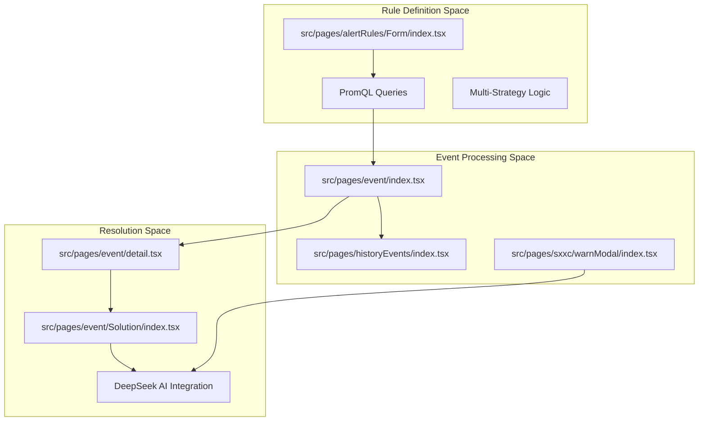
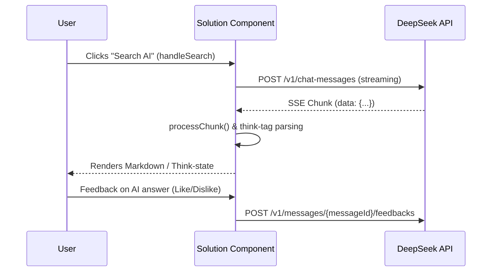

# Alerting System
Relevant source files

- [src/pages/alertRules/Form/Base.tsx](https://github.com/thetide557/ln-server-pub/blob/629bd918/src/pages/alertRules/Form/Base.tsx)
- [src/pages/alertRules/Form/Notify/index.tsx](https://github.com/thetide557/ln-server-pub/blob/629bd918/src/pages/alertRules/Form/Notify/index.tsx)
- [src/pages/alertRules/Form/components/HelpLabel.tsx](https://github.com/thetide557/ln-server-pub/blob/629bd918/src/pages/alertRules/Form/components/HelpLabel.tsx)
- [src/pages/alertRules/Form/index.tsx](https://github.com/thetide557/ln-server-pub/blob/629bd918/src/pages/alertRules/Form/index.tsx)
- [src/pages/alertRules/Form/style.less](https://github.com/thetide557/ln-server-pub/blob/629bd918/src/pages/alertRules/Form/style.less)
- [src/pages/alertRules/List/index.tsx](https://github.com/thetide557/ln-server-pub/blob/629bd918/src/pages/alertRules/List/index.tsx)
- [src/pages/event/Solution/index.less](https://github.com/thetide557/ln-server-pub/blob/629bd918/src/pages/event/Solution/index.less)
- [src/pages/event/Solution/index.tsx](https://github.com/thetide557/ln-server-pub/blob/629bd918/src/pages/event/Solution/index.tsx)
- [src/pages/event/detail.less](https://github.com/thetide557/ln-server-pub/blob/629bd918/src/pages/event/detail.less)
- [src/pages/event/detail.tsx](https://github.com/thetide557/ln-server-pub/blob/629bd918/src/pages/event/detail.tsx)
- [src/pages/event/index.tsx](https://github.com/thetide557/ln-server-pub/blob/629bd918/src/pages/event/index.tsx)
- [src/pages/event/locale/zh_CN.ts](https://github.com/thetide557/ln-server-pub/blob/629bd918/src/pages/event/locale/zh_CN.ts)
- [src/pages/historyEvents/index.tsx](https://github.com/thetide557/ln-server-pub/blob/629bd918/src/pages/historyEvents/index.tsx)
- [src/pages/log/syslog/index.tsx](https://github.com/thetide557/ln-server-pub/blob/629bd918/src/pages/log/syslog/index.tsx)
- [src/pages/permissions/index.tsx](https://github.com/thetide557/ln-server-pub/blob/629bd918/src/pages/permissions/index.tsx)
- [src/pages/sxxc/aiRobot/loading/index.less](https://github.com/thetide557/ln-server-pub/blob/629bd918/src/pages/sxxc/aiRobot/loading/index.less)
- [src/pages/sxxc/aiRobot/loading/index.tsx](https://github.com/thetide557/ln-server-pub/blob/629bd918/src/pages/sxxc/aiRobot/loading/index.tsx)
- [src/pages/sxxc/warnModal/index.less](https://github.com/thetide557/ln-server-pub/blob/629bd918/src/pages/sxxc/warnModal/index.less)
- [src/pages/sxxc/warnModal/index.tsx](https://github.com/thetide557/ln-server-pub/blob/629bd918/src/pages/sxxc/warnModal/index.tsx)
- [src/pages/targets/BusinessGroup/index.tsx](https://github.com/thetide557/ln-server-pub/blob/629bd918/src/pages/targets/BusinessGroup/index.tsx)
- [src/pages/user/component/addUser/index.tsx](https://github.com/thetide557/ln-server-pub/blob/629bd918/src/pages/user/component/addUser/index.tsx)

The Alerting System provides a comprehensive pipeline for detecting infrastructure anomalies, managing active incidents, and facilitating resolution through AI assistance. It integrates Prometheus-based metric monitoring with a multi-strategy rule engine and a robust notification framework.

## System Architecture

The alerting lifecycle flows from rule definition through event generation to AI-assisted remediation.

### Alerting Pipeline Overview

Note: `WarnModal` (the large-screen alert popup, only shown on the `/screenView` route via a global WebSocket push in `App.tsx`) does not render or call the `Solution` component. It embeds its own independent, duplicated copy of the same DeepSeek streaming/think-tag logic directly, so it talks to DeepSeek on its own path rather than through `SolutionCpt`. The `Solution` component is only used by `event/detail.tsx` (route `/alert-cur-events/:id`).

Sources:[src/pages/alertRules/Form/index.tsx#17-40](https://github.com/thetide557/ln-server-pub/blob/629bd918/src/pages/alertRules/Form/index.tsx#L17-L40)[src/pages/event/index.tsx#18-45](https://github.com/thetide557/ln-server-pub/blob/629bd918/src/pages/event/index.tsx#L18-L45)[src/pages/event/Solution/index.tsx#1-15](https://github.com/thetide557/ln-server-pub/blob/629bd918/src/pages/event/Solution/index.tsx#L1-L15)[src/pages/sxxc/warnModal/index.tsx#1-17](https://github.com/thetide557/ln-server-pub/blob/629bd918/src/pages/sxxc/warnModal/index.tsx#L1-L17)

---

## Alert Rule Management

Alert rules are the core logic units of the system. They are defined using PromQL and can be scoped to specific assets or business groups. A single rule can contain multiple Strategies, allowing for different thresholds or notification behaviors based on time windows or severity levels.

- Multi-Strategy Support: Rules support up to 5 distinct strategies [src/pages/alertRules/Form/index.tsx#119-122](https://github.com/thetide557/ln-server-pub/blob/629bd918/src/pages/alertRules/Form/index.tsx#L119-L122)
- Asset Scoping: Rules can be filtered by `asset_id` or `excludes` to target specific infrastructure [src/pages/alertRules/Form/Base.tsx#84-97](https://github.com/thetide557/ln-server-pub/blob/629bd918/src/pages/alertRules/Form/Base.tsx#L84-L97)
- CRUD & Batch Operations: The rule list supports enabling/disabling, cloning, and batch deletion [src/pages/alertRules/List/index.tsx#26-33](https://github.com/thetide557/ln-server-pub/blob/629bd918/src/pages/alertRules/List/index.tsx#L26-L33)

For details on configuration and validation, see [Alert Rule Management](/org/benjamin-braddock/wiki/thetide557/ln-server-pub/page/5.1?branch=v2.1).

Sources:[src/pages/alertRules/Form/index.tsx#101-115](https://github.com/thetide557/ln-server-pub/blob/629bd918/src/pages/alertRules/Form/index.tsx#L101-L115)[src/pages/alertRules/Form/Base.tsx#41-50](https://github.com/thetide557/ln-server-pub/blob/629bd918/src/pages/alertRules/Form/Base.tsx#L41-L50)[src/pages/alertRules/List/index.tsx#87-120](https://github.com/thetide557/ln-server-pub/blob/629bd918/src/pages/alertRules/List/index.tsx#L87-L120)

---

## Alert Events & History

When a rule's conditions are met, an Alert Event is generated. The system tracks both active (current) and resolved (historical) events.

| Feature | Code Entity | Description |
| --- | --- | --- |
| Current Events | `Event`[src/pages/event/index.tsx](https://github.com/thetide557/ln-server-pub/blob/629bd918/src/pages/event/index.tsx) | Card or list view of active alerts, with batch delete/export. A batch "acknowledgement" action (`BatchAckBtn`, imported from `plus:/parcels/Event/Acknowledge/BatchAckBtn`) is wired into the menu but resolves to a no-op placeholder in this repo (no `src/plus` directory and default build is not `:advanced`), so it renders nothing and is not actually usable here. |
| Event History | `Event`[src/pages/historyEvents/index.tsx](https://github.com/thetide557/ln-server-pub/blob/629bd918/src/pages/historyEvents/index.tsx) | Searchable archive of past alerts with time-range filtering. |
| Event Detail | `EventDetailPage`[src/pages/event/detail.tsx](https://github.com/thetide557/ln-server-pub/blob/629bd918/src/pages/event/detail.tsx) | Deep dive into triggers, values, and associated asset metrics. |
| Large Screen Modal | `WarnModal`[src/pages/sxxc/warnModal/index.tsx](https://github.com/thetide557/ln-server-pub/blob/629bd918/src/pages/sxxc/warnModal/index.tsx) | Specialized UI for high-visibility operations environments. |

For details on event lifecycles and exports, see [Alert Events & History](/org/benjamin-braddock/wiki/thetide557/ln-server-pub/page/5.2?branch=v2.1).

Sources:[src/pages/event/index.tsx#80-110](https://github.com/thetide557/ln-server-pub/blob/629bd918/src/pages/event/index.tsx#L80-L110)[src/pages/historyEvents/index.tsx#62-95](https://github.com/thetide557/ln-server-pub/blob/629bd918/src/pages/historyEvents/index.tsx#L62-L95)[src/pages/event/detail.tsx#44-84](https://github.com/thetide557/ln-server-pub/blob/629bd918/src/pages/event/detail.tsx#L44-L84)[src/pages/sxxc/warnModal/index.tsx#18-30](https://github.com/thetide557/ln-server-pub/blob/629bd918/src/pages/sxxc/warnModal/index.tsx#L18-L30)

---

## Alert Subscriptions & Notifications

The notification engine ensures that the right stakeholders are informed via the appropriate channels. The primary, business-group-scoped management surfaces are the dedicated Subscription Rules page (`src/pages/warning/subscribe`, route `/alert-subscribes`) and Mute Rules page (`src/pages/warning/shield`, route `/alert-mutes`) — both distinct directories from `alertRules`, despite similar naming in some internal locale keys.

- Subscription Rules: `src/pages/warning/subscribe` (route `/alert-subscribes`) lets users define rules that forward matching alerts to additional recipients/channels, backed by `/api/takin/busi-group/{busiId}/alert-subscribes`
- Mute Rules: `src/pages/warning/shield` (route `/alert-mutes`) manages persistent, rule-based suppression (not just ad-hoc), backed by `/api/takin/busi-group/{busiId}/alert-mutes`
- Notification Groups: Users are organized into groups for receiving alerts [src/pages/alertRules/List/index.tsx#198-209](https://github.com/thetide557/ln-server-pub/blob/629bd918/src/pages/alertRules/List/index.tsx#L198-L209)
- Quick Muting from the large-screen popup: `WarnModal` additionally offers an inline, ad-hoc mute action configurable by duration (e.g., 1h, 1d), calling `/api/takin/busi-group/{busiId}/alert-mutes` directly — separate from the dedicated Mute Rules page above [src/pages/sxxc/warnModal/index.tsx#25-86](https://github.com/thetide557/ln-server-pub/blob/629bd918/src/pages/sxxc/warnModal/index.tsx#L25-L86)
- Severity Mapping: Alerts are categorized into "Emergency" (紧急), "Important" (重要), and "Normal" (一般) [src/pages/event/index.tsx#44-45](https://github.com/thetide557/ln-server-pub/blob/629bd918/src/pages/event/index.tsx#L44-L45)

For details on channels and routing, see [Alert Subscriptions, Mutes & Notifications](/org/benjamin-braddock/wiki/thetide557/ln-server-pub/page/5.3?branch=v2.1).

Sources:[src/pages/sxxc/warnModal/index.tsx#224-243](https://github.com/thetide557/ln-server-pub/blob/629bd918/src/pages/sxxc/warnModal/index.tsx#L224-L243)[src/pages/alertRules/List/index.tsx#148-162](https://github.com/thetide557/ln-server-pub/blob/629bd918/src/pages/alertRules/List/index.tsx#L148-L162)

---

## AI-Assisted Alert Solutions

The platform integrates AI (via DeepSeek) to provide real-time troubleshooting recommendations directly within the alert detail view.

### AI Interaction Logic

Note: There are two distinct feedback calls, not one. Feedback on a knowledge-base solution card calls the backend service `getFeedbacks(flag, id)`, which hits `/api/takin/alert-rule-solution/feedbacks/{id}` (keyed by solution id). Feedback on a streamed AI chat answer instead does a direct `fetch` to the DeepSeek proxy endpoint `/v1/messages/{messageId}/feedbacks` and does not go through the `getFeedbacks` service function.

Sources:[src/pages/event/Solution/index.tsx#67-93](https://github.com/thetide557/ln-server-pub/blob/629bd918/src/pages/event/Solution/index.tsx#L67-L93)[src/pages/event/Solution/index.tsx#95-135](https://github.com/thetide557/ln-server-pub/blob/629bd918/src/pages/event/Solution/index.tsx#L95-L135)[src/pages/event/Solution/index.tsx#160-179](https://github.com/thetide557/ln-server-pub/blob/629bd918/src/pages/event/Solution/index.tsx#L160-L179)

- Streaming Responses: Uses `fetchWithTimeout` and `TextDecoder` to handle Server-Sent Events (SSE) for low-latency chat [src/pages/event/Solution/index.tsx#55-64](https://github.com/thetide557/ln-server-pub/blob/629bd918/src/pages/event/Solution/index.tsx#L55-L64)
- Deep Thinking: Specifically parses `<think>` tags to display the AI's internal reasoning process [src/pages/event/Solution/index.tsx#160-174](https://github.com/thetide557/ln-server-pub/blob/629bd918/src/pages/event/Solution/index.tsx#L160-L174)
- Knowledge Base: Displays pre-defined solution cards fetched via `getRuleSolution` alongside a separate, always-available AI chat search box for further troubleshooting (the two are shown together, not a sequential "fallback") [src/pages/event/Solution/index.tsx#41-52](https://github.com/thetide557/ln-server-pub/blob/629bd918/src/pages/event/Solution/index.tsx#L41-L52)

For details on AI integration, see [AI-Assisted Alert Solutions](/org/benjamin-braddock/wiki/thetide557/ln-server-pub/page/5.4?branch=v2.1).

Sources:[src/pages/event/Solution/index.tsx#10-35](https://github.com/thetide557/ln-server-pub/blob/629bd918/src/pages/event/Solution/index.tsx#L10-L35)[src/pages/event/Solution/index.tsx#215-220](https://github.com/thetide557/ln-server-pub/blob/629bd918/src/pages/event/Solution/index.tsx#L215-L220)