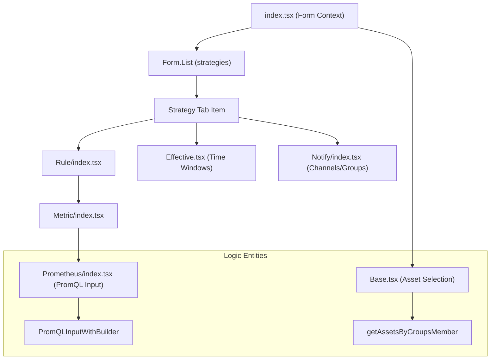
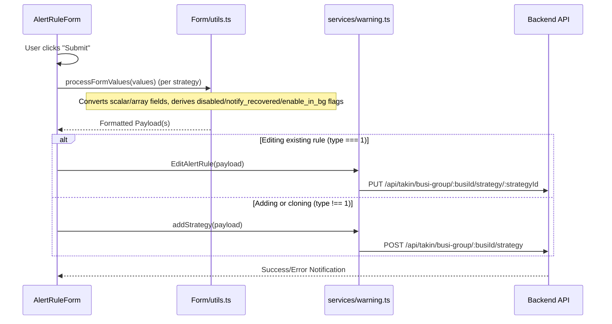

# Alert Rule Management
Relevant source files

- [src/pages/alertRules/Edit.tsx](https://github.com/thetide557/ln-server-pub/blob/629bd918/src/pages/alertRules/Edit.tsx)
- [src/pages/alertRules/Form/Base.tsx](https://github.com/thetide557/ln-server-pub/blob/629bd918/src/pages/alertRules/Form/Base.tsx)
- [src/pages/alertRules/Form/Effective/index.tsx](https://github.com/thetide557/ln-server-pub/blob/629bd918/src/pages/alertRules/Form/Effective/index.tsx)
- [src/pages/alertRules/Form/Notify/index.tsx](https://github.com/thetide557/ln-server-pub/blob/629bd918/src/pages/alertRules/Form/Notify/index.tsx)
- [src/pages/alertRules/Form/Rule/Rule/Metric/Prometheus/index.tsx](https://github.com/thetide557/ln-server-pub/blob/629bd918/src/pages/alertRules/Form/Rule/Rule/Metric/Prometheus/index.tsx)
- [src/pages/alertRules/Form/Rule/Rule/Metric/index.tsx](https://github.com/thetide557/ln-server-pub/blob/629bd918/src/pages/alertRules/Form/Rule/Rule/Metric/index.tsx)
- [src/pages/alertRules/Form/Rule/index.tsx](https://github.com/thetide557/ln-server-pub/blob/629bd918/src/pages/alertRules/Form/Rule/index.tsx)
- [src/pages/alertRules/Form/components/DatasourceValueSelect/index.tsx](https://github.com/thetide557/ln-server-pub/blob/629bd918/src/pages/alertRules/Form/components/DatasourceValueSelect/index.tsx)
- [src/pages/alertRules/Form/components/HelpLabel.tsx](https://github.com/thetide557/ln-server-pub/blob/629bd918/src/pages/alertRules/Form/components/HelpLabel.tsx)
- [src/pages/alertRules/Form/components/IntervalAndDuration/index.tsx](https://github.com/thetide557/ln-server-pub/blob/629bd918/src/pages/alertRules/Form/components/IntervalAndDuration/index.tsx)
- [src/pages/alertRules/Form/components/ProdSelect.tsx](https://github.com/thetide557/ln-server-pub/blob/629bd918/src/pages/alertRules/Form/components/ProdSelect.tsx)
- [src/pages/alertRules/Form/index copy.tsx](https://github.com/thetide557/ln-server-pub/blob/629bd918/src/pages/alertRules/Form/index copy.tsx)
- [src/pages/alertRules/Form/index.tsx](https://github.com/thetide557/ln-server-pub/blob/629bd918/src/pages/alertRules/Form/index.tsx)
- [src/pages/alertRules/Form/style.less](https://github.com/thetide557/ln-server-pub/blob/629bd918/src/pages/alertRules/Form/style.less)
- [src/pages/alertRules/Form/utils.ts](https://github.com/thetide557/ln-server-pub/blob/629bd918/src/pages/alertRules/Form/utils.ts)
- [src/pages/alertRules/List/MoreOperations.tsx](https://github.com/thetide557/ln-server-pub/blob/629bd918/src/pages/alertRules/List/MoreOperations.tsx)
- [src/pages/alertRules/List/index.tsx](https://github.com/thetide557/ln-server-pub/blob/629bd918/src/pages/alertRules/List/index.tsx)
- [src/pages/event/detail.less](https://github.com/thetide557/ln-server-pub/blob/629bd918/src/pages/event/detail.less)
- [src/pages/event/index.tsx](https://github.com/thetide557/ln-server-pub/blob/629bd918/src/pages/event/index.tsx)
- [src/pages/historyEvents/index.tsx](https://github.com/thetide557/ln-server-pub/blob/629bd918/src/pages/historyEvents/index.tsx)
- [src/pages/log/syslog/index.tsx](https://github.com/thetide557/ln-server-pub/blob/629bd918/src/pages/log/syslog/index.tsx)
- [src/pages/permissions/index.tsx](https://github.com/thetide557/ln-server-pub/blob/629bd918/src/pages/permissions/index.tsx)
- [src/pages/recordingRules/edit.tsx](https://github.com/thetide557/ln-server-pub/blob/629bd918/src/pages/recordingRules/edit.tsx)
- [src/pages/targets/BusinessGroup/index.tsx](https://github.com/thetide557/ln-server-pub/blob/629bd918/src/pages/targets/BusinessGroup/index.tsx)
- [src/pages/warning/shield/index.tsx](https://github.com/thetide557/ln-server-pub/blob/629bd918/src/pages/warning/shield/index.tsx)
- [src/services/warning.ts](https://github.com/thetide557/ln-server-pub/blob/629bd918/src/services/warning.ts)

Alert Rule Management is the core configuration interface for defining monitoring logic, thresholds, and notification strategies. The system supports multi-strategy rules, allowing different evaluation criteria or notification targets for the same rule name based on time or conditions.

## 1. Rule List Interface

The alert rule list provides a consolidated view of all monitoring policies, supporting CRUD operations, batch status updates, and filtering by asset attributes.

### 1.1 Key Features

- Grouping by Strategy: The list supports grouping alerts by `strategy_id` to handle multi-strategy rules [src/pages/alertRules/List/index.tsx#109-115](https://github.com/thetide557/ln-server-pub/blob/629bd918/src/pages/alertRules/List/index.tsx#L109-L115)
- Asset Integration: Rules can be filtered by IP address, asset name, or asset type [src/pages/alertRules/List/index.tsx#43-50](https://github.com/thetide557/ln-server-pub/blob/629bd918/src/pages/alertRules/List/index.tsx#L43-L50)
- Row-Level Actions: Each row supports enabling/disabling (`updateAlertRulesStatus`), view, edit, delete (`deleteAlertRules`), and cloning — clone routes to the same edit form with `?mode=clone` [src/pages/alertRules/List/index.tsx#303-318](https://github.com/thetide557/ln-server-pub/blob/629bd918/src/pages/alertRules/List/index.tsx#L303-L318)
- Batch Operations: Via `MoreOperations`, supports batch delete (`deleteStrategy`) and a batch-update dialog (`EditModal`/`updateAlertRules`) covering a broad set of fields — severity, datasource, eval interval/duration, effective time windows, notify channels/groups/recovery, callbacks, etc. — not just enable/disable [src/pages/alertRules/List/MoreOperations.tsx#90-123](https://github.com/thetide557/ln-server-pub/blob/629bd918/src/pages/alertRules/List/MoreOperations.tsx#L90-L123)
- Import/Export: `MoreOperations` also provides JSON-based bulk import (`Import.tsx`/`importStrategy`) and export of the selected rows (`Export.tsx`) [src/pages/alertRules/List/MoreOperations.tsx#60-89](https://github.com/thetide557/ln-server-pub/blob/629bd918/src/pages/alertRules/List/MoreOperations.tsx#L60-L89)

### 1.2 Data Representation

| Column | Description | Code Entity |
| --- | --- | --- |
| Rule Name | The primary identifier for the alert rule. | `name`[src/pages/alertRules/List/index.tsx#89](https://github.com/thetide557/ln-server-pub/blob/629bd918/src/pages/alertRules/List/index.tsx#L89-L89) |
| Strategy Name | Sub-identifier for multi-strategy rules. | `strategy_name`[src/pages/alertRules/List/index.tsx#124](https://github.com/thetide557/ln-server-pub/blob/629bd918/src/pages/alertRules/List/index.tsx#L124-L124) |
| Severity | Priority levels (Emergency, Important, Normal). | `severities`[src/pages/alertRules/List/index.tsx#130](https://github.com/thetide557/ln-server-pub/blob/629bd918/src/pages/alertRules/List/index.tsx#L130-L130) |
| Status | Toggle for enabling/disabling the rule. | `updateAlertRulesStatus`[src/pages/alertRules/List/index.tsx#26](https://github.com/thetide557/ln-server-pub/blob/629bd918/src/pages/alertRules/List/index.tsx#L26-L26) |

Sources:[src/pages/alertRules/List/index.tsx#18-210](https://github.com/thetide557/ln-server-pub/blob/629bd918/src/pages/alertRules/List/index.tsx#L18-L210)

---

## 2. Multi-Strategy Rule Form

The platform uses a sophisticated form architecture to manage complex alert definitions. A single "Alert Rule" can contain multiple "Strategies" (`Form.List` named `strategies`) [src/pages/alertRules/Form/index.tsx#198-200](https://github.com/thetide557/ln-server-pub/blob/629bd918/src/pages/alertRules/Form/index.tsx#L198-L200). A rule is capped at 5 strategies — the Tabs `onEdit` handler rejects further additions once `fields.length >= 5` [src/pages/alertRules/Form/index.tsx#211-217](https://github.com/thetide557/ln-server-pub/blob/629bd918/src/pages/alertRules/Form/index.tsx#L211-L217)

### 2.1 Form Structure

The form is divided into three main functional areas:

1. Base (Basic Information): Defines the rule name, associated asset (via `asset_id`), and optional exclusions [src/pages/alertRules/Form/Base.tsx#41-50](https://github.com/thetide557/ln-server-pub/blob/629bd918/src/pages/alertRules/Form/Base.tsx#L41-L50)
2. Rule/Metric: Contains the PromQL queries, severity levels, and evaluation intervals [src/pages/alertRules/Form/Rule/Rule/Metric/Prometheus/index.tsx#46-64](https://github.com/thetide557/ln-server-pub/blob/629bd918/src/pages/alertRules/Form/Rule/Rule/Metric/Prometheus/index.tsx#L46-L64)
3. Notify: Configures notification channels (email, SMS, etc.) and receiver groups [src/pages/alertRules/Form/Notify/index.tsx#53-78](https://github.com/thetide557/ln-server-pub/blob/629bd918/src/pages/alertRules/Form/Notify/index.tsx#L53-L78)

### 2.2 Component Hierarchy Diagram

"Alert Rule Form Component Structure"

Sources:[src/pages/alertRules/Form/index.tsx#184-205](https://github.com/thetide557/ln-server-pub/blob/629bd918/src/pages/alertRules/Form/index.tsx#L184-L205)[src/pages/alertRules/Form/Base.tsx#134-140](https://github.com/thetide557/ln-server-pub/blob/629bd918/src/pages/alertRules/Form/Base.tsx#L134-L140)[src/pages/alertRules/Form/Rule/Rule/Metric/Prometheus/index.tsx#74](https://github.com/thetide557/ln-server-pub/blob/629bd918/src/pages/alertRules/Form/Rule/Rule/Metric/Prometheus/index.tsx#L74-L74)

---

## 3. PromQL & Asset Scoping

A unique feature of the platform is the automatic injection of asset-specific tags into PromQL queries.

### 3.1 Asset-Scoped Queries

When an asset is selected in the `Base` component, the system uses `handleAssetIdTags` to dynamically append `asset_id` filters to the PromQL strings across all defined strategies [src/pages/alertRules/Form/Base.tsx#81-96](https://github.com/thetide557/ln-server-pub/blob/629bd918/src/pages/alertRules/Form/Base.tsx#L81-L96)

- Positive Scoping: Appends `{asset_id="123"}`.
- Negative Scoping (Excludes): Appends `{asset_id!="123"}`[src/pages/alertRules/Form/Base.tsx#87](https://github.com/thetide557/ln-server-pub/blob/629bd918/src/pages/alertRules/Form/Base.tsx#L87-L87)

### 3.2 PromQL Validation

The `PromQLInputWithBuilder` component pairs a CodeMirror-based editor — with the `codemirror-promql` linter/autocompletion activated for real-time syntax highlighting — with a "构建" (Builder) button that opens `PromQueryBuilderModal`, a visual query-building interface [src/pages/alertRules/Form/Rule/Rule/Metric/Prometheus/index.tsx#74-89](https://github.com/thetide557/ln-server-pub/blob/629bd918/src/pages/alertRules/Form/Rule/Rule/Metric/Prometheus/index.tsx#L74-L89). Note: the PromQL `Form.Item` only carries a `required` rule — the linter surfaces syntax diagnostics inline but does not itself block form submission.

---

## 4. Data Flow & Persistence

The lifecycle of an alert rule involves transforming raw form values into a backend-compatible structure.

### 4.1 Data Transformation Logic

The `utils.ts` file contains critical mapping functions:

- `processInitialValues`: Normalizes a strategy record into form-ready values — reconstructs `effective_time` entries from `enable_stimes`/`enable_etimes`/`enable_days_of_weeks`, converts `callbacks` (URL strings) into `{url}` objects and `annotations` (a map) into a key/value array, and derives boolean switches (`enable_status`, `notify_recovered`, `enable_in_bg`) from numeric flags. Note: the `rule_config_fe` JSON string is only ever produced on submit (`JSON.stringify` in `Form/index.tsx`); the matching `JSON.parse(res.dat["rule_config_fe"])` in `Edit.tsx` is commented-out dead code and plays no role in loading the form [src/pages/alertRules/Edit.tsx#41-42](https://github.com/thetide557/ln-server-pub/blob/629bd918/src/pages/alertRules/Edit.tsx#L41-L42)
- `transformAlertRules`: Aggregates multiple strategies into the form's tabbed structure [src/pages/alertRules/Form/index.tsx#104](https://github.com/thetide557/ln-server-pub/blob/629bd918/src/pages/alertRules/Form/index.tsx#L104-L104)

### 4.2 API Integration Flow

"Rule Save/Update Data Flow"

Note: `EditStrategy` is imported in `Form/index.tsx` but is dead code (only referenced in commented-out blocks); the actual edit path calls `EditAlertRule`.

Sources:[src/pages/alertRules/Form/index.tsx#62-99](https://github.com/thetide557/ln-server-pub/blob/629bd918/src/pages/alertRules/Form/index.tsx#L62-L99)[src/pages/alertRules/Form/utils.ts#33](https://github.com/thetide557/ln-server-pub/blob/629bd918/src/pages/alertRules/Form/utils.ts#L33-L33)[src/services/warning.ts#24](https://github.com/thetide557/ln-server-pub/blob/629bd918/src/services/warning.ts#L24-L24)

---

## 5. Summary of Key Files

| File Path | Role |
| --- | --- |
| `src/pages/alertRules/List/index.tsx` | Main table view for alert rules and strategies. |
| `src/pages/alertRules/Form/index.tsx` | Entry point for the multi-strategy form using `Form.List`. |
| `src/pages/alertRules/Form/Base.tsx` | Handles rule naming and asset-to-PromQL binding. |
| `src/pages/alertRules/Form/Notify/index.tsx` | Manages notification groups and recovery settings. |
| `src/pages/alertRules/Form/utils.ts` | Data normalization and transformation logic. |

Sources:[src/pages/alertRules/Form/index.tsx#17-49](https://github.com/thetide557/ln-server-pub/blob/629bd918/src/pages/alertRules/Form/index.tsx#L17-L49)[src/pages/alertRules/Form/Base.tsx#41-45](https://github.com/thetide557/ln-server-pub/blob/629bd918/src/pages/alertRules/Form/Base.tsx#L41-L45)[src/pages/alertRules/Form/Notify/index.tsx#18-35](https://github.com/thetide557/ln-server-pub/blob/629bd918/src/pages/alertRules/Form/Notify/index.tsx#L18-L35)