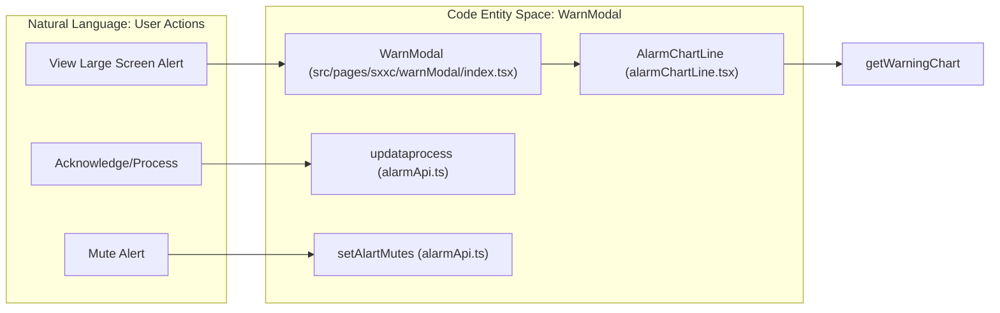
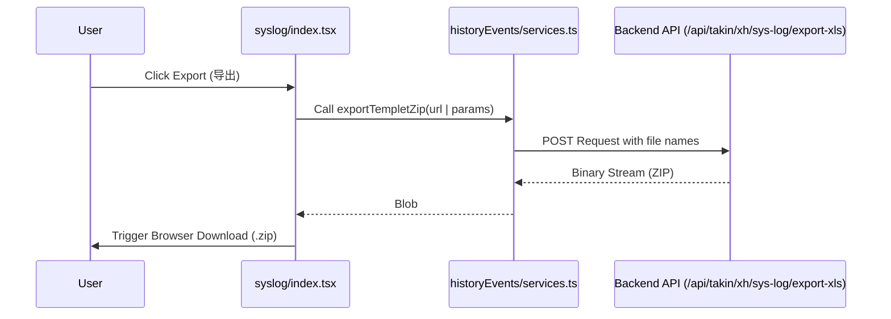

# Alert Events & History
Relevant source files

- [src/pages/alertRules/List/index.tsx](https://github.com/thetide557/ln-server-pub/blob/629bd918/src/pages/alertRules/List/index.tsx)
- [src/pages/event/Solution/index.less](https://github.com/thetide557/ln-server-pub/blob/629bd918/src/pages/event/Solution/index.less)
- [src/pages/event/Solution/index.tsx](https://github.com/thetide557/ln-server-pub/blob/629bd918/src/pages/event/Solution/index.tsx)
- [src/pages/event/Table.tsx](https://github.com/thetide557/ln-server-pub/blob/629bd918/src/pages/event/Table.tsx)
- [src/pages/event/card.tsx](https://github.com/thetide557/ln-server-pub/blob/629bd918/src/pages/event/card.tsx)
- [src/pages/event/detail.tsx](https://github.com/thetide557/ln-server-pub/blob/629bd918/src/pages/event/detail.tsx)
- [src/pages/event/index.tsx](https://github.com/thetide557/ln-server-pub/blob/629bd918/src/pages/event/index.tsx)
- [src/pages/event/locale/zh_CN.ts](https://github.com/thetide557/ln-server-pub/blob/629bd918/src/pages/event/locale/zh_CN.ts)
- [src/pages/event/services.ts](https://github.com/thetide557/ln-server-pub/blob/629bd918/src/pages/event/services.ts)
- [src/pages/historyEvents/index.tsx](https://github.com/thetide557/ln-server-pub/blob/629bd918/src/pages/historyEvents/index.tsx)
- [src/pages/historyEvents/services.ts](https://github.com/thetide557/ln-server-pub/blob/629bd918/src/pages/historyEvents/services.ts)
- [src/pages/log/syslog/index.tsx](https://github.com/thetide557/ln-server-pub/blob/629bd918/src/pages/log/syslog/index.tsx)
- [src/pages/permissions/index.tsx](https://github.com/thetide557/ln-server-pub/blob/629bd918/src/pages/permissions/index.tsx)
- [src/pages/sxxc/aiRobot/loading/index.less](https://github.com/thetide557/ln-server-pub/blob/629bd918/src/pages/sxxc/aiRobot/loading/index.less)
- [src/pages/sxxc/aiRobot/loading/index.tsx](https://github.com/thetide557/ln-server-pub/blob/629bd918/src/pages/sxxc/aiRobot/loading/index.tsx)
- [src/pages/sxxc/warnModal/alarmChartLine.tsx](https://github.com/thetide557/ln-server-pub/blob/629bd918/src/pages/sxxc/warnModal/alarmChartLine.tsx)
- [src/pages/sxxc/warnModal/index.less](https://github.com/thetide557/ln-server-pub/blob/629bd918/src/pages/sxxc/warnModal/index.less)
- [src/pages/sxxc/warnModal/index.tsx](https://github.com/thetide557/ln-server-pub/blob/629bd918/src/pages/sxxc/warnModal/index.tsx)
- [src/pages/targets/BusinessGroup/index.tsx](https://github.com/thetide557/ln-server-pub/blob/629bd918/src/pages/targets/BusinessGroup/index.tsx)
- [src/pages/user/component/addUser/index.tsx](https://github.com/thetide557/ln-server-pub/blob/629bd918/src/pages/user/component/addUser/index.tsx)

This page details the implementation of alert event management within the platform, covering real-time active events, historical event auditing, AI-assisted troubleshooting, and specialized visualization for large-screen environments.

## 1. Active Alert Events

Active events represent ongoing issues that have not yet been recovered. The system provides two primary views for these events: a Card View for high-level status monitoring and a Table View for detailed operations.

### 1.1 View Modes & Data Flow

The main entry point `src/pages/event/index.tsx` manages the switching between `card` and `list` views via local state `view`[src/pages/event/index.tsx#82](https://github.com/thetide557/ln-server-pub/blob/629bd918/src/pages/event/index.tsx#L82-L82) It utilizes `useLocalStorage` to persist the user's display preference [src/pages/event/index.tsx#95](https://github.com/thetide557/ln-server-pub/blob/629bd918/src/pages/event/index.tsx#L95-L95)

- Card View (`Card` component): Groups alerts by severity and business group. It uses `getAlertCards` to fetch aggregated data [src/pages/event/card.tsx#81](https://github.com/thetide557/ln-server-pub/blob/629bd918/src/pages/event/card.tsx#L81-L81)
- Table View (`TableCpt` component): Provides a standard paginated list of all active events using the `useAntdTable` hook [src/pages/event/Table.tsx#24](https://github.com/thetide557/ln-server-pub/blob/629bd918/src/pages/event/Table.tsx#L24-L24)

### 1.2 Event Lifecycle Operations

Users can interact with active events through several key actions:

- Acknowledge (Ack): Marking an alert as "known" to suppress further noise. Rendered via the `AckBtn`/`BatchAckBtn` components, which are imported from `plus:/parcels/Event/Acknowledge/*` [src/pages/event/card.tsx#218](https://github.com/thetide557/ln-server-pub/blob/629bd918/src/pages/event/card.tsx#L218-L218) This repository has no `src/plus` directory and does not build with the `:advanced` lifecycle event, so the `plus:` import resolves to `plugins/PlusPlaceholder`, which renders `null` — **the Ack feature is unavailable in this build and is an enterprise-only placeholder**, not a working feature. (In `src/pages/event/Table.tsx`, `AckBtn` is even imported but never rendered in the list view's operate column.)
- Mute (Shield): Redirects users to the mute configuration page with pre-filled event tags [src/pages/event/Table.tsx#173-184](https://github.com/thetide557/ln-server-pub/blob/629bd918/src/pages/event/Table.tsx#L173-L184)
- Delete: Permanent removal of event records via `deleteAlertEventsModal`[src/pages/event/index.tsx#46-62](https://github.com/thetide557/ln-server-pub/blob/629bd918/src/pages/event/index.tsx#L46-L62)

### 1.3 Interaction Diagram: Active Event Management

| Code Entity | Role |
| --- | --- |
| `Event` (`src/pages/event/index.tsx`) | Main container managing filters and view switching. |
| `TableCpt` (`src/pages/event/Table.tsx`) | Renders the list of events with column sorting and action buttons. |
| `Card` (`src/pages/event/card.tsx`) | Renders severity-based cards and handles drawer-based detail views. |
| `getEvents` (`src/pages/event/services.ts`) | API service to fetch the list of current active events. |

Sources:[src/pages/event/index.tsx#80-112](https://github.com/thetide557/ln-server-pub/blob/629bd918/src/pages/event/index.tsx#L80-L112)[src/pages/event/card.tsx#47-60](https://github.com/thetide557/ln-server-pub/blob/629bd918/src/pages/event/card.tsx#L47-L60)[src/pages/event/Table.tsx#48-54](https://github.com/thetide557/ln-server-pub/blob/629bd918/src/pages/event/Table.tsx#L48-L54)

---

## 2. Historical Alert Events

The History module (`src/pages/historyEvents/index.tsx`) allows users to audit past alerts using time-range filtering and rule enrichment.

### 2.1 Filtering and Time Ranges

Historical events default to a 1-hour window, driven by the `range` state initialized as `{ start: 'now-1h', end: 'now' }` and persisted in local storage [src/pages/historyEvents/index.tsx#97](https://github.com/thetide557/ln-server-pub/blob/629bd918/src/pages/historyEvents/index.tsx#L97-L97) Users can select custom ranges using the `TimeRangePicker` component. Note: a `getDefaultHours`/`setDefaultHours` helper pair defaulting to 6 hours is also defined in this file [src/pages/historyEvents/index.tsx#40-46](https://github.com/thetide557/ln-server-pub/blob/629bd918/src/pages/historyEvents/index.tsx#L40-L46) but it is not called anywhere and does not feed the actual `range` state — it is unused/dead code, not the effective default.

### 2.2 Data Enrichment

When rendering historical events, the system often enriches the view by linking to the original asset or monitor configuration:

- Asset Link: Navigates to the monitor detail page using `asset_id`[src/pages/historyEvents/index.tsx#144](https://github.com/thetide557/ln-server-pub/blob/629bd918/src/pages/historyEvents/index.tsx#L144-L144)
- Rule Detail: Links to the historical event detail page [src/pages/historyEvents/index.tsx#125](https://github.com/thetide557/ln-server-pub/blob/629bd918/src/pages/historyEvents/index.tsx#L125-L125)

Sources:[src/pages/historyEvents/index.tsx#62-98](https://github.com/thetide557/ln-server-pub/blob/629bd918/src/pages/historyEvents/index.tsx#L62-L98)[src/pages/historyEvents/index.tsx#116-150](https://github.com/thetide557/ln-server-pub/blob/629bd918/src/pages/historyEvents/index.tsx#L116-L150)

---

## 3. Event Detail & AI Solution

The `EventDetailPage` provides a deep dive into a specific alert instance, combining metadata, a read-only PromQL script view with a "回放" (replay) button that navigates out to the metric Explorer for charting, and AI-generated troubleshooting steps. There is no metric chart embedded directly in the detail page itself.

### 3.1 Detail Components

- Metadata: Displays rule name, severity, trigger value, and tags [src/pages/event/detail.tsx#84-164](https://github.com/thetide557/ln-server-pub/blob/629bd918/src/pages/event/detail.tsx#L84-L164)
- Contextual Links: Includes buttons to view the original alert rule [src/pages/event/detail.tsx#89-91](https://github.com/thetide557/ln-server-pub/blob/629bd918/src/pages/event/detail.tsx#L89-L91) or the associated asset [src/pages/event/detail.tsx#112-114](https://github.com/thetide557/ln-server-pub/blob/629bd918/src/pages/event/detail.tsx#L112-L114)
- AI Solution (`Solution` component): Integrates with a LLM (DeepSeek) to provide automated resolution steps.

### 3.2 AI Streaming Implementation

The `Solution` component uses Server-Sent Events (SSE) to stream responses:

1. Request: Initiated via `fetchWithTimeout` to `/v1/chat-messages`[src/pages/event/Solution/index.tsx#117-128](https://github.com/thetide557/ln-server-pub/blob/629bd918/src/pages/event/Solution/index.tsx#L117-L128)
2. Processing: The `readStream` function recursively reads the stream [src/pages/event/Solution/index.tsx#145-181](https://github.com/thetide557/ln-server-pub/blob/629bd918/src/pages/event/Solution/index.tsx#L145-L181)
3. Parsing:`processChunk` extracts the `answer`, `task_id`, and `message_id` from the SSE data [src/pages/event/Solution/index.tsx#67-93](https://github.com/thetide557/ln-server-pub/blob/629bd918/src/pages/event/Solution/index.tsx#L67-L93)
4. Think Tags: Special logic parses `<think>` tags to separate the model's "internal reasoning" from the final answer [src/pages/event/Solution/index.tsx#161-174](https://github.com/thetide557/ln-server-pub/blob/629bd918/src/pages/event/Solution/index.tsx#L161-L174)

Sources:[src/pages/event/detail.tsx#44-83](https://github.com/thetide557/ln-server-pub/blob/629bd918/src/pages/event/detail.tsx#L44-L83)[src/pages/event/Solution/index.tsx#16-38](https://github.com/thetide557/ln-server-pub/blob/629bd918/src/pages/event/Solution/index.tsx#L16-L38)[src/pages/event/Solution/index.tsx#95-150](https://github.com/thetide557/ln-server-pub/blob/629bd918/src/pages/event/Solution/index.tsx#L95-L150)

---

## 4. Large-Screen Alerting: WarnModal

For the "Screen View" (Operations Center), a specialized `WarnModal` is used to provide high-visibility alert information and quick actions.

### 4.1 Implementation Detail

- Visual Style: Uses a custom theme defined in `index.less` with background images suitable for NOC environments [src/pages/sxxc/warnModal/index.less#1-15](https://github.com/thetide557/ln-server-pub/blob/629bd918/src/pages/sxxc/warnModal/index.less#L1-L15)
- Alarm Chart: Integrates `AlarmChartLine`, which initializes an ECharts instance to show the metric trend 30 minutes before and after the alert trigger time [src/pages/sxxc/warnModal/alarmChartLine.tsx#65-68](https://github.com/thetide557/ln-server-pub/blob/629bd918/src/pages/sxxc/warnModal/alarmChartLine.tsx#L65-L68)
- Quick Mute: A simplified "Shield" (屏蔽) feature that allows users to silence an alert for a predefined duration (e.g., 1h, 2h, 1d) directly from the modal [src/pages/sxxc/warnModal/index.tsx#25-86](https://github.com/thetide557/ln-server-pub/blob/629bd918/src/pages/sxxc/warnModal/index.tsx#L25-L86)

### 4.2 Code Entity Space Mapping

Sources:[src/pages/sxxc/warnModal/index.tsx#18-24](https://github.com/thetide557/ln-server-pub/blob/629bd918/src/pages/sxxc/warnModal/index.tsx#L18-L24)[src/pages/sxxc/warnModal/index.tsx#153-174](https://github.com/thetide557/ln-server-pub/blob/629bd918/src/pages/sxxc/warnModal/index.tsx#L153-L174)[src/pages/sxxc/warnModal/alarmChartLine.tsx#51-69](https://github.com/thetide557/ln-server-pub/blob/629bd918/src/pages/sxxc/warnModal/alarmChartLine.tsx#L51-L69)

---

## 5. System Log Export

While primary events are stored in the platform database, system-level logs (syslogs) can be exported for external analysis.

- File Browser:`src/pages/log/syslog/index.tsx` provides a file-tree view of available logs.
- Export Logic: Uses `exportTempletZip` from the history services to bundle selected log files into a `.zip` archive [src/pages/log/syslog/index.tsx#147-160](https://github.com/thetide557/ln-server-pub/blob/629bd918/src/pages/log/syslog/index.tsx#L147-L160)

### Data Flow: Event Exporting

Sources:[src/pages/log/syslog/index.tsx#63-104](https://github.com/thetide557/ln-server-pub/blob/629bd918/src/pages/log/syslog/index.tsx#L63-L104)[src/pages/log/syslog/index.tsx#139-163](https://github.com/thetide557/ln-server-pub/blob/629bd918/src/pages/log/syslog/index.tsx#L139-L163)