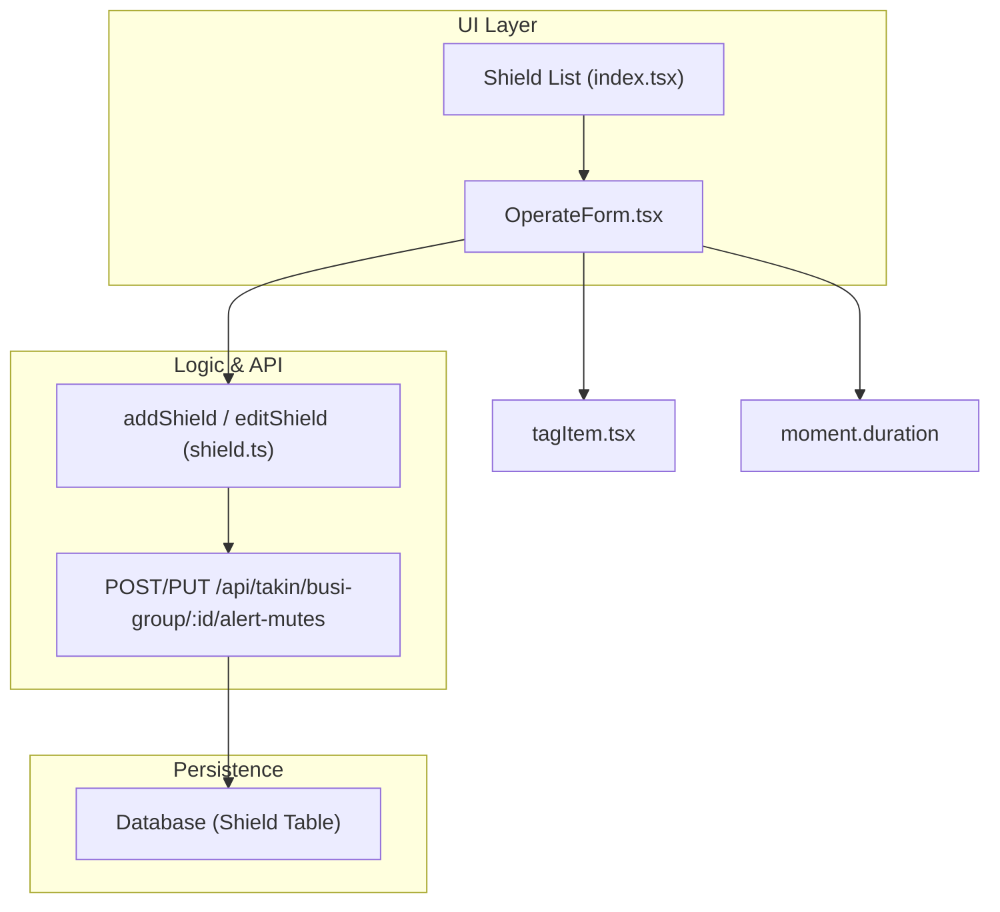
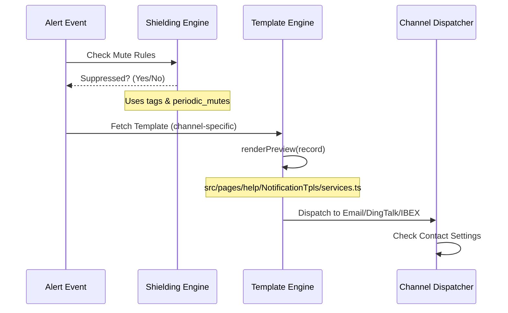

# Alert Subscriptions, Mutes & Notifications
Relevant source files

- [src/pages/account/info.tsx](https://github.com/thetide557/ln-server-pub/blob/629bd918/src/pages/account/info.tsx)
- [src/pages/alertRules/Edit.tsx](https://github.com/thetide557/ln-server-pub/blob/629bd918/src/pages/alertRules/Edit.tsx)
- [src/pages/alertRules/Form/index copy.tsx](https://github.com/thetide557/ln-server-pub/blob/629bd918/src/pages/alertRules/Form/index copy.tsx)
- [src/pages/apiService/index.tsx](https://github.com/thetide557/ln-server-pub/blob/629bd918/src/pages/apiService/index.tsx)
- [src/pages/event/Detail/Prometheus.tsx](https://github.com/thetide557/ln-server-pub/blob/629bd918/src/pages/event/Detail/Prometheus.tsx)
- [src/pages/help/NotificationSettings/IBEX/index.tsx](https://github.com/thetide557/ln-server-pub/blob/629bd918/src/pages/help/NotificationSettings/IBEX/index.tsx)
- [src/pages/help/NotificationSettings/services.ts](https://github.com/thetide557/ln-server-pub/blob/629bd918/src/pages/help/NotificationSettings/services.ts)
- [src/pages/help/NotificationTpls/Editor/components/FieldWithEditor/index.tsx](https://github.com/thetide557/ln-server-pub/blob/629bd918/src/pages/help/NotificationTpls/Editor/components/FieldWithEditor/index.tsx)
- [src/pages/help/NotificationTpls/FormModal.tsx](https://github.com/thetide557/ln-server-pub/blob/629bd918/src/pages/help/NotificationTpls/FormModal.tsx)
- [src/pages/help/NotificationTpls/index.tsx](https://github.com/thetide557/ln-server-pub/blob/629bd918/src/pages/help/NotificationTpls/index.tsx)
- [src/pages/help/NotificationTpls/services.ts](https://github.com/thetide557/ln-server-pub/blob/629bd918/src/pages/help/NotificationTpls/services.ts)
- [src/pages/recordingRules/edit.tsx](https://github.com/thetide557/ln-server-pub/blob/629bd918/src/pages/recordingRules/edit.tsx)
- [src/pages/task/index.tsx](https://github.com/thetide557/ln-server-pub/blob/629bd918/src/pages/task/index.tsx)
- [src/pages/warning/shield/components/operateForm.tsx](https://github.com/thetide557/ln-server-pub/blob/629bd918/src/pages/warning/shield/components/operateForm.tsx)
- [src/pages/warning/shield/index.tsx](https://github.com/thetide557/ln-server-pub/blob/629bd918/src/pages/warning/shield/index.tsx)
- [src/pages/warning/subscribe/components/operateForm.tsx](https://github.com/thetide557/ln-server-pub/blob/629bd918/src/pages/warning/subscribe/components/operateForm.tsx)
- [src/pages/warning/subscribe/components/ruleModal.tsx](https://github.com/thetide557/ln-server-pub/blob/629bd918/src/pages/warning/subscribe/components/ruleModal.tsx)
- [src/pages/warning/subscribe/index.tsx](https://github.com/thetide557/ln-server-pub/blob/629bd918/src/pages/warning/subscribe/index.tsx)
- [src/services/shield.ts](https://github.com/thetide557/ln-server-pub/blob/629bd918/src/services/shield.ts)
- [src/services/subscribe.ts](https://github.com/thetide557/ln-server-pub/blob/629bd918/src/services/subscribe.ts)
- [src/services/warning.ts](https://github.com/thetide557/ln-server-pub/blob/629bd918/src/services/warning.ts)

This section details the mechanisms for forwarding/re-notifying alerts (Subscriptions), suppressing alerts (Muting/Shielding), managing notification templates, and configuring delivery channels within the LingNiu platform. It covers the lifecycle of an alert from subscription/suppression logic to final template rendering and dispatch.

## Alert Subscription Rules

Alert Subscription Rules (`src/pages/warning/subscribe`, route `/alert-subscribes`) let operators forward or re-notify matching alerts to additional recipients, optionally overriding the severity, channels, or webhooks used for the forwarded notification. Unlike Mutes, subscriptions never suppress an alert — they only add extra notification behavior.

### Implementation Details

- Data Structure: The `subscribeItem` interface holds the matching conditions (`tags`, `busi_groups`), an optional bound alert rule (`rule_id`/`rule_name`), datasource/`prod`/`severities` filters, the notified `user_groups`, and the `redefine_severity`/`redefine_channels`/`redefine_webhooks` override flags [src/store/warningInterface/subscribe.ts#17-37](https://github.com/thetide557/ln-server-pub/blob/629bd918/src/store/warningInterface/subscribe.ts#L17-L37)
- Rule Binding: A subscription can optionally be scoped to one specific existing alert rule, chosen from a searchable cross-business-group list via `RuleModal` (backed by `getStrategyGroupSubList`); when no rule is bound, the subscription instead matches any alert whose tags/business-group satisfy the `tags`/`busi_groups` conditions — the same `key`/`func`/`value` triples (`==`, `=~`, `in`, `not in`, `!=`, `!~`) used by Mutes [src/pages/warning/subscribe/components/ruleModal.tsx#239-263](https://github.com/thetide557/ln-server-pub/blob/629bd918/src/pages/warning/subscribe/components/ruleModal.tsx#L239-L263)[src/pages/warning/subscribe/components/operateForm.tsx#222-243](https://github.com/thetide557/ln-server-pub/blob/629bd918/src/pages/warning/subscribe/components/operateForm.tsx#L222-L243)
- Recipients & Overrides: `user_group_ids` adds extra team/user groups to notify; three independent `Switch` toggles let the rule redefine the forwarded severity (`redefine_severity`/`new_severity`), notification channels (`redefine_channels`/`new_channels`), and/or webhook targets (`redefine_webhooks`/`webhooks`) for the forwarded notification only [src/pages/warning/subscribe/components/operateForm.tsx#304-392](https://github.com/thetide557/ln-server-pub/blob/629bd918/src/pages/warning/subscribe/components/operateForm.tsx#L304-L392)
- Persistence: `getSubscribeList`/`addSubscribe`/`editSubscribe`/`deleteSubscribes` in `src/services/subscribe.ts` call `/api/takin/busi-group/{busiId}/alert-subscribes` (GET/POST/PUT/DELETE); a single subscription can also be fetched via `getSubscribeData` at `/api/takin/alert-subscribe/{id}` [src/services/subscribe.ts#20-51](https://github.com/thetide557/ln-server-pub/blob/629bd918/src/services/subscribe.ts#L20-L51)

Sources:[src/pages/warning/subscribe/index.tsx#1-339](https://github.com/thetide557/ln-server-pub/blob/629bd918/src/pages/warning/subscribe/index.tsx#L1-L339)[src/pages/warning/subscribe/components/operateForm.tsx#1-436](https://github.com/thetide557/ln-server-pub/blob/629bd918/src/pages/warning/subscribe/components/operateForm.tsx#L1-L436)[src/services/subscribe.ts#1-52](https://github.com/thetide557/ln-server-pub/blob/629bd918/src/services/subscribe.ts#L1-L52)

## Alert Mutes (Shielding)

Alert Mutes (internally referred to as "Shields") allow operators to suppress notifications for specific alerts based on tags, time ranges, or periodic schedules. This is commonly used during maintenance windows or for known noisy metrics.

### Implementation Details

The shielding logic is managed via the `Shield` component and its associated service layer.

- Data Structure: The `shieldItem` interface defines the suppression criteria, including `tags` (key-value-function triples), `btime`/`etime` (start/end timestamps), and `periodic_mutes` for recurring suppression [src/pages/warning/shield/index.tsx#30](https://github.com/thetide557/ln-server-pub/blob/629bd918/src/pages/warning/shield/index.tsx#L30-L30)[src/pages/warning/shield/components/operateForm.tsx#176-190](https://github.com/thetide557/ln-server-pub/blob/629bd918/src/pages/warning/shield/components/operateForm.tsx#L176-L190)
- Time Management: Supports two types of muting:

1. Fixed Window: Defined by Unix timestamps `btime` and `etime`[src/pages/warning/shield/components/operateForm.tsx#109-110](https://github.com/thetide557/ln-server-pub/blob/629bd918/src/pages/warning/shield/components/operateForm.tsx#L109-L110)
2. Periodic: Defined by `enable_days_of_week` and specific time ranges (e.g., every Monday 02:00-04:00) [src/pages/warning/shield/components/operateForm.tsx#112-118](https://github.com/thetide557/ln-server-pub/blob/629bd918/src/pages/warning/shield/components/operateForm.tsx#L112-L118)
- Tag Matching: Mutes apply to alerts where tags match one of six functions: `==`, `=~` (regex match), `in`, `not in`, `!=`, or `!~` (regex non-match)[src/pages/warning/shield/components/tagItem.tsx#57-65](https://github.com/thetide557/ln-server-pub/blob/629bd918/src/pages/warning/shield/components/tagItem.tsx#L57-L65)

### Mute Configuration Data Flow

Sources:[src/pages/warning/shield/index.tsx#28-35](https://github.com/thetide557/ln-server-pub/blob/629bd918/src/pages/warning/shield/index.tsx#L28-L35)[src/pages/warning/shield/components/operateForm.tsx#25-32](https://github.com/thetide557/ln-server-pub/blob/629bd918/src/pages/warning/shield/components/operateForm.tsx#L25-L32)[src/services/shield.ts#27-46](https://github.com/thetide557/ln-server-pub/blob/629bd918/src/services/shield.ts#L27-L46)

## Notification Templates

Notification templates define how alert data is formatted for different channels (Email, DingTalk, WeChat, etc.). The system supports both built-in and custom templates.

### Template Editing and Preview

- Format Support: Supports HTML (primarily for Email) and Markdown (for IM channels) [src/pages/help/NotificationTpls/index.tsx#137-158](https://github.com/thetide557/ln-server-pub/blob/629bd918/src/pages/help/NotificationTpls/index.tsx#L137-L158)
- Editor: Uses `CodeMirror` for template editing [src/pages/help/NotificationTpls/Editor/components/FieldWithEditor/index.tsx#97](https://github.com/thetide557/ln-server-pub/blob/629bd918/src/pages/help/NotificationTpls/Editor/components/FieldWithEditor/index.tsx#L97-L97)
- Preview Engine: The `previewTemplate` service allows users to see how the template renders with sample data before saving [src/pages/help/NotificationTpls/Editor/components/FieldWithEditor/index.tsx#44-54](https://github.com/thetide557/ln-server-pub/blob/629bd918/src/pages/help/NotificationTpls/Editor/components/FieldWithEditor/index.tsx#L44-L54)
- Built-in Protection: Templates marked as `built_in` cannot be deleted [src/pages/help/NotificationTpls/index.tsx#104-121](https://github.com/thetide557/ln-server-pub/blob/629bd918/src/pages/help/NotificationTpls/index.tsx#L104-L121)

### Code Mapping: Template Entities

| UI Concept | Code Entity | File Reference |
| --- | --- | --- |
| Template List | `NotifyTplsType[]` | [src/pages/help/NotificationTpls/types.ts](https://github.com/thetide557/ln-server-pub/blob/629bd918/src/pages/help/NotificationTpls/types.ts) |
| HTML Editor | `HTML` component | [src/pages/help/NotificationTpls/Editor/HTML.tsx](https://github.com/thetide557/ln-server-pub/blob/629bd918/src/pages/help/NotificationTpls/Editor/HTML.tsx) |
| Markdown Editor | `Markdown` component | [src/pages/help/NotificationTpls/Editor/Markdown.tsx](https://github.com/thetide557/ln-server-pub/blob/629bd918/src/pages/help/NotificationTpls/Editor/Markdown.tsx) |
| API Service | `getNotifyTpls`, `putNotifyTplContent` | [src/pages/help/NotificationTpls/services.ts](https://github.com/thetide557/ln-server-pub/blob/629bd918/src/pages/help/NotificationTpls/services.ts) |

Sources:[src/pages/help/NotificationTpls/index.tsx#7-14](https://github.com/thetide557/ln-server-pub/blob/629bd918/src/pages/help/NotificationTpls/index.tsx#L7-L14)[src/pages/help/NotificationTpls/Editor/components/FieldWithEditor/index.tsx#31-40](https://github.com/thetide557/ln-server-pub/blob/629bd918/src/pages/help/NotificationTpls/Editor/components/FieldWithEditor/index.tsx#L31-L40)

## Notification Routing & Settings

Notifications are routed through specific channels based on the alert rule configuration.

### IBEX Integration

`/help/notification-settings/ibex` is one of the Notification Settings pages; it is titled "自愈配置" (self-healing configuration), but its implementation is a single raw-text config editor — a `CodeMirror` field bound to one `ibex_server` config value, loaded/saved via `getNotifyConfig`/`putNotifyConfig` [src/pages/help/NotificationSettings/IBEX/index.tsx#10-78](https://github.com/thetide557/ln-server-pub/blob/629bd918/src/pages/help/NotificationSettings/IBEX/index.tsx#L10-L78). The alert rule Form/Edit pages and the `job-tasks` list (`src/pages/task/index.tsx`) contain no reference to IBEX or to each other, so this frontend does not implement (or expose) any alert-rule-to-self-healing-task binding — that logic, if it exists, lives outside this codebase.

### Contact-Based Routing

Channel delivery is keyed off each user's own `contacts` map rather than any automatic SSO/LDAP attribute sync: the contact "idents" (e.g. phone/email/DingTalk/WeChat) are defined once in Notification Settings → Contacts, and each user fills in their own values for those idents on the Account Info page, which are then persisted back onto the user profile [src/pages/account/info.tsx#42-49](https://github.com/thetide557/ln-server-pub/blob/629bd918/src/pages/account/info.tsx#L42-L49)[src/pages/account/info.tsx#109-148](https://github.com/thetide557/ln-server-pub/blob/629bd918/src/pages/account/info.tsx#L109-L148). No LDAP/SSO-attribute-to-channel mapping is implemented in this frontend.

### Alert Event Context

`rule_config` (the alert rule's PromQL definition) and `rule_replay` (an optional replay-specific PromQL variant) are stored on the alert rule and echoed onto the resulting event record. They are rendered by the Event Detail page for post-alert investigation, not routed through the notification/channel dispatch pipeline.

- PromQL Replay: The Event Detail page renders "Replay" links for the metric state at the time of the alert using the `PrometheusDetail` component, which jumps to `/metric/explorer` with the original query and a time window centered on the trigger time [src/pages/event/Detail/Prometheus.tsx#39-53](https://github.com/thetide557/ln-server-pub/blob/629bd918/src/pages/event/Detail/Prometheus.tsx#L39-L53)
- Asset Context: Before building the `rule_replay` link, the component replaces `$asset_id` placeholders in the replay PromQL with the actual asset ID from the event [src/pages/event/Detail/Prometheus.tsx#69-71](https://github.com/thetide557/ln-server-pub/blob/629bd918/src/pages/event/Detail/Prometheus.tsx#L69-L71)

### Notification Data Flow Diagram

Sources:[src/pages/event/Detail/Prometheus.tsx#63-72](https://github.com/thetide557/ln-server-pub/blob/629bd918/src/pages/event/Detail/Prometheus.tsx#L63-L72)[src/pages/help/NotificationTpls/index.tsx#131-158](https://github.com/thetide557/ln-server-pub/blob/629bd918/src/pages/help/NotificationTpls/index.tsx#L131-L158)[src/pages/warning/shield/index.tsx#154-189](https://github.com/thetide557/ln-server-pub/blob/629bd918/src/pages/warning/shield/index.tsx#L154-L189)

## Key Functions and Classes

- `addShield` / `editShield`: Functions in `src/services/shield.ts` that handle the persistence of alert suppression rules [src/services/shield.ts#27-46](https://github.com/thetide557/ln-server-pub/blob/629bd918/src/services/shield.ts#L27-L46)
- `updateAlertRulesStatus`: Used to batch enable or disable alert rules, which directly affects whether notifications are generated [src/services/warning.ts#217-229](https://github.com/thetide557/ln-server-pub/blob/629bd918/src/services/warning.ts#L217-L229)
- `previewTemplate`: A critical utility for validating template syntax (Go template / Markdown) against real event data [src/pages/help/NotificationTpls/Editor/components/FieldWithEditor/index.tsx#44](https://github.com/thetide557/ln-server-pub/blob/629bd918/src/pages/help/NotificationTpls/Editor/components/FieldWithEditor/index.tsx#L44-L44)
- `OperateForm` (Shield): A complex form that handles the conversion between UI time pickers and the backend Unix/Periodic format [src/pages/warning/shield/components/operateForm.tsx#100-120](https://github.com/thetide557/ln-server-pub/blob/629bd918/src/pages/warning/shield/components/operateForm.tsx#L100-L120)

Sources:[src/services/shield.ts#1-54](https://github.com/thetide557/ln-server-pub/blob/629bd918/src/services/shield.ts#L1-L54)[src/services/warning.ts#217-229](https://github.com/thetide557/ln-server-pub/blob/629bd918/src/services/warning.ts#L217-L229)[src/pages/help/NotificationTpls/index.tsx#160-173](https://github.com/thetide557/ln-server-pub/blob/629bd918/src/pages/help/NotificationTpls/index.tsx#L160-L173)