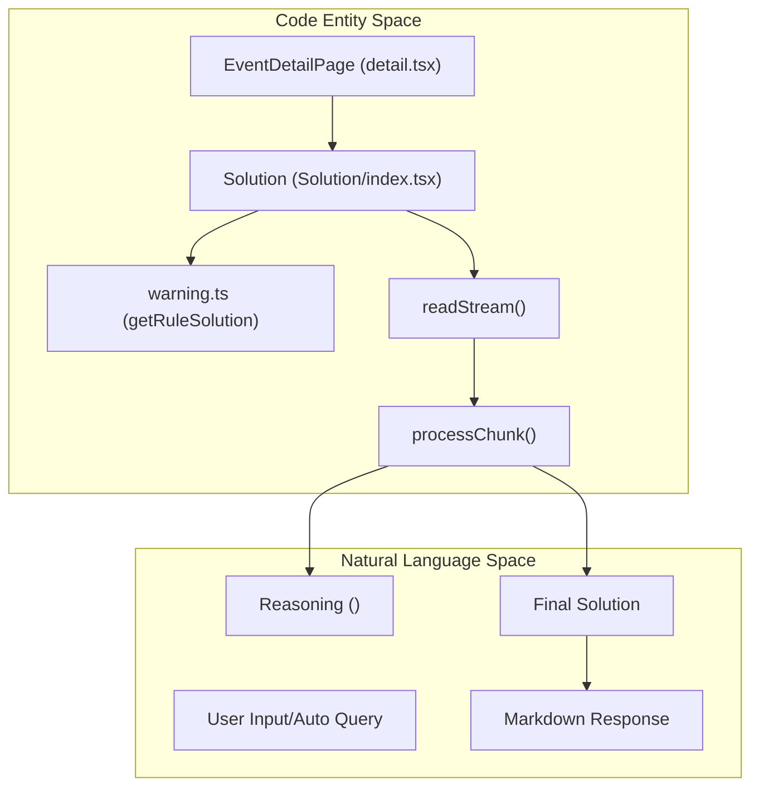
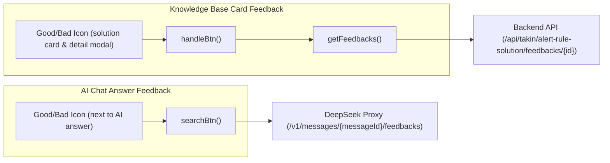

# AI-Assisted Alert Solutions
Relevant source files

- [public/image/alarm/bad1.png](https://github.com/thetide557/ln-server-pub/blob/629bd918/public/image/alarm/bad1.png)
- [public/image/alarm/bad2.png](https://github.com/thetide557/ln-server-pub/blob/629bd918/public/image/alarm/bad2.png)
- [public/image/alarm/detail-card.png](https://github.com/thetide557/ln-server-pub/blob/629bd918/public/image/alarm/detail-card.png)
- [public/image/alarm/detail-title.png](https://github.com/thetide557/ln-server-pub/blob/629bd918/public/image/alarm/detail-title.png)
- [public/image/alarm/good1.png](https://github.com/thetide557/ln-server-pub/blob/629bd918/public/image/alarm/good1.png)
- [public/image/alarm/good2.png](https://github.com/thetide557/ln-server-pub/blob/629bd918/public/image/alarm/good2.png)
- [public/image/alarm/pb-btn.png](https://github.com/thetide557/ln-server-pub/blob/629bd918/public/image/alarm/pb-btn.png)
- [public/image/alarm/solution-card.png](https://github.com/thetide557/ln-server-pub/blob/629bd918/public/image/alarm/solution-card.png)
- [public/image/solution/bad1.png](https://github.com/thetide557/ln-server-pub/blob/629bd918/public/image/solution/bad1.png)
- [public/image/solution/bad2.png](https://github.com/thetide557/ln-server-pub/blob/629bd918/public/image/solution/bad2.png)
- [public/image/solution/bar.png](https://github.com/thetide557/ln-server-pub/blob/629bd918/public/image/solution/bar.png)
- [public/image/solution/card.jpg](https://github.com/thetide557/ln-server-pub/blob/629bd918/public/image/solution/card.jpg)
- [public/image/solution/good1.png](https://github.com/thetide557/ln-server-pub/blob/629bd918/public/image/solution/good1.png)
- [public/image/solution/good2.png](https://github.com/thetide557/ln-server-pub/blob/629bd918/public/image/solution/good2.png)
- [public/image/solution/refresh.png](https://github.com/thetide557/ln-server-pub/blob/629bd918/public/image/solution/refresh.png)
- [src/pages/event/Solution/index.less](https://github.com/thetide557/ln-server-pub/blob/629bd918/src/pages/event/Solution/index.less)
- [src/pages/event/Solution/index.tsx](https://github.com/thetide557/ln-server-pub/blob/629bd918/src/pages/event/Solution/index.tsx)
- [src/pages/event/detail.tsx](https://github.com/thetide557/ln-server-pub/blob/629bd918/src/pages/event/detail.tsx)
- [src/pages/event/locale/zh_CN.ts](https://github.com/thetide557/ln-server-pub/blob/629bd918/src/pages/event/locale/zh_CN.ts)
- [src/pages/sxxc/aiRobot/loading/index.less](https://github.com/thetide557/ln-server-pub/blob/629bd918/src/pages/sxxc/aiRobot/loading/index.less)
- [src/pages/sxxc/aiRobot/loading/index.tsx](https://github.com/thetide557/ln-server-pub/blob/629bd918/src/pages/sxxc/aiRobot/loading/index.tsx)
- [src/pages/sxxc/warnModal/index.less](https://github.com/thetide557/ln-server-pub/blob/629bd918/src/pages/sxxc/warnModal/index.less)
- [src/pages/sxxc/warnModal/index.tsx](https://github.com/thetide557/ln-server-pub/blob/629bd918/src/pages/sxxc/warnModal/index.tsx)
- [src/pages/user/component/addUser/index.tsx](https://github.com/thetide557/ln-server-pub/blob/629bd918/src/pages/user/component/addUser/index.tsx)

The AI-Assisted Alert Solutions module provides automated troubleshooting recommendations and diagnostic insights for alert events. It integrates with the DeepSeek LLM to analyze alert contexts and generate human-readable solutions. The system supports streaming responses via Server-Sent Events (SSE), handles complex "deep-thinking" logic parsing, and includes a feedback loop for continuous improvement of AI suggestions.

## Core Components

The AI solution functionality is primarily delivered through two entry points: the standard event detail page and the high-visibility "Big Screen" operation center.

### Solution Component

The `Solution` component is the primary interface for AI interactions within the alert details view [src/pages/event/detail.tsx#42](https://github.com/thetide557/ln-server-pub/blob/629bd918/src/pages/event/detail.tsx#L42-L42) It handles:

- Knowledge Base Retrieval: Fetches existing rule-based solutions via `getRuleSolution`[src/pages/event/Solution/index.tsx#41-52](https://github.com/thetide557/ln-server-pub/blob/629bd918/src/pages/event/Solution/index.tsx#L41-L52)
- Streaming Chat: Manages the `fetch` request to the AI backend with SSE processing [src/pages/event/Solution/index.tsx#117-138](https://github.com/thetide557/ln-server-pub/blob/629bd918/src/pages/event/Solution/index.tsx#L117-L138)
- Content Parsing: Specifically parses `<think>` tags used by DeepSeek models to separate reasoning from final answers [src/pages/event/Solution/index.tsx#161-179](https://github.com/thetide557/ln-server-pub/blob/629bd918/src/pages/event/Solution/index.tsx#L161-L179)

### WarnModal Integration

In the Operations Center (SXXC), the `WarnModal` provides a specialized version of the AI assistant tailored for large-screen monitoring [src/pages/sxxc/warnModal/index.tsx#18](https://github.com/thetide557/ln-server-pub/blob/629bd918/src/pages/sxxc/warnModal/index.tsx#L18-L18) It combines real-time metric charts (`AlarmChartLine`) with AI diagnostic capabilities [src/pages/sxxc/warnModal/index.tsx#12-13](https://github.com/thetide557/ln-server-pub/blob/629bd918/src/pages/sxxc/warnModal/index.tsx#L12-L13)

Sources:

- [src/pages/event/detail.tsx#42](https://github.com/thetide557/ln-server-pub/blob/629bd918/src/pages/event/detail.tsx#L42-L42)
- [src/pages/event/Solution/index.tsx#16](https://github.com/thetide557/ln-server-pub/blob/629bd918/src/pages/event/Solution/index.tsx#L16-L16)
- [src/pages/sxxc/warnModal/index.tsx#18](https://github.com/thetide557/ln-server-pub/blob/629bd918/src/pages/sxxc/warnModal/index.tsx#L18-L18)

## Technical Architecture

The architecture bridges the gap between structured alert data and natural language AI responses.

### Data Flow: Alert to AI Recommendation

The following diagram illustrates how an alert event ID is transformed into an AI-generated troubleshooting guide.

Alert Diagnostic Flow

Sources:

- [src/pages/event/Solution/index.tsx#95-113](https://github.com/thetide557/ln-server-pub/blob/629bd918/src/pages/event/Solution/index.tsx#L95-L113)
- [src/pages/event/Solution/index.tsx#145-193](https://github.com/thetide557/ln-server-pub/blob/629bd918/src/pages/event/Solution/index.tsx#L145-L193)
- [src/pages/event/Solution/index.tsx#161-174](https://github.com/thetide557/ln-server-pub/blob/629bd918/src/pages/event/Solution/index.tsx#L161-L174)

## SSE Streaming & Token Management

The platform utilizes a streaming interface to provide immediate feedback while the AI model generates content.

### DeepSeek Integration

The system requires a `deepseek_token` stored in `localStorage` for authentication [src/pages/event/Solution/index.tsx#123](https://github.com/thetide557/ln-server-pub/blob/629bd918/src/pages/event/Solution/index.tsx#L123-L123) Requests are sent to the `/v1/chat-messages` endpoint with `response_mode: "streaming"`[src/pages/event/Solution/index.tsx#112-118](https://github.com/thetide557/ln-server-pub/blob/629bd918/src/pages/event/Solution/index.tsx#L112-L118)

### Stream Processing Logic

The `processChunk` function handles the raw buffer from the SSE stream:

1. Prefix Removal: Strips the `data:` prefix from the SSE line [src/pages/event/Solution/index.tsx#74](https://github.com/thetide557/ln-server-pub/blob/629bd918/src/pages/event/Solution/index.tsx#L74-L74)
2. JSON Parsing: Extracts `task_id`, `message_id`, and the partial `answer` string [src/pages/event/Solution/index.tsx#76-85](https://github.com/thetide557/ln-server-pub/blob/629bd918/src/pages/event/Solution/index.tsx#L76-L85)
3. Think Tag Parsing: Uses a regular expression `/<think>(.*?)<\/think>(.*)/s` to isolate the model's internal reasoning from the user-facing solution [src/pages/event/Solution/index.tsx#161-162](https://github.com/thetide557/ln-server-pub/blob/629bd918/src/pages/event/Solution/index.tsx#L161-L162)

| Feature | Implementation |
| --- | --- |
| Timeout | 60 seconds via `fetchWithTimeout`[src/pages/event/Solution/index.tsx#55-64](https://github.com/thetide557/ln-server-pub/blob/629bd918/src/pages/event/Solution/index.tsx#L55-L64) |
| Cancellation | Uses `AbortController` to stop the stream [src/pages/event/Solution/index.tsx#31](https://github.com/thetide557/ln-server-pub/blob/629bd918/src/pages/event/Solution/index.tsx#L31-L31) |
| Loading State | `LoadingDots` component with light/dark theme support [src/pages/sxxc/aiRobot/loading/index.tsx#6-15](https://github.com/thetide557/ln-server-pub/blob/629bd918/src/pages/sxxc/aiRobot/loading/index.tsx#L6-L15) |

Sources:

- [src/pages/event/Solution/index.tsx#31-193](https://github.com/thetide557/ln-server-pub/blob/629bd918/src/pages/event/Solution/index.tsx#L31-L193)
- [src/pages/sxxc/aiRobot/loading/index.tsx#6-15](https://github.com/thetide557/ln-server-pub/blob/629bd918/src/pages/sxxc/aiRobot/loading/index.tsx#L6-L15)

## Feedback and Iteration

To improve the quality of AI suggestions, the platform implements a feedback mechanism (Like/Dislike). Notably, the knowledge-base cards and the AI chat answer each have their **own independent** feedback path — one is not a wrapper around the other.

### Feedback Loop

Feedback Code Entities

These are two separate, independently triggered mechanisms:

- **Knowledge base card feedback**: the Like/Dislike icons on each solution card, and inside the "查看详情" detail modal, call `handleBtn(item, flag, type)`, which is keyed by the solution's own `item.id` and invokes the `getFeedbacks(flag, item.id)` service — a PUT request to the backend at `/api/takin/alert-rule-solution/feedbacks/{id}?favorite={flag}` [src/pages/event/Solution/index.tsx#257-264](https://github.com/thetide557/ln-server-pub/blob/629bd918/src/pages/event/Solution/index.tsx#L257-L264). It does not use `messageId`.
- **AI chat answer feedback**: once a streamed answer yields a `messageId`, separate Like/Dislike icons appear next to the AI conversation box. Clicking them calls `searchBtn(flag)`, which performs its own `fetchWithTimeout` POST directly to the DeepSeek proxy endpoint `/v1/messages/${messageId}/feedbacks`, authenticated with the `deepseek_token` bearer token — entirely bypassing `getFeedbacks` and the backend API [src/pages/event/Solution/index.tsx#266-285](https://github.com/thetide557/ln-server-pub/blob/629bd918/src/pages/event/Solution/index.tsx#L266-L285).

The same pair of independent code paths (`handleBtn`/`getFeedbacks` for cards, `searchBtn`/direct DeepSeek-proxy fetch for chat) is duplicated in `WarnModal` for the Big Screen operation center.

Sources:

- [src/pages/event/Solution/index.tsx#257-264](https://github.com/thetide557/ln-server-pub/blob/629bd918/src/pages/event/Solution/index.tsx#L257-L264)
- [src/pages/event/Solution/index.tsx#266-285](https://github.com/thetide557/ln-server-pub/blob/629bd918/src/pages/event/Solution/index.tsx#L266-L285)
- [src/pages/sxxc/warnModal/index.tsx#269-276](https://github.com/thetide557/ln-server-pub/blob/629bd918/src/pages/sxxc/warnModal/index.tsx#L269-L276)
- [src/pages/sxxc/warnModal/index.tsx#476-495](https://github.com/thetide557/ln-server-pub/blob/629bd918/src/pages/sxxc/warnModal/index.tsx#L476-L495)

## Visual Styles

The AI solution UI uses a card-based layout defined in `index.less`. Key styles include:

- `.ai-card-item`: Defines the container for individual AI suggestions with a custom background image [src/pages/event/Solution/index.less#35-41](https://github.com/thetide557/ln-server-pub/blob/629bd918/src/pages/event/Solution/index.less#L35-L41)
- `.ai-keyword`: Small tags used to highlight relevant keywords within a solution [src/pages/event/Solution/index.less#186-200](https://github.com/thetide557/ln-server-pub/blob/629bd918/src/pages/event/Solution/index.less#L186-L200)
- `.loading-dots`: An animated ellipsis used while waiting for the first chunk of the AI response [src/pages/sxxc/aiRobot/loading/index.less#1-17](https://github.com/thetide557/ln-server-pub/blob/629bd918/src/pages/sxxc/aiRobot/loading/index.less#L1-L17)

Sources:

- [src/pages/event/Solution/index.less#35-200](https://github.com/thetide557/ln-server-pub/blob/629bd918/src/pages/event/Solution/index.less#L35-L200)
- [src/pages/sxxc/aiRobot/loading/index.less#1-17](https://github.com/thetide557/ln-server-pub/blob/629bd918/src/pages/sxxc/aiRobot/loading/index.less#L1-L17)