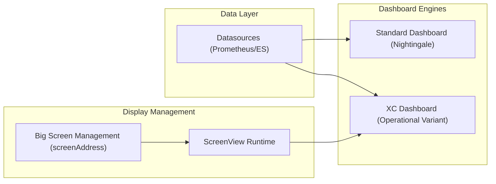
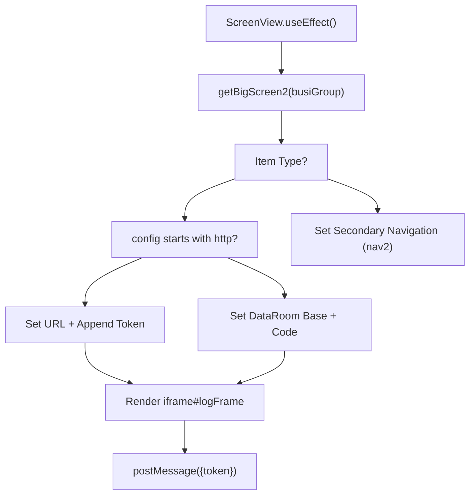

# Dashboards & Visualization
Relevant source files

- [public/image/screenview/back.png](https://github.com/thetide557/ln-server-pub/blob/629bd918/public/image/screenview/back.png)
- [public/image/screenview/back1.png](https://github.com/thetide557/ln-server-pub/blob/629bd918/public/image/screenview/back1.png)
- [public/image/screenview/card1.png](https://github.com/thetide557/ln-server-pub/blob/629bd918/public/image/screenview/card1.png)
- [public/image/screenview/card2.png](https://github.com/thetide557/ln-server-pub/blob/629bd918/public/image/screenview/card2.png)
- [public/image/screenview/card3.png](https://github.com/thetide557/ln-server-pub/blob/629bd918/public/image/screenview/card3.png)
- [public/image/screenview/card4.png](https://github.com/thetide557/ln-server-pub/blob/629bd918/public/image/screenview/card4.png)
- [public/image/screenview/card5.png](https://github.com/thetide557/ln-server-pub/blob/629bd918/public/image/screenview/card5.png)
- [public/image/screenview/card6.png](https://github.com/thetide557/ln-server-pub/blob/629bd918/public/image/screenview/card6.png)
- [src/pages/dashboard/Editor/Fields/StandardOptions/index.tsx](https://github.com/thetide557/ln-server-pub/blob/629bd918/src/pages/dashboard/Editor/Fields/StandardOptions/index.tsx)
- [src/pages/dashboard/locale/zh_CN.ts](https://github.com/thetide557/ln-server-pub/blob/629bd918/src/pages/dashboard/locale/zh_CN.ts)
- [src/pages/dashboard/locale/zh_HK.ts](https://github.com/thetide557/ln-server-pub/blob/629bd918/src/pages/dashboard/locale/zh_HK.ts)
- [src/pages/help/SSOConfigs/index.tsx](https://github.com/thetide557/ln-server-pub/blob/629bd918/src/pages/help/SSOConfigs/index.tsx)
- [src/pages/sxxc/dashboardxc/Detail/Title.tsx](https://github.com/thetide557/ln-server-pub/blob/629bd918/src/pages/sxxc/dashboardxc/Detail/Title.tsx)
- [src/pages/sxxc/dashboardxc/Detail/titleStyle.less](https://github.com/thetide557/ln-server-pub/blob/629bd918/src/pages/sxxc/dashboardxc/Detail/titleStyle.less)
- [src/pages/sxxc/dashboardxc/Editor/Fields/StandardOptions/index.tsx](https://github.com/thetide557/ln-server-pub/blob/629bd918/src/pages/sxxc/dashboardxc/Editor/Fields/StandardOptions/index.tsx)
- [src/pages/sxxc/dashboardxc/locale/zh_CN.ts](https://github.com/thetide557/ln-server-pub/blob/629bd918/src/pages/sxxc/dashboardxc/locale/zh_CN.ts)
- [src/pages/sxxc/screenAddress/Add.tsx](https://github.com/thetide557/ln-server-pub/blob/629bd918/src/pages/sxxc/screenAddress/Add.tsx)
- [src/pages/sxxc/screenAddress/Detail.tsx](https://github.com/thetide557/ln-server-pub/blob/629bd918/src/pages/sxxc/screenAddress/Detail.tsx)
- [src/pages/sxxc/screenAddress/Edit.tsx](https://github.com/thetide557/ln-server-pub/blob/629bd918/src/pages/sxxc/screenAddress/Edit.tsx)
- [src/pages/sxxc/screenAddress/Form/index.tsx](https://github.com/thetide557/ln-server-pub/blob/629bd918/src/pages/sxxc/screenAddress/Form/index.tsx)
- [src/pages/sxxc/screenAddress/index.tsx](https://github.com/thetide557/ln-server-pub/blob/629bd918/src/pages/sxxc/screenAddress/index.tsx)
- [src/pages/sxxc/screenView/index.tsx](https://github.com/thetide557/ln-server-pub/blob/629bd918/src/pages/sxxc/screenView/index.tsx)
- [src/services/sxxc/bigScreen.ts](https://github.com/thetide557/ln-server-pub/blob/629bd918/src/services/sxxc/bigScreen.ts)

The Dashboards & Visualization system provides a flexible framework for monitoring metrics through interactive charts, specialized operational views, and large-screen display management. The platform supports two primary dashboarding engines: the Standard Dashboard (inherited from Nightingale) and the XC Dashboard (a customized operational variant sharing the same underlying board/panel data model, rendered via a distinct route). Additionally, a Big Screen (大屏) management module allows for the orchestration of high-impact visual displays and carousel cycling through multiple internal screens.

### Visualization Architecture

The system bridges metric data sources (primarily Prometheus) to visual components through a series of specialized renderers and configuration handlers.

Dashboard System Overview

Sources: [src/services/sxxc/bigScreen.ts#84-110](https://github.com/thetide557/ln-server-pub/blob/629bd918/src/services/sxxc/bigScreen.ts#L84-L110)[src/pages/sxxc/screenView/index.tsx#27-42](https://github.com/thetide557/ln-server-pub/blob/629bd918/src/pages/sxxc/screenView/index.tsx#L27-L42)

---

### [6.1 Standard Dashboard (Nightingale)](https://github.com/thetide557/ln-server-pub/blob/629bd918/6.1 Standard Dashboard (Nightingale))

The standard dashboard module is the core visualization tool for general performance monitoring. It features a robust panel editor and supports a wide variety of visualization types including Timeseries, Stat, Gauge, Table, and Hexbin.

- Panel Configuration: Users can define units (SI/IEC), decimal precision, and thresholds for color-coding metrics [src/pages/dashboard/Editor/Fields/StandardOptions/index.tsx#42-98](https://github.com/thetide557/ln-server-pub/blob/629bd918/src/pages/dashboard/Editor/Fields/StandardOptions/index.tsx#L42-L98)
- Variable System: Supports dynamic variables (Query, Custom, Constant, Datasource) to create templated dashboards that filter data based on user selection [src/pages/dashboard/locale/zh_CN.ts#64-98](https://github.com/thetide557/ln-server-pub/blob/629bd918/src/pages/dashboard/locale/zh_CN.ts#L64-L98)
- Time Management: Includes a global time range picker and auto-refresh intervals [src/pages/dashboard/locale/zh_CN.ts#8-9](https://github.com/thetide557/ln-server-pub/blob/629bd918/src/pages/dashboard/locale/zh_CN.ts#L8-L9)

For details, see [Standard Dashboard (Nightingale)](/org/benjamin-braddock/wiki/thetide557/ln-server-pub/page/6.1?branch=v2.1).

---

### [6.2 XC Dashboard (dashboardxc)](https://github.com/thetide557/ln-server-pub/blob/629bd918/6.2 XC Dashboard (dashboardxc))

The XC Dashboard is a specialized variant designed for specific operational requirements, often used in large-screen or command-center contexts. It reuses the same underlying board/panel data model as the Standard Dashboard but is rendered through a distinct route (`/dashboardsxc/:id`) with a custom header.

- Business Group Switching: The XC header's "项目组" dropdown lets users jump to the dashboard bound to a different business group, resolved via `getBigScreen2`/`getDashboards` and `goBoard` [src/pages/sxxc/dashboardxc/Detail/Title.tsx#145-154](https://github.com/thetide557/ln-server-pub/blob/629bd918/src/pages/sxxc/dashboardxc/Detail/Title.tsx#L145-L154)
- Note: `Title.tsx` also contains code for linking a dashboard to a specific asset type (`setDashboardAssetType`) and for resetting a board from a template (`getDashboardTemplate`), but the buttons and modals that would trigger these (lines ~297-332, ~395-435) are commented out and are not reachable from the current UI [src/pages/sxxc/dashboardxc/Detail/Title.tsx#101-105](https://github.com/thetide557/ln-server-pub/blob/629bd918/src/pages/sxxc/dashboardxc/Detail/Title.tsx#L101-L105)
- View Modes: Optimized for `fullscreen` and `dark` themes to match command center aesthetics [src/pages/sxxc/dashboardxc/Detail/Title.tsx#65-67](https://github.com/thetide557/ln-server-pub/blob/629bd918/src/pages/sxxc/dashboardxc/Detail/Title.tsx#L65-L67)

For details, see [XC Dashboard (dashboardxc)](/org/benjamin-braddock/wiki/thetide557/ln-server-pub/page/6.2?branch=v2.1).

---

### [6.3 Big Screen (大屏) Management & Viewer](https://github.com/thetide557/ln-server-pub/blob/629bd918/6.3 Big Screen (大屏) Management & Viewer)

The Big Screen module manages high-level visual displays, including integration with external "DataRoom" components and carousel cycling across multiple internal screens.

- Configuration (screenAddress): Admins define screen types — Level 1 ("一级大屏", an actual visual screen with a `config` value that is either a URL or an internal DataRoom code, plus a navigation template) and Level 2 ("二级大屏", a lightweight business-group entry with no `config`/URL, used only to populate the secondary "项目组" navigation) [src/pages/sxxc/screenAddress/Form/index.tsx#149-168](https://github.com/thetide557/ln-server-pub/blob/629bd918/src/pages/sxxc/screenAddress/Form/index.tsx#L149-L168)
- ScreenView Runtime: The viewer component handles the actual rendering. It supports an `iframe` based integration with a `postMessage` handshake to pass authentication tokens to embedded sub-applications [src/pages/sxxc/screenView/index.tsx#48-53](https://github.com/thetide557/ln-server-pub/blob/629bd918/src/pages/sxxc/screenView/index.tsx#L48-L53)
- Carousel Mode: Can automatically cycle through multiple Level 1 screens whose `config` is an internal DataRoom code and whose `carousel_mode` is set to "轮播", using the configured `carousel_interval`. Screens whose `config` is an external URL are excluded from the auto-cycling carousel even if carousel mode is enabled [src/pages/sxxc/screenView/index.tsx#116-135](https://github.com/thetide557/ln-server-pub/blob/629bd918/src/pages/sxxc/screenView/index.tsx#L116-L135)

Big Screen Entity Mapping

| Code Entity | System Role | File Path |
| --- | --- | --- |
| `getBigScreen2` | API Service to fetch screen list | [src/services/sxxc/bigScreen.ts#106-110](https://github.com/thetide557/ln-server-pub/blob/629bd918/src/services/sxxc/bigScreen.ts#L106-L110) |
| `ScreenView` | Runtime viewer and carousel controller | [src/pages/sxxc/screenView/index.tsx#27](https://github.com/thetide557/ln-server-pub/blob/629bd918/src/pages/sxxc/screenView/index.tsx#L27-L27) |
| `nav_template` | CSS string for custom border/header styles | [src/pages/sxxc/screenAddress/Form/index.tsx#56](https://github.com/thetide557/ln-server-pub/blob/629bd918/src/pages/sxxc/screenAddress/Form/index.tsx#L56-L56) |
| `logFrame` | Iframe id/class hosting either the internal DataRoom viewer or an external URL (token appended) | [src/pages/sxxc/screenView/index.tsx#49](https://github.com/thetide557/ln-server-pub/blob/629bd918/src/pages/sxxc/screenView/index.tsx#L49-L49) |

For details, see [Big Screen (大屏) Management & Viewer](/org/benjamin-braddock/wiki/thetide557/ln-server-pub/page/6.3?branch=v2.1).

---

### Visual Component Logic

The following diagram illustrates how the `ScreenView` component resolves a configuration into a displayed dashboard or external site.

ScreenView Resolution Logic

Sources: [src/pages/sxxc/screenView/index.tsx#101-151](https://github.com/thetide557/ln-server-pub/blob/629bd918/src/pages/sxxc/screenView/index.tsx#L101-L151)[src/pages/sxxc/screenView/index.tsx#194-207](https://github.com/thetide557/ln-server-pub/blob/629bd918/src/pages/sxxc/screenView/index.tsx#L194-L207)