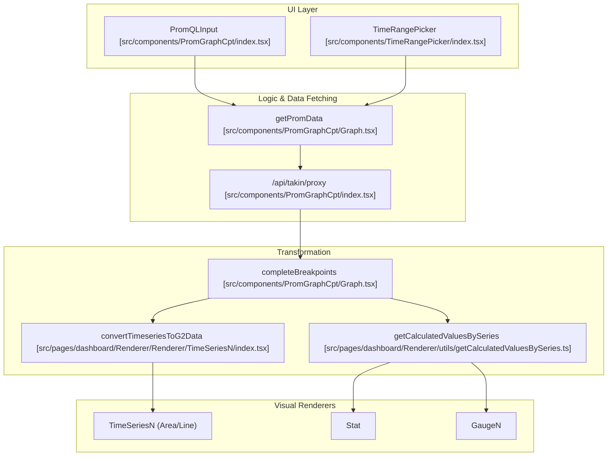
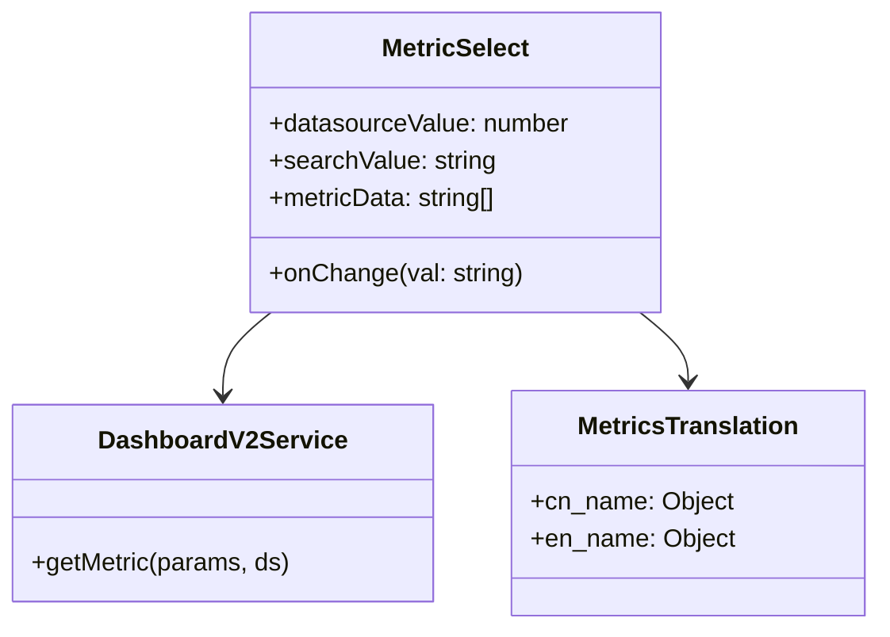

# Standard Dashboard (Nightingale)
Relevant source files

- [src/components/PromGraphCpt/Graph.tsx](https://github.com/thetide557/ln-server-pub/blob/629bd918/src/components/PromGraphCpt/Graph.tsx)
- [src/components/PromGraphCpt/index.tsx](https://github.com/thetide557/ln-server-pub/blob/629bd918/src/components/PromGraphCpt/index.tsx)
- [src/components/PromQueryBuilder/MetricSelect/index.tsx](https://github.com/thetide557/ln-server-pub/blob/629bd918/src/components/PromQueryBuilder/MetricSelect/index.tsx)
- [src/pages/dashboard/Detail/Title.tsx](https://github.com/thetide557/ln-server-pub/blob/629bd918/src/pages/dashboard/Detail/Title.tsx)
- [src/pages/dashboard/Editor/Fields/StandardOptions/index.tsx](https://github.com/thetide557/ln-server-pub/blob/629bd918/src/pages/dashboard/Editor/Fields/StandardOptions/index.tsx)
- [src/pages/dashboard/Renderer/Renderer/BarGauge/index.tsx](https://github.com/thetide557/ln-server-pub/blob/629bd918/src/pages/dashboard/Renderer/Renderer/BarGauge/index.tsx)
- [src/pages/dashboard/Renderer/Renderer/Column/index.tsx](https://github.com/thetide557/ln-server-pub/blob/629bd918/src/pages/dashboard/Renderer/Renderer/Column/index.tsx)
- [src/pages/dashboard/Renderer/Renderer/Gauge/index.tsx](https://github.com/thetide557/ln-server-pub/blob/629bd918/src/pages/dashboard/Renderer/Renderer/Gauge/index.tsx)
- [src/pages/dashboard/Renderer/Renderer/GaugeN/index.tsx](https://github.com/thetide557/ln-server-pub/blob/629bd918/src/pages/dashboard/Renderer/Renderer/GaugeN/index.tsx)
- [src/pages/dashboard/Renderer/Renderer/Hexbin/index.tsx](https://github.com/thetide557/ln-server-pub/blob/629bd918/src/pages/dashboard/Renderer/Renderer/Hexbin/index.tsx)
- [src/pages/dashboard/Renderer/Renderer/Line/index.tsx](https://github.com/thetide557/ln-server-pub/blob/629bd918/src/pages/dashboard/Renderer/Renderer/Line/index.tsx)
- [src/pages/dashboard/Renderer/Renderer/Pie/index.tsx](https://github.com/thetide557/ln-server-pub/blob/629bd918/src/pages/dashboard/Renderer/Renderer/Pie/index.tsx)
- [src/pages/dashboard/Renderer/Renderer/Stat/index.tsx](https://github.com/thetide557/ln-server-pub/blob/629bd918/src/pages/dashboard/Renderer/Renderer/Stat/index.tsx)
- [src/pages/dashboard/Renderer/Renderer/Table/index.tsx](https://github.com/thetide557/ln-server-pub/blob/629bd918/src/pages/dashboard/Renderer/Renderer/Table/index.tsx)
- [src/pages/dashboard/Renderer/Renderer/TimeSeriesN/index.tsx](https://github.com/thetide557/ln-server-pub/blob/629bd918/src/pages/dashboard/Renderer/Renderer/TimeSeriesN/index.tsx)
- [src/pages/dashboard/locale/zh_CN.ts](https://github.com/thetide557/ln-server-pub/blob/629bd918/src/pages/dashboard/locale/zh_CN.ts)
- [src/pages/dashboard/locale/zh_HK.ts](https://github.com/thetide557/ln-server-pub/blob/629bd918/src/pages/dashboard/locale/zh_HK.ts)
- [src/pages/help/SSOConfigs/index.tsx](https://github.com/thetide557/ln-server-pub/blob/629bd918/src/pages/help/SSOConfigs/index.tsx)
- [src/pages/sxxc/dashboardxc/Editor/Fields/StandardOptions/index.tsx](https://github.com/thetide557/ln-server-pub/blob/629bd918/src/pages/sxxc/dashboardxc/Editor/Fields/StandardOptions/index.tsx)
- [src/pages/sxxc/dashboardxc/locale/zh_CN.ts](https://github.com/thetide557/ln-server-pub/blob/629bd918/src/pages/sxxc/dashboardxc/locale/zh_CN.ts)
- [src/pages/taskTpl/index.tsx](https://github.com/thetide557/ln-server-pub/blob/629bd918/src/pages/taskTpl/index.tsx)

The Standard Dashboard module, based on the Nightingale (夜莺) monitoring system, provides a comprehensive visualization layer for metric data. It supports dynamic panel creation, variable-driven filtering, and a wide array of renderer types including time-series graphs, stats, gauges, and tables.

### Data Flow and Architecture

The dashboard architecture bridges raw PromQL queries to visual representations through a structured pipeline:

1. Variable Resolution: User-selected variables are injected into queries.
2. Data Fetching: The `PromGraphCpt` or Dashboard Detail view triggers requests to the datasource proxy.
3. Transformation: Raw Prometheus/VictoriaMetrics results are converted into standardized series formats.
4. Rendering: Specific renderer components (e.g., `TimeSeriesN`, `Stat`) apply visual styles and formatting.

#### Logic Flow: Dashboard Query to Render

The following diagram illustrates how a query moves from the UI input to a rendered graph.

Diagram: Query Execution and Rendering Flow

Sources:[src/components/PromGraphCpt/index.tsx#171-185](https://github.com/thetide557/ln-server-pub/blob/629bd918/src/components/PromGraphCpt/index.tsx#L171-L185)[src/components/PromGraphCpt/Graph.tsx#107-147](https://github.com/thetide557/ln-server-pub/blob/629bd918/src/components/PromGraphCpt/Graph.tsx#L107-L147)[src/pages/dashboard/Renderer/Renderer/TimeSeriesN/index.tsx#27-33](https://github.com/thetide557/ln-server-pub/blob/629bd918/src/pages/dashboard/Renderer/Renderer/TimeSeriesN/index.tsx#L27-L33)

---

### Dashboard Detail and Global Controls

The dashboard detail view is managed via `Title.tsx`, which handles global actions such as time range selection, variable configuration, and panel management.

- Time Range Picker: Utilizes `TimeRangePickerWithRefresh` to manage the observation window and auto-refresh intervals [src/pages/dashboard/Detail/Title.tsx#189-195](https://github.com/thetide557/ln-server-pub/blob/629bd918/src/pages/dashboard/Detail/Title.tsx#L189-L195)
- Variable Configuration: The `VariableConfig` component allows users to define and select variables that dynamically update panel queries [src/pages/dashboard/Detail/Title.tsx#186-188](https://github.com/thetide557/ln-server-pub/blob/629bd918/src/pages/dashboard/Detail/Title.tsx#L186-L188)
- Asset Integration: Dashboards can be associated with specific asset types using `setDashboardAssetType`[src/pages/dashboard/Detail/Title.tsx#99-105](https://github.com/thetide557/ln-server-pub/blob/629bd918/src/pages/dashboard/Detail/Title.tsx#L99-L105)

Sources:[src/pages/dashboard/Detail/Title.tsx#57-200](https://github.com/thetide557/ln-server-pub/blob/629bd918/src/pages/dashboard/Detail/Title.tsx#L57-L200)

---

### Panel Editor and Standard Options

The Panel Editor allows fine-grained control over how data is displayed. The `StandardOptions` component provides universal settings for all panel types.

| Option | Description | Code Reference |
| --- | --- | --- |
| Unit | Supports SI (1000), IEC (1024), Percent, and Time formats. | [src/pages/dashboard/Editor/Fields/StandardOptions/index.tsx#76-98](https://github.com/thetide557/ln-server-pub/blob/629bd918/src/pages/dashboard/Editor/Fields/StandardOptions/index.tsx#L76-L98) |
| Customized Unit | Allows manual entry of units if presets are insufficient. | [src/pages/dashboard/Editor/Fields/StandardOptions/index.tsx#112-117](https://github.com/thetide557/ln-server-pub/blob/629bd918/src/pages/dashboard/Editor/Fields/StandardOptions/index.tsx#L112-L117) |
| Min/Max | Defines the Y-axis or Gauge boundaries. | [src/pages/dashboard/Editor/Fields/StandardOptions/index.tsx#133-141](https://github.com/thetide557/ln-server-pub/blob/629bd918/src/pages/dashboard/Editor/Fields/StandardOptions/index.tsx#L133-L141) |
| Decimals | Controls numerical precision. | [src/pages/dashboard/Editor/Fields/StandardOptions/index.tsx#143-146](https://github.com/thetide557/ln-server-pub/blob/629bd918/src/pages/dashboard/Editor/Fields/StandardOptions/index.tsx#L143-L146) |
| Thresholds | Defines color steps for values (e.g., Green for OK, Red for Critical). | [src/pages/dashboard/locale/zh_CN.ts#151-154](https://github.com/thetide557/ln-server-pub/blob/629bd918/src/pages/dashboard/locale/zh_CN.ts#L151-L154) |

Sources:[src/pages/dashboard/Editor/Fields/StandardOptions/index.tsx#32-151](https://github.com/thetide557/ln-server-pub/blob/629bd918/src/pages/dashboard/Editor/Fields/StandardOptions/index.tsx#L32-L151)[src/pages/dashboard/locale/zh_CN.ts#178-195](https://github.com/thetide557/ln-server-pub/blob/629bd918/src/pages/dashboard/locale/zh_CN.ts#L178-L195)

---

### Renderer Types

The system supports multiple visualization types, each specialized for different data patterns.

#### 1. TimeSeries (Line/Area)

The `TimeSeriesN` component uses `@ant-design/plots` to render trend data.

- Smoothness: Controlled by `lineInterpolation`[src/pages/dashboard/Renderer/Renderer/TimeSeriesN/index.tsx#57](https://github.com/thetide557/ln-server-pub/blob/629bd918/src/pages/dashboard/Renderer/Renderer/TimeSeriesN/index.tsx#L57-L57)
- Stacking: Supports normal stacking via `isStack`[src/pages/dashboard/Renderer/Renderer/TimeSeriesN/index.tsx#58](https://github.com/thetide557/ln-server-pub/blob/629bd918/src/pages/dashboard/Renderer/Renderer/TimeSeriesN/index.tsx#L58-L58)
- Annotations: Thresholds are rendered as dashed lines across the chart [src/pages/dashboard/Renderer/Renderer/TimeSeriesN/index.tsx#114-124](https://github.com/thetide557/ln-server-pub/blob/629bd918/src/pages/dashboard/Renderer/Renderer/TimeSeriesN/index.tsx#L114-L124)

#### 2. Stat and Gauge

- Stat: Displays a single aggregate value (Last, Max, Avg) with optional background coloring based on thresholds.
- Gauge / GaugeN: Displays values on a circular or semi-circular scale.

#### 3. Hexbin

Used for high-density heatmaps. It supports automatic `min/max` calculation from series data and color domain inversion [src/pages/dashboard/locale/zh_CN.ts#218-221](https://github.com/thetide557/ln-server-pub/blob/629bd918/src/pages/dashboard/locale/zh_CN.ts#L218-L221)

#### 4. Table

The table renderer allows transforming series into rows and columns.

- Aggregation: Supports displaying labels as columns or aggregating by specific dimensions [src/pages/dashboard/locale/zh_CN.ts#237-241](https://github.com/thetide557/ln-server-pub/blob/629bd918/src/pages/dashboard/locale/zh_CN.ts#L237-L241)
- Formatting: Values within cells are processed by `valueFormatter` to apply units and decimals.

Sources:[src/pages/dashboard/Renderer/Renderer/TimeSeriesN/index.tsx#51-132](https://github.com/thetide557/ln-server-pub/blob/629bd918/src/pages/dashboard/Renderer/Renderer/TimeSeriesN/index.tsx#L51-L132)[src/pages/dashboard/locale/zh_CN.ts#199-283](https://github.com/thetide557/ln-server-pub/blob/629bd918/src/pages/dashboard/locale/zh_CN.ts#L199-L283)

---

### PromQL Query Builder

For users unfamiliar with raw PromQL, the `PromQueryBuilderModal` provides a visual interface to construct queries.

- Metric Selection: `MetricSelect` provides an `AutoComplete` component that searches for available metrics and displays Chinese/English translations for metric names [src/components/PromQueryBuilder/MetricSelect/index.tsx#54-79](https://github.com/thetide557/ln-server-pub/blob/629bd918/src/components/PromQueryBuilder/MetricSelect/index.tsx#L54-L79)
- Metric Translation: Uses a dictionary (`cn_name`, `en_name`) to provide human-readable descriptions for technical metric keys [src/components/PromQueryBuilder/MetricSelect/index.tsx#33-44](https://github.com/thetide557/ln-server-pub/blob/629bd918/src/components/PromQueryBuilder/MetricSelect/index.tsx#L33-L44)

Diagram: Metric Selection Logic

Sources:[src/components/PromQueryBuilder/MetricSelect/index.tsx#18-101](https://github.com/thetide557/ln-server-pub/blob/629bd918/src/components/PromQueryBuilder/MetricSelect/index.tsx#L18-L101)[src/components/PromGraphCpt/index.tsx#108-121](https://github.com/thetide557/ln-server-pub/blob/629bd918/src/components/PromGraphCpt/index.tsx#L108-L121)

---

### Sharing and Embedding

Dashboards support external integration through several mechanisms:

- Public Access: Dashboards can be set to "Public" mode for unauthorized viewing [src/pages/dashboard/locale/zh_CN.ts#11-21](https://github.com/thetide557/ln-server-pub/blob/629bd918/src/pages/dashboard/locale/zh_CN.ts#L11-L21)
- Full Screen Mode: Toggled via a `viewMode=fullscreen` query parameter (also applied automatically to the "分享" share link from the dashboard list), it hides normal chrome and exposes a dark/light theme switch for wall-display viewing [src/pages/dashboard/Detail/Title.tsx#202-205](https://github.com/thetide557/ln-server-pub/blob/629bd918/src/pages/dashboard/Detail/Title.tsx#L202-L205)
- Iframe Embedding: The `iframe` renderer allows embedding external pages (like DataRoom or Topology) directly into a dashboard panel [src/pages/dashboard/locale/zh_HK.ts#284-286](https://github.com/thetide557/ln-server-pub/blob/629bd918/src/pages/dashboard/locale/zh_HK.ts#L284-L286)

Sources:[src/pages/dashboard/Detail/Title.tsx#65-206](https://github.com/thetide557/ln-server-pub/blob/629bd918/src/pages/dashboard/Detail/Title.tsx#L65-L206)[src/pages/dashboard/locale/zh_CN.ts#10-27](https://github.com/thetide557/ln-server-pub/blob/629bd918/src/pages/dashboard/locale/zh_CN.ts#L10-L27)