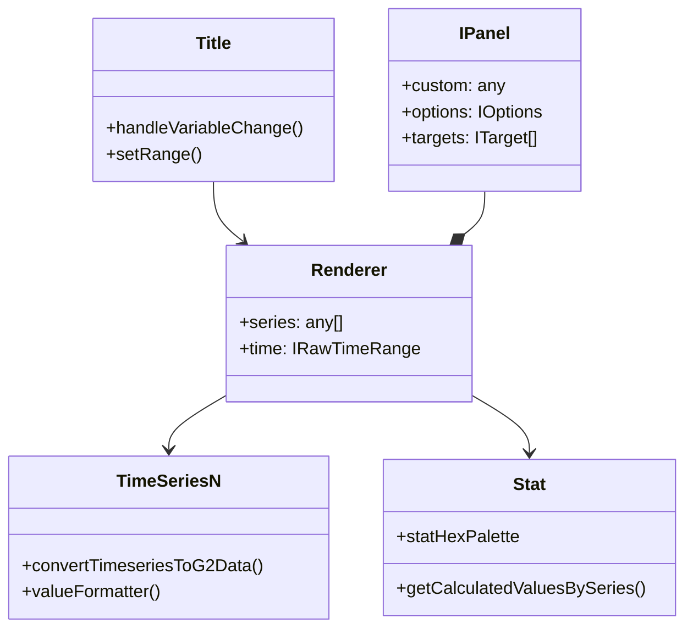

# XC Dashboard (dashboardxc)
Relevant source files

- [public/image/screenview/back.png](https://github.com/thetide557/ln-server-pub/blob/629bd918/public/image/screenview/back.png)
- [public/image/screenview/back1.png](https://github.com/thetide557/ln-server-pub/blob/629bd918/public/image/screenview/back1.png)
- [public/image/screenview/card1.png](https://github.com/thetide557/ln-server-pub/blob/629bd918/public/image/screenview/card1.png)
- [public/image/screenview/card2.png](https://github.com/thetide557/ln-server-pub/blob/629bd918/public/image/screenview/card2.png)
- [public/image/screenview/card3.png](https://github.com/thetide557/ln-server-pub/blob/629bd918/public/image/screenview/card3.png)
- [public/image/screenview/card4.png](https://github.com/thetide557/ln-server-pub/blob/629bd918/public/image/screenview/card4.png)
- [public/image/screenview/card5.png](https://github.com/thetide557/ln-server-pub/blob/629bd918/public/image/screenview/card5.png)
- [public/image/screenview/card6.png](https://github.com/thetide557/ln-server-pub/blob/629bd918/public/image/screenview/card6.png)
- [src/pages/dashboard/Renderer/Renderer/Hexbin/render.ts](https://github.com/thetide557/ln-server-pub/blob/629bd918/src/pages/dashboard/Renderer/Renderer/Hexbin/render.ts)
- [src/pages/sxxc/dashboardxc/Detail/Title.tsx](https://github.com/thetide557/ln-server-pub/blob/629bd918/src/pages/sxxc/dashboardxc/Detail/Title.tsx)
- [src/pages/sxxc/dashboardxc/Detail/titleStyle.less](https://github.com/thetide557/ln-server-pub/blob/629bd918/src/pages/sxxc/dashboardxc/Detail/titleStyle.less)
- [src/pages/sxxc/dashboardxc/Panels/Row.tsx](https://github.com/thetide557/ln-server-pub/blob/629bd918/src/pages/sxxc/dashboardxc/Panels/Row.tsx)
- [src/pages/sxxc/dashboardxc/Panels/index.tsx](https://github.com/thetide557/ln-server-pub/blob/629bd918/src/pages/sxxc/dashboardxc/Panels/index.tsx)
- [src/pages/sxxc/dashboardxc/Renderer/Renderer/BarGauge/index.tsx](https://github.com/thetide557/ln-server-pub/blob/629bd918/src/pages/sxxc/dashboardxc/Renderer/Renderer/BarGauge/index.tsx)
- [src/pages/sxxc/dashboardxc/Renderer/Renderer/Column/index.tsx](https://github.com/thetide557/ln-server-pub/blob/629bd918/src/pages/sxxc/dashboardxc/Renderer/Renderer/Column/index.tsx)
- [src/pages/sxxc/dashboardxc/Renderer/Renderer/Gauge/index.tsx](https://github.com/thetide557/ln-server-pub/blob/629bd918/src/pages/sxxc/dashboardxc/Renderer/Renderer/Gauge/index.tsx)
- [src/pages/sxxc/dashboardxc/Renderer/Renderer/GaugeN/index.tsx](https://github.com/thetide557/ln-server-pub/blob/629bd918/src/pages/sxxc/dashboardxc/Renderer/Renderer/GaugeN/index.tsx)
- [src/pages/sxxc/dashboardxc/Renderer/Renderer/Hexbin/index.tsx](https://github.com/thetide557/ln-server-pub/blob/629bd918/src/pages/sxxc/dashboardxc/Renderer/Renderer/Hexbin/index.tsx)
- [src/pages/sxxc/dashboardxc/Renderer/Renderer/Hexbin/render.ts](https://github.com/thetide557/ln-server-pub/blob/629bd918/src/pages/sxxc/dashboardxc/Renderer/Renderer/Hexbin/render.ts)
- [src/pages/sxxc/dashboardxc/Renderer/Renderer/Line/index.tsx](https://github.com/thetide557/ln-server-pub/blob/629bd918/src/pages/sxxc/dashboardxc/Renderer/Renderer/Line/index.tsx)
- [src/pages/sxxc/dashboardxc/Renderer/Renderer/Stat/index.tsx](https://github.com/thetide557/ln-server-pub/blob/629bd918/src/pages/sxxc/dashboardxc/Renderer/Renderer/Stat/index.tsx)
- [src/pages/sxxc/dashboardxc/Renderer/Renderer/Table/index.tsx](https://github.com/thetide557/ln-server-pub/blob/629bd918/src/pages/sxxc/dashboardxc/Renderer/Renderer/Table/index.tsx)
- [src/pages/sxxc/dashboardxc/Renderer/Renderer/TimeSeriesN/index.tsx](https://github.com/thetide557/ln-server-pub/blob/629bd918/src/pages/sxxc/dashboardxc/Renderer/Renderer/TimeSeriesN/index.tsx)
- [src/pages/sxxc/dashboardxc/Renderer/Renderer/Timeseries/index.tsx](https://github.com/thetide557/ln-server-pub/blob/629bd918/src/pages/sxxc/dashboardxc/Renderer/Renderer/Timeseries/index.tsx)
- [src/pages/sxxc/dashboardxc/Renderer/Renderer/index.tsx](https://github.com/thetide557/ln-server-pub/blob/629bd918/src/pages/sxxc/dashboardxc/Renderer/Renderer/index.tsx)
- [src/pages/sxxc/dashboardxc/VariableConfig/index.tsx](https://github.com/thetide557/ln-server-pub/blob/629bd918/src/pages/sxxc/dashboardxc/VariableConfig/index.tsx)
- [src/pages/sxxc/screenView/config.tsx](https://github.com/thetide557/ln-server-pub/blob/629bd918/src/pages/sxxc/screenView/config.tsx)

The XC Dashboard (`dashboardxc`) is a specialized dashboard variant within the LingNiu platform designed for custom visualization needs, particularly for high-level operations ("Big Screen") monitoring. It shares the same board/panel data model as the standard Nightingale dashboard, differing mainly in its route, a custom title bar with business-group switching, specific renderer implementations (e.g., `TimeSeriesN`, `GaugeN`), and support for a fullscreen/dark `viewMode`/`themeMode` presentation. (`Title.tsx` also still imports asset-type APIs for a dashboard-to-asset-type binding feature, but the UI that would trigger it is commented out — see below.)

## Architecture and Data Flow

The XC Dashboard follows a hierarchical structure where the `Title` component manages global dashboard state (time ranges, variables, and business-group navigation), while the `Renderer` components handle the visual representation of metric data.

### System Interaction Diagram

This diagram illustrates how the XC Dashboard components interact with global state and backend services.

Sources:[src/pages/sxxc/dashboardxc/Detail/Title.tsx#58-106](https://github.com/thetide557/ln-server-pub/blob/629bd918/src/pages/sxxc/dashboardxc/Detail/Title.tsx#L58-L106)[src/pages/sxxc/dashboardxc/Detail/Title.tsx#188-206](https://github.com/thetide557/ln-server-pub/blob/629bd918/src/pages/sxxc/dashboardxc/Detail/Title.tsx#L188-L206)[src/pages/sxxc/dashboardxc/Renderer/Renderer/Stat/index.tsx#162-172](https://github.com/thetide557/ln-server-pub/blob/629bd918/src/pages/sxxc/dashboardxc/Renderer/Renderer/Stat/index.tsx#L162-L172)

## Key Components

### 1. Title Bar (`Title.tsx`)

The `Title` component is the control center of the XC Dashboard. It manages:

- Asset Integration (dead code, not reachable in the UI): `Title.tsx` retains a `formSubmit` handler that calls `setDashboardAssetType`[src/pages/sxxc/dashboardxc/Detail/Title.tsx#99-106](https://github.com/thetide557/ln-server-pub/blob/629bd918/src/pages/sxxc/dashboardxc/Detail/Title.tsx#L99-L106), intended to bind a dashboard to an asset type. However, the "设置默认" button that opens the modal and the modal itself are both commented out, so this feature cannot currently be triggered by users.
- Navigation: Features a custom dropdown for switching between business group dashboards using `getBigScreen2` and `getDashboards`[src/pages/sxxc/dashboardxc/Detail/Title.tsx#108-132](https://github.com/thetide557/ln-server-pub/blob/629bd918/src/pages/sxxc/dashboardxc/Detail/Title.tsx#L108-L132)
- Variable Management: Integrates the `VariableConfig` component to handle dynamic PromQL variables [src/pages/sxxc/dashboardxc/Detail/Title.tsx#28](https://github.com/thetide557/ln-server-pub/blob/629bd918/src/pages/sxxc/dashboardxc/Detail/Title.tsx#L28-L28)
- Time Range: Syncs the dashboard time range across all panels via `TimeRangePickerWithRefresh`[src/pages/sxxc/dashboardxc/Detail/Title.tsx#24](https://github.com/thetide557/ln-server-pub/blob/629bd918/src/pages/sxxc/dashboardxc/Detail/Title.tsx#L24-L24)

### 2. Specialized Renderers

The XC variant utilizes a set of renderers, some of which are specific "N" (New/Next) versions optimized for Ant Design Plots.

| Renderer | File Path | Description |
| --- | --- | --- |
| TimeSeriesN | `src/pages/sxxc/dashboardxc/Renderer/Renderer/TimeSeriesN/index.tsx` | Uses `@ant-design/plots` Area chart with support for stacking, threshold annotations, and custom time masks [src/pages/sxxc/dashboardxc/Renderer/Renderer/TimeSeriesN/index.tsx#53-129](https://github.com/thetide557/ln-server-pub/blob/629bd918/src/pages/sxxc/dashboardxc/Renderer/Renderer/TimeSeriesN/index.tsx#L53-L129) |
| GaugeN | `src/pages/sxxc/dashboardxc/Renderer/Renderer/GaugeN/index.tsx` | A simplified gauge implementation using Ant Design Plots, focusing on percent-unit visualization [src/pages/sxxc/dashboardxc/Renderer/Renderer/GaugeN/index.tsx#39-91](https://github.com/thetide557/ln-server-pub/blob/629bd918/src/pages/sxxc/dashboardxc/Renderer/Renderer/GaugeN/index.tsx#L39-L91) |
| Hexbin | `src/pages/sxxc/dashboardxc/Renderer/Renderer/Hexbin/index.tsx` | D3-based honeycomb visualization for high-density metric status [src/pages/sxxc/dashboardxc/Renderer/Renderer/Hexbin/index.tsx#59-88](https://github.com/thetide557/ln-server-pub/blob/629bd918/src/pages/sxxc/dashboardxc/Renderer/Renderer/Hexbin/index.tsx#L59-L88) |
| BarGauge | `src/pages/sxxc/dashboardxc/Renderer/Renderer/BarGauge/index.tsx` | Horizontal bars representing relative metric values with support for detail URL linking [src/pages/sxxc/dashboardxc/Renderer/Renderer/BarGauge/index.tsx#38-116](https://github.com/thetide557/ln-server-pub/blob/629bd918/src/pages/sxxc/dashboardxc/Renderer/Renderer/BarGauge/index.tsx#L38-L116) |
| Stat | `src/pages/sxxc/dashboardxc/Renderer/Renderer/Stat/index.tsx` | Single stat display with optional sparkline (area graph) background [src/pages/sxxc/dashboardxc/Renderer/Renderer/Stat/index.tsx#109-113](https://github.com/thetide557/ln-server-pub/blob/629bd918/src/pages/sxxc/dashboardxc/Renderer/Renderer/Stat/index.tsx#L109-L113) |

## Data Processing Flow

Renderers typically follow a standardized data transformation pipeline:

1. Series Conversion: Raw timeseries data is converted into G2-compatible formats using `convertTimeseriesToG2Data`[src/pages/sxxc/dashboardxc/Renderer/Renderer/TimeSeriesN/index.tsx#30](https://github.com/thetide557/ln-server-pub/blob/629bd918/src/pages/sxxc/dashboardxc/Renderer/Renderer/TimeSeriesN/index.tsx#L30-L30)
2. Calculation: The `getCalculatedValuesBySeries` utility computes specific values (Avg, Max, Min, Last) based on the panel configuration (`calc`) [src/pages/sxxc/dashboardxc/Renderer/Renderer/Stat/index.tsx#162-172](https://github.com/thetide557/ln-server-pub/blob/629bd918/src/pages/sxxc/dashboardxc/Renderer/Renderer/Stat/index.tsx#L162-L172)
3. Formatting: Values are passed through `valueFormatter` to apply units (e.g., percent, bytes), decimals, and date formats [src/pages/sxxc/dashboardxc/Renderer/Renderer/TimeSeriesN/index.tsx#82-90](https://github.com/thetide557/ln-server-pub/blob/629bd918/src/pages/sxxc/dashboardxc/Renderer/Renderer/TimeSeriesN/index.tsx#L82-L90)
4. Coloring: Thresholds defined in `options.thresholds` are applied to determine the visual state (color) of the data [src/pages/sxxc/dashboardxc/Renderer/Renderer/GaugeN/index.tsx#42-45](https://github.com/thetide557/ln-server-pub/blob/629bd918/src/pages/sxxc/dashboardxc/Renderer/Renderer/GaugeN/index.tsx#L42-L45)

### Renderer Entity Relationship

Sources:[src/pages/sxxc/dashboardxc/Renderer/Renderer/TimeSeriesN/index.tsx#22-25](https://github.com/thetide557/ln-server-pub/blob/629bd918/src/pages/sxxc/dashboardxc/Renderer/Renderer/TimeSeriesN/index.tsx#L22-L25)[src/pages/sxxc/dashboardxc/Renderer/Renderer/Stat/index.tsx#158-161](https://github.com/thetide557/ln-server-pub/blob/629bd918/src/pages/sxxc/dashboardxc/Renderer/Renderer/Stat/index.tsx#L158-L161)[src/pages/sxxc/dashboardxc/Detail/Title.tsx#39-54](https://github.com/thetide557/ln-server-pub/blob/629bd918/src/pages/sxxc/dashboardxc/Detail/Title.tsx#L39-L54)

## Visual Styling and Themes

The XC Dashboard supports a specific "Dark Mode" styling, often triggered by the `themeMode=dark` query parameter [src/pages/sxxc/dashboardxc/Detail/Title.tsx#65](https://github.com/thetide557/ln-server-pub/blob/629bd918/src/pages/sxxc/dashboardxc/Detail/Title.tsx#L65-L65)

- Custom Assets: The dashboard uses specialized image assets for the title bar UI, such as `card1.png` through `card6.png`, providing a "Big Screen" aesthetic [src/pages/sxxc/dashboardxc/Detail/titleStyle.less#14-25](https://github.com/thetide557/ln-server-pub/blob/629bd918/src/pages/sxxc/dashboardxc/Detail/titleStyle.less#L14-L25)
- Table Customization: The Table renderer includes `useAntdResizableHeader` to allow users to adjust column widths dynamically in the browser [src/pages/sxxc/dashboardxc/Renderer/Renderer/Table/index.tsx#25](https://github.com/thetide557/ln-server-pub/blob/629bd918/src/pages/sxxc/dashboardxc/Renderer/Renderer/Table/index.tsx#L25-L25)
- Hexbin Rendering: Uses a custom `renderFn` to draw SVG hexagons via D3, calculating positions based on the container size [src/pages/sxxc/dashboardxc/Renderer/Renderer/Hexbin/index.tsx#68-88](https://github.com/thetide557/ln-server-pub/blob/629bd918/src/pages/sxxc/dashboardxc/Renderer/Renderer/Hexbin/index.tsx#L68-L88)

Sources:[src/pages/sxxc/dashboardxc/Detail/titleStyle.less#1-156](https://github.com/thetide557/ln-server-pub/blob/629bd918/src/pages/sxxc/dashboardxc/Detail/titleStyle.less#L1-L156)[src/pages/sxxc/dashboardxc/Renderer/Renderer/Table/index.tsx#83-126](https://github.com/thetide557/ln-server-pub/blob/629bd918/src/pages/sxxc/dashboardxc/Renderer/Renderer/Table/index.tsx#L83-L126)[src/pages/sxxc/dashboardxc/Renderer/Renderer/Hexbin/index.tsx#39-97](https://github.com/thetide557/ln-server-pub/blob/629bd918/src/pages/sxxc/dashboardxc/Renderer/Renderer/Hexbin/index.tsx#L39-L97)