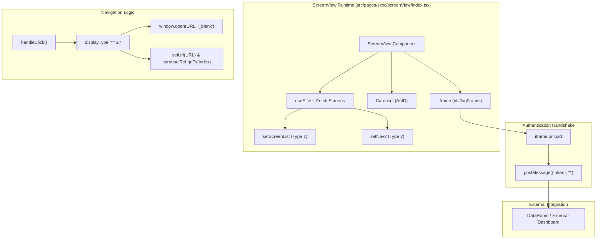
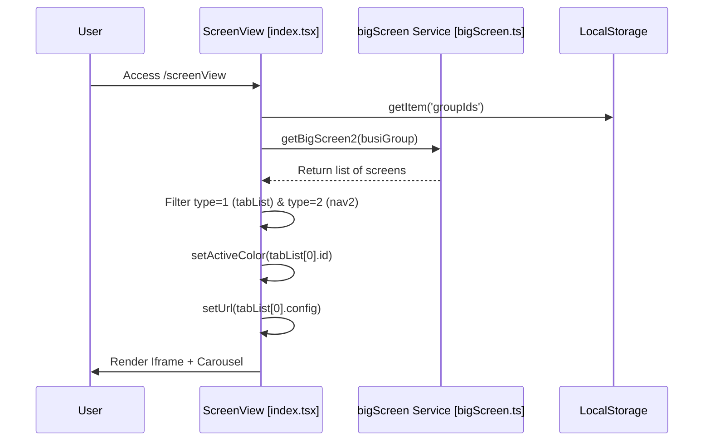

# Big Screen (大屏) Management & Viewer
Relevant source files

- [src/components/ColorPicker/color.tsx](https://github.com/thetide557/ln-server-pub/blob/629bd918/src/components/ColorPicker/color.tsx)
- [src/components/ColorPicker/gradient.tsx](https://github.com/thetide557/ln-server-pub/blob/629bd918/src/components/ColorPicker/gradient.tsx)
- [src/components/ColorPicker/style.less](https://github.com/thetide557/ln-server-pub/blob/629bd918/src/components/ColorPicker/style.less)
- [src/pages/sxxc/screenAddress/Add.tsx](https://github.com/thetide557/ln-server-pub/blob/629bd918/src/pages/sxxc/screenAddress/Add.tsx)
- [src/pages/sxxc/screenAddress/Detail.tsx](https://github.com/thetide557/ln-server-pub/blob/629bd918/src/pages/sxxc/screenAddress/Detail.tsx)
- [src/pages/sxxc/screenAddress/Edit.tsx](https://github.com/thetide557/ln-server-pub/blob/629bd918/src/pages/sxxc/screenAddress/Edit.tsx)
- [src/pages/sxxc/screenAddress/Form/form.less](https://github.com/thetide557/ln-server-pub/blob/629bd918/src/pages/sxxc/screenAddress/Form/form.less)
- [src/pages/sxxc/screenAddress/Form/index copy.tsx](https://github.com/thetide557/ln-server-pub/blob/629bd918/src/pages/sxxc/screenAddress/Form/index copy.tsx)
- [src/pages/sxxc/screenAddress/Form/index.tsx](https://github.com/thetide557/ln-server-pub/blob/629bd918/src/pages/sxxc/screenAddress/Form/index.tsx)
- [src/pages/sxxc/screenAddress/index copy.tsx](https://github.com/thetide557/ln-server-pub/blob/629bd918/src/pages/sxxc/screenAddress/index copy.tsx)
- [src/pages/sxxc/screenAddress/index.less](https://github.com/thetide557/ln-server-pub/blob/629bd918/src/pages/sxxc/screenAddress/index.less)
- [src/pages/sxxc/screenAddress/index.tsx](https://github.com/thetide557/ln-server-pub/blob/629bd918/src/pages/sxxc/screenAddress/index.tsx)
- [src/pages/sxxc/screenView/alarmApi.tsx](https://github.com/thetide557/ln-server-pub/blob/629bd918/src/pages/sxxc/screenView/alarmApi.tsx)
- [src/pages/sxxc/screenView/alarmChart.tsx](https://github.com/thetide557/ln-server-pub/blob/629bd918/src/pages/sxxc/screenView/alarmChart.tsx)
- [src/pages/sxxc/screenView/index.tsx](https://github.com/thetide557/ln-server-pub/blob/629bd918/src/pages/sxxc/screenView/index.tsx)
- [src/services/sxxc/bigScreen.ts](https://github.com/thetide557/ln-server-pub/blob/629bd918/src/services/sxxc/bigScreen.ts)
- [src/pages/sxxc/warnModal/index.tsx](https://github.com/thetide557/ln-server-pub/blob/629bd918/src/pages/sxxc/warnModal/index.tsx)
- [src/pages/sxxc/warnModal/alarmChartLine.tsx](https://github.com/thetide557/ln-server-pub/blob/629bd918/src/pages/sxxc/warnModal/alarmChartLine.tsx)
- [yarn.lock](https://github.com/thetide557/ln-server-pub/blob/629bd918/yarn.lock)

The Big Screen module provides a specialized visualization layer designed for NOC (Network Operations Center) environments. It supports high-level configuration of dashboard displays, including carousel rotation for multi-screen monitoring, iframe-based integration with external data visualization tools (e.g., DataRoom), and a runtime viewer that handles authentication handshakes with embedded sub-applications.

## 1. Big Screen Configuration (CRUD)

The management interface allows administrators to define "Screen Addresses" which can be internal dashboards or external URLs.

### 1.1 Data Structure

Each big screen entry is defined by the `ApiServiceType` and managed via the `bigscreen` API endpoints.

| Field | Type | Description |
| --- | --- | --- |
| `title` | `string` | The display name of the screen. |
| `type` | `number` | 1: Primary Big Screen (Tab-based); 2: Secondary Navigation (Business Group linked). |
| `config` | `string` | The URL or DataRoom code for the screen. **Type 1 only** — the form does not render this field for Type 2. |
| `busi_group` | `string` | Business group ID(s) linked to the screen. For Type 1 the form uses a multi-select and the array is joined into a comma-separated string on submit; for Type 2 it is a single-select, so the value is a single business group ID (used as the `nav2` menu key). |
| `carousel_mode` | `number` | 1: Static; 2: Auto-carousel. **Type 1 only** — for Type 2 the field is rendered but hidden and has no effect. |
| `carousel_interval` | `number` | Interval in seconds for auto-rotation. Only shown/used when Type 1 and `carousel_mode == 2`. |
| `nav_template` | `string` | CSS string for custom styling of the navigation elements. **Type 1 only**, along with the related `nav_name`/`font_size`/`font_color`/`bg_color`/`bg_width`/`bg_height` fields. |

Type 2 ("二级大屏") entries are therefore effectively limited to `title` + `busi_group` and carry no `config`, carousel, or nav-styling data [src/pages/sxxc/screenAddress/Form/index.tsx#171-251](https://github.com/thetide557/ln-server-pub/blob/629bd918/src/pages/sxxc/screenAddress/Form/index.tsx#L171-L251)

Sources:[src/pages/sxxc/screenAddress/index.tsx#15-24](https://github.com/thetide557/ln-server-pub/blob/629bd918/src/pages/sxxc/screenAddress/index.tsx#L15-L24)[src/pages/sxxc/screenAddress/Form/index.tsx#25-52](https://github.com/thetide557/ln-server-pub/blob/629bd918/src/pages/sxxc/screenAddress/Form/index.tsx#L25-L52)

### 1.2 Administrative Workflow

The configuration is handled through three main components:

- `Add.tsx`: Initializes the form for new screen creation, converting business group arrays to comma-separated strings before calling `addBigScreen`[src/pages/sxxc/screenAddress/Add.tsx#14-25](https://github.com/thetide557/ln-server-pub/blob/629bd918/src/pages/sxxc/screenAddress/Add.tsx#L14-L25)
- `Edit.tsx`: Fetches existing configuration via `getScreenById` and populates the form [src/pages/sxxc/screenAddress/Edit.tsx#14-23](https://github.com/thetide557/ln-server-pub/blob/629bd918/src/pages/sxxc/screenAddress/Edit.tsx#L14-L23)
- `Form/index.tsx`: The core UI for configuration, supporting visual color pickers (`Gradient`, `Color`) and previewing the `nav_template` CSS [src/pages/sxxc/screenAddress/Form/index.tsx#53-62](https://github.com/thetide557/ln-server-pub/blob/629bd918/src/pages/sxxc/screenAddress/Form/index.tsx#L53-L62)

Sources:[src/services/sxxc/bigScreen.ts#113-140](https://github.com/thetide557/ln-server-pub/blob/629bd918/src/services/sxxc/bigScreen.ts#L113-L140)[src/pages/sxxc/screenAddress/Form/index.tsx#6-9](https://github.com/thetide557/ln-server-pub/blob/629bd918/src/pages/sxxc/screenAddress/Form/index.tsx#L6-L9)

## 2. ScreenView Runtime

The `ScreenView` component is the specialized viewer that renders the configured big screens. It manages the lifecycle of the display, including carousel transitions and iframe communication.

### 2.1 Component Interaction Diagram



Sources:[src/pages/sxxc/screenView/index.tsx#27-53](https://github.com/thetide557/ln-server-pub/blob/629bd918/src/pages/sxxc/screenView/index.tsx#L27-L53)[src/pages/sxxc/screenView/index.tsx#101-151](https://github.com/thetide557/ln-server-pub/blob/629bd918/src/pages/sxxc/screenView/index.tsx#L101-L151)

### 2.2 Navigation Template Parsing

The system allows dynamic CSS injection for navigation tabs. The `MyStyle` function parses a semicolon-delimited string (e.g., `borderColor: #048787;`) into a React CSS object.

```
const MyStyle = (styleString) => {
  const styleObject = styleString.split(';').reduce((style, declaration) => {
    const [key, value] = declaration.split(':').map(part => part.trim());
    if (key && value) {
      style[key] = value;
    }
    return style;
  }, {});
  return styleObject;
};
```

Sources:[src/pages/sxxc/screenView/index.tsx#152-162](https://github.com/thetide557/ln-server-pub/blob/629bd918/src/pages/sxxc/screenView/index.tsx#L152-L162)[src/pages/sxxc/screenAddress/Form/index.tsx#117-128](https://github.com/thetide557/ln-server-pub/blob/629bd918/src/pages/sxxc/screenAddress/Form/index.tsx#L117-L128)

### 2.3 Iframe Authentication Handshake

When an **external URL** screen (`config` starting with `http`/`https`/`www.`) is loaded, the `ScreenView` component performs a `postMessage` handshake to pass the `access_token` from the parent application to the embedded site.

1. The token is retrieved from `js-cookie`[src/pages/sxxc/screenView/index.tsx#45](https://github.com/thetide557/ln-server-pub/blob/629bd918/src/pages/sxxc/screenView/index.tsx#L45-L45)
2. `sendToken` looks up `document.getElementById('logFrame')` and attaches an `iframe.onload` handler that transmits the token via `iframe.contentWindow.postMessage` once the sub-application loads [src/pages/sxxc/screenView/index.tsx#48-53](https://github.com/thetide557/ln-server-pub/blob/629bd918/src/pages/sxxc/screenView/index.tsx#L48-L53)
3. `sendToken()` is only explicitly invoked on the **external-URL** branches — on initial load [src/pages/sxxc/screenView/index.tsx#215](https://github.com/thetide557/ln-server-pub/blob/629bd918/src/pages/sxxc/screenView/index.tsx#L215-L215) and on tab click [src/pages/sxxc/screenView/index.tsx#136](https://github.com/thetide557/ln-server-pub/blob/629bd918/src/pages/sxxc/screenView/index.tsx#L136-L136). For internal DataRoom `config` codes, the equivalent call exists in the source but is commented out (dead code) at both call sites [src/pages/sxxc/screenView/index.tsx#148](https://github.com/thetide557/ln-server-pub/blob/629bd918/src/pages/sxxc/screenView/index.tsx#L148-L148)[src/pages/sxxc/screenView/index.tsx#219](https://github.com/thetide557/ln-server-pub/blob/629bd918/src/pages/sxxc/screenView/index.tsx#L219-L219) — so no `postMessage` handshake is actually fired for internal DataRoom navigation; the DataRoom iframe is same-origin (`/dataroom/...`) and its authentication does not go through this mechanism.
4. The `document.getElementById('logFrame')` lookup only matches the single fallback `<iframe id="logFrame">` rendered when no screen is in carousel mode [src/pages/sxxc/screenView/index.tsx#303](https://github.com/thetide557/ln-server-pub/blob/629bd918/src/pages/sxxc/screenView/index.tsx#L303-L303). When the `Carousel` is active, its iframes use `className='logFrame'` with no `id` attribute [src/pages/sxxc/screenView/index.tsx#300](https://github.com/thetide557/ln-server-pub/blob/629bd918/src/pages/sxxc/screenView/index.tsx#L300-L300), so this selector does not resolve to them.

## 3. Carousel and Group Switching

The viewer supports two primary modes of operation:

1. Tabbed View (Type 1 Screens): Renders a horizontal list of tabs. Clicking a tab triggers `handleClick`, which updates the `url` state and moves the `Carousel` to the corresponding index [src/pages/sxxc/screenView/index.tsx#101-151](https://github.com/thetide557/ln-server-pub/blob/629bd918/src/pages/sxxc/screenView/index.tsx#L101-L151)
2. Business Group Navigation (Type 2 Screens): Renders a dropdown menu (`goBoard`) that filters dashboards by business group. If a specific `label_value` matches the dashboard tags, it redirects to the custom `dashboardsxc` view [src/pages/sxxc/screenView/index.tsx#55-79](https://github.com/thetide557/ln-server-pub/blob/629bd918/src/pages/sxxc/screenView/index.tsx#L55-L79)

### Data Flow for Screen Initialization



Sources:[src/pages/sxxc/screenView/index.tsx#194-220](https://github.com/thetide557/ln-server-pub/blob/629bd918/src/pages/sxxc/screenView/index.tsx#L194-L220)[src/services/sxxc/bigScreen.ts#106-110](https://github.com/thetide557/ln-server-pub/blob/629bd918/src/services/sxxc/bigScreen.ts#L106-L110)

## 4. Alarm Visualization in Big Screen

The `AlarmChart` component defined in `src/pages/sxxc/screenView/alarmChart.tsx` (rendered via `@ant-design/plots`'s `Line` chart, driven by a `chartList` prop) is **not imported or rendered anywhere in the application** — it is dead/orphaned code and does not participate in the actual Big Screen alarm flow.

The alarm trend chart that is actually shown in the Big Screen context is rendered inside the `WarnModal` alert popup (see the Dashboards documentation for how `WarnModal` itself is triggered via the global WebSocket, only on `/screenView`), by a differently-named component, `AlarmChartLine` [src/pages/sxxc/warnModal/alarmChartLine.tsx](https://github.com/thetide557/ln-server-pub/blob/629bd918/src/pages/sxxc/warnModal/alarmChartLine.tsx), imported by `WarnModal` [src/pages/sxxc/warnModal/index.tsx#11](https://github.com/thetide557/ln-server-pub/blob/629bd918/src/pages/sxxc/warnModal/index.tsx#L11-L11)[src/pages/sxxc/warnModal/index.tsx#762](https://github.com/thetide557/ln-server-pub/blob/629bd918/src/pages/sxxc/warnModal/index.tsx#L762-L762):

- Metric Query: `AlarmChartLine` calls the same `getWarningChart` (defined in `screenView/alarmApi.tsx`) to proxy a PromQL `query_range` request, but with a fixed window of `curWarn.trigger_time - 1800` to `curWarn.trigger_time + 1800` (30 minutes before and after the alert's trigger time) at a 15-second step — not simply "the last N minutes" [src/pages/sxxc/warnModal/alarmChartLine.tsx#57-68](https://github.com/thetide557/ln-server-pub/blob/629bd918/src/pages/sxxc/warnModal/alarmChartLine.tsx#L57-L68)
- Rendering: Uses `echarts` directly (`echarts.init` + `myChart.setOption`), not `@ant-design/plots` [src/pages/sxxc/warnModal/alarmChartLine.tsx#5](https://github.com/thetide557/ln-server-pub/blob/629bd918/src/pages/sxxc/warnModal/alarmChartLine.tsx#L5-L5)[src/pages/sxxc/warnModal/alarmChartLine.tsx#56](https://github.com/thetide557/ln-server-pub/blob/629bd918/src/pages/sxxc/warnModal/alarmChartLine.tsx#L56-L56)
- Time Formatting: `AlarmChartLine` has its own copy of the `convertTime` helper; X-axis labels are produced by formatting each timestamp with `convertTime(ts, 'year')` and slicing characters 11-16 out of the resulting string to obtain `HH:mm` [src/pages/sxxc/warnModal/alarmChartLine.tsx#15-34](https://github.com/thetide557/ln-server-pub/blob/629bd918/src/pages/sxxc/warnModal/alarmChartLine.tsx#L15-L34)[src/pages/sxxc/warnModal/alarmChartLine.tsx#166-172](https://github.com/thetide557/ln-server-pub/blob/629bd918/src/pages/sxxc/warnModal/alarmChartLine.tsx#L166-L172)

`getWarningChart`/`alarmApi.tsx` remain accurate as the underlying metric-query service; the discrepancy is only in which component actually renders the result.

Sources:[src/pages/sxxc/warnModal/alarmChartLine.tsx](https://github.com/thetide557/ln-server-pub/blob/629bd918/src/pages/sxxc/warnModal/alarmChartLine.tsx)[src/pages/sxxc/warnModal/index.tsx#1-12](https://github.com/thetide557/ln-server-pub/blob/629bd918/src/pages/sxxc/warnModal/index.tsx#L1-L12)[src/pages/sxxc/screenView/alarmApi.tsx#21-39](https://github.com/thetide557/ln-server-pub/blob/629bd918/src/pages/sxxc/screenView/alarmApi.tsx#L21-L39)