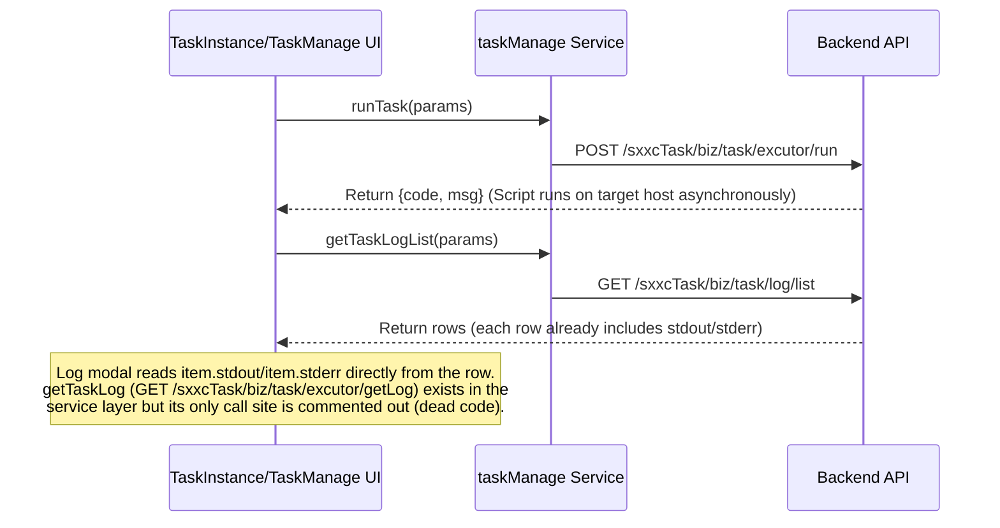

# Operations Center (SXXC Modules)
Relevant source files

- [src/components/PromQueryBuilder/components/metrics_translation.ts](https://github.com/thetide557/ln-server-pub/blob/629bd918/src/components/PromQueryBuilder/components/metrics_translation.ts)
- [src/hooks/useIsMounted.ts](https://github.com/thetide557/ln-server-pub/blob/629bd918/src/hooks/useIsMounted.ts)
- [src/pages/dataRoom/index.tsx](https://github.com/thetide557/ln-server-pub/blob/629bd918/src/pages/dataRoom/index.tsx)
- [src/pages/sxxc/autoInspect/index.tsx](https://github.com/thetide557/ln-server-pub/blob/629bd918/src/pages/sxxc/autoInspect/index.tsx)
- [src/pages/sxxc/dutyManage/AutoScheduleModal.tsx](https://github.com/thetide557/ln-server-pub/blob/629bd918/src/pages/sxxc/dutyManage/AutoScheduleModal.tsx)
- [src/pages/sxxc/dutyManage/BatchDeleteModal.tsx](https://github.com/thetide557/ln-server-pub/blob/629bd918/src/pages/sxxc/dutyManage/BatchDeleteModal.tsx)
- [src/pages/sxxc/dutyManage/DutyList.tsx](https://github.com/thetide557/ln-server-pub/blob/629bd918/src/pages/sxxc/dutyManage/DutyList.tsx)
- [src/pages/sxxc/dutyManage/DutyLogs.less](https://github.com/thetide557/ln-server-pub/blob/629bd918/src/pages/sxxc/dutyManage/DutyLogs.less)
- [src/pages/sxxc/dutyManage/DutyLogs.tsx](https://github.com/thetide557/ln-server-pub/blob/629bd918/src/pages/sxxc/dutyManage/DutyLogs.tsx)
- [src/pages/sxxc/dutyManage/OperationModal.tsx](https://github.com/thetide557/ln-server-pub/blob/629bd918/src/pages/sxxc/dutyManage/OperationModal.tsx)
- [src/pages/sxxc/dutyManage/ProjectSupport.less](https://github.com/thetide557/ln-server-pub/blob/629bd918/src/pages/sxxc/dutyManage/ProjectSupport.less)
- [src/pages/sxxc/dutyManage/ProjectSupport.tsx](https://github.com/thetide557/ln-server-pub/blob/629bd918/src/pages/sxxc/dutyManage/ProjectSupport.tsx)
- [src/pages/sxxc/healthReport/index.tsx](https://github.com/thetide557/ln-server-pub/blob/629bd918/src/pages/sxxc/healthReport/index.tsx)
- [src/pages/sxxc/inspectionList/components/createModal/index.tsx](https://github.com/thetide557/ln-server-pub/blob/629bd918/src/pages/sxxc/inspectionList/components/createModal/index.tsx)
- [src/pages/sxxc/inspectionList/components/inspectionForm/index.tsx](https://github.com/thetide557/ln-server-pub/blob/629bd918/src/pages/sxxc/inspectionList/components/inspectionForm/index.tsx)
- [src/pages/sxxc/inspectionList/index.tsx](https://github.com/thetide557/ln-server-pub/blob/629bd918/src/pages/sxxc/inspectionList/index.tsx)
- [src/pages/sxxc/inspectionList/log.tsx](https://github.com/thetide557/ln-server-pub/blob/629bd918/src/pages/sxxc/inspectionList/log.tsx)
- [src/pages/sxxc/inspectionReport/index.tsx](https://github.com/thetide557/ln-server-pub/blob/629bd918/src/pages/sxxc/inspectionReport/index.tsx)
- [src/pages/sxxc/productionPlan/index.tsx](https://github.com/thetide557/ln-server-pub/blob/629bd918/src/pages/sxxc/productionPlan/index.tsx)
- [src/pages/sxxc/serverVideoAlarm/index.tsx](https://github.com/thetide557/ln-server-pub/blob/629bd918/src/pages/sxxc/serverVideoAlarm/index.tsx)
- [src/pages/sxxc/serverVideoAsset/index.tsx](https://github.com/thetide557/ln-server-pub/blob/629bd918/src/pages/sxxc/serverVideoAsset/index.tsx)
- [src/pages/sxxc/taskInstance/index.tsx](https://github.com/thetide557/ln-server-pub/blob/629bd918/src/pages/sxxc/taskInstance/index.tsx)
- [src/pages/sxxc/taskManage/components/createModal/index.tsx](https://github.com/thetide557/ln-server-pub/blob/629bd918/src/pages/sxxc/taskManage/components/createModal/index.tsx)
- [src/pages/sxxc/taskManage/components/runForm/index.tsx](https://github.com/thetide557/ln-server-pub/blob/629bd918/src/pages/sxxc/taskManage/components/runForm/index.tsx)
- [src/pages/sxxc/taskManage/components/taskForm/index.tsx](https://github.com/thetide557/ln-server-pub/blob/629bd918/src/pages/sxxc/taskManage/components/taskForm/index.tsx)
- [src/pages/sxxc/taskManage/index.tsx](https://github.com/thetide557/ln-server-pub/blob/629bd918/src/pages/sxxc/taskManage/index.tsx)
- [src/pages/sxxc/topology/index.tsx](https://github.com/thetide557/ln-server-pub/blob/629bd918/src/pages/sxxc/topology/index.tsx)
- [src/pages/sxxc/workorder/index.tsx](https://github.com/thetide557/ln-server-pub/blob/629bd918/src/pages/sxxc/workorder/index.tsx)
- [src/services/sxxc/inspection.ts](https://github.com/thetide557/ln-server-pub/blob/629bd918/src/services/sxxc/inspection.ts)
- [src/services/sxxc/taskManage.ts](https://github.com/thetide557/ln-server-pub/blob/629bd918/src/services/sxxc/taskManage.ts)
- [src/services/sxxc/taskStrategy.ts](https://github.com/thetide557/ln-server-pub/blob/629bd918/src/services/sxxc/taskStrategy.ts)
- [src/store/sxxc/inspection/index.ts](https://github.com/thetide557/ln-server-pub/blob/629bd918/src/store/sxxc/inspection/index.ts)
- [src/store/sxxc/taskInterface/index.ts](https://github.com/thetide557/ln-server-pub/blob/629bd918/src/store/sxxc/taskInterface/index.ts)
- [src/utils/request.ts](https://github.com/thetide557/ln-server-pub/blob/629bd918/src/utils/request.ts)

The Operations Center comprises the SXXC (Integrated Operations) suite, extending the platform's core monitoring capabilities with high-level maintenance workflows. This includes automated inspection scheduling, a script-based task execution engine, duty roster management, and a series of integrated sub-applications hosted via iframes.

## System Architecture Overview

The SXXC modules bridge the gap between raw monitoring data and operational actions. They interact with the asset management system to target specific servers and use a dedicated task engine to execute maintenance scripts.

### Code-to-System Mapping

The following diagram illustrates how UI components in the Operations Center map to their underlying service layers and data entities.

SXXC Logic Flow

Sources:[src/pages/sxxc/inspectionList/components/inspectionForm/index.tsx#32-33](https://github.com/thetide557/ln-server-pub/blob/629bd918/src/pages/sxxc/inspectionList/components/inspectionForm/index.tsx#L32-L33)[src/pages/sxxc/taskInstance/index.tsx#29-30](https://github.com/thetide557/ln-server-pub/blob/629bd918/src/pages/sxxc/taskInstance/index.tsx#L29-L30)[src/services/sxxc/taskManage.ts#1-30](https://github.com/thetide557/ln-server-pub/blob/629bd918/src/services/sxxc/taskManage.ts#L1-L30)

---

## Inspection Management (#7.1)

The Inspection module automates routine checks across the infrastructure. Users define inspection plans with specific cycles (Daily, Weekly, or Custom Dates) [src/pages/sxxc/inspectionList/components/inspectionForm/index.tsx#57-61](https://github.com/thetide557/ln-server-pub/blob/629bd918/src/pages/sxxc/inspectionList/components/inspectionForm/index.tsx#L57-L61) and target them at specific scopes such as "All Servers", "Specific Projects", or "Specific IPs" [src/pages/sxxc/inspectionList/components/inspectionForm/index.tsx#72-76](https://github.com/thetide557/ln-server-pub/blob/629bd918/src/pages/sxxc/inspectionList/components/inspectionForm/index.tsx#L72-L76)

- Task Binding: Inspections are composed of multiple `bizScript` tasks selected via the `InspectionForm`[src/pages/sxxc/inspectionList/components/inspectionForm/index.tsx#89-118](https://github.com/thetide557/ln-server-pub/blob/629bd918/src/pages/sxxc/inspectionList/components/inspectionForm/index.tsx#L89-L118)
- Reporting: Execution results are aggregated into logs, which can be exported as PDF reports using `html2canvas` and `jsPDF`[src/pages/sxxc/inspectionList/log.tsx#162-185](https://github.com/thetide557/ln-server-pub/blob/629bd918/src/pages/sxxc/inspectionList/log.tsx#L162-L185)

For details, see [Inspection Management](/org/benjamin-braddock/wiki/thetide557/ln-server-pub/page/7.1?branch=v2.1).

---

## Task Management & Self-Healing (#7.2)

The Task Management system is a script repository (`bizScript`) that supports manual, user-initiated remote execution on targeted assets via `/taskManage/taskManage` and `/taskManage/taskInstance`, and is the same script pool that Inspection plans bind into. Despite the "告警自愈" (Alarm Self-Healing) label used elsewhere in the app's menu, there is no code path in `sxxc/taskManage`/`sxxc/taskInstance` that triggers a script from an alert rule or alert event — execution is always a manual "执行" action. The menu's actual "告警自愈" entries (`/job-tpls` "自愈脚本", `/job-tasks` "执行历史") point to a separate job-template system (`src/pages/taskTpl`, `src/pages/task`) outside the SXXC module, not to this bizScript engine.

- Execution Engine: Tasks are executed via the `runTask` service [src/services/sxxc/taskManage.ts#29](https://github.com/thetide557/ln-server-pub/blob/629bd918/src/services/sxxc/taskManage.ts#L29-L29). The log modal in `taskInstance` displays the `stdout`/`stderr` fields already present on the row returned by `getTaskLogList`; the dedicated `getTaskLog` real-time log-fetch call is defined in the service layer but its only call site is commented out [src/pages/sxxc/taskInstance/index.tsx#168-186](https://github.com/thetide557/ln-server-pub/blob/629bd918/src/pages/sxxc/taskInstance/index.tsx#L168-L186), so it is dead code rather than an active real-time debugging path.
- Strategies: The "分析策略" (analysis strategy) switch/selector inside the create/edit Task form, and its `getStrategyList` call, are commented-out dead code and never render [src/pages/sxxc/taskManage/components/taskForm/index.tsx#170-187](https://github.com/thetide557/ln-server-pub/blob/629bd918/src/pages/sxxc/taskManage/components/taskForm/index.tsx#L170-L187) — tasks cannot actually be bound to a strategy from this form. A separate, working "任务策略" CRUD page exists at route `/taskManage/strategy` (`src/pages/sxxc/taskStrategy`, backed by `/sxxcTask/biz/strategy/*`), but its menu entry is commented out in `topMenuXH.tsx`, so it's reachable only by direct URL, not through in-app navigation.

For details, see [Task Management & Self-Healing](/org/benjamin-braddock/wiki/thetide557/ln-server-pub/page/7.2?branch=v2.1).

---

## Duty Management (#7.3)

Duty Management handles the personnel side of operations. It provides a structured way to manage on-call rosters and project support schedules.

- Scheduling: Includes an `AutoScheduleModal` for generating rotations and a `DutyList` for manual adjustments.
- Operations: Supports batch deletions with time-range validation and Excel-based imports for large teams.
- Logging:`DutyLogs` record handovers and significant events during a shift [src/pages/sxxc/dutyManage/DutyLogs.tsx#1-50](https://github.com/thetide557/ln-server-pub/blob/629bd918/src/pages/sxxc/dutyManage/DutyLogs.tsx#L1-L50)

For details, see [Duty Management](/org/benjamin-braddock/wiki/thetide557/ln-server-pub/page/7.3?branch=v2.1).

---

## Integrated Iframe Sub-Applications (#7.4)

The platform acts as a portal for several standalone specialized tools, integrated as `iframe`s pointed at same-origin sub-application paths (e.g. `/workorder/`, `/healthreport/`, `/autoinspect/`, `/dataroom/`). Each component reads the `access_token` cookie via `js-cookie`, but in `healthReport`, `autoInspect`, `productionPlan`, and `topology` the code that would forward it to the iframe via `postMessage` is commented out and the `token` variable is otherwise unused — in practice these iframes rely on the shared-domain session cookie rather than an explicit URL-param/postMessage token handoff.

| Sub-Application | Component | Purpose |
| --- | --- | --- |
| DataRoom | `DataRoom` | Large-screen data visualization [src/pages/dataRoom/index.tsx#4-11](https://github.com/thetide557/ln-server-pub/blob/629bd918/src/pages/dataRoom/index.tsx#L4-L11) |
| Work Order | `workOrder` | Ticket management with permission-based routing [src/pages/sxxc/workorder/index.tsx#7-24](https://github.com/thetide557/ln-server-pub/blob/629bd918/src/pages/sxxc/workorder/index.tsx#L7-L24) |
| Health Report | `healthReport` | Automated system health summaries [src/pages/sxxc/healthReport/index.tsx#6-18](https://github.com/thetide557/ln-server-pub/blob/629bd918/src/pages/sxxc/healthReport/index.tsx#L6-L18) |
| Auto Inspect | `autoInspect` | External automated inspection engine [src/pages/sxxc/autoInspect/index.tsx#6-19](https://github.com/thetide557/ln-server-pub/blob/629bd918/src/pages/sxxc/autoInspect/index.tsx#L6-L19) |

Note: `serverVideoAlarm`/`serverVideoAsset` (video-based asset monitoring) exist as source files but are dead code — their imports, routes, and menu entries are all commented out in `src/routers/index.tsx` and `src/components/menu/topMenuXH.tsx`, so they are not reachable in the running app and are omitted from the table above. `productionPlan` (`/productionplan`) is a live route of the same iframe pattern but likewise has no menu entry, so it's reachable only by direct URL.

For details, see [Integrated Iframe Sub-Applications](/org/benjamin-braddock/wiki/thetide557/ln-server-pub/page/7.4?branch=v2.1).

---

## Operations Data Interaction

The following diagram maps the relationship between the Task Execution system and the resulting logs.

Task Execution Data Flow

Note: `/sxxcTask` is a distinct backend path (proxied separately in `vite.config.ts`) from the `/api/takin/*` prefix used by the rest of the platform — there is no `/api/sxxcTask/*` route.

Sources:[src/pages/sxxc/taskInstance/index.tsx#107-186](https://github.com/thetide557/ln-server-pub/blob/629bd918/src/pages/sxxc/taskInstance/index.tsx#L107-L186)[src/services/sxxc/taskManage.ts#1-85](https://github.com/thetide557/ln-server-pub/blob/629bd918/src/services/sxxc/taskManage.ts#L1-L85)[src/utils/request.ts#100-106](https://github.com/thetide557/ln-server-pub/blob/629bd918/src/utils/request.ts#L100-L106)