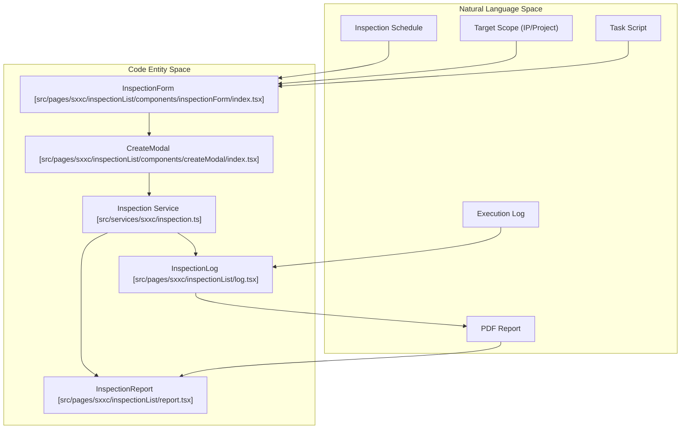
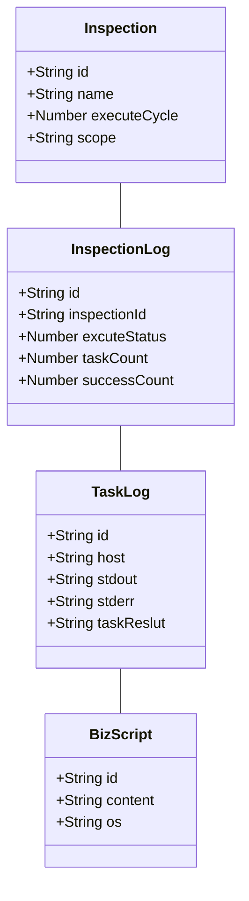

# Inspection Management
Relevant source files

- [src/pages/sxxc/inspectionList/components/createModal/index.tsx](https://github.com/thetide557/ln-server-pub/blob/629bd918/src/pages/sxxc/inspectionList/components/createModal/index.tsx)
- [src/pages/sxxc/inspectionList/components/inspectionForm/index.tsx](https://github.com/thetide557/ln-server-pub/blob/629bd918/src/pages/sxxc/inspectionList/components/inspectionForm/index.tsx)
- [src/pages/sxxc/inspectionList/index.tsx](https://github.com/thetide557/ln-server-pub/blob/629bd918/src/pages/sxxc/inspectionList/index.tsx)
- [src/pages/sxxc/inspectionList/log.tsx](https://github.com/thetide557/ln-server-pub/blob/629bd918/src/pages/sxxc/inspectionList/log.tsx)
- [src/pages/sxxc/inspectionReport/index.tsx](https://github.com/thetide557/ln-server-pub/blob/629bd918/src/pages/sxxc/inspectionReport/index.tsx)
- [src/pages/sxxc/taskInstance/index.tsx](https://github.com/thetide557/ln-server-pub/blob/629bd918/src/pages/sxxc/taskInstance/index.tsx)
- [src/pages/sxxc/taskManage/components/taskForm/index.tsx](https://github.com/thetide557/ln-server-pub/blob/629bd918/src/pages/sxxc/taskManage/components/taskForm/index.tsx)
- [src/pages/sxxc/taskManage/index.tsx](https://github.com/thetide557/ln-server-pub/blob/629bd918/src/pages/sxxc/taskManage/index.tsx)
- [src/services/sxxc/inspection.ts](https://github.com/thetide557/ln-server-pub/blob/629bd918/src/services/sxxc/inspection.ts)
- [src/store/sxxc/inspection/index.ts](https://github.com/thetide557/ln-server-pub/blob/629bd918/src/store/sxxc/inspection/index.ts)

Inspection Management provides an automated framework for scheduling periodic system checks, binding operational scripts to specific infrastructure scopes, and generating comprehensive PDF reports based on execution results. It bridges the gap between manual script execution and structured maintenance compliance.

## System Architecture and Data Flow

The inspection system is built on a tiered architecture where `Inspection` definitions govern the "when" and "where," while `Task` scripts (Business Scripts) define the "what."

### Logic Flow Diagram

This diagram illustrates the lifecycle of an inspection from definition to report generation, mapping UI components to their underlying service implementations.

Sources:[src/pages/sxxc/inspectionList/components/inspectionForm/index.tsx#44-124](https://github.com/thetide557/ln-server-pub/blob/629bd918/src/pages/sxxc/inspectionList/components/inspectionForm/index.tsx#L44-L124)[src/pages/sxxc/inspectionList/components/createModal/index.tsx#33-129](https://github.com/thetide557/ln-server-pub/blob/629bd918/src/pages/sxxc/inspectionList/components/createModal/index.tsx#L33-L129)[src/services/sxxc/inspection.ts#5-72](https://github.com/thetide557/ln-server-pub/blob/629bd918/src/services/sxxc/inspection.ts#L5-L72)

---

## Inspection Configuration

Inspections are defined by three primary dimensions: Cycle, Scope, and Tasks.

### 1. Scheduling Cycles

The platform supports three temporal triggers managed within the `InspectionForm` component:

- Daily (每日): Executes at a specific `HH:mm:ss` every day [src/pages/sxxc/inspectionList/components/inspectionForm/index.tsx#58](https://github.com/thetide557/ln-server-pub/blob/629bd918/src/pages/sxxc/inspectionList/components/inspectionForm/index.tsx#L58-L58)
- Weekly (每周): Executes on selected days of the week (Monday-Sunday) [src/pages/sxxc/inspectionList/components/inspectionForm/index.tsx#62-70](https://github.com/thetide557/ln-server-pub/blob/629bd918/src/pages/sxxc/inspectionList/components/inspectionForm/index.tsx#L62-L70)
- Specific Date (指定时间): Executes once on a predefined `YYYY-MM-DD`[src/pages/sxxc/inspectionList/components/inspectionForm/index.tsx#60](https://github.com/thetide557/ln-server-pub/blob/629bd918/src/pages/sxxc/inspectionList/components/inspectionForm/index.tsx#L60-L60)

### 2. Targeting Scopes

Targeting logic is handled by the `scope` field, which determines where the bound scripts will run:

- All Servers: Targets all assets across authorized business groups [src/pages/sxxc/inspectionList/components/inspectionForm/index.tsx#73](https://github.com/thetide557/ln-server-pub/blob/629bd918/src/pages/sxxc/inspectionList/components/inspectionForm/index.tsx#L73-L73)
- Specified Projects: Targets assets belonging to specific business groups/projects [src/pages/sxxc/inspectionList/components/inspectionForm/index.tsx#74](https://github.com/thetide557/ln-server-pub/blob/629bd918/src/pages/sxxc/inspectionList/components/inspectionForm/index.tsx#L74-L74)
- Specified IPs: Targets specific host identifiers (`ident`). The system filters for `status == 1` (Online) and types `物理服务器` (Physical) or `虚拟服务器` (Virtual) [src/pages/sxxc/inspectionList/components/inspectionForm/index.tsx#191-197](https://github.com/thetide557/ln-server-pub/blob/629bd918/src/pages/sxxc/inspectionList/components/inspectionForm/index.tsx#L191-L197)

### 3. Task Script Binding

Inspections bind to one or more `BizScript` entities. The `InspectionForm` utilizes `getBizScriptList` to allow users to select tasks from the script repository [src/pages/sxxc/inspectionList/components/inspectionForm/index.tsx#146-154](https://github.com/thetide557/ln-server-pub/blob/629bd918/src/pages/sxxc/inspectionList/components/inspectionForm/index.tsx#L146-L154)

Sources:[src/pages/sxxc/inspectionList/components/inspectionForm/index.tsx#57-80](https://github.com/thetide557/ln-server-pub/blob/629bd918/src/pages/sxxc/inspectionList/components/inspectionForm/index.tsx#L57-L80)[src/pages/sxxc/inspectionList/components/createModal/index.tsx#63-101](https://github.com/thetide557/ln-server-pub/blob/629bd918/src/pages/sxxc/inspectionList/components/createModal/index.tsx#L63-L101)

---

## Execution and Logging

Once an inspection is triggered, the system creates an `InspectionLog` entry and individual `TaskInstance` logs for every host-script pair.

### Execution Entity Relationship

The following diagram shows how high-level inspection logs relate to granular task logs and the script repository.

Sources:[src/store/sxxc/inspection/index.ts#19-27](https://github.com/thetide557/ln-server-pub/blob/629bd918/src/store/sxxc/inspection/index.ts#L19-L27)[src/pages/sxxc/taskInstance/index.tsx#58-99](https://github.com/thetide557/ln-server-pub/blob/629bd918/src/pages/sxxc/taskInstance/index.tsx#L58-L99)[src/pages/sxxc/inspectionList/log.tsx#92-136](https://github.com/thetide557/ln-server-pub/blob/629bd918/src/pages/sxxc/inspectionList/log.tsx#L92-L136)

### Log Management

- Inspection Logs: Viewable via `getInspectionLogList`. Displays summary statistics: `taskCount`, `successCount`, and `failCount`[src/pages/sxxc/inspectionList/log.tsx#125-135](https://github.com/thetide557/ln-server-pub/blob/629bd918/src/pages/sxxc/inspectionList/log.tsx#L125-L135)
- Task Instance Logs: Detailed logs for each host. Users can view `stdout` or `stderr` depending on the `taskReslut`[src/pages/sxxc/taskInstance/index.tsx#168-186](https://github.com/thetide557/ln-server-pub/blob/629bd918/src/pages/sxxc/taskInstance/index.tsx#L168-L186)
- Re-execution: Failed or specific task instances can be manually re-run using `runTask`, which inherits the original script content and host parameters [src/pages/sxxc/taskInstance/index.tsx#107-139](https://github.com/thetide557/ln-server-pub/blob/629bd918/src/pages/sxxc/taskInstance/index.tsx#L107-L139)

---

## Report Generation

The platform provides a mechanism to convert inspection results into formal PDF documents using client-side rendering.

### PDF Export Workflow

An identical `exportPDF` function is defined in both `src/pages/sxxc/inspectionList/log.tsx` and `src/pages/sxxc/inspectionReport/index.tsx`, but only the `inspectionReport/index.tsx` copy is actually reachable. Its `changeReport` handler calls `getInspectionReport` and sets `visible` to `true`, which opens the modal wired to `exportPDF`. In `log.tsx`, the "报告" button instead navigates away via `history.push('/inspection/inspectionReport/:id')`, and the line that would open its own local report modal (`setVisible(true)`) is commented out — so that file's modal and its `exportPDF` copy are dead code, never invoked from the UI. The steps below describe the shared logic (illustrated via the reachable `inspectionReport/index.tsx` implementation):

1. DOM Capture: The `html2canvas` library captures the `elementRef` (the report container) and converts it into a JPEG data URL [src/pages/sxxc/inspectionReport/index.tsx#171-184](https://github.com/thetide557/ln-server-pub/blob/629bd918/src/pages/sxxc/inspectionReport/index.tsx#L171-L184)
2. Pagination Logic: The system calculates the `contentHeight` against the A4 standard height (`841.89` pt). If the content exceeds one page, it enters a `while` loop to add pages and shift the `position` until the `leftHeight` is exhausted [src/pages/sxxc/inspectionReport/index.tsx#191-204](https://github.com/thetide557/ln-server-pub/blob/629bd918/src/pages/sxxc/inspectionReport/index.tsx#L191-L204)
3. Document Assembly:`jsPDF` assembles the images into a `.pdf` file for download [src/pages/sxxc/inspectionReport/index.tsx#186-206](https://github.com/thetide557/ln-server-pub/blob/629bd918/src/pages/sxxc/inspectionReport/index.tsx#L186-L206)

Sources:[src/pages/sxxc/inspectionList/log.tsx#162-200](https://github.com/thetide557/ln-server-pub/blob/629bd918/src/pages/sxxc/inspectionList/log.tsx#L162-L200)[src/pages/sxxc/inspectionReport/index.tsx#170-208](https://github.com/thetide557/ln-server-pub/blob/629bd918/src/pages/sxxc/inspectionReport/index.tsx#L170-L208)

---

## Key API Endpoints

| Function | Method | Endpoint | Description |
| --- | --- | --- | --- |
| `getInspectionList` | GET | `/sxxcTask/biz/task/inspection/list` | Fetch scheduled inspections [src/services/sxxc/inspection.ts#5-10](https://github.com/thetide557/ln-server-pub/blob/629bd918/src/services/sxxc/inspection.ts#L5-L10) |
| `addInspection` | POST | `/sxxcTask/biz/task/inspection/add` | Create new schedule [src/services/sxxc/inspection.ts#25-30](https://github.com/thetide557/ln-server-pub/blob/629bd918/src/services/sxxc/inspection.ts#L25-L30) |
| `editInspectionStatus` | POST | `/sxxcTask/biz/task/inspection/changeStatus` | Enable/Disable inspection [src/services/sxxc/inspection.ts#32-37](https://github.com/thetide557/ln-server-pub/blob/629bd918/src/services/sxxc/inspection.ts#L32-L37) |
| `getInspectionLogList` | GET | `/sxxcTask/biz/inspection/log/list` | Summary logs of executions [src/services/sxxc/inspection.ts#52-57](https://github.com/thetide557/ln-server-pub/blob/629bd918/src/services/sxxc/inspection.ts#L52-L57) |
| `getTaskLogList` | GET | `/sxxcTask/biz/task/log/list` | Detailed logs for individual tasks [src/services/sxxc/taskManage.ts](https://github.com/thetide557/ln-server-pub/blob/629bd918/src/services/sxxc/taskManage.ts) |

Sources:[src/services/sxxc/inspection.ts#1-72](https://github.com/thetide557/ln-server-pub/blob/629bd918/src/services/sxxc/inspection.ts#L1-L72)[src/pages/sxxc/taskInstance/index.tsx#207-212](https://github.com/thetide557/ln-server-pub/blob/629bd918/src/pages/sxxc/taskInstance/index.tsx#L207-L212)