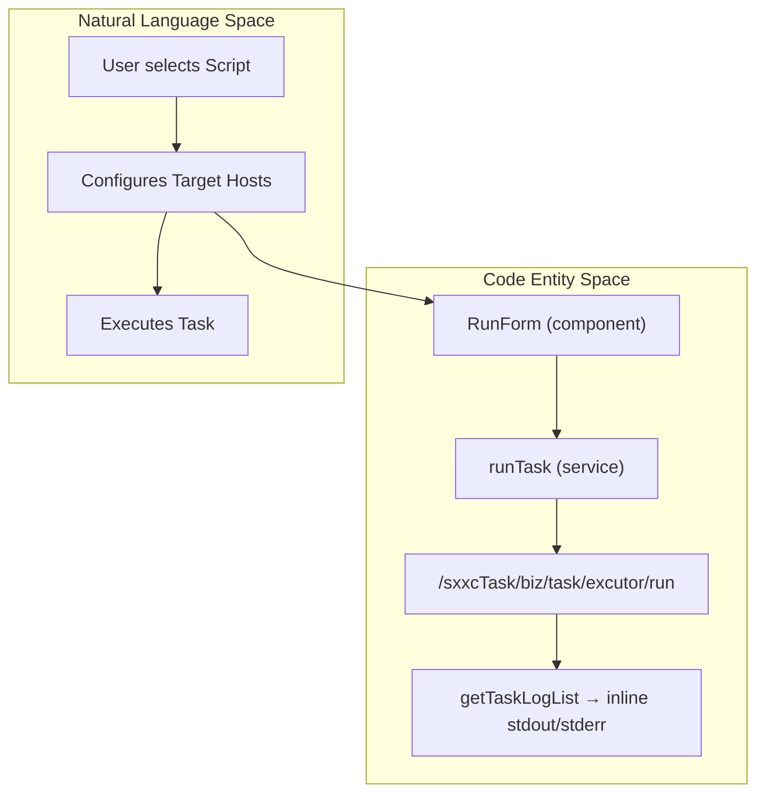

# Task Management & Self-Healing
Relevant source files

- [src/components/TimeRangePicker/TimeRangePicker.tsx](https://github.com/thetide557/ln-server-pub/blob/629bd918/src/components/TimeRangePicker/TimeRangePicker.tsx)
- [src/locales/common/en_US.ts](https://github.com/thetide557/ln-server-pub/blob/629bd918/src/locales/common/en_US.ts)
- [src/locales/common/zh_CN.ts](https://github.com/thetide557/ln-server-pub/blob/629bd918/src/locales/common/zh_CN.ts)
- [src/pages/orderformEvents/index.tsx](https://github.com/thetide557/ln-server-pub/blob/629bd918/src/pages/orderformEvents/index.tsx)
- [src/pages/orderformEvents/createModal/index.tsx](https://github.com/thetide557/ln-server-pub/blob/629bd918/src/pages/orderformEvents/createModal/index.tsx)
- [src/pages/orderformEvents/services.ts](https://github.com/thetide557/ln-server-pub/blob/629bd918/src/pages/orderformEvents/services.ts)
- [src/pages/permissions/Operations.tsx](https://github.com/thetide557/ln-server-pub/blob/629bd918/src/pages/permissions/Operations.tsx)
- [src/components/menu/topMenuXH.tsx](https://github.com/thetide557/ln-server-pub/blob/629bd918/src/components/menu/topMenuXH.tsx)
- [src/pages/sxxc/taskManage/index.tsx](https://github.com/thetide557/ln-server-pub/blob/629bd918/src/pages/sxxc/taskManage/index.tsx)
- [src/pages/sxxc/taskManage/components/createModal/index.tsx](https://github.com/thetide557/ln-server-pub/blob/629bd918/src/pages/sxxc/taskManage/components/createModal/index.tsx)
- [src/pages/sxxc/taskManage/components/runForm/index.tsx](https://github.com/thetide557/ln-server-pub/blob/629bd918/src/pages/sxxc/taskManage/components/runForm/index.tsx)
- [src/pages/sxxc/taskManage/components/taskForm/index.tsx](https://github.com/thetide557/ln-server-pub/blob/629bd918/src/pages/sxxc/taskManage/components/taskForm/index.tsx)
- [src/pages/sxxc/taskInstance/index.tsx](https://github.com/thetide557/ln-server-pub/blob/629bd918/src/pages/sxxc/taskInstance/index.tsx)
- [src/pages/sxxc/taskStrategy/index.tsx](https://github.com/thetide557/ln-server-pub/blob/629bd918/src/pages/sxxc/taskStrategy/index.tsx)
- [src/services/sxxc/taskManage.ts](https://github.com/thetide557/ln-server-pub/blob/629bd918/src/services/sxxc/taskManage.ts)
- [src/services/sxxc/taskStrategy.ts](https://github.com/thetide557/ln-server-pub/blob/629bd918/src/services/sxxc/taskStrategy.ts)
- [src/store/sxxc/taskInterface/index.ts](https://github.com/thetide557/ln-server-pub/blob/629bd918/src/store/sxxc/taskInterface/index.ts)

The Task Management system in LingNiu (`src/pages/sxxc/taskManage`, part of the SXXC module) provides a framework for managing a manually-run `bizScript` repository and executing those scripts against target hosts. Despite the "Self-Healing" heading below, this SXXC `bizScript` engine has **no binding to alert events** — scripts are only ever run by a user clicking "执行" in the UI. The genuinely alert-oriented "self-healing script" concept (`自愈脚本`) lives entirely in a separate, unrelated module — `src/pages/taskTpl` (`/job-tpls`) and `src/pages/task` (`/job-tasks`) — which is not part of SXXC and does not share code with `bizScript`.

## Script & Task Repository

The core of the task system is the Business Script repository. Scripts are defined with metadata including titles, content (shell/python scripts), and a task type/subtype.

### Implementation Details

- Script Management: Managed via `getBizScriptList`, `addBizScript`, and `editBizScript` services [src/services/sxxc/taskManage.ts#5-30](https://github.com/thetide557/ln-server-pub/blob/629bd918/src/services/sxxc/taskManage.ts#L5-L30)
- Data Structure: The `Task` interface defines scripts with properties like `content`, `strategyId`, and `taskTypeId`[src/store/sxxc/taskInterface/index.ts#23-30](https://github.com/thetide557/ln-server-pub/blob/629bd918/src/store/sxxc/taskInterface/index.ts#L23-L30). However, the create/edit form's "需要分析" switch and "分析策略" (`strategyId`) select that would let a user actually attach a strategy to a script are commented-out dead code [src/pages/sxxc/taskManage/components/taskForm/index.tsx#170-187](https://github.com/thetide557/ln-server-pub/blob/629bd918/src/pages/sxxc/taskManage/components/taskForm/index.tsx#L170-L187) — the field exists in the data model but is not settable from the UI.
- Task Types: Defined in the `TaskType` enum, covering `CreateTask`, `RunTask`, and `EditTask`[src/store/sxxc/taskInterface/index.ts#78-83](https://github.com/thetide557/ln-server-pub/blob/629bd918/src/store/sxxc/taskInterface/index.ts#L78-L83)

### Task Management Data Flow

This diagram illustrates how a script is transitioned from a repository item to an active execution task.

| Entity | Code Identifier |
| --- | --- |
| Script Service | `getBizScriptList`[src/services/sxxc/taskManage.ts#5](https://github.com/thetide557/ln-server-pub/blob/629bd918/src/services/sxxc/taskManage.ts#L5-L5) |
| Execution Modal | `CreateModal`[src/pages/sxxc/taskManage/components/createModal/index.tsx#26](https://github.com/thetide557/ln-server-pub/blob/629bd918/src/pages/sxxc/taskManage/components/createModal/index.tsx#L26-L26) |
| Execution Form | `RunForm`[src/pages/sxxc/taskManage/components/runForm/index.tsx#34](https://github.com/thetide557/ln-server-pub/blob/629bd918/src/pages/sxxc/taskManage/components/runForm/index.tsx#L34-L34) |
| API Endpoint | `/sxxcTask/biz/task/excutor/run`[src/services/sxxc/taskManage.ts#39](https://github.com/thetide557/ln-server-pub/blob/629bd918/src/services/sxxc/taskManage.ts#L39-L39) |

Sources:[src/pages/sxxc/taskManage/components/runForm/index.tsx#34-70](https://github.com/thetide557/ln-server-pub/blob/629bd918/src/pages/sxxc/taskManage/components/runForm/index.tsx#L34-L70)[src/services/sxxc/taskManage.ts#38-43](https://github.com/thetide557/ln-server-pub/blob/629bd918/src/services/sxxc/taskManage.ts#L38-L43)[src/store/sxxc/taskInterface/index.ts#23-30](https://github.com/thetide557/ln-server-pub/blob/629bd918/src/store/sxxc/taskInterface/index.ts#L23-L30)

## Task Execution & Logs

Tasks are executed against specific assets (hosts). The system supports selecting hosts by business group or IP address.

### Execution Workflow

1. Target Selection: `RunForm` uses `getBizScriptAssets` to fetch available assets filtered by `groupIds`[src/pages/sxxc/taskManage/components/runForm/index.tsx#211-216](https://github.com/thetide557/ln-server-pub/blob/629bd918/src/pages/sxxc/taskManage/components/runForm/index.tsx#L211-L216)
2. Task Invocation: The `onOk` handler in `CreateModal` calls `runTask`, passing `hosts`, `projectNames`, and `projectCodes`[src/pages/sxxc/taskManage/components/createModal/index.tsx#84](https://github.com/thetide557/ln-server-pub/blob/629bd918/src/pages/sxxc/taskManage/components/createModal/index.tsx#L84-L84)
3. Log Retrieval: There is a dedicated `getTaskLog` service (`/sxxcTask/biz/task/excutor/getLog`) [src/services/sxxc/taskManage.ts#45-50](https://github.com/thetide557/ln-server-pub/blob/629bd918/src/services/sxxc/taskManage.ts#L45-L50), but its only call site is commented out (dead code). In practice, execution results are read from `getTaskLogList` (`/sxxcTask/biz/task/log/list`), whose rows already carry `stdout`/`stderr` inline; the "任务实例" page's "日志" button just displays `record.stdout` or `record.stderr` directly from that row [src/pages/sxxc/taskInstance/index.tsx#168-186](https://github.com/thetide557/ln-server-pub/blob/629bd918/src/pages/sxxc/taskInstance/index.tsx#L168-L186)

### Log Visualization

The `Resource` component in `src/pages/sxxc/taskInstance/index.tsx` ("任务实例") is the actual log/history view for `bizScript` runs:

- Result Column: A plain-text `taskReslut` column (not color-coded tags) showing values such as `success`, `waiting`, `running`, `timeout`, `todo`, `failed` [src/pages/sxxc/taskInstance/index.tsx#96-98](https://github.com/thetide557/ln-server-pub/blob/629bd918/src/pages/sxxc/taskInstance/index.tsx#L96-L98)
- Log Modal: Clicking "日志" opens a modal showing only `stdout` (on success) or `stderr` (otherwise) as raw text for that row — there is no separate stdout/stderr stream picker [src/pages/sxxc/taskInstance/index.tsx#168-186](https://github.com/thetide557/ln-server-pub/blob/629bd918/src/pages/sxxc/taskInstance/index.tsx#L168-L186)
- Row Operations: Only "执行" (re-run the script via `runTask`, gated by `/taskManage/taskInstanceRun`) and "日志" (gated by `/taskManage/taskInstanceLog`) are present — there is no `ignore`/`redo`/`kill` control on this page [src/pages/sxxc/taskInstance/index.tsx#100-162](https://github.com/thetide557/ln-server-pub/blob/629bd918/src/pages/sxxc/taskInstance/index.tsx#L100-L162)

Note: the status-tag rendering (`success`/`failed`/`timeout`/`killfailed`), separate stdout/stderr windows, and `ignore`/`redo`/`kill` controls exist in this codebase, but only on `src/pages/task/result.tsx` — the result page of the unrelated `/job-tasks` module (its own `/task` backend prefix, not `/sxxcTask`). That module is covered in the self-healing section below and should not be conflated with the SXXC `bizScript` log view.

Sources:[src/pages/sxxc/taskManage/components/runForm/index.tsx#54-69](https://github.com/thetide557/ln-server-pub/blob/629bd918/src/pages/sxxc/taskManage/components/runForm/index.tsx#L54-L69)[src/pages/sxxc/taskInstance/index.tsx#57-186](https://github.com/thetide557/ln-server-pub/blob/629bd918/src/pages/sxxc/taskInstance/index.tsx#L57-L186)[src/services/sxxc/taskManage.ts#44-63](https://github.com/thetide557/ln-server-pub/blob/629bd918/src/services/sxxc/taskManage.ts#L44-L63)

## Task Strategies

Strategies are a standalone CRUD entity managed on the separate "任务策略" page (`/taskManage/strategy`, `src/pages/sxxc/taskStrategy`). This page's menu entry is commented out in the top menu config [src/components/menu/topMenuXH.tsx#165-168](https://github.com/thetide557/ln-server-pub/blob/629bd918/src/components/menu/topMenuXH.tsx#L165-L168), so it is only reachable by navigating directly to the URL. Its own "执行" (run) button is likewise commented-out dead code [src/pages/sxxc/taskStrategy/index.tsx#95-97](https://github.com/thetide557/ln-server-pub/blob/629bd918/src/pages/sxxc/taskStrategy/index.tsx#L95-L97), and — as noted above — the script create/edit form's strategy-binding UI is also dead code. So strategies can be created/edited/deleted here, but nothing in the current frontend actually attaches or triggers one against a `bizScript`.

### Strategy Configuration

Strategies include a `classPath` which likely points to backend execution logic or specific analysis patterns [src/pages/sxxc/taskStrategy/index.tsx#67-69](https://github.com/thetide557/ln-server-pub/blob/629bd918/src/pages/sxxc/taskStrategy/index.tsx#L67-L69)

| Field | Description | Source |
| --- | --- | --- |
| `title` | Strategy Name | [src/pages/sxxc/taskStrategy/index.tsx#63](https://github.com/thetide557/ln-server-pub/blob/629bd918/src/pages/sxxc/taskStrategy/index.tsx#L63-L63) |
| `classPath` | Backend execution path | [src/pages/sxxc/taskStrategy/index.tsx#67](https://github.com/thetide557/ln-server-pub/blob/629bd918/src/pages/sxxc/taskStrategy/index.tsx#L67-L67) |
| `content` | Strategy description | [src/pages/sxxc/taskStrategy/index.tsx#71](https://github.com/thetide557/ln-server-pub/blob/629bd918/src/pages/sxxc/taskStrategy/index.tsx#L71-L71) |

Sources:[src/pages/sxxc/taskStrategy/index.tsx#57-82](https://github.com/thetide557/ln-server-pub/blob/629bd918/src/pages/sxxc/taskStrategy/index.tsx#L57-L82)[src/services/sxxc/taskStrategy.ts#5-35](https://github.com/thetide557/ln-server-pub/blob/629bd918/src/services/sxxc/taskStrategy.ts#L5-L35)

## Alarm Self-Healing (告警自愈)

**Correction: there is no automatic or code-level binding between alert events and the SXXC `bizScript` task system described above.** No code path connects `orderformEvents` (or its detail page) to `runTask`, `bizScript`, or any `/sxxcTask/*` endpoint — a repo-wide search of both files finds zero references between them.

### What actually happens to an alert event ("处理")

1. Event Listing: Alert events (工单, "work orders") are listed in `orderformEvents`, with a numeric `status` of `0` (未处理/Unprocessed), `1` (已处理/Processed), or `2` (已关闭/Closed) [src/pages/orderformEvents/index.tsx#67-77](https://github.com/thetide557/ln-server-pub/blob/629bd918/src/pages/orderformEvents/index.tsx#L67-L77)
2. Manual Processing Only: Clicking "处理" on an unprocessed (`status === 0`) row navigates to a detail page; "处理"/"关闭" there opens a modal requiring the user to type a free-text remark, then calls `solveEvents`/`closeEvents` [src/pages/orderformEvents/createModal/index.tsx#33-51](https://github.com/thetide557/ln-server-pub/blob/629bd918/src/pages/orderformEvents/createModal/index.tsx#L33-L51). These hit `/api/takin/alert-his-event/solve/:id` and `/api/takin/alert-his-event/close/:id` [src/pages/orderformEvents/services.ts#13-25](https://github.com/thetide557/ln-server-pub/blob/629bd918/src/pages/orderformEvents/services.ts#L13-L25) — a `/api/takin/*` endpoint, entirely separate from `/sxxcTask/*`. No script of any kind is invoked; this is purely a manual "record a resolution note and mark the ticket solved/closed" workflow.
3. "自愈脚本" terminology is real but belongs to a different module: the `tpl` locale key translated as `自愈脚本` [src/locales/common/zh_CN.ts#99](https://github.com/thetide557/ln-server-pub/blob/629bd918/src/locales/common/zh_CN.ts#L99-L99) is used exclusively inside `src/pages/taskTpl/*` and `src/pages/task/add.tsx` — i.e., the independent `/job-tpls` (script templates) and `/job-tasks` (execution history) module. That module is unrelated to the SXXC `bizScript` engine documented above, and is not otherwise covered by this page.

In short: "Alarm Self-Healing" is not a feature of the `bizScript`/`taskManage` system covered in this document — alert-event handling is a manual ticket workflow, and the actual self-healing-script concept lives entirely in the separate `taskTpl`/`task` module.

Sources:[src/pages/orderformEvents/index.tsx#48-166](https://github.com/thetide557/ln-server-pub/blob/629bd918/src/pages/orderformEvents/index.tsx#L48-L166)[src/pages/orderformEvents/createModal/index.tsx#26-91](https://github.com/thetide557/ln-server-pub/blob/629bd918/src/pages/orderformEvents/createModal/index.tsx#L26-L91)[src/pages/orderformEvents/services.ts#1-25](https://github.com/thetide557/ln-server-pub/blob/629bd918/src/pages/orderformEvents/services.ts#L1-L25)[src/locales/common/zh_CN.ts#98-100](https://github.com/thetide557/ln-server-pub/blob/629bd918/src/locales/common/zh_CN.ts#L98-L100)

## Permissions & Access Control

Task execution is restricted based on user roles and business group permissions, following an `Admin || permList.includes(...)` check throughout (there is no route-level 403 — an unauthorized user simply doesn't see the gated button/link).

- Host Scoping: `RunForm`/`TaskForm` fetch selectable hosts via `getBizScriptAssets` filtered by the current user's `groupIds` [src/pages/sxxc/taskManage/components/runForm/index.tsx#207-222](https://github.com/thetide557/ln-server-pub/blob/629bd918/src/pages/sxxc/taskManage/components/runForm/index.tsx#L207-L222), so which machines a script can target is scoped by business group membership; Admins bypass the permission checks below entirely via `profile.roles?.includes('Admin')`.
- Functional Permissions (task/script list): `/taskManage/taskManageAdd`, `/taskManage/taskManageEdit`, `/taskManage/taskManageRemove`, `/taskManage/taskManageQuery`, and `/taskManage/run` gate script CRUD and execution [src/pages/sxxc/taskManage/index.tsx#117-138](https://github.com/thetide557/ln-server-pub/blob/629bd918/src/pages/sxxc/taskManage/index.tsx#L117-L138)
- Functional Permissions (task instance/log): `/taskManage/taskInstanceRun`, `/taskManage/taskInstanceLog`, and `/taskManage/taskInstanceQuery` gate re-run, log viewing, and search on the "任务实例" page [src/pages/sxxc/taskInstance/index.tsx#107-154](https://github.com/thetide557/ln-server-pub/blob/629bd918/src/pages/sxxc/taskInstance/index.tsx#L107-L154)
- Functional Permissions (strategy): `/taskManage/strategyAdd`, `/taskManage/strategyEdit`, and `/taskManage/strategyRemove` control strategy management [src/pages/sxxc/taskStrategy/index.tsx#90-119](https://github.com/thetide557/ln-server-pub/blob/629bd918/src/pages/sxxc/taskStrategy/index.tsx#L90-L119) — though as noted above, this page's menu entry is itself commented out.

Sources:[src/pages/sxxc/taskManage/index.tsx#67-169](https://github.com/thetide557/ln-server-pub/blob/629bd918/src/pages/sxxc/taskManage/index.tsx#L67-L169)[src/pages/sxxc/taskInstance/index.tsx#55-162](https://github.com/thetide557/ln-server-pub/blob/629bd918/src/pages/sxxc/taskInstance/index.tsx#L55-L162)[src/pages/sxxc/taskStrategy/index.tsx#89-122](https://github.com/thetide557/ln-server-pub/blob/629bd918/src/pages/sxxc/taskStrategy/index.tsx#L89-L122)