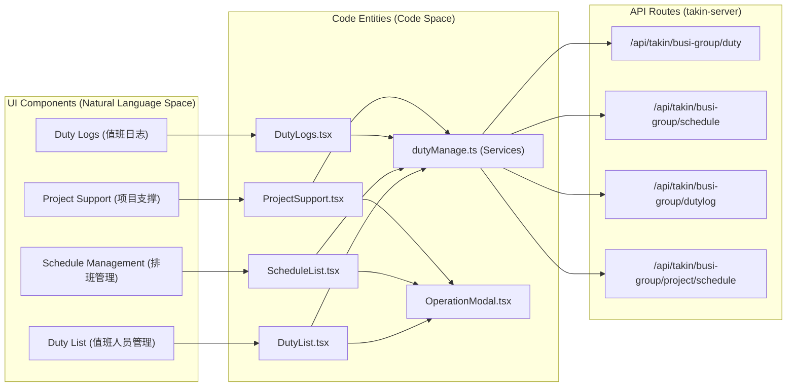
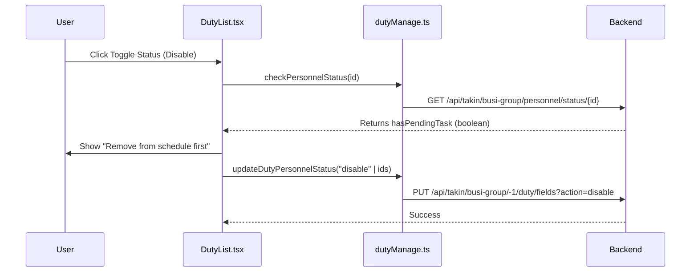

# Duty Management
Relevant source files

- [src/hooks/useIsMounted.ts](https://github.com/thetide557/ln-server-pub/blob/629bd918/src/hooks/useIsMounted.ts)
- [src/pages/sxxc/dutyManage/AutoScheduleModal.tsx](https://github.com/thetide557/ln-server-pub/blob/629bd918/src/pages/sxxc/dutyManage/AutoScheduleModal.tsx)
- [src/pages/sxxc/dutyManage/BatchDeleteModal.tsx](https://github.com/thetide557/ln-server-pub/blob/629bd918/src/pages/sxxc/dutyManage/BatchDeleteModal.tsx)
- [src/pages/sxxc/dutyManage/DutyList.tsx](https://github.com/thetide557/ln-server-pub/blob/629bd918/src/pages/sxxc/dutyManage/DutyList.tsx)
- [src/pages/sxxc/dutyManage/DutyLogs.less](https://github.com/thetide557/ln-server-pub/blob/629bd918/src/pages/sxxc/dutyManage/DutyLogs.less)
- [src/pages/sxxc/dutyManage/DutyLogs.tsx](https://github.com/thetide557/ln-server-pub/blob/629bd918/src/pages/sxxc/dutyManage/DutyLogs.tsx)
- [src/pages/sxxc/dutyManage/OperationModal.tsx](https://github.com/thetide557/ln-server-pub/blob/629bd918/src/pages/sxxc/dutyManage/OperationModal.tsx)
- [src/pages/sxxc/dutyManage/ProjectSupport.less](https://github.com/thetide557/ln-server-pub/blob/629bd918/src/pages/sxxc/dutyManage/ProjectSupport.less)
- [src/pages/sxxc/dutyManage/ProjectSupport.tsx](https://github.com/thetide557/ln-server-pub/blob/629bd918/src/pages/sxxc/dutyManage/ProjectSupport.tsx)
- [src/pages/sxxc/dutyManage/ScheduleList.tsx](https://github.com/thetide557/ln-server-pub/blob/629bd918/src/pages/sxxc/dutyManage/ScheduleList.tsx)
- [src/pages/sxxc/dutyManage/index.tsx](https://github.com/thetide557/ln-server-pub/blob/629bd918/src/pages/sxxc/dutyManage/index.tsx)
- [src/services/sxxc/dutyManage.ts](https://github.com/thetide557/ln-server-pub/blob/629bd918/src/services/sxxc/dutyManage.ts)

The Duty Management module provides a comprehensive personnel roster and scheduling system for operation and maintenance teams. It encompasses personnel information management, multi-tier duty scheduling (Director, Tier 1-3), project support coordination, and duty log recording with automated scheduling capabilities.

## Module Architecture

The module is organized into four primary functional tabs managed within a central layout `src/pages/sxxc/dutyManage/index.tsx`[src/pages/sxxc/dutyManage/index.tsx#1-42](https://github.com/thetide557/ln-server-pub/blob/629bd918/src/pages/sxxc/dutyManage/index.tsx#L1-L42)

### Data Flow Overview

The following diagram illustrates the relationship between the UI components and the backend service layer.

Duty Management System Mapping

Sources:[src/pages/sxxc/dutyManage/index.tsx#9-12](https://github.com/thetide557/ln-server-pub/blob/629bd918/src/pages/sxxc/dutyManage/index.tsx#L9-L12)[src/services/sxxc/dutyManage.ts#1-237](https://github.com/thetide557/ln-server-pub/blob/629bd918/src/services/sxxc/dutyManage.ts#L1-L237)

---

## Personnel Roster (DutyList)

The `DutyList` component manages the master list of O&M personnel available for scheduling.

### Key Functionalities

- CRUD Operations: Personnel can be added, edited, or deleted. Deletion and status changes (Enable/Disable) are protected by a pending task check via `getPersonnelStatus`[src/services/sxxc/dutyManage.ts#45-49](https://github.com/thetide557/ln-server-pub/blob/629bd918/src/services/sxxc/dutyManage.ts#L45-L49)
- Status Management: Personnel status (启用/禁用) affects their availability in scheduling dropdowns. If a user has pending duties, the system prevents disabling them to maintain schedule integrity [src/pages/sxxc/dutyManage/DutyList.tsx#240-250](https://github.com/thetide557/ln-server-pub/blob/629bd918/src/pages/sxxc/dutyManage/DutyList.tsx#L240-L250)
- Batch Operations: Supports batch importing via Excel templates using `OperationModal`[src/pages/sxxc/dutyManage/OperationModal.tsx#73-136](https://github.com/thetide557/ln-server-pub/blob/629bd918/src/pages/sxxc/dutyManage/OperationModal.tsx#L73-L136)

Personnel Lifecycle Logic

Sources:[src/pages/sxxc/dutyManage/DutyList.tsx#221-255](https://github.com/thetide557/ln-server-pub/blob/629bd918/src/pages/sxxc/dutyManage/DutyList.tsx#L221-L255)[src/services/sxxc/dutyManage.ts#45-57](https://github.com/thetide557/ln-server-pub/blob/629bd918/src/services/sxxc/dutyManage.ts#L45-L57)

---

## Scheduling & Auto-Generation

The platform supports two types of scheduling: standard O&M shifts (`ScheduleList`) and project-specific support (`ProjectSupport`).

### Auto-Schedule Generation

Both scheduling modules invoke the `autoSchedule` (`ScheduleList`) or `autoProjectSchedule` (`ProjectSupport`) services when auto-scheduling is triggered [src/services/sxxc/dutyManage.ts#168-173](https://github.com/thetide557/ln-server-pub/blob/629bd918/src/services/sxxc/dutyManage.ts#L168-L173)[src/services/sxxc/dutyManage.ts#231-236](https://github.com/thetide557/ln-server-pub/blob/629bd918/src/services/sxxc/dutyManage.ts#L231-L236), but neither tab actually drives this through the `AutoScheduleModal` configuration UI in the current build:

- Actual Behavior: The "自动排班" button in both `ScheduleList` and `ProjectSupport` calls a local `setSchedule` handler that opens a plain `Modal.confirm` and, on confirmation, calls the auto-schedule service with an empty payload (`{}`) — there is no "Current Month" / "Specific Date Range" selection in the live flow. The dialog text simply states that scheduling starts from the first unscheduled day and covers the next 30 days, with `ProjectSupport` additionally rounding the end date to that week's Sunday [src/pages/sxxc/dutyManage/ScheduleList.tsx#610-624](https://github.com/thetide557/ln-server-pub/blob/629bd918/src/pages/sxxc/dutyManage/ScheduleList.tsx#L610-L624)[src/pages/sxxc/dutyManage/ProjectSupport.tsx#626-646](https://github.com/thetide557/ln-server-pub/blob/629bd918/src/pages/sxxc/dutyManage/ProjectSupport.tsx#L626-L646)
- Dead Code: `AutoScheduleModal` (with its "Current Month"/"Specific Date Range" radio choice and `disabledDate` validation) is only wired up in `ScheduleList.tsx`, and even there the button that would set `autoScheduleVisible` to `true` is commented out, so the modal can never actually be opened from the UI [src/pages/sxxc/dutyManage/ScheduleList.tsx#712-722](https://github.com/thetide557/ln-server-pub/blob/629bd918/src/pages/sxxc/dutyManage/ScheduleList.tsx#L712-L722). `ProjectSupport.tsx` does not import `AutoScheduleModal` at all.

### Schedule Detail Components

The `ScheduleList` component renders a calendar view where each cell displays the assigned personnel for that date [src/pages/sxxc/dutyManage/ScheduleList.tsx#127-142](https://github.com/thetide557/ln-server-pub/blob/629bd918/src/pages/sxxc/dutyManage/ScheduleList.tsx#L127-L142)

- Tiered Roles: Supports `director_id` (值班主任), `first_line_ids` (一线), `second_line_ids` (二线), and `third_line_ids` (三线) [src/pages/sxxc/dutyManage/ScheduleList.tsx#53-65](https://github.com/thetide557/ln-server-pub/blob/629bd918/src/pages/sxxc/dutyManage/ScheduleList.tsx#L53-L65)
- Project Support: `ProjectSupport` specifically filters personnel using `getSupportOptions` to find staff marked for project assistance [src/services/sxxc/dutyManage.ts#177-181](https://github.com/thetide557/ln-server-pub/blob/629bd918/src/services/sxxc/dutyManage.ts#L177-L181)

Sources:[src/pages/sxxc/dutyManage/ScheduleList.tsx#146-159](https://github.com/thetide557/ln-server-pub/blob/629bd918/src/pages/sxxc/dutyManage/ScheduleList.tsx#L146-L159)[src/pages/sxxc/dutyManage/AutoScheduleModal.tsx#18-22](https://github.com/thetide557/ln-server-pub/blob/629bd918/src/pages/sxxc/dutyManage/AutoScheduleModal.tsx#L18-L22)

---

## Duty Logs & Batch Deletion

The `DutyLogs` component tracks operational activities recorded during shifts.

### Log Recording

- Lifecycle: Logs are fetched monthly via `getDutyLogList` and detailed per day via `getDutyLogDetail`[src/services/sxxc/dutyManage.ts#120-133](https://github.com/thetide557/ln-server-pub/blob/629bd918/src/services/sxxc/dutyManage.ts#L120-L133)
- Association: Logs are visually associated with the O&M schedule in the UI to verify who was on duty during a specific event [src/pages/sxxc/dutyManage/DutyLogs.tsx#139-149](https://github.com/thetide557/ln-server-pub/blob/629bd918/src/pages/sxxc/dutyManage/DutyLogs.tsx#L139-L149)

### Batch Delete with Validation

The `BatchDeleteModal` is a shared component used to clear data across specific time ranges [src/pages/sxxc/dutyManage/BatchDeleteModal.tsx#18-22](https://github.com/thetide557/ln-server-pub/blob/629bd918/src/pages/sxxc/dutyManage/BatchDeleteModal.tsx#L18-L22)

- Time-Range Validation: The `validateTimeRanges` function ensures that multiple selected time ranges do not overlap [src/pages/sxxc/dutyManage/BatchDeleteModal.tsx#33-48](https://github.com/thetide557/ln-server-pub/blob/629bd918/src/pages/sxxc/dutyManage/BatchDeleteModal.tsx#L33-L48)
- Logic: It sorts ranges by start time and checks if `current.end >= next.start`[src/pages/sxxc/dutyManage/BatchDeleteModal.tsx#40-46](https://github.com/thetide557/ln-server-pub/blob/629bd918/src/pages/sxxc/dutyManage/BatchDeleteModal.tsx#L40-L46)

Sources:[src/pages/sxxc/dutyManage/DutyLogs.tsx#95-115](https://github.com/thetide557/ln-server-pub/blob/629bd918/src/pages/sxxc/dutyManage/DutyLogs.tsx#L95-L115)[src/pages/sxxc/dutyManage/BatchDeleteModal.tsx#51-81](https://github.com/thetide557/ln-server-pub/blob/629bd918/src/pages/sxxc/dutyManage/BatchDeleteModal.tsx#L51-L81)

---

## Import and Export Utilities

Personnel and schedule data can be managed via Excel to handle large rosters.

| Function | Service Call | Target URL |
| --- | --- | --- |
| Download Template | `exportTemplet` | `/api/takin/busi-group/duty/template` |
| Excel Import | `importXhAssetSetData` | `/api/takin/xh/duty/import-xls` |

The `OperationModal` handles the file upload state. It uses `beforeUpload` to intercept the file, store it in `fileList`, and prevent automatic upload so the user can trigger it manually via `submitForm`[src/pages/sxxc/dutyManage/OperationModal.tsx#57-69](https://github.com/thetide557/ln-server-pub/blob/629bd918/src/pages/sxxc/dutyManage/OperationModal.tsx#L57-L69)[src/pages/sxxc/dutyManage/OperationModal.tsx#172-190](https://github.com/thetide557/ln-server-pub/blob/629bd918/src/pages/sxxc/dutyManage/OperationModal.tsx#L172-L190)

`DutyList` (batch import) and `ScheduleList` (导入/导出 buttons) both expose this flow in the live UI. `ProjectSupport` also renders an `OperationModal` and defines `handleImport`/`handleExport`, but the toolbar buttons that call them are commented out in the current build, so Excel import/export is not reachable from the `ProjectSupport` tab [src/pages/sxxc/dutyManage/ProjectSupport.tsx#704-724](https://github.com/thetide557/ln-server-pub/blob/629bd918/src/pages/sxxc/dutyManage/ProjectSupport.tsx#L704-L724)

Sources:[src/pages/sxxc/dutyManage/OperationModal.tsx#33-37](https://github.com/thetide557/ln-server-pub/blob/629bd918/src/pages/sxxc/dutyManage/OperationModal.tsx#L33-L37)[src/pages/sxxc/dutyManage/OperationModal.tsx#101-122](https://github.com/thetide557/ln-server-pub/blob/629bd918/src/pages/sxxc/dutyManage/OperationModal.tsx#L101-L122)