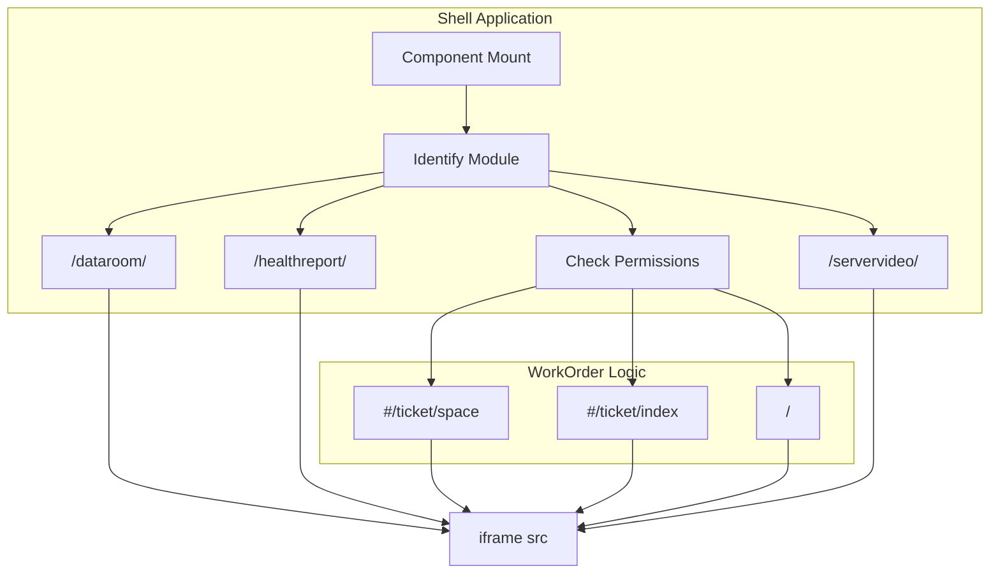

# Integrated Iframe Sub-Applications
Relevant source files

- [src/components/PromQueryBuilder/components/metrics_translation.ts](https://github.com/thetide557/ln-server-pub/blob/629bd918/src/components/PromQueryBuilder/components/metrics_translation.ts)
- [src/pages/dataRoom/index.tsx](https://github.com/thetide557/ln-server-pub/blob/629bd918/src/pages/dataRoom/index.tsx)
- [src/pages/sxxc/autoInspect/index.tsx](https://github.com/thetide557/ln-server-pub/blob/629bd918/src/pages/sxxc/autoInspect/index.tsx)
- [src/pages/sxxc/healthReport/index.tsx](https://github.com/thetide557/ln-server-pub/blob/629bd918/src/pages/sxxc/healthReport/index.tsx)
- [src/pages/sxxc/productionPlan/index.less](https://github.com/thetide557/ln-server-pub/blob/629bd918/src/pages/sxxc/productionPlan/index.less)
- [src/pages/sxxc/productionPlan/index.tsx](https://github.com/thetide557/ln-server-pub/blob/629bd918/src/pages/sxxc/productionPlan/index.tsx)
- [src/pages/sxxc/serverVideoAlarm/index.tsx](https://github.com/thetide557/ln-server-pub/blob/629bd918/src/pages/sxxc/serverVideoAlarm/index.tsx)
- [src/pages/sxxc/serverVideoAsset/index.tsx](https://github.com/thetide557/ln-server-pub/blob/629bd918/src/pages/sxxc/serverVideoAsset/index.tsx)
- [src/pages/sxxc/topology/index.tsx](https://github.com/thetide557/ln-server-pub/blob/629bd918/src/pages/sxxc/topology/index.tsx)
- [src/pages/sxxc/workorder/index.less](https://github.com/thetide557/ln-server-pub/blob/629bd918/src/pages/sxxc/workorder/index.less)
- [src/pages/sxxc/workorder/index.tsx](https://github.com/thetide557/ln-server-pub/blob/629bd918/src/pages/sxxc/workorder/index.tsx)
- [src/utils/request.ts](https://github.com/thetide557/ln-server-pub/blob/629bd918/src/utils/request.ts)

The LingNiu (羚牛) platform extends its core functionality by integrating several specialized sub-applications via `<iframe>` elements. These sub-applications are hosted as independent modules within the platform's infrastructure, allowing for a unified user experience while maintaining decoupled development cycles for specific features like Work Orders, Topology, and Health Reports. (Two additional "Server Video" sub-applications exist in the source tree but are currently dead code — see [Server Video (Alarm & Asset)](#3-server-video-alarm--asset) below.)

## Architecture and Data Flow

Sub-applications are embedded using standard React functional components that return an `<iframe>`. Each host component appends a cache-busting `timestamp` to the iframe `src` as a URL query parameter, and the Work Order component additionally appends a hash route to select an initial view based on permissions. Although every host component also reads `access_token` via `js-cookie`, in the current code this value is **not** actually forwarded into the iframe: it is not appended to the `src` query string, and the `postMessage`-based token-forwarding code present (commented out) in `healthReport`, `autoInspect`, `topology`, and `productionPlan` never executes. Authentication for the embedded sub-applications instead relies on the browser automatically sending the shared, same-origin session cookie when it requests the iframe `src`.

### Authentication & Token Passing

The platform utilizes `js-cookie` to retrieve the `access_token` from the browser in each host component, but this value is unused dead code in the current implementation — it is not appended to the iframe URL and the corresponding `postMessage` calls are commented out. Session continuity inside the iframe instead depends on the shared same-origin session cookie being sent automatically by the browser.

| Mechanism | Implementation |
| --- | --- |
| Token Retrieval (present but unused) | `Cookies.get('access_token')`[src/pages/dataRoom/index.tsx#5](https://github.com/thetide557/ln-server-pub/blob/629bd918/src/pages/dataRoom/index.tsx#L5-L5) — the returned value is assigned to a variable but never forwarded to the iframe; the `postMessage({'token': token}, '*')` calls that would do so are commented out in `healthReport`, `autoInspect`, `topology`, and `productionPlan` |
| Cache Busting | Appending a `timestamp` (Unix epoch) to the URL to prevent browser caching of the iframe content [src/pages/sxxc/autoInspect/index.tsx#8-9](https://github.com/thetide557/ln-server-pub/blob/629bd918/src/pages/sxxc/autoInspect/index.tsx#L8-L9) |
| Frame Styling | Standardized to `width: 100%`, `height: 100%`, and `border: none`[src/pages/sxxc/productionPlan/index.less#1-3](https://github.com/thetide557/ln-server-pub/blob/629bd918/src/pages/sxxc/productionPlan/index.less#L1-L3) |

### Sub-Application Routing Logic

The following diagram illustrates how the main application shell resolves the URL for various sub-applications.

Iframe URL Resolution Flow



Note: the `F["/servervideo/"]` branch reflects the `serverVideoAlarm`/`serverVideoAsset` components' internal iframe-path logic only. Those two components are not actually mounted — their imports and `<Route>` entries in `src/routers/index.tsx` and their menu entries in `src/components/menu/topMenuXH.tsx` are all commented out — so this branch is unreachable in the running application.

Sources: [src/pages/sxxc/workorder/index.tsx#11-20](https://github.com/thetide557/ln-server-pub/blob/629bd918/src/pages/sxxc/workorder/index.tsx#L11-L20)[src/pages/dataRoom/index.tsx#7](https://github.com/thetide557/ln-server-pub/blob/629bd918/src/pages/dataRoom/index.tsx#L7-L7)[src/pages/sxxc/healthReport/index.tsx#9](https://github.com/thetide557/ln-server-pub/blob/629bd918/src/pages/sxxc/healthReport/index.tsx#L9-L9)

---

## Sub-Application Directory

### 1. DataRoom (Visualization)

The `DataRoom` component provides a large-screen data visualization interface. It appends a timestamp to the base path `/dataroom/` to ensure the most recent dashboard configuration is loaded.

- File:`src/pages/dataRoom/index.tsx`
- Iframe content path:`/dataroom/`[src/pages/dataRoom/index.tsx#7](https://github.com/thetide557/ln-server-pub/blob/629bd918/src/pages/dataRoom/index.tsx#L7-L7)
- App route (menu-reachable): `/bigscreen`, menu "大屏管理 > 大屏设计" in `src/routers/index.tsx` and `src/components/menu/topMenuXH.tsx`

### 2. Work Order (工单系统)

The Work Order module implements complex permission-based routing. It accesses the `CommonStateContext` to retrieve the `permList` and determines the initial hash route based on the user's specific privileges.

| Permission Check | Redirect Path |
| --- | --- |
| Lacks `/workorder/order` AND `/workorder/ticket/index` | `#/ticket/space` |
| Lacks `/workorder/order` | `#/ticket/index` |
| Default (Has permissions) | `/workorder/` |

- File:`src/pages/sxxc/workorder/index.tsx`
- Context Usage:`const { permList } = useContext(CommonStateContext);`[src/pages/sxxc/workorder/index.tsx#9](https://github.com/thetide557/ln-server-pub/blob/629bd918/src/pages/sxxc/workorder/index.tsx#L9-L9)
- Implementation:[src/pages/sxxc/workorder/index.tsx#13-19](https://github.com/thetide557/ln-server-pub/blob/629bd918/src/pages/sxxc/workorder/index.tsx#L13-L19)
- App route (menu-reachable): `/workOrder`, menu "运维工单" in `src/routers/index.tsx` and `src/components/menu/topMenuXH.tsx`

### 3. Server Video (Alarm & Asset) — Dead Code, Not Reachable

The `serverVideoAlarm` and `serverVideoAsset` components target different hash routes (`#/alarm-management` and `#/asset-management` respectively) within a `/servervideo/` sub-application, but **neither component is actually part of the running application**. In `src/routers/index.tsx` both the imports and the `<Route>` entries are commented out, and in `src/components/menu/topMenuXH.tsx` both corresponding menu entries ("视频类项目资产清单" and "视频类项目历史告警") are commented out as well. There is no path in the current codebase to mount either component, so this should not be treated as an available/live feature.

- Video Alarms (dead code): `#/alarm-management`[src/pages/sxxc/serverVideoAlarm/index.tsx#13](https://github.com/thetide557/ln-server-pub/blob/629bd918/src/pages/sxxc/serverVideoAlarm/index.tsx#L13-L13)
- Video Assets (dead code): `#/asset-management`[src/pages/sxxc/serverVideoAsset/index.tsx#13](https://github.com/thetide557/ln-server-pub/blob/629bd918/src/pages/sxxc/serverVideoAsset/index.tsx#L13-L13)

### 4. Automated Inspection & Operations

These modules provide specialized operational tools:

- Auto Inspect: iframe content path `/autoinspect/`; app route `/autoInspect`, menu "系统配置 > 自动化检测". [src/pages/sxxc/autoInspect/index.tsx#9](https://github.com/thetide557/ln-server-pub/blob/629bd918/src/pages/sxxc/autoInspect/index.tsx#L9-L9)
- Topology: iframe content path `/topology/`; app route `/bigscreen/topology`, menu "大屏管理 > 拓扑管理". [src/pages/sxxc/topology/index.tsx#9](https://github.com/thetide557/ln-server-pub/blob/629bd918/src/pages/sxxc/topology/index.tsx#L9-L9)
- Health Report: iframe content path `/healthreport/`; app route `/healthReport`, menu "健康报告". [src/pages/sxxc/healthReport/index.tsx#9](https://github.com/thetide557/ln-server-pub/blob/629bd918/src/pages/sxxc/healthReport/index.tsx#L9-L9)
- Production Plan: iframe content path `/productionPlan/`; app route `/productionplan` is registered in `src/routers/index.tsx`, but its menu entry ("巡检中心 > 作业计划管理") is commented out in `src/components/menu/topMenuXH.tsx`. The page therefore has **no menu entry** and is only reachable by navigating directly to the URL. [src/pages/sxxc/productionPlan/index.tsx#9](https://github.com/thetide557/ln-server-pub/blob/629bd918/src/pages/sxxc/productionPlan/index.tsx#L9-L9)

---

## Technical Implementation Detail

### Iframe Component Pattern

All integrated sub-applications follow a consistent React pattern. The component initializes the URL state and renders a full-screen iframe.

Code Entity Relationship

Sources: [src/pages/sxxc/workorder/index.tsx#7-24](https://github.com/thetide557/ln-server-pub/blob/629bd918/src/pages/sxxc/workorder/index.tsx#L7-L24)[src/pages/dataRoom/index.tsx#4-11](https://github.com/thetide557/ln-server-pub/blob/629bd918/src/pages/dataRoom/index.tsx#L4-L11)

### Security and Headers

The main application shell handles authentication via `src/utils/request.ts`, whose request interceptor attaches `Authorization: Bearer <token>` (read from the `access_token` cookie) to all of the shell's own API calls. This mechanism is internal to the shell's own HTTP client and is **not** used to authenticate the iframe sub-applications: there is no active code path that forwards `access_token` into any iframe (all URL-param/`postMessage` token-passing code is commented out — see [Authentication & Token Passing](#authentication--token-passing)). Because each iframe `src` is a same-origin relative path (e.g. `/workorder/`, `/healthreport/`), the sub-applications instead rely on the browser automatically sending the shared session cookie when the iframe's own request is made; there is no separate token/postMessage-based auth handshake actually in effect.

- Request Interceptor:[src/utils/request.ts#66-77](https://github.com/thetide557/ln-server-pub/blob/629bd918/src/utils/request.ts#L66-L77)
- Token Storage:`Cookies.get("access_token")`[src/utils/request.ts#70](https://github.com/thetide557/ln-server-pub/blob/629bd918/src/utils/request.ts#L70-L70)

### CSS Integration

To ensure the iframes blend seamlessly into the platform UI, specific styles are applied to remove borders and manage scrolling.

```
// src/pages/sxxc/productionPlan/index.less
iframe {
  display: block;
  border: none;
}
```

Sources: [src/pages/sxxc/productionPlan/index.less#1-3](https://github.com/thetide557/ln-server-pub/blob/629bd918/src/pages/sxxc/productionPlan/index.less#L1-L3)[src/pages/sxxc/workorder/index.less#1-3](https://github.com/thetide557/ln-server-pub/blob/629bd918/src/pages/sxxc/workorder/index.less#L1-L3)

---

Sources:

- `src/pages/dataRoom/index.tsx`
- `src/pages/sxxc/workorder/index.tsx`
- `src/pages/sxxc/healthReport/index.tsx`
- `src/pages/sxxc/serverVideoAlarm/index.tsx`
- `src/pages/sxxc/serverVideoAsset/index.tsx`
- `src/pages/sxxc/autoInspect/index.tsx`
- `src/pages/sxxc/topology/index.tsx`
- `src/pages/sxxc/productionPlan/index.tsx`
- `src/utils/request.ts`
- `src/pages/sxxc/productionPlan/index.less`