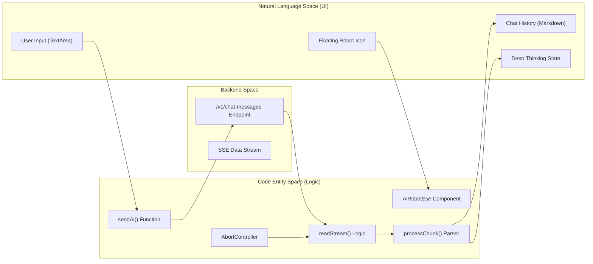
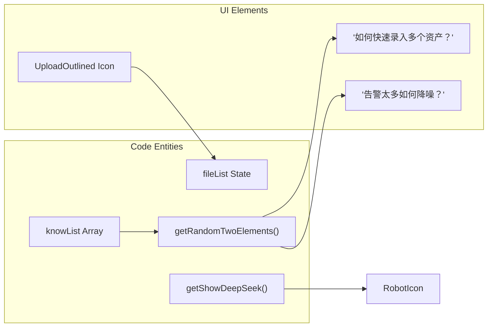

# AI Assistant (AiRobot)
Relevant source files

- [index.html](https://github.com/thetide557/ln-server-pub/blob/629bd918/index.html)
- [public/image/ai/d-logo.png](https://github.com/thetide557/ln-server-pub/blob/629bd918/public/image/ai/d-logo.png)
- [public/image/ai/l-logo.png](https://github.com/thetide557/ln-server-pub/blob/629bd918/public/image/ai/l-logo.png)
- [public/image/ai/l-robot.png](https://github.com/thetide557/ln-server-pub/blob/629bd918/public/image/ai/l-robot.png)
- [public/image/ai/robot.png](https://github.com/thetide557/ln-server-pub/blob/629bd918/public/image/ai/robot.png)
- [public/image/ai/send.png](https://github.com/thetide557/ln-server-pub/blob/629bd918/public/image/ai/send.png)
- [src/pages/sxxc/aiRobot/index.less](https://github.com/thetide557/ln-server-pub/blob/629bd918/src/pages/sxxc/aiRobot/index.less)
- [src/pages/sxxc/aiRobot/index.tsx](https://github.com/thetide557/ln-server-pub/blob/629bd918/src/pages/sxxc/aiRobot/index.tsx)
- [src/pages/sxxc/aiRobot/sse.tsx](https://github.com/thetide557/ln-server-pub/blob/629bd918/src/pages/sxxc/aiRobot/sse.tsx)

The AiRobot is a floating, draggable AI assistant integrated throughout the platform to provide real-time operational support, answer system-related queries, and assist with alert troubleshooting. It leverages DeepSeek backend integration and a specialized KnowList suggestion system to guide users through platform features.

### System Overview

The AI Assistant is implemented primarily as a React component that persists across different views (standard dashboard and large-screen views). It supports multiple interaction states, including a collapsed "robot" icon and an expanded chat interface.

#### Key Capabilities:

- SSE Streaming: Uses Server-Sent Events to provide real-time, character-by-character responses [src/pages/sxxc/aiRobot/sse.tsx#153-175](https://github.com/thetide557/ln-server-pub/blob/629bd918/src/pages/sxxc/aiRobot/sse.tsx#L153-L175)
- Deep Thinking: Visualizes the AI's "thought process" by parsing `<think>` tags within the response stream [src/pages/sxxc/aiRobot/sse.tsx#280-285](https://github.com/thetide557/ln-server-pub/blob/629bd918/src/pages/sxxc/aiRobot/sse.tsx#L280-L285)
- Contextual Awareness: Allows users to upload files (Word, Excel, PPT, Images) to provide context for AI queries [src/pages/sxxc/aiRobot/sse.tsx#251-275](https://github.com/thetide557/ln-server-pub/blob/629bd918/src/pages/sxxc/aiRobot/sse.tsx#L251-L275)
- Adaptive UI: Automatically adjusts positioning and themes (dark/light) based on the current viewport and page type (e.g., `screenView`) [src/pages/sxxc/aiRobot/sse.tsx#75-79](https://github.com/thetide557/ln-server-pub/blob/629bd918/src/pages/sxxc/aiRobot/sse.tsx#L75-L79)

### Core Architecture & Entity Mapping

The following diagram illustrates the relationship between the UI components, the streaming logic, and the backend communication layer.

AiRobot Component Interaction Flow

Sources:[src/pages/sxxc/aiRobot/sse.tsx#26-38](https://github.com/thetide557/ln-server-pub/blob/629bd918/src/pages/sxxc/aiRobot/sse.tsx#L26-L38)[src/pages/sxxc/aiRobot/sse.tsx#180-188](https://github.com/thetide557/ln-server-pub/blob/629bd918/src/pages/sxxc/aiRobot/sse.tsx#L180-L188)[src/pages/sxxc/aiRobot/sse.tsx#207-231](https://github.com/thetide557/ln-server-pub/blob/629bd918/src/pages/sxxc/aiRobot/sse.tsx#L207-L231)[src/pages/sxxc/aiRobot/sse.tsx#239-290](https://github.com/thetide557/ln-server-pub/blob/629bd918/src/pages/sxxc/aiRobot/sse.tsx#L239-L290)

---

### Key Modules

#### SSE Streaming & Chat Architecture

The core of the assistant's responsiveness lies in its SSE implementation. Unlike standard REST calls, the assistant maintains an open connection to the `/v1/chat-messages` endpoint (DeepSeek proxy), processing data chunks as they arrive. This allows the UI to render text immediately rather than waiting for the full response.

- Cancellation: If a `task_id` has already been received from the stream, stopping generation posts to the `/v1/chat-messages/{taskId}/stop` endpoint on the backend; if no `task_id` has arrived yet (or the request times out), the local `AbortController` aborts the in-flight fetch instead [src/pages/sxxc/aiRobot/sse.tsx#204-209](https://github.com/thetide557/ln-server-pub/blob/629bd918/src/pages/sxxc/aiRobot/sse.tsx#L204-L209)
- Markdown Rendering: Responses are converted from raw text to formatted HTML using the `marked` library [src/pages/sxxc/aiRobot/sse.tsx#279](https://github.com/thetide557/ln-server-pub/blob/629bd918/src/pages/sxxc/aiRobot/sse.tsx#L279-L279)

For details, see [SSE Streaming & Chat Architecture](/org/benjamin-braddock/wiki/thetide557/ln-server-pub/page/8.1?branch=v2.1).

#### AI UI, Theming & File Uploads

The UI is designed to be non-intrusive yet accessible. It uses `react-draggable` to allow users to move the assistant anywhere on the screen.

- Theming: The assistant detects if it is on a "Big Screen" view (`/screenView`) and applies a dark theme to match the high-contrast dashboard environment [src/pages/sxxc/aiRobot/sse.tsx#75-79](https://github.com/thetide557/ln-server-pub/blob/629bd918/src/pages/sxxc/aiRobot/sse.tsx#L75-L79)
- File Context: A file upload manager handles attachments, sending file information to the backend to ground the AI's answers in specific documents [src/pages/sxxc/aiRobot/sse.tsx#251-265](https://github.com/thetide557/ln-server-pub/blob/629bd918/src/pages/sxxc/aiRobot/sse.tsx#L251-L265)
- Responsive Layout: The dialog size and position are calculated dynamically based on `window.innerWidth` to ensure it doesn't overlap critical UI elements [src/pages/sxxc/aiRobot/sse.tsx#101-110](https://github.com/thetide557/ln-server-pub/blob/629bd918/src/pages/sxxc/aiRobot/sse.tsx#L101-L110)

For details, see [AI UI, Theming & File Uploads](/org/benjamin-braddock/wiki/thetide557/ln-server-pub/page/8.2?branch=v2.1).

#### KnowList Suggestion System

To help new users, the assistant features a `knowList`—a predefined set of common operations and maintenance questions.

- Randomization: On initial component mount, and again whenever the "refresh" icon is clicked, two random questions are selected from the list to prompt user interaction (opening/closing the chat window itself does not reshuffle the list) [src/pages/sxxc/aiRobot/sse.tsx#81-98](https://github.com/thetide557/ln-server-pub/blob/629bd918/src/pages/sxxc/aiRobot/sse.tsx#L81-L98)
- One-Click Query: Clicking a suggestion automatically populates the input field and triggers the AI request [src/pages/sxxc/aiRobot/sse.tsx#300-303](https://github.com/thetide557/ln-server-pub/blob/629bd918/src/pages/sxxc/aiRobot/sse.tsx#L300-L303)

Entity Association Diagram

Sources:[src/pages/sxxc/aiRobot/sse.tsx#39-60](https://github.com/thetide557/ln-server-pub/blob/629bd918/src/pages/sxxc/aiRobot/sse.tsx#L39-L60)[src/pages/sxxc/aiRobot/sse.tsx#81-98](https://github.com/thetide557/ln-server-pub/blob/629bd918/src/pages/sxxc/aiRobot/sse.tsx#L81-L98)[src/pages/sxxc/aiRobot/sse.tsx#150-155](https://github.com/thetide557/ln-server-pub/blob/629bd918/src/pages/sxxc/aiRobot/sse.tsx#L150-L155)

### Technical Summary Table

| Feature | Implementation Detail | File Reference |
| --- | --- | --- |
| Backend Provider | DeepSeek (via `/v1/*` proxy, e.g. `/v1/chat-messages`) | [src/pages/sxxc/aiRobot/sse.tsx#276](https://github.com/thetide557/ln-server-pub/blob/629bd918/src/pages/sxxc/aiRobot/sse.tsx#L276-L276) |
| Streaming Protocol | Server-Sent Events (SSE)-formatted stream, read manually via `fetch` + `ReadableStream` reader (not the browser `EventSource` API) | [src/pages/sxxc/aiRobot/sse.tsx#153-175](https://github.com/thetide557/ln-server-pub/blob/629bd918/src/pages/sxxc/aiRobot/sse.tsx#L153-L175) |
| Draggable Container | `react-draggable` | [src/pages/sxxc/aiRobot/sse.tsx#317](https://github.com/thetide557/ln-server-pub/blob/629bd918/src/pages/sxxc/aiRobot/sse.tsx#L317-L317) |
| Thought Parsing | Regex match (`/<think>(.*?)<\/think>(.*)/s`) against the accumulated stream buffer for `<think>` tags | [src/pages/sxxc/aiRobot/sse.tsx#280-285](https://github.com/thetide557/ln-server-pub/blob/629bd918/src/pages/sxxc/aiRobot/sse.tsx#L280-L285) |
| Style Framework | Less (scoped to `.nav-bar`) | [src/pages/sxxc/aiRobot/index.less#1-5](https://github.com/thetide557/ln-server-pub/blob/629bd918/src/pages/sxxc/aiRobot/index.less#L1-L5) |
| File Support | `.doc`, `.xlsx`, `.ppt`, `.png`, `.jpg` | [src/pages/sxxc/aiRobot/sse.tsx#15-19](https://github.com/thetide557/ln-server-pub/blob/629bd918/src/pages/sxxc/aiRobot/sse.tsx#L15-L19) |

Sources:[src/pages/sxxc/aiRobot/sse.tsx#1-30](https://github.com/thetide557/ln-server-pub/blob/629bd918/src/pages/sxxc/aiRobot/sse.tsx#L1-L30) | [src/pages/sxxc/aiRobot/index.less#1-100](https://github.com/thetide557/ln-server-pub/blob/629bd918/src/pages/sxxc/aiRobot/index.less#L1-L100)