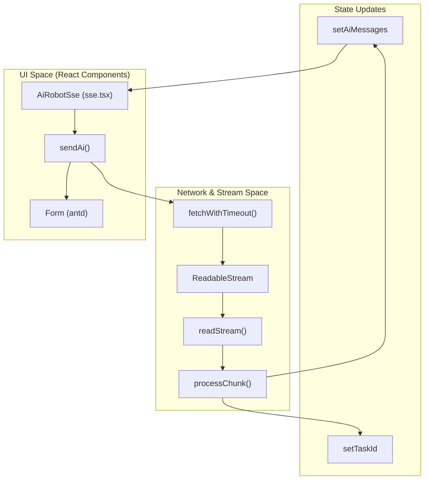
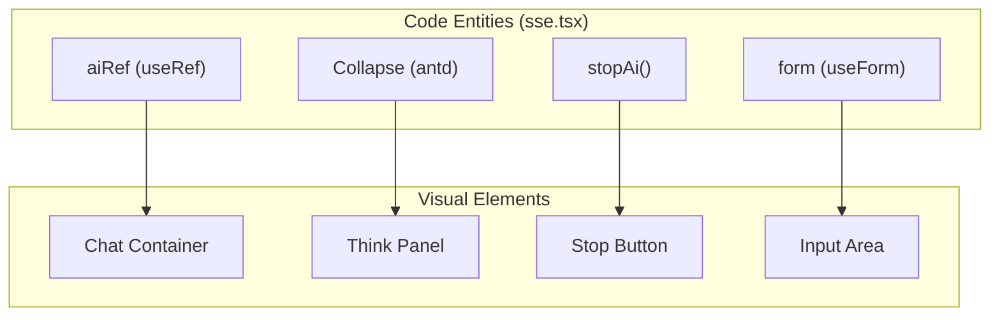

# SSE Streaming & Chat Architecture
Relevant source files

- [index.html](https://github.com/thetide557/ln-server-pub/blob/629bd918/index.html)
- [src/pages/sxxc/aiRobot/index.less](https://github.com/thetide557/ln-server-pub/blob/629bd918/src/pages/sxxc/aiRobot/index.less)
- [src/pages/sxxc/aiRobot/index.tsx](https://github.com/thetide557/ln-server-pub/blob/629bd918/src/pages/sxxc/aiRobot/index.tsx)
- [src/pages/sxxc/aiRobot/sse.tsx](https://github.com/thetide557/ln-server-pub/blob/629bd918/src/pages/sxxc/aiRobot/sse.tsx)

The AI Assistant (AiRobot) utilizes Server-Sent Events (SSE) to provide real-time, streaming responses from backend LLM models (such as DeepSeek). This architecture ensures that users receive immediate feedback as the model generates text, supporting long-running "thinking" processes and multi-modal contexts (files and text).

## 1. Streaming Lifecycle & Data Flow

The streaming process is initiated via the `sendAi` function, which manages the transition from a user input to a reactive UI update. The system uses the browser's `fetch` API with a `ReadableStream` to process incoming data chunks.

### Data Flow Architecture

The following diagram illustrates the transition from the UI layer to the network stream processing logic.

Diagram: Chat Request to Stream Processing

Sources:

- `src/pages/sxxc/aiRobot/sse.tsx:239-250` (sendAi initialization)
- `src/pages/sxxc/aiRobot/sse.tsx:195-204` (fetchWithTimeout implementation)
- `src/pages/sxxc/aiRobot/sse.tsx:300-320` (readStream recursive loop)

## 2. Chunk Processing & Think-Tag Parsing

The platform handles specialized AI responses that include "thinking" steps (common in reasoning models). The `processChunk` function parses the raw SSE `data:` lines, while separate UI logic (in `sendAi`'s `readStream`) handles the rendering of `<think>` tags.

### Chunk Parsing Logic

1. Prefix Removal: The `processChunk` function identifies lines starting with `data:` and strips the prefix `<FileRef file-url="https://github.com/thetide557/ln-server-pub/blob/629bd918/src/pages/sxxc/aiRobot/sse.tsx#L213-L214" min=213 max=214 file-path="src/pages/sxxc/aiRobot/sse.tsx">Hii</FileRef>`.
2. JSON Validation: Each chunk is parsed as JSON to extract the `answer` and `task_id``<FileRef file-url="https://github.com/thetide557/ln-server-pub/blob/629bd918/src/pages/sxxc/aiRobot/sse.tsx#L217-L224" min=217 max=224 file-path="src/pages/sxxc/aiRobot/sse.tsx">Hii</FileRef>`.
3. Task ID Lifecycle: The `task_id` is stored in component state only when the parsed chunk has `task_id` **and no** `workflow_run_id` present; this stored `task_id` is later used by `stopAi` to target the server-side stop endpoint (`POST /v1/chat-messages/{taskId}/stop`) for cancelling generation `<FileRef file-url="https://github.com/thetide557/ln-server-pub/blob/629bd918/src/pages/sxxc/aiRobot/sse.tsx#L219-L221" min=219 max=221 file-path="src/pages/sxxc/aiRobot/sse.tsx">Hii</FileRef>`.

### Think-Tag Handling

When the AI is in a "thinking" state, the accumulated response contains `<think>` tags (not `<thought>`). The component uses a single regex match — not a global multi-match loop — to split the whole accumulated `aiStr` into a "think" part and a "post-think" part in one pass, re-evaluated on every chunk:

- Regex: `/<think>(.*?)<\/think>(.*)/s``<FileRef file-url="https://github.com/thetide557/ln-server-pub/blob/629bd918/src/pages/sxxc/aiRobot/sse.tsx#L336-L336" min=336 max=336 file-path="src/pages/sxxc/aiRobot/sse.tsx">Hii</FileRef>` — group 1 is the think content, group 2 is everything after the closing `</think>` tag.
- UI Representation: Both parts are rendered inside an `antd``Collapse` panel. While the `<think>` tag has not yet closed in the stream (no match, only raw text so far, or a match with empty/no post-think content), the panel header shows "深度思考中..."; once the closing tag has arrived and post-think content exists, the header switches to "深度思考完成" and the post-think content is rendered separately below a `Divider` `<FileRef file-url="https://github.com/thetide557/ln-server-pub/blob/629bd918/src/pages/sxxc/aiRobot/sse.tsx#L634-L685" min=634 max=685 file-path="src/pages/sxxc/aiRobot/sse.tsx">Hii</FileRef>`.

Sources:

- `src/pages/sxxc/aiRobot/sse.tsx:207-231` (processChunk implementation)
- `src/pages/sxxc/aiRobot/sse.tsx:634-685` (Rendering logic for think tags)

## 3. Cancellation & Lifecycle Management

To prevent resource leaks and allow users to stop long-running AI generations, the architecture incorporates `AbortController`.

| Entity | Role | Code Reference |
| --- | --- | --- |
| `controller` | React state holding the current `AbortController` instance. | `<FileRef file-url="https://github.com/thetide557/ln-server-pub/blob/629bd918/src/pages/sxxc/aiRobot/sse.tsx#L63-L63" min=63 file-path="src/pages/sxxc/aiRobot/sse.tsx">Hii</FileRef>` |
| `stopAi` | Two-branch stop function: if a `task_id` is set (the common case), it POSTs to `/v1/chat-messages/{taskId}/stop` on the server (with body `{ user }`) and sets loading to false — it does **not** call `abort()` in this branch. Only when no `task_id` exists does it fall back to calling local `controller.abort()`, resetting the `AbortController`, and setting loading to false. | `<FileRef file-url="https://github.com/thetide557/ln-server-pub/blob/629bd918/src/pages/sxxc/aiRobot/sse.tsx#L428-L460" min=428 max=460 file-path="src/pages/sxxc/aiRobot/sse.tsx">Hii</FileRef>` |
| `fetchWithTimeout` | Injects the `controller.signal` into the fetch request. | `<FileRef file-url="https://github.com/thetide557/ln-server-pub/blob/629bd918/src/pages/sxxc/aiRobot/sse.tsx#L196-L196" min=196 file-path="src/pages/sxxc/aiRobot/sse.tsx">Hii</FileRef>` |
| `Cleanup` | `useEffect` hook that aborts any pending request when the component unmounts. | `<FileRef file-url="https://github.com/thetide557/ln-server-pub/blob/629bd918/src/pages/sxxc/aiRobot/sse.tsx#L160-L162" min=160 max=162 file-path="src/pages/sxxc/aiRobot/sse.tsx">Hii</FileRef>` |

Sources:

- `src/pages/sxxc/aiRobot/sse.tsx:63-63` (State definition)
- `src/pages/sxxc/aiRobot/sse.tsx:428-460` (Stop functionality)

## 4. UI Synchronization & Auto-Scrolling

The chat interface must maintain visual continuity during rapid streaming updates.

### Auto-Scrolling Behavior

Whenever the `aiMessages` state updates, the system triggers a scroll-to-bottom operation to ensure the latest generated text is visible. This is implemented as a **single** `useEffect` keyed on `aiMessages` — not as separate scroll calls placed at the send/stream call sites. Because both sending a new message and each streamed chunk update go through `setAiMessages`, this one effect re-fires on every such update and covers both cases.

- Implementation: The `aiRef` (referencing the scrollable container) has its `scrollTop` set to `scrollHeight` inside `useEffect(() => { ... }, [aiMessages])``<FileRef file-url="https://github.com/thetide557/ln-server-pub/blob/629bd918/src/pages/sxxc/aiRobot/sse.tsx#L488-L492" min=488 max=492 file-path="src/pages/sxxc/aiRobot/sse.tsx">Hii</FileRef>`.
- Trigger: "New message sent" and "streaming chunk arrived" both funnel through `setAiMessages`, so they share this one effect. Note there is a similar `aiRef.current.scrollTop = ...` line directly inside `sendAi`, but it is commented out and does not execute `<FileRef file-url="https://github.com/thetide557/ln-server-pub/blob/629bd918/src/pages/sxxc/aiRobot/sse.tsx#L278-L278" min=278 max=278 file-path="src/pages/sxxc/aiRobot/sse.tsx">Hii</FileRef>`.

### Code Entity Mapping

The following diagram maps internal logic functions to the visual components they manage.

Diagram: UI Entity to Code Logic Mapping

Sources:

- `src/pages/sxxc/aiRobot/sse.tsx:34-35` (Refs definition)
- `src/pages/sxxc/aiRobot/sse.tsx:488-492` (Auto-scroll `useEffect`, fires on every `aiMessages` update)
- `src/pages/sxxc/aiRobot/sse.tsx:278` (commented-out/dead scroll call inside `sendAi`, not executed)
- `src/pages/sxxc/aiRobot/index.less:93-101` (Scrollbar CSS)

## 5. Technical Specifications

| Feature | Implementation Detail |
| --- | --- |
| SSE Protocol | Standard HTTP POST with `ReadableStream` processing (not EventSource). |
| Markdown | `marked` library is used to parse AI strings into HTML `<FileRef file-url="https://github.com/thetide557/ln-server-pub/blob/629bd918/src/pages/sxxc/aiRobot/sse.tsx#L313-L313" min=313 file-path="src/pages/sxxc/aiRobot/sse.tsx">Hii</FileRef>`. |
| Timeout | Default timeout is set to 60,000ms `<FileRef file-url="https://github.com/thetide557/ln-server-pub/blob/629bd918/src/pages/sxxc/aiRobot/sse.tsx#L195-L195" min=195 file-path="src/pages/sxxc/aiRobot/sse.tsx">Hii</FileRef>`. |
| Context | Supports file context via `fileList`, sent as `files:[{type:"document",transfer_method:"local_file",upload_file_id}]` when a file is attached. No `conversation_id` is included in the request body, so each call to `/v1/chat-messages` is an independent, single-turn request with no cross-turn context threading `<FileRef file-url="https://github.com/thetide557/ln-server-pub/blob/629bd918/src/pages/sxxc/aiRobot/sse.tsx#L251-L279" min=251 max=279 file-path="src/pages/sxxc/aiRobot/sse.tsx">Hii</FileRef>`. (Note: `kb_cls: "ln"` only appears in the deprecated, unreferenced `index.tsx`'s old `/chat` request body — the active `sse.tsx` does not send it.) |

Sources:

- `src/pages/sxxc/aiRobot/sse.tsx:21-21` (Marked import)
- `src/pages/sxxc/aiRobot/sse.tsx:195-204` (Timeout logic)
- `src/pages/sxxc/aiRobot/sse.tsx:258-261` (Request payload)