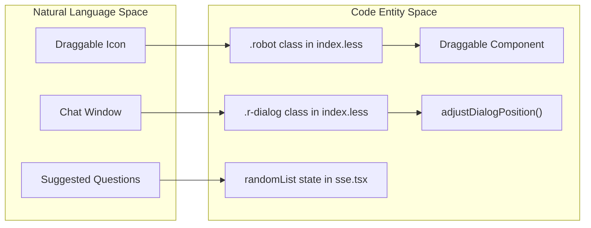
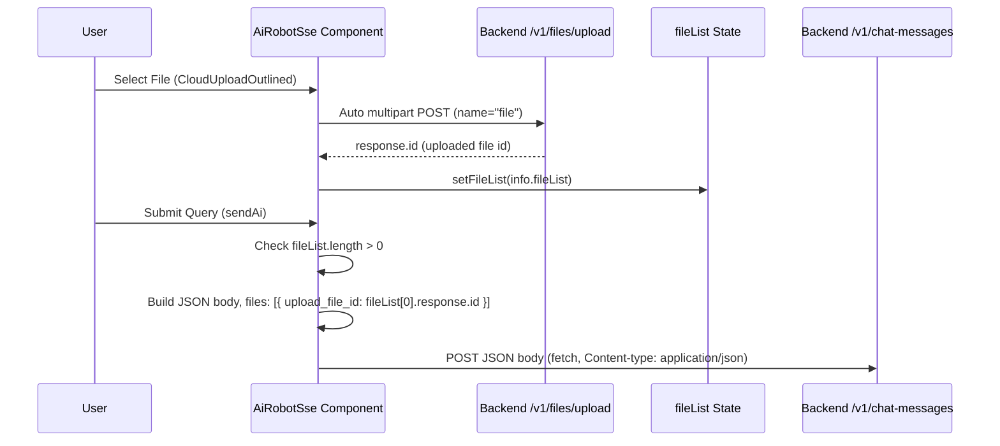

# AI UI, Theming & File Uploads
Relevant source files

- [index.html](https://github.com/thetide557/ln-server-pub/blob/629bd918/index.html)
- [src/pages/event/Solution/index.less](https://github.com/thetide557/ln-server-pub/blob/629bd918/src/pages/event/Solution/index.less)
- [src/pages/event/Solution/index.tsx](https://github.com/thetide557/ln-server-pub/blob/629bd918/src/pages/event/Solution/index.tsx)
- [src/pages/event/detail.tsx](https://github.com/thetide557/ln-server-pub/blob/629bd918/src/pages/event/detail.tsx)
- [src/pages/event/locale/zh_CN.ts](https://github.com/thetide557/ln-server-pub/blob/629bd918/src/pages/event/locale/zh_CN.ts)
- [src/pages/sxxc/aiRobot/index.less](https://github.com/thetide557/ln-server-pub/blob/629bd918/src/pages/sxxc/aiRobot/index.less)
- [src/pages/sxxc/aiRobot/index.tsx](https://github.com/thetide557/ln-server-pub/blob/629bd918/src/pages/sxxc/aiRobot/index.tsx)
- [src/pages/sxxc/aiRobot/loading/index.less](https://github.com/thetide557/ln-server-pub/blob/629bd918/src/pages/sxxc/aiRobot/loading/index.less)
- [src/pages/sxxc/aiRobot/loading/index.tsx](https://github.com/thetide557/ln-server-pub/blob/629bd918/src/pages/sxxc/aiRobot/loading/index.tsx)
- [src/pages/sxxc/aiRobot/sse.tsx](https://github.com/thetide557/ln-server-pub/blob/629bd918/src/pages/sxxc/aiRobot/sse.tsx)
- [src/pages/sxxc/warnModal/index.less](https://github.com/thetide557/ln-server-pub/blob/629bd918/src/pages/sxxc/warnModal/index.less)
- [src/pages/sxxc/warnModal/index.tsx](https://github.com/thetide557/ln-server-pub/blob/629bd918/src/pages/sxxc/warnModal/index.tsx)
- [src/pages/user/component/addUser/index.tsx](https://github.com/thetide557/ln-server-pub/blob/629bd918/src/pages/user/component/addUser/index.tsx)

This page details the implementation of the AI Assistant's user interface, including its responsive layout, theme adaptation for large-screen views, and the integrated file upload management system.

## Draggable Robot UI & Chat States

The AI Assistant (`AiRobotSse`) is a floating component anchored by a draggable robot icon. It transitions between several UI states based on user interaction and data presence.

### UI State Transitions

- Collapsed State: Only the draggable robot icon is visible. The icon uses a background image from `/image/ai/robot.png`[src/pages/sxxc/aiRobot/index.less#12-13](https://github.com/thetide557/ln-server-pub/blob/629bd918/src/pages/sxxc/aiRobot/index.less#L12-L13)
- Empty Chat State: When `aiShow` is true but `aiMessages` is empty, the UI displays a logo, a title, and a "Knowledge List" (`knowList`) of suggested questions [src/pages/sxxc/aiRobot/sse.tsx#39-60](https://github.com/thetide557/ln-server-pub/blob/629bd918/src/pages/sxxc/aiRobot/sse.tsx#L39-L60)
- Active Chat State: Displays a scrollable conversation history. User messages are aligned to the right with a blue background, while AI responses are on the left with a gray (or dark blue) background [src/pages/sxxc/aiRobot/index.less#102-135](https://github.com/thetide557/ln-server-pub/blob/629bd918/src/pages/sxxc/aiRobot/index.less#L102-L135)

### Responsive Positioning Logic

The component uses `react-draggable` to allow users to move the assistant [src/pages/sxxc/aiRobot/sse.tsx#217](https://github.com/thetide557/ln-server-pub/blob/629bd918/src/pages/sxxc/aiRobot/sse.tsx#L217-L217) To prevent the chat dialog from overflowing the viewport, a custom adjustment function is used:

| Function | Role | Source |
| --- | --- | --- |
| `calculateDialogSize` | Computes width/height based on viewport width (`vw`) to match CSS `calc` values. | [src/pages/sxxc/aiRobot/sse.tsx#101-110](https://github.com/thetide557/ln-server-pub/blob/629bd918/src/pages/sxxc/aiRobot/sse.tsx#L101-L110) |
| `adjustDialogPosition` | Calculates `left` and `top` offsets to ensure the dialog stays within window boundaries. | [src/pages/sxxc/aiRobot/sse.tsx#112-135](https://github.com/thetide557/ln-server-pub/blob/629bd918/src/pages/sxxc/aiRobot/sse.tsx#L112-L135) |
| `handleAiClick` | Distinguishes between a "drag" and a "click" to toggle visibility. | [src/pages/sxxc/aiRobot/sse.tsx#180-188](https://github.com/thetide557/ln-server-pub/blob/629bd918/src/pages/sxxc/aiRobot/sse.tsx#L180-L188) |

### Layout Entity Mapping

Title: "AI UI Component Mapping"

Sources: [src/pages/sxxc/aiRobot/sse.tsx#112-135](https://github.com/thetide557/ln-server-pub/blob/629bd918/src/pages/sxxc/aiRobot/sse.tsx#L112-L135)[src/pages/sxxc/aiRobot/index.less#9-25](https://github.com/thetide557/ln-server-pub/blob/629bd918/src/pages/sxxc/aiRobot/index.less#L9-L25)

## Theming: Light vs. Dark Mode

The AI Assistant adapts its styling based on the current URL path. Specifically, it enters a "Dark Mode" when the user is viewing large-screen dashboards (`/screenView`).

- Detection: The `isScreen` flag is set to `true` if `pathname.startsWith("/screenView")`[src/pages/sxxc/aiRobot/sse.tsx#75-79](https://github.com/thetide557/ln-server-pub/blob/629bd918/src/pages/sxxc/aiRobot/sse.tsx#L75-L79)
- Styling Overrides: CSS classes like `.dark-answer`, `.dark-stop1`, and `.dark-file` are applied to modify background colors and text contrast for dark backgrounds [src/pages/sxxc/aiRobot/index.less#152-210](https://github.com/thetide557/ln-server-pub/blob/629bd918/src/pages/sxxc/aiRobot/index.less#L152-L210)
- Component Theming: The `LoadingDots` component accepts a `theme` prop to toggle between light and dark dot colors [src/pages/sxxc/aiRobot/loading/index.tsx#7-13](https://github.com/thetide557/ln-server-pub/blob/629bd918/src/pages/sxxc/aiRobot/loading/index.tsx#L7-L13)

| Element | Light Mode Style | Dark Mode Style |
| --- | --- | --- |
| AI Bubble | `#f7f7f7` background, `#525252` text | `#205a96` background, `#fff` text |
| Stop Button | Blue text, gray border | White text, light blue border |
| Attached File Row | Default text/icon colors (`.ai-file`) | White text and icons (`.dark-file`) |

Note: the `Upload` component sets `showUploadList: false`, so AntD's built-in upload list is never rendered; attached files are instead shown as a custom row (`.ai-file`/`.dark-file`) above the input box [src/pages/sxxc/aiRobot/sse.tsx#462-470](https://github.com/thetide557/ln-server-pub/blob/629bd918/src/pages/sxxc/aiRobot/sse.tsx#L462-L470)[src/pages/sxxc/aiRobot/sse.tsx#716-728](https://github.com/thetide557/ln-server-pub/blob/629bd918/src/pages/sxxc/aiRobot/sse.tsx#L716-L728)

Sources: [src/pages/sxxc/aiRobot/index.less#152-210](https://github.com/thetide557/ln-server-pub/blob/629bd918/src/pages/sxxc/aiRobot/index.less#L152-L210)[src/pages/sxxc/aiRobot/sse.tsx#75-79](https://github.com/thetide557/ln-server-pub/blob/629bd918/src/pages/sxxc/aiRobot/sse.tsx#L75-L79)

## File Upload Manager

The AI Assistant supports uploading files to provide context for queries. The implementation uses Ant Design's `Upload` component with custom icon mapping for different file types.

### Implementation Details

- State Management: Files are stored in the `fileList` state [src/pages/sxxc/aiRobot/sse.tsx#73](https://github.com/thetide557/ln-server-pub/blob/629bd918/src/pages/sxxc/aiRobot/sse.tsx#L73-L73). The `Upload` component itself is configured with `action: "/v1/files/upload"` and `maxCount: 1`, so only one attachment can be staged at a time and no `accept` whitelist restricts which file types can be picked [src/pages/sxxc/aiRobot/sse.tsx#462-470](https://github.com/thetide557/ln-server-pub/blob/629bd918/src/pages/sxxc/aiRobot/sse.tsx#L462-L470)
- Icon Mapping: The icon is chosen from the file's MIME type string (not its filename extension) — `FileWordTwoTone` when it contains `.document`, `FileExcelTwoTone` for `.sheet`, `FileImageTwoTone` for `image`, `FilePptTwoTone` for `.presentation`, and `FileTextTwoTone` as the fallback; the same mapping is applied both to the attached-file row and to the file chip shown inside a sent user message [src/pages/sxxc/aiRobot/sse.tsx#15-19](https://github.com/thetide557/ln-server-pub/blob/629bd918/src/pages/sxxc/aiRobot/sse.tsx#L15-L19)
- Data Flow: Selecting a file triggers AntD's own multipart upload to `/v1/files/upload` immediately (before any message is sent), and the returned file id lands in `fileList[0].response.id`. When the user then sends a message, if `fileList` is not empty `sendAi` builds a plain JSON body — **not** `FormData` — whose `files` array references that `upload_file_id`, and POSTs it (with the query/inputs) to `/v1/chat-messages` [src/pages/sxxc/aiRobot/sse.tsx#251-260](https://github.com/thetide557/ln-server-pub/blob/629bd918/src/pages/sxxc/aiRobot/sse.tsx#L251-L260)

### File Upload Logic Flow

Title: "File Upload Data Flow"

Sources: [src/pages/sxxc/aiRobot/sse.tsx#239-260](https://github.com/thetide557/ln-server-pub/blob/629bd918/src/pages/sxxc/aiRobot/sse.tsx#L239-L260)[src/pages/sxxc/aiRobot/sse.tsx#430-445](https://github.com/thetide557/ln-server-pub/blob/629bd918/src/pages/sxxc/aiRobot/sse.tsx#L430-L445)

## Viewport-Width Responsive Layout

The AI UI utilizes `calc` functions relative to `100vw` and `1920px` to maintain a consistent visual ratio across different screen resolutions.

- Dialog Dimensions: Width is defined as `calc((500 / 1920) * 100vw)`[src/pages/sxxc/aiRobot/index.less#19](https://github.com/thetide557/ln-server-pub/blob/629bd918/src/pages/sxxc/aiRobot/index.less#L19-L19)
- Font Scaling: Base font size scales via `calc((16 / 1920) * 100vw)`[src/pages/sxxc/aiRobot/index.less#29](https://github.com/thetide557/ln-server-pub/blob/629bd918/src/pages/sxxc/aiRobot/index.less#L29-L29)
- Icon Scaling: The robot icon scales to `calc((85 / 1920) * 100vw)`[src/pages/sxxc/aiRobot/index.less#10](https://github.com/thetide557/ln-server-pub/blob/629bd918/src/pages/sxxc/aiRobot/index.less#L10-L10)

This ensures that on a 4K monitor or a smaller laptop screen, the AI assistant occupies the same proportional space.

Sources: [src/pages/sxxc/aiRobot/index.less#10-30](https://github.com/thetide557/ln-server-pub/blob/629bd918/src/pages/sxxc/aiRobot/index.less#L10-L30)