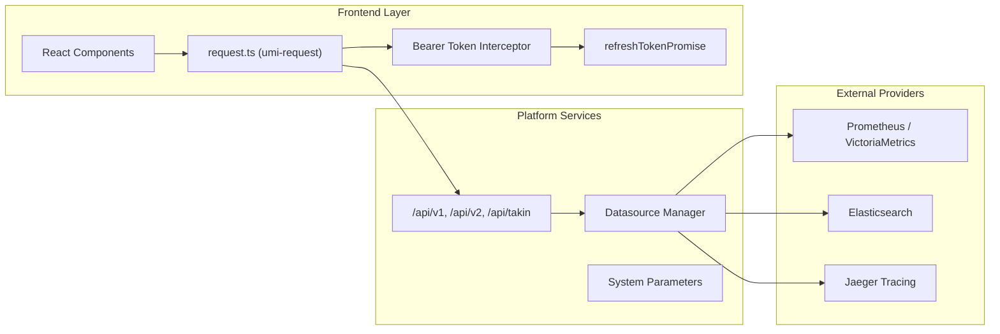
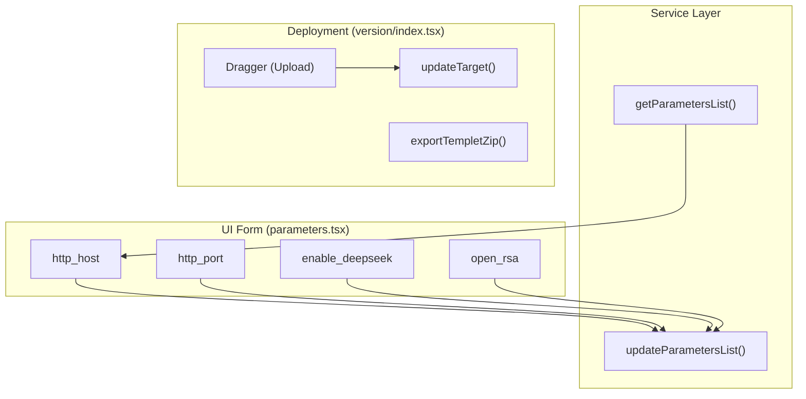

# Infrastructure & Platform Services
Relevant source files

- [src/components/PromQueryBuilder/components/metrics_translation.ts](https://github.com/thetide557/ln-server-pub/blob/629bd918/src/components/PromQueryBuilder/components/metrics_translation.ts)
- [src/pages/dataRoom/index.tsx](https://github.com/thetide557/ln-server-pub/blob/629bd918/src/pages/dataRoom/index.tsx)
- [src/pages/datasource/Form.tsx](https://github.com/thetide557/ln-server-pub/blob/629bd918/src/pages/datasource/Form.tsx)
- [src/pages/datasource/services.ts](https://github.com/thetide557/ln-server-pub/blob/629bd918/src/pages/datasource/services.ts)
- [src/pages/help/version/index.less](https://github.com/thetide557/ln-server-pub/blob/629bd918/src/pages/help/version/index.less)
- [src/pages/help/version/index.tsx](https://github.com/thetide557/ln-server-pub/blob/629bd918/src/pages/help/version/index.tsx)
- [src/pages/help/version/locale/zh_CN.ts](https://github.com/thetide557/ln-server-pub/blob/629bd918/src/pages/help/version/locale/zh_CN.ts)
- [src/pages/sxxc/autoInspect/index.tsx](https://github.com/thetide557/ln-server-pub/blob/629bd918/src/pages/sxxc/autoInspect/index.tsx)
- [src/pages/sxxc/healthReport/index.tsx](https://github.com/thetide557/ln-server-pub/blob/629bd918/src/pages/sxxc/healthReport/index.tsx)
- [src/pages/sxxc/productionPlan/index.tsx](https://github.com/thetide557/ln-server-pub/blob/629bd918/src/pages/sxxc/productionPlan/index.tsx)
- [src/pages/sxxc/serverVideoAlarm/index.tsx](https://github.com/thetide557/ln-server-pub/blob/629bd918/src/pages/sxxc/serverVideoAlarm/index.tsx)
- [src/pages/sxxc/serverVideoAsset/index.tsx](https://github.com/thetide557/ln-server-pub/blob/629bd918/src/pages/sxxc/serverVideoAsset/index.tsx)
- [src/pages/sxxc/topology/index.tsx](https://github.com/thetide557/ln-server-pub/blob/629bd918/src/pages/sxxc/topology/index.tsx)
- [src/pages/sxxc/workorder/index.tsx](https://github.com/thetide557/ln-server-pub/blob/629bd918/src/pages/sxxc/workorder/index.tsx)
- [src/pages/system/parameters.tsx](https://github.com/thetide557/ln-server-pub/blob/629bd918/src/pages/system/parameters.tsx)
- [src/pages/targets/version/index.tsx](https://github.com/thetide557/ln-server-pub/blob/629bd918/src/pages/targets/version/index.tsx)
- [src/services/targets.ts](https://github.com/thetide557/ln-server-pub/blob/629bd918/src/services/targets.ts)
- [src/utils/aes.ts](https://github.com/thetide557/ln-server-pub/blob/629bd918/src/utils/aes.ts)
- [src/utils/request.ts](https://github.com/thetide557/ln-server-pub/blob/629bd918/src/utils/request.ts)

This section covers the foundational layers of the LingNiu (羚牛) platform that provide cross-cutting capabilities to all functional modules. This includes standardized communication via the HTTP request layer, management of external data sources, centralized system configuration, and the platform's deployment and licensing infrastructure.

### System Infrastructure Overview

The infrastructure layer bridges the frontend application with backend microservices and external providers (like Prometheus or Elasticsearch). It ensures secure, authenticated communication and provides administrative tools for platform maintenance.

#### Data & Communication Flow

The following diagram illustrates how the frontend infrastructure interacts with backend services and external datasources.

Infrastructure Communication Architecture

Sources:[src/utils/request.ts#56-82](https://github.com/thetide557/ln-server-pub/blob/629bd918/src/utils/request.ts#L56-L82)[src/pages/datasource/services.ts#1-20](https://github.com/thetide557/ln-server-pub/blob/629bd918/src/pages/datasource/services.ts#L1-L20)

---

### HTTP Request Layer & API Conventions

The platform utilizes `umi-request` as its core networking utility. The `request.ts` module implements a sophisticated interceptor pattern to handle:

- Authentication: Automatic injection of `Bearer` tokens from cookies [src/utils/request.ts#66-77](https://github.com/thetide557/ln-server-pub/blob/629bd918/src/utils/request.ts#L66-L77)
- Token Lifecycle: A `refreshTokenPromise` singleton prevents race conditions when multiple concurrent requests trigger a 401 error, ensuring only one refresh attempt is made [src/utils/request.ts#63-65](https://github.com/thetide557/ln-server-pub/blob/629bd918/src/utils/request.ts#L63-L65)[src/utils/request.ts#201-205](https://github.com/thetide557/ln-server-pub/blob/629bd918/src/utils/request.ts#L201-L205)
- Response Normalization: Handling disparate data structures from various backend versions (n9e, n9e-plus, and takin) to provide a unified `{ success: true, ...data }` object to the UI. Requests whose URL matches `sxxcTask`, `/api/takin/proxy`, or `/probe/v1` (i.e. datasource proxy calls to Prometheus/Elasticsearch/Jaeger and probe endpoints) bypass this normalization and return the raw provider payload unchanged [src/utils/request.ts#95-145](https://github.com/thetide557/ln-server-pub/blob/629bd918/src/utils/request.ts#L95-L145)

For details, see [HTTP Request Layer & API Conventions](/org/benjamin-braddock/wiki/thetide557/ln-server-pub/page/9.1?branch=v2.1).

Sources:[src/utils/request.ts#1-147](https://github.com/thetide557/ln-server-pub/blob/629bd918/src/utils/request.ts#L1-L147)

---

### Datasource Management

The platform supports a plugin-based architecture for connecting to observability backends. Admins can configure and test connections to Prometheus, VictoriaMetrics, Elasticsearch, and Jaeger.

- Security: Sensitive credentials like passwords and API keys are protected using AES encryption [src/utils/aes.ts#1-10](https://github.com/thetide557/ln-server-pub/blob/629bd918/src/utils/aes.ts#L1-L10)
- Context: Configured datasources are synchronized to the `CommonStateContext` for use in dashboarding and alerting modules.

For details, see [Datasource Management](/org/benjamin-braddock/wiki/thetide557/ln-server-pub/page/9.2?branch=v2.1).

Sources:[src/pages/datasource/Form.tsx#1-50](https://github.com/thetide557/ln-server-pub/blob/629bd918/src/pages/datasource/Form.tsx#L1-L50)[src/pages/datasource/services.ts#1-30](https://github.com/thetide557/ln-server-pub/blob/629bd918/src/pages/datasource/services.ts#L1-L30)

---

### Log Analysis & System Logs

Centralized logging provides both operational visibility and application-level troubleshooting.

- Index Patterns: Management of Elasticsearch indices for log discovery.
- Operlog: Tracking of system operation logs to audit administrative actions.
- Syslog Explorer: A dedicated interface for browsing system logs with features like ZIP export for offline analysis [src/pages/historyEvents/services.ts#10-15](https://github.com/thetide557/ln-server-pub/blob/629bd918/src/pages/historyEvents/services.ts#L10-L15)

For details, see [Log Analysis & System Logs](/org/benjamin-braddock/wiki/thetide557/ln-server-pub/page/9.3?branch=v2.1).

Sources:[src/pages/targets/version/index.tsx#216-226](https://github.com/thetide557/ln-server-pub/blob/629bd918/src/pages/targets/version/index.tsx#L216-L226)

---

### System Configuration & License

The `parameters.tsx` module serves as the central hub for platform tuning and environment-specific settings.

#### Configuration Entity Mapping

The following diagram maps UI configuration toggles to their corresponding code logic and service calls.

Configuration & Deployment Mapping

Sources:[src/pages/system/parameters.tsx#92-97](https://github.com/thetide557/ln-server-pub/blob/629bd918/src/pages/system/parameters.tsx#L92-L97)[src/pages/targets/version/index.tsx#6-10](https://github.com/thetide557/ln-server-pub/blob/629bd918/src/pages/targets/version/index.tsx#L6-L10)

- System Parameters: Controls for HTTP binding, token expiration (access/refresh), RSA encryption toggles, and AI assistant (DeepSeek) activation [src/pages/system/parameters.tsx#160-200](https://github.com/thetide557/ln-server-pub/blob/629bd918/src/pages/system/parameters.tsx#L160-L200)
- Probe Management: A pipeline for uploading and deploying monitoring probe versions (`zip` format) across Linux, Windows, and Darwin architectures [src/pages/targets/version/index.tsx#51-76](https://github.com/thetide557/ln-server-pub/blob/629bd918/src/pages/targets/version/index.tsx#L51-L76)
- License System: Management of base platform licenses and per-device quotas.

For details, see [System Configuration & License](/org/benjamin-braddock/wiki/thetide557/ln-server-pub/page/9.4?branch=v2.1).

Sources:[src/pages/system/parameters.tsx#1-143](https://github.com/thetide557/ln-server-pub/blob/629bd918/src/pages/system/parameters.tsx#L1-L143)[src/pages/targets/version/index.tsx#1-116](https://github.com/thetide557/ln-server-pub/blob/629bd918/src/pages/targets/version/index.tsx#L1-L116)[src/pages/help/version/index.tsx#33-87](https://github.com/thetide557/ln-server-pub/blob/629bd918/src/pages/help/version/index.tsx#L33-L87)