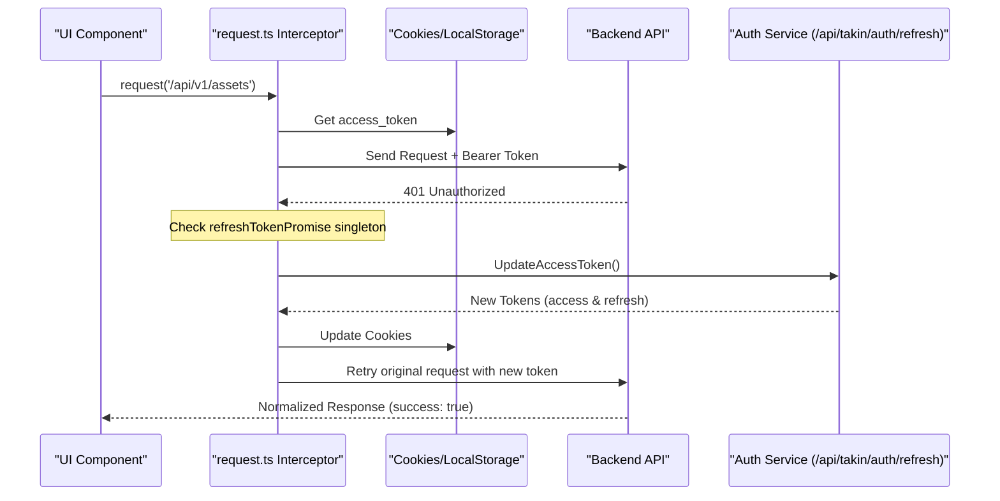
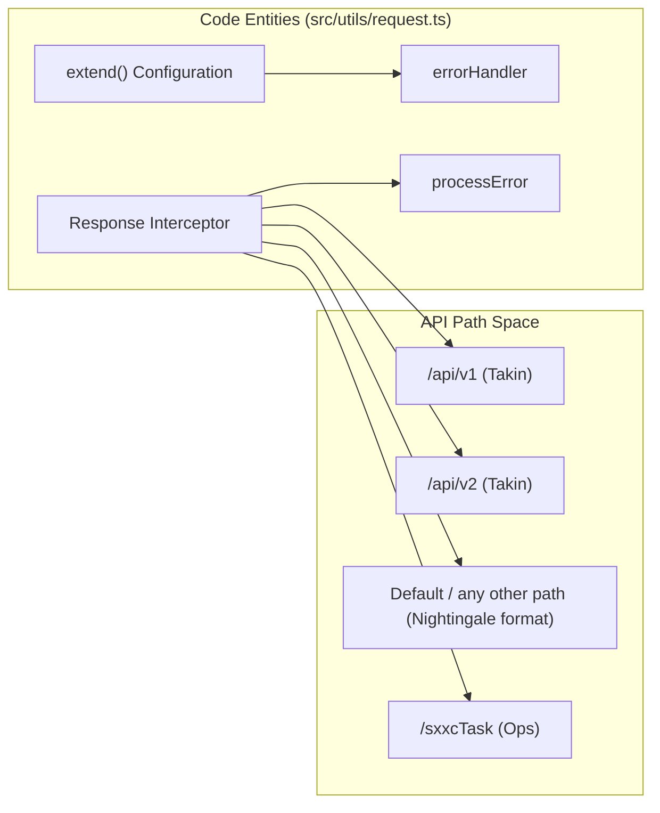

# HTTP Request Layer & API Conventions
Relevant source files

- [public/image/solution/title-card.png](https://github.com/thetide557/ln-server-pub/blob/629bd918/public/image/solution/title-card.png)
- [src/components/PromQueryBuilder/components/metrics_translation.ts](https://github.com/thetide557/ln-server-pub/blob/629bd918/src/components/PromQueryBuilder/components/metrics_translation.ts)
- [src/pages/dataRoom/index.tsx](https://github.com/thetide557/ln-server-pub/blob/629bd918/src/pages/dataRoom/index.tsx)
- [src/pages/sxxc/autoInspect/index.tsx](https://github.com/thetide557/ln-server-pub/blob/629bd918/src/pages/sxxc/autoInspect/index.tsx)
- [src/pages/sxxc/healthReport/index.tsx](https://github.com/thetide557/ln-server-pub/blob/629bd918/src/pages/sxxc/healthReport/index.tsx)
- [src/pages/sxxc/productionPlan/index.tsx](https://github.com/thetide557/ln-server-pub/blob/629bd918/src/pages/sxxc/productionPlan/index.tsx)
- [src/pages/sxxc/serverVideoAlarm/index.tsx](https://github.com/thetide557/ln-server-pub/blob/629bd918/src/pages/sxxc/serverVideoAlarm/index.tsx)
- [src/pages/sxxc/serverVideoAsset/index.tsx](https://github.com/thetide557/ln-server-pub/blob/629bd918/src/pages/sxxc/serverVideoAsset/index.tsx)
- [src/pages/sxxc/topology/index.tsx](https://github.com/thetide557/ln-server-pub/blob/629bd918/src/pages/sxxc/topology/index.tsx)
- [src/pages/sxxc/workorder/index.tsx](https://github.com/thetide557/ln-server-pub/blob/629bd918/src/pages/sxxc/workorder/index.tsx)
- [src/services/common.ts](https://github.com/thetide557/ln-server-pub/blob/629bd918/src/services/common.ts)
- [src/services/parameters.ts](https://github.com/thetide557/ln-server-pub/blob/629bd918/src/services/parameters.ts)
- [src/utils/request.ts](https://github.com/thetide557/ln-server-pub/blob/629bd918/src/utils/request.ts)

The HTTP request layer in the LingNiu platform is built upon `umi-request`, providing a centralized utility for managing authentication headers, handling asynchronous token refreshes, and normalizing inconsistent backend response structures. This layer ensures that UI components interact with a predictable data format regardless of which backend service (Nightingale, Takin, or XH) is being queried.

## The request.ts Utility

The core of the network communication resides in `src/utils/request.ts`. It configures global defaults, interceptors, and error handling for all API interactions [src/utils/request.ts#1-61](https://github.com/thetide557/ln-server-pub/blob/629bd918/src/utils/request.ts#L1-L61)

### Request Interception & Token Injection

Every outgoing request is intercepted to inject necessary metadata and authentication tokens:

- Bearer Token: The `access_token` is retrieved from cookies and added to the `Authorization` header [src/utils/request.ts#70](https://github.com/thetide557/ln-server-pub/blob/629bd918/src/utils/request.ts#L70-L70)
- Language Preference: The `X-Language` header is set based on the `language` key in `localStorage` (`en` or `zh`) [src/utils/request.ts#71](https://github.com/thetide557/ln-server-pub/blob/629bd918/src/utils/request.ts#L71-L71)
- Debug Mode: A `Bg-debug: 1` header is appended to all requests [src/utils/request.ts#72](https://github.com/thetide557/ln-server-pub/blob/629bd918/src/utils/request.ts#L72-L72)
- Credentials: The system is configured to `omit` credentials, meaning it does not carry native browser cookies across cross-origin requests, relying instead on the manual `Authorization` header [src/utils/request.ts#60](https://github.com/thetide557/ln-server-pub/blob/629bd918/src/utils/request.ts#L60-L60)

### 401 Transparent Refresh Flow

The platform implements a "silent" refresh mechanism to handle expired access tokens without interrupting the user experience.

1. Detection: If a request returns a `401 Unauthorized` status, the response interceptor catches it [src/utils/request.ts#148](https://github.com/thetide557/ln-server-pub/blob/629bd918/src/utils/request.ts#L148-L148)
2. Conflict Handling: If the error code is `LOGIN_CONFLICT`, the system clears all tokens and redirects to `/login` immediately [src/utils/request.ts#157-176](https://github.com/thetide557/ln-server-pub/blob/629bd918/src/utils/request.ts#L157-L176)
3. Singleton Refresh: To prevent multiple concurrent 401s from triggering multiple refresh calls, the utility uses a `refreshTokenPromise` singleton [src/utils/request.ts#64](https://github.com/thetide557/ln-server-pub/blob/629bd918/src/utils/request.ts#L64-L64)
- The first 401 request initiates `UpdateAccessToken()` and stores the resulting promise [src/utils/request.ts#201-203](https://github.com/thetide557/ln-server-pub/blob/629bd918/src/utils/request.ts#L201-L203)
- Subsequent 401 requests wait for this same promise [src/utils/request.ts#228](https://github.com/thetide557/ln-server-pub/blob/629bd918/src/utils/request.ts#L228-L228)
4. Retry: Once the token is refreshed, the original failed request is automatically retried with the new `access_token`[src/utils/request.ts#230-233](https://github.com/thetide557/ln-server-pub/blob/629bd918/src/utils/request.ts#L230-L233)

### Request Flow and Token Lifecycle

The following diagram illustrates the interaction between the `request` utility, the browser storage, and the backend auth services.

Diagram: Authentication and Request Lifecycle

Sources: [src/utils/request.ts#63-77](https://github.com/thetide557/ln-server-pub/blob/629bd918/src/utils/request.ts#L63-L77)[src/utils/request.ts#199-235](https://github.com/thetide557/ln-server-pub/blob/629bd918/src/utils/request.ts#L199-L235)

---

## Response Normalization

The backend services utilize various data structures. The `response` interceptor in `request.ts` maps these disparate formats into a unified object containing a `success` boolean and the relevant data [src/utils/request.ts#82-146](https://github.com/thetide557/ln-server-pub/blob/629bd918/src/utils/request.ts#L82-L146)

### API Path Conventions

The normalization logic varies based on the URL path:

| Path Pattern | Backend Source | Data Structure Handling |
| --- | --- | --- |
| `/api/v1`, `/api/v2`, `/api/takin/datasource` | Takin / Core | Checks `!data.error`. If true, adds `success: true`. [src/utils/request.ts#113-119](https://github.com/thetide557/ln-server-pub/blob/629bd918/src/utils/request.ts#L113-L119) |
| `/api/takin/proxy`, `/probe/v1` | Proxy Layers | Returns raw data without modification. [src/utils/request.ts#107-111](https://github.com/thetide557/ln-server-pub/blob/629bd918/src/utils/request.ts#L107-L111) |
| `/sxxcTask` | Operations Center | Returns raw data. [src/utils/request.ts#101-105](https://github.com/thetide557/ln-server-pub/blob/629bd918/src/utils/request.ts#L101-L105) |
| Default (Nightingale) | Nightingale (n9e) | Checks if `err === ""`, `status === "success"`, or `error === ""`. [src/utils/request.ts#130-135](https://github.com/thetide557/ln-server-pub/blob/629bd918/src/utils/request.ts#L130-L135) |

### Error Processing

The `processError` function extracts error messages from various potential keys (`error`, `err`, `errors`, or `message`) returned by different backend modules [src/utils/request.ts#38-54](https://github.com/thetide557/ln-server-pub/blob/629bd918/src/utils/request.ts#L38-L54)

Code-to-Entity Mapping: Response Logic

Sources: [src/utils/request.ts#38-54](https://github.com/thetide557/ln-server-pub/blob/629bd918/src/utils/request.ts#L38-L54)[src/utils/request.ts#82-146](https://github.com/thetide557/ln-server-pub/blob/629bd918/src/utils/request.ts#L82-L146)

---

## Error Handling & UI Notifications

Errors are handled globally in the `errorHandler` function [src/utils/request.ts#9-35](https://github.com/thetide557/ln-server-pub/blob/629bd918/src/utils/request.ts#L9-L35)

- Ant Design Integration: Errors are displayed to the user via `message.error()`[src/utils/request.ts#21-29](https://github.com/thetide557/ln-server-pub/blob/629bd918/src/utils/request.ts#L21-L29)
- Silence Flag: Developers can pass a `silence: true` option in the request configuration to suppress the automatic global error message, allowing for custom error handling within the calling component [src/utils/request.ts#17-27](https://github.com/thetide557/ln-server-pub/blob/629bd918/src/utils/request.ts#L17-L27)
- Special Exceptions: `AbortError` (triggered by `AbortController`) and specific `umi-request` bugs are ignored to prevent noisy console logs [src/utils/request.ts#12-15](https://github.com/thetide557/ln-server-pub/blob/629bd918/src/utils/request.ts#L12-L15)

---

## Iframe Integration & Token Passing

For sub-applications integrated via iframes (e.g., DataRoom, Topology, Work Order), the platform passes the `access_token` to ensure seamless authentication across modules.

### Token Delivery Methods

1. URL Parameters: Most modules append a timestamp to the URL to prevent caching, and the token is managed via shared cookies [src/pages/dataRoom/index.tsx#5-8](https://github.com/thetide557/ln-server-pub/blob/629bd918/src/pages/dataRoom/index.tsx#L5-L8)[src/pages/sxxc/topology/index.tsx#7-9](https://github.com/thetide557/ln-server-pub/blob/629bd918/src/pages/sxxc/topology/index.tsx#L7-L9)
2. PostMessage (Legacy/Prepared): Some components contain commented-out logic for `window.postMessage` delivery, providing a template for future secure cross-domain token passing [src/pages/sxxc/healthReport/index.tsx#11-14](https://github.com/thetide557/ln-server-pub/blob/629bd918/src/pages/sxxc/healthReport/index.tsx#L11-L14)
3. Permission-Based Routing: The `workOrder` component dynamically calculates the iframe `src` URL based on the user's `permList` retrieved from `CommonStateContext`[src/pages/sxxc/workorder/index.tsx#9-20](https://github.com/thetide557/ln-server-pub/blob/629bd918/src/pages/sxxc/workorder/index.tsx#L9-L20)

Sources: [src/pages/dataRoom/index.tsx#1-11](https://github.com/thetide557/ln-server-pub/blob/629bd918/src/pages/dataRoom/index.tsx#L1-L11)[src/pages/sxxc/workorder/index.tsx#1-24](https://github.com/thetide557/ln-server-pub/blob/629bd918/src/pages/sxxc/workorder/index.tsx#L1-L24)[src/pages/sxxc/topology/index.tsx#1-18](https://github.com/thetide557/ln-server-pub/blob/629bd918/src/pages/sxxc/topology/index.tsx#L1-L18)