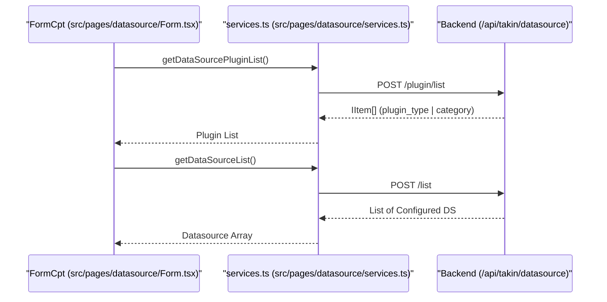
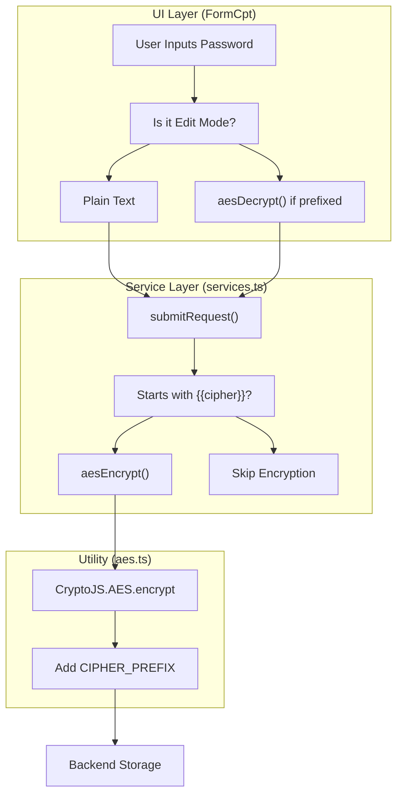

# Datasource Management
Relevant source files

- [src/pages/datasource/Form.tsx](https://github.com/thetide557/ln-server-pub/blob/629bd918/src/pages/datasource/Form.tsx)
- [src/pages/datasource/services.ts](https://github.com/thetide557/ln-server-pub/blob/629bd918/src/pages/datasource/services.ts)
- [src/pages/explorer/Elasticsearch/services.ts](https://github.com/thetide557/ln-server-pub/blob/629bd918/src/pages/explorer/Elasticsearch/services.ts)
- [src/utils/aes.ts](https://github.com/thetide557/ln-server-pub/blob/629bd918/src/utils/aes.ts)

The Datasource Management system provides a plugin-based architecture for integrating various telemetry and log backends into the LingNiu platform. In this open-source edition, only `prometheus` (VictoriaMetrics is supported as a Prometheus-compatible remote-read URL, not a distinct plugin type), `elasticsearch`, and `jaeger` ship with a working add/edit form; other plugin types the backend may surface (`ck`/ClickHouse, `influxdb`, `zabbix`, `opensearch`, `aliyun-sls`) fall back to an enterprise-only placeholder and have no functional configuration UI here (see [Type Dispatch and Enterprise-only Plugin Types](#type-dispatch-and-enterprise-only-plugin-types) below). The system handles lifecycle management (CRUD), connectivity testing, and secure credential storage.

## Plugin-based Architecture

Datasources are categorized by `plugin_type` and managed via a centralized service layer. The platform distinguishes between the available plugins (the "types" of datasources supported) and the actual configured instances.

### Data Flow for Datasource Discovery

The following diagram illustrates how the system retrieves available plugins and configured instances to populate the global context and management UI.

Diagram: Datasource Metadata Flow

Sources:[src/pages/datasource/services.ts#15-29](https://github.com/thetide557/ln-server-pub/blob/629bd918/src/pages/datasource/services.ts#L15-L29)[src/pages/datasource/Form.tsx#13-22](https://github.com/thetide557/ln-server-pub/blob/629bd918/src/pages/datasource/Form.tsx#L13-L22)

### Type Dispatch and Enterprise-only Plugin Types

The `type` segment of the `/:action/:type/:id` route is handed to a dedicated dispatcher, `src/pages/datasource/Datasources/Form.tsx`, which renders a real form component only for `prometheus`, `elasticsearch`, and `jaeger`; every other type falls through to `plus:/parcels/Datasource/Form` [src/pages/datasource/Datasources/Form.tsx#1-21](https://github.com/thetide557/ln-server-pub/blob/629bd918/src/pages/datasource/Datasources/Form.tsx#L1-L21). The `plus:` module id is resolved by a Vite plugin (`plugins/plusResolve.ts`) that only points to the real enterprise implementation when the app is built with the `:advanced` lifecycle script; otherwise it resolves to `plugins/PlusPlaceholder.tsx`, a component that renders `null`. As a result, `ck` (ClickHouse), `influxdb`, `zabbix`, `opensearch`, and `aliyun-sls` — although they may appear as selectable plugin cards because the card list itself comes from the backend's `/plugin/list` response, and their logos are wired up in `src/pages/datasource/config.tsx` — have no functional add/edit form in this repository; navigating to their add/edit page renders nothing.

## Configuration and Form Management

The `FormCpt` component in `src/pages/datasource/Form.tsx` acts as the primary controller for adding and editing datasources. It handles route parameter parsing, data fetching for edit modes, and data transformation before submission.

### Key Logic and Transformations

- Action Handling: Determines `add` or `edit` mode based on URL parameters `/:action/:type/:id`[src/pages/datasource/Form.tsx#16-19](https://github.com/thetide557/ln-server-pub/blob/629bd918/src/pages/datasource/Form.tsx#L16-L19)
- Header Transformation: Converts key-value pairs from the UI into the flat object format expected by the backend for `http.headers` or `influxdb.headers`[src/pages/datasource/Form.tsx#25-50](https://github.com/thetide557/ln-server-pub/blob/629bd918/src/pages/datasource/Form.tsx#L25-L50)
- Cluster Validation: For specific types like `prometheus` or `elasticsearch`, the system prompts a confirmation if `cluster_name` is missing [src/pages/datasource/Form.tsx#118-137](https://github.com/thetide557/ln-server-pub/blob/629bd918/src/pages/datasource/Form.tsx#L118-L137)

### Submission Process

The `submitRequest` function handles the final API call. It dynamically switches the endpoint based on the environment (Standard vs Pro/Plus) [src/pages/datasource/services.ts#38-43](https://github.com/thetide557/ln-server-pub/blob/629bd918/src/pages/datasource/services.ts#L38-L43)

| Function | File Path | Purpose |
| --- | --- | --- |
| `getDataSourceDetailById` | `src/pages/datasource/services.ts` | Fetches full configuration for a specific ID [src/pages/datasource/services.ts#31-36](https://github.com/thetide557/ln-server-pub/blob/629bd918/src/pages/datasource/services.ts#L31-L36) |
| `submitRequest` | `src/pages/datasource/services.ts` | Performs `upsert` (Update or Insert) operations [src/pages/datasource/services.ts#38-53](https://github.com/thetide557/ln-server-pub/blob/629bd918/src/pages/datasource/services.ts#L38-L53) |
| `updateDataSourceStatus` | `src/pages/datasource/services.ts` | Toggles `enabled`/`disabled` state [src/pages/datasource/services.ts#55-60](https://github.com/thetide557/ln-server-pub/blob/629bd918/src/pages/datasource/services.ts#L55-L60) |

Sources:[src/pages/datasource/Form.tsx#23-69](https://github.com/thetide557/ln-server-pub/blob/629bd918/src/pages/datasource/Form.tsx#L23-L69)[src/pages/datasource/services.ts#38-53](https://github.com/thetide557/ln-server-pub/blob/629bd918/src/pages/datasource/services.ts#L38-L53)

## Synchronization with Global State

The configured-datasource list is not only rendered locally: `TableSource` (`src/pages/datasource/components/TableSource/index.tsx`) calls `getDataSourceList` and pushes the result into the shared `CommonStateContext` via `setDatasourceList`, which regroups the flat list by `plugin_type` into `groupedDatasourceList` [src/pages/datasource/components/TableSource/index.tsx#33-51](https://github.com/thetide557/ln-server-pub/blob/629bd918/src/pages/datasource/components/TableSource/index.tsx#L33-L51)[src/App.tsx#141-158](https://github.com/thetide557/ln-server-pub/blob/629bd918/src/App.tsx#L141-L158). This grouped map is consumed platform-wide — dashboard and recording-rule editors, alert rule forms, the explorer, and warning shield/subscribe pages all read `groupedDatasourceList[cate]` from context to populate their datasource selectors, rather than each re-fetching the list.

## Security and AES Encryption

To protect sensitive information like `basic_auth_password`, the platform implements client-side AES encryption before transmission and decryption upon retrieval for editing.

### Encryption Implementation

The utility `src/utils/aes.ts` uses `crypto-js` with `AES-256-CBC` mode and a random IV [src/utils/aes.ts#1-22](https://github.com/thetide557/ln-server-pub/blob/629bd918/src/utils/aes.ts#L1-L22)

1. Prefixing: Encrypted strings are prefixed with `{{cipher}}` (defined as `CIPHER_PREFIX`) to distinguish them from plain text [src/utils/aes.ts#4-8](https://github.com/thetide557/ln-server-pub/blob/629bd918/src/utils/aes.ts#L4-L8)
2. Encryption Flow: When `submitRequest` is called, it checks if the password field starts with the prefix; if not, it applies `aesEncrypt`[src/pages/datasource/services.ts#44-48](https://github.com/thetide557/ln-server-pub/blob/629bd918/src/pages/datasource/services.ts#L44-L48)
3. Decryption Flow: When `FormCpt` fetches details for editing, it checks for the prefix and applies `aesDecrypt` so the user sees the plain text in the form [src/pages/datasource/Form.tsx#76-79](https://github.com/thetide557/ln-server-pub/blob/629bd918/src/pages/datasource/Form.tsx#L76-L79)

Diagram: Credential Security Lifecycle

Sources:[src/utils/aes.ts#1-47](https://github.com/thetide557/ln-server-pub/blob/629bd918/src/utils/aes.ts#L1-L47)[src/pages/datasource/services.ts#44-48](https://github.com/thetide557/ln-server-pub/blob/629bd918/src/pages/datasource/services.ts#L44-L48)[src/pages/datasource/Form.tsx#76-79](https://github.com/thetide557/ln-server-pub/blob/629bd918/src/pages/datasource/Form.tsx#L76-L79)

## Elasticsearch Proxy and Explorer Integration

For log-based datasources like Elasticsearch, the platform provides a proxy layer to interact with the ES API (indices, mappings, and searches).

### Service Methods

The Elasticsearch services utilize a proxy route `/api/takin/proxy/${datasourceValue}/...` to bypass CORS and handle authentication via the backend.

| Method | Endpoint | Description |
| --- | --- | --- |
| `getIndices` | `/_cat/indices` | Lists available ES indices [src/pages/explorer/Elasticsearch/services.ts#23-37](https://github.com/thetide557/ln-server-pub/blob/629bd918/src/pages/explorer/Elasticsearch/services.ts#L23-L37) |
| `getFields` | `/_mapping` | Retrieves field mappings for an index [src/pages/explorer/Elasticsearch/services.ts#56-74](https://github.com/thetide557/ln-server-pub/blob/629bd918/src/pages/explorer/Elasticsearch/services.ts#L56-L74) |
| `getLogsQuery` | `/_msearch` | Executes multi-search queries for log retrieval [src/pages/explorer/Elasticsearch/services.ts#102-121](https://github.com/thetide557/ln-server-pub/blob/629bd918/src/pages/explorer/Elasticsearch/services.ts#L102-L121) |
| `getESVersion` | `/` | Checks the Elasticsearch cluster version [src/pages/explorer/Elasticsearch/services.ts#136-143](https://github.com/thetide557/ln-server-pub/blob/629bd918/src/pages/explorer/Elasticsearch/services.ts#L136-L143) |

Sources:[src/pages/explorer/Elasticsearch/services.ts#23-143](https://github.com/thetide557/ln-server-pub/blob/629bd918/src/pages/explorer/Elasticsearch/services.ts#L23-L143)