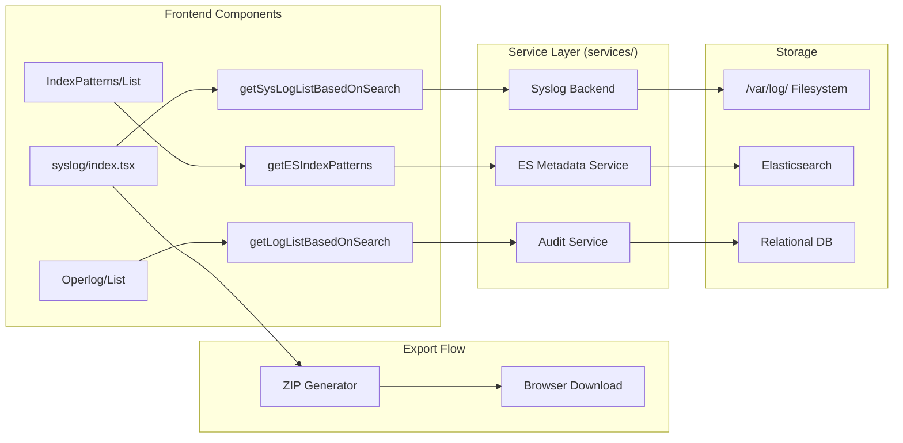
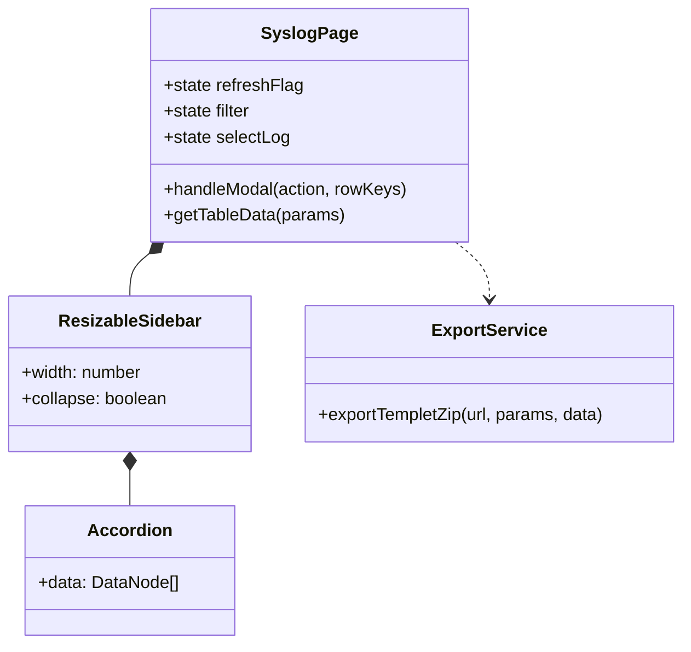

# Log Analysis & System Logs
Relevant source files

- [src/pages/alertRules/List/index.tsx](https://github.com/thetide557/ln-server-pub/blob/629bd918/src/pages/alertRules/List/index.tsx)
- [src/pages/event/index.tsx](https://github.com/thetide557/ln-server-pub/blob/629bd918/src/pages/event/index.tsx)
- [src/pages/historyEvents/index.tsx](https://github.com/thetide557/ln-server-pub/blob/629bd918/src/pages/historyEvents/index.tsx)
- [src/pages/log/IndexPatterns/services.ts](https://github.com/thetide557/ln-server-pub/blob/629bd918/src/pages/log/IndexPatterns/services.ts)
- [src/pages/log/operlog/index.tsx](https://github.com/thetide557/ln-server-pub/blob/629bd918/src/pages/log/operlog/index.tsx)
- [src/pages/log/syslog/index.tsx](https://github.com/thetide557/ln-server-pub/blob/629bd918/src/pages/log/syslog/index.tsx)
- [src/pages/permissions/index.tsx](https://github.com/thetide557/ln-server-pub/blob/629bd918/src/pages/permissions/index.tsx)
- [src/services/operlog.ts](https://github.com/thetide557/ln-server-pub/blob/629bd918/src/services/operlog.ts)
- [src/pages/targets/BusinessGroup/index.tsx](https://github.com/thetide557/ln-server-pub/blob/629bd918/src/pages/targets/BusinessGroup/index.tsx)

This section details the platform's multi-layered logging architecture, including Elasticsearch index management for application logs, the system operation log (operlog) auditing mechanism, and the specialized Syslog browsing interface for infrastructure-level log files.

## Overview of Log Management

The logging system is divided into three distinct functional areas:

1. Index Patterns: Management of Elasticsearch indices to enable structured log searching.
2. Syslog Browser: A specialized interface for browsing physical log files on servers, featuring a resizable sidebar and ZIP export capabilities.
3. Operation Logs (Operlog): Audit trails capturing user actions across the platform.

### Data Flow: Log Retrieval & Export

The following diagram illustrates the flow from the frontend components to the backend services and storage layers.

Diagram: Log System Data Flow

Sources:[src/pages/log/syslog/index.tsx#17-18](https://github.com/thetide557/ln-server-pub/blob/629bd918/src/pages/log/syslog/index.tsx#L17-L18)[src/pages/log/IndexPatterns/services.ts#20-27](https://github.com/thetide557/ln-server-pub/blob/629bd918/src/pages/log/IndexPatterns/services.ts#L20-L27)[src/pages/log/syslog/index.tsx#147-160](https://github.com/thetide557/ln-server-pub/blob/629bd918/src/pages/log/syslog/index.tsx#L147-L160)

---

## Index Patterns Management

Index patterns are required to map Elasticsearch indices to the platform's log explorer. They define how time-based indices are grouped and which fields are used for timestamping.

### Implementation Details

- Service Layer: The logic for CRUD operations on index patterns is encapsulated in `src/pages/log/IndexPatterns/services.ts`.
- API Endpoints:

- `GET /api/takin/es-index-pattern-list`: Retrieves all registered patterns [src/pages/log/IndexPatterns/services.ts#20-27](https://github.com/thetide557/ln-server-pub/blob/629bd918/src/pages/log/IndexPatterns/services.ts#L20-L27)
- `POST /api/takin/es-index-pattern`: Creates a new pattern [src/pages/log/IndexPatterns/services.ts#38-43](https://github.com/thetide557/ln-server-pub/blob/629bd918/src/pages/log/IndexPatterns/services.ts#L38-L43)
- `DELETE /api/takin/es-index-pattern`: Removes patterns via an array of IDs [src/pages/log/IndexPatterns/services.ts#55-60](https://github.com/thetide557/ln-server-pub/blob/629bd918/src/pages/log/IndexPatterns/services.ts#L55-L60)

Sources:[src/pages/log/IndexPatterns/services.ts#1-61](https://github.com/thetide557/ln-server-pub/blob/629bd918/src/pages/log/IndexPatterns/services.ts#L1-L61)

---

## Syslog Browser & Resizable UI

The Syslog module provides a specialized interface for viewing system-level logs. It utilizes a resizable layout to allow users to navigate directory structures while maintaining a large viewing area for log content.

### Resizable Sidebar Logic

The sidebar uses the `re-resizable` library to allow dynamic width adjustments, which are persisted to `localStorage`.

- Width Persistence: The width is initialized from `localStorage.getItem('leftassetWidth')` and updated via the `onResizeStop` callback [src/pages/log/syslog/index.tsx#40](https://github.com/thetide557/ln-server-pub/blob/629bd918/src/pages/log/syslog/index.tsx#L40-L40)
- Collapse State: A toggle button allows users to hide the sidebar, storing the state in `left_log_list`[src/pages/log/syslog/index.tsx#39](https://github.com/thetide557/ln-server-pub/blob/629bd918/src/pages/log/syslog/index.tsx#L39-L39)

### Component Architecture

Diagram: Syslog Component & Layout

### ZIP Export Functionality

The platform supports exporting log files as ZIP archives. This is handled by the `handleModal` function which interacts with the `exportTempletZip` service.

1. Selection: Users select rows in the `Table` component.
2. Request: The `exportTempletZip` function is called with the target URL `/api/takin/xh/sys-log/export-xls` and the selected file names [src/pages/log/syslog/index.tsx#141-147](https://github.com/thetide557/ln-server-pub/blob/629bd918/src/pages/log/syslog/index.tsx#L141-L147)
3. Blob Processing: The response is converted into a `Blob` with type `application/zip`[src/pages/log/syslog/index.tsx#148-151](https://github.com/thetide557/ln-server-pub/blob/629bd918/src/pages/log/syslog/index.tsx#L148-L151)
4. Download: A temporary `<a>` element is created to trigger the browser's download prompt with a timestamped filename (e.g., `系统日志_MMDDHHmmss.zip`) [src/pages/log/syslog/index.tsx#152-160](https://github.com/thetide557/ln-server-pub/blob/629bd918/src/pages/log/syslog/index.tsx#L152-L160)

Sources:[src/pages/log/syslog/index.tsx#25-163](https://github.com/thetide557/ln-server-pub/blob/629bd918/src/pages/log/syslog/index.tsx#L25-L163)[src/pages/log/syslog/index.tsx#21-22](https://github.com/thetide557/ln-server-pub/blob/629bd918/src/pages/log/syslog/index.tsx#L21-L22)

---

## System Operation Logs (Operlog)

Operation logs provide an audit trail for security and troubleshooting. This is implemented in `src/pages/log/operlog/index.tsx` and is a distinct module from the Syslog browser above (different backend endpoints and a different export mechanism).

### Table Configuration

The Operlog list columns are: 日志编号 (`id`), 操作类型 (`type`), 系统模块 (`object`, one of a fixed set of modules such as 资产/监控/用户配置/告警/用户信息/接口管理/登录/许可管理), 描述 (`description`), 操作人员 (`user`), and 操作时间 (`oper_time`, a Unix timestamp rendered as `YYYY-MM-DD HH:mm:ss`). A per-row "导出" action is also shown when the user has the `Admin` role or the `/log/operlog/export` permission. There is no IP-address column, and no HTTP-method/target-URL fields — those do not exist in this module.

### Filtering & Search

Filtering uses the same `queryFilter` dropdown pattern as Syslog, but with fields specific to Operlog: `id` (日志编号, input), `object` (系统模块, select), `type` (操作类型, input), and `user` (操作人员, input) — there is no `ip` filter. A `RangePicker` additionally updates the `filter` state with Unix timestamps (`start`/`end`) to scope the query by time range.

### Export

Selecting one or more rows (or none, which triggers an "export all" confirmation) opens a modal where the user picks an output format — Excel, XML, or TXT — via a `Radio.Group`. Confirming calls `exportTemplet` against `/api/takin/operation-log/export-xls` and downloads a file named `操作日志信息数据_MMDDHHmmss` with the corresponding extension. This is a separate code path from Syslog's ZIP-only `exportTempletZip` export. Batch export additionally requires the `Admin` role or the `/log/operlog/exportAll` permission.

Sources:[src/pages/log/operlog/index.tsx#58-124](https://github.com/thetide557/ln-server-pub/blob/629bd918/src/pages/log/operlog/index.tsx#L58-L124)[src/pages/log/operlog/index.tsx#184-256](https://github.com/thetide557/ln-server-pub/blob/629bd918/src/pages/log/operlog/index.tsx#L184-L256)[src/pages/log/operlog/index.tsx#394-406](https://github.com/thetide557/ln-server-pub/blob/629bd918/src/pages/log/operlog/index.tsx#L394-L406)[src/services/operlog.ts#1-10](https://github.com/thetide557/ln-server-pub/blob/629bd918/src/services/operlog.ts#L1-L10)

---

## Permissions & Access Control

Log access is strictly governed by the RBAC system.

- Admin Override: Users with the `Admin` role bypass specific permission checks [src/pages/log/syslog/index.tsx#94](https://github.com/thetide557/ln-server-pub/blob/629bd918/src/pages/log/syslog/index.tsx#L94-L94)
- Function-Level Permissions: Specific actions like exporting logs check for the presence of strings like `/log/syslog/export` in the `permList` provided by `CommonStateContext`[src/pages/log/syslog/index.tsx#94](https://github.com/thetide557/ln-server-pub/blob/629bd918/src/pages/log/syslog/index.tsx#L94-L94)

Sources:[src/pages/log/syslog/index.tsx#27-28](https://github.com/thetide557/ln-server-pub/blob/629bd918/src/pages/log/syslog/index.tsx#L27-L28)[src/pages/permissions/index.tsx#108-122](https://github.com/thetide557/ln-server-pub/blob/629bd918/src/pages/permissions/index.tsx#L108-L122)