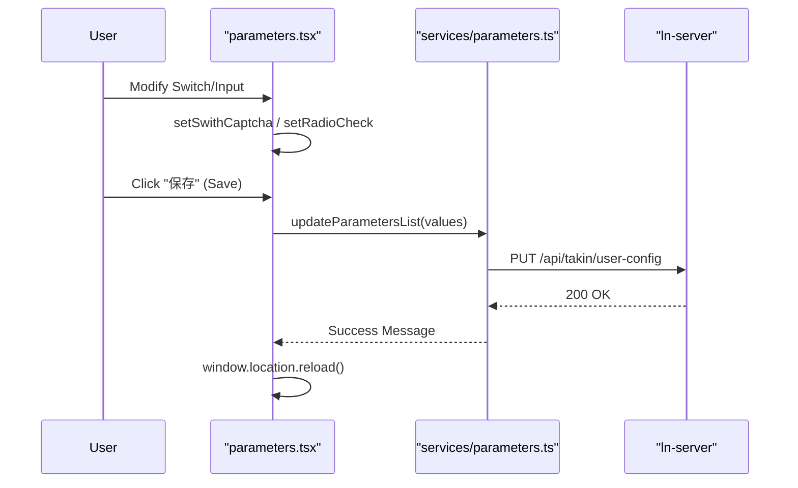
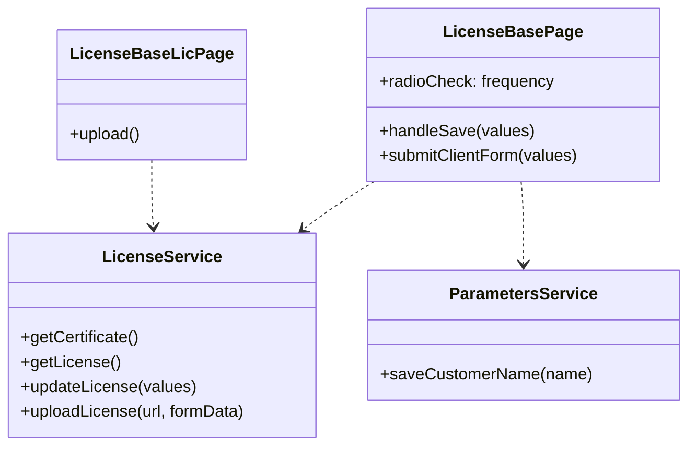

# System Configuration & License
Relevant source files

- [src/pages/datasource/components/SourceCards/index.tsx](https://github.com/thetide557/ln-server-pub/blob/629bd918/src/pages/datasource/components/SourceCards/index.tsx)
- [src/pages/datasource/components/TableSource/index.tsx](https://github.com/thetide557/ln-server-pub/blob/629bd918/src/pages/datasource/components/TableSource/index.tsx)
- [src/pages/dictType/index.tsx](https://github.com/thetide557/ln-server-pub/blob/629bd918/src/pages/dictType/index.tsx)
- [src/pages/help/SSOConfigs/services.ts](https://github.com/thetide557/ln-server-pub/blob/629bd918/src/pages/help/SSOConfigs/services.ts)
- [src/pages/help/version/index.less](https://github.com/thetide557/ln-server-pub/blob/629bd918/src/pages/help/version/index.less)
- [src/pages/help/version/index.tsx](https://github.com/thetide557/ln-server-pub/blob/629bd918/src/pages/help/version/index.tsx)
- [src/pages/help/version/locale/zh_CN.ts](https://github.com/thetide557/ln-server-pub/blob/629bd918/src/pages/help/version/locale/zh_CN.ts)
- [src/pages/license/base/index.tsx](https://github.com/thetide557/ln-server-pub/blob/629bd918/src/pages/license/base/index.tsx)
- [src/pages/license/base/license.tsx](https://github.com/thetide557/ln-server-pub/blob/629bd918/src/pages/license/base/license.tsx)
- [src/pages/license/device/index.tsx](https://github.com/thetide557/ln-server-pub/blob/629bd918/src/pages/license/device/index.tsx)
- [src/pages/log/operlog/index.tsx](https://github.com/thetide557/ln-server-pub/blob/629bd918/src/pages/log/operlog/index.tsx)
- [src/pages/permissions/style.less](https://github.com/thetide557/ln-server-pub/blob/629bd918/src/pages/permissions/style.less)
- [src/pages/system/parameters.tsx](https://github.com/thetide557/ln-server-pub/blob/629bd918/src/pages/system/parameters.tsx)
- [src/pages/targets/version/index.tsx](https://github.com/thetide557/ln-server-pub/blob/629bd918/src/pages/targets/version/index.tsx)
- [src/services/targets.ts](https://github.com/thetide557/ln-server-pub/blob/629bd918/src/services/targets.ts)

This page details the implementation and configuration of system-level parameters, the probe deployment pipeline, and the license management system. These components provide the foundational settings for the LingNiu platform, including network configurations, security toggles, and resource authorization.

## System Parameters Configuration

The system parameters interface allows administrators to manage global environment variables, security settings, and AI integration toggles. The primary entry point for these settings is the `Parameters` page.

### Implementation Details

The configuration is managed via a centralized form that interacts with the `parameters` service. Data is fetched using `getParametersList` and updated via `updateParametersList`[src/pages/system/parameters.tsx#10](https://github.com/thetide557/ln-server-pub/blob/629bd918/src/pages/system/parameters.tsx#L10-L10)

Key parameters include:

- Network & Performance: Binding IP (`http_host`), Port (`http_port`), and Token expiration/refresh times (`access_expired`, `refresh_expired`) [src/pages/system/parameters.tsx#161-190](https://github.com/thetide557/ln-server-pub/blob/629bd918/src/pages/system/parameters.tsx#L161-L190)
- Security Toggles: Toggle switches for Captcha (`captcha`), RSA Encryption (`open_rsa`), and SSO (`sso`) [src/pages/system/parameters.tsx#93-96](https://github.com/thetide557/ln-server-pub/blob/629bd918/src/pages/system/parameters.tsx#L93-L96)
- AI Integration: A toggle for DeepSeek AI assistant features (`enable_deepseek`) [src/pages/system/parameters.tsx#95](https://github.com/thetide557/ln-server-pub/blob/629bd918/src/pages/system/parameters.tsx#L95-L95)
- Logging: Log level selection (DEBUG, INFO, WARNING, ERROR) mapped to numeric values (1-4) [src/pages/system/parameters.tsx#28-33](https://github.com/thetide557/ln-server-pub/blob/629bd918/src/pages/system/parameters.tsx#L28-L33)

### Data Flow: Parameter Update

Sources:[src/pages/system/parameters.tsx#84-101](https://github.com/thetide557/ln-server-pub/blob/629bd918/src/pages/system/parameters.tsx#L84-L101)[src/services/parameters.ts](https://github.com/thetide557/ln-server-pub/blob/629bd918/src/services/parameters.ts)

---

## Probe Version & Deployment Pipeline

The platform supports managing and deploying monitoring probes (targets) across different operating systems and architectures. This is handled in the `Targets` version management module.

### Probe Upload & Validation

The system enforces strict naming conventions for probe packages to ensure compatibility during deployment.

- Format: `[name]-[type]-[version]-[os]-[arch].zip`[src/pages/targets/version/index.tsx#60](https://github.com/thetide557/ln-server-pub/blob/629bd918/src/pages/targets/version/index.tsx#L60-L60)
- Supported OS: `linux`, `windows`, `darwin`[src/pages/targets/version/index.tsx#67](https://github.com/thetide557/ln-server-pub/blob/629bd918/src/pages/targets/version/index.tsx#L67-L67)
- Supported Architectures: `amd64`, `386`, `arm`, `arm64`[src/pages/targets/version/index.tsx#71](https://github.com/thetide557/ln-server-pub/blob/629bd918/src/pages/targets/version/index.tsx#L71-L71)

### Version Management UI

The `version` component provides a split view for System Versions and Probe Updates using `antd` Tabs [src/pages/help/version/index.tsx#89-154](https://github.com/thetide557/ln-server-pub/blob/629bd918/src/pages/help/version/index.tsx#L89-L154)

| Feature | Code Entity | Description |
| --- | --- | --- |
| System Update | `Dragger` (action: `/api/takin/server/update`) | Uploads `ln-server.gz` for platform upgrades [src/pages/help/version/index.tsx#134-142](https://github.com/thetide557/ln-server-pub/blob/629bd918/src/pages/help/version/index.tsx#L134-L142) |
| Probe List | `getMonObjectUpdateList` | Fetches monitoring targets with their current probe versions [src/pages/targets/version/index.tsx#188-201](https://github.com/thetide557/ln-server-pub/blob/629bd918/src/pages/targets/version/index.tsx#L188-L201) |
| Probe Upgrade | `updateTarget` | Triggers a version update for specific monitoring targets [src/pages/targets/version/index.tsx#6](https://github.com/thetide557/ln-server-pub/blob/629bd918/src/pages/targets/version/index.tsx#L6-L6) |

Sources:[src/pages/targets/version/index.tsx#51-76](https://github.com/thetide557/ln-server-pub/blob/629bd918/src/pages/targets/version/index.tsx#L51-L76)[src/pages/help/version/index.tsx#33-87](https://github.com/thetide557/ln-server-pub/blob/629bd918/src/pages/help/version/index.tsx#L33-L87)[src/services/targets.ts#32-41](https://github.com/thetide557/ln-server-pub/blob/629bd918/src/services/targets.ts#L32-L41)

---

## License Management

The license system manages two types of authorizations: Base License (platform-wide) and Device License (asset-specific).

### Base License Implementation

The `LicenseBase` component handles the core platform authorization, including node limits and notification frequencies.

- Certificate Listing: Uses `getCertificate()` to fetch the list of installed license certificates (serial number, node quota `permission_node`/used quota `used_node`, and validity period) rendered in the license table — it does not derive any machine/system fingerprint [src/pages/license/base/index.tsx#104-108](https://github.com/thetide557/ln-server-pub/blob/629bd918/src/pages/license/base/index.tsx#L104-L108)
- Certificate Renewal: Clicking "更新证书" on a table row navigates to a dedicated sub-page (`src/pages/license/base/license.tsx`, route `/license/base/:id`) where the admin uploads a new `.crt` certificate and `.key` key file; submission calls `uploadLicense()`, which issues `PUT /api/takin/xh/license/update` [src/pages/license/base/license.tsx#121-134](https://github.com/thetide557/ln-server-pub/blob/629bd918/src/pages/license/base/license.tsx#L121-L134)
- Expiry Notification Settings: The "License 通知设置" card (`handleSave`) lets admins configure the remaining-node reminder threshold (`nodes`), the reminder frequency (`once` or `days`), and notification email(s); this is saved via `updateLicense()`, which issues `PUT /api/takin/xh/license-config` — it does not touch the license key/certificate itself [src/pages/license/base/index.tsx#76-86](https://github.com/thetide557/ln-server-pub/blob/629bd918/src/pages/license/base/index.tsx#L76-L86)
- Customer Customization: Allows setting the platform's display name via `saveCustomerName`[src/pages/license/base/index.tsx#190-199](https://github.com/thetide557/ln-server-pub/blob/629bd918/src/pages/license/base/index.tsx#L190-L199)

### Code Mapping: License Entities

Sources:[src/pages/license/base/index.tsx#17-18](https://github.com/thetide557/ln-server-pub/blob/629bd918/src/pages/license/base/index.tsx#L17-L18)[src/pages/license/base/index.tsx#76-86](https://github.com/thetide557/ln-server-pub/blob/629bd918/src/pages/license/base/index.tsx#L76-L86)[src/services/license.ts](https://github.com/thetide557/ln-server-pub/blob/629bd918/src/services/license.ts)

---

## SSO & Authentication Configuration

Single Sign-On (SSO) is toggled within the `Parameters` page, but its behavior is governed by global state and specific service endpoints.

1. Toggle Logic: The `swithSso` state in `parameters.tsx` only drives the admin-facing Switch UI and the `sso` field submitted by `updateParametersList`; it does not itself decide what end users see. The actual login page (`src/pages/login/index.tsx`) independently calls `ifShowSso()` (`GET /api/takin/auth/ifShowSso`) at load time and renders `LoginSso` or `LoginNormal` based on that response's `show` flag [src/pages/system/parameters.tsx#37](https://github.com/thetide557/ln-server-pub/blob/629bd918/src/pages/system/parameters.tsx#L37-L37)
2. Configuration: When enabled, the platform redirects to the configured SSO provider (CAS/OAuth2).
3. Operation Logs: All configuration changes, including SSO toggles and license updates, are recorded in the system operation logs (`operlog`) under the "许可管理模块" (License Management) or "用户配置模块" (User Config) [src/pages/log/operlog/index.tsx#35-41](https://github.com/thetide557/ln-server-pub/blob/629bd918/src/pages/log/operlog/index.tsx#L35-L41)

### Permissions and Access Control

Access to configuration and license pages is restricted via `permList` checks:

- Update System: `/help/version/update`[src/pages/help/version/index.tsx#113](https://github.com/thetide557/ln-server-pub/blob/629bd918/src/pages/help/version/index.tsx#L113-L113)
- Probe Version: `/target/version/update`, `/target/version/del`[src/pages/targets/version/index.tsx#99-112](https://github.com/thetide557/ln-server-pub/blob/629bd918/src/pages/targets/version/index.tsx#L99-L112)
- License Edit: Managed via standard RBAC checks in the `LicenseBase` component [src/pages/license/base/index.tsx#35](https://github.com/thetide557/ln-server-pub/blob/629bd918/src/pages/license/base/index.tsx#L35-L35)

Sources:[src/pages/system/parameters.tsx#96](https://github.com/thetide557/ln-server-pub/blob/629bd918/src/pages/system/parameters.tsx#L96-L96)[src/pages/log/operlog/index.tsx#40](https://github.com/thetide557/ln-server-pub/blob/629bd918/src/pages/log/operlog/index.tsx#L40-L40)[src/pages/help/version/index.tsx#41-55](https://github.com/thetide557/ln-server-pub/blob/629bd918/src/pages/help/version/index.tsx#L41-L55)